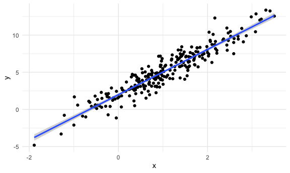
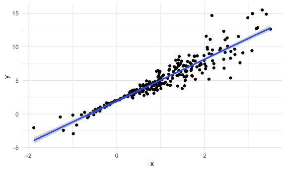
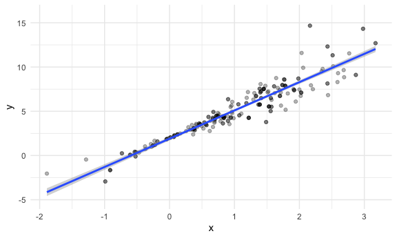

Bootstrapping
================

## Simulate data

``` r
n_samp = 250

sim_df_const =
  tibble(
    x = rnorm(n_samp, 1, 1),
    error = rnorm(n_samp, 0, 1),
    y = 2 + 3 * x + error
  )

sim_df_nonconst =
  sim_df_const %>% 
  mutate(
    error = error * .75 * x,
    y = 2 + 3 * x + error
  )
```

Plot the datasets

``` r
sim_df_const %>% 
  ggplot(aes(x = x, y = y)) +
  geom_point() +
  geom_smooth(method = "lm")
```

    ## `geom_smooth()` using formula 'y ~ x'



``` r
#Equal variances. Underlying assumption for linear regression

sim_df_nonconst %>% 
  ggplot(aes(x = x, y = y)) +
  geom_point() +
  geom_smooth(method = "lm")
```

    ## `geom_smooth()` using formula 'y ~ x'



``` r
#Unequal variance.  When x close to zero, residuals are very very small.  When x is far from zero, the residuals spread out.  Can still do linear regression, but one of the key assumptions - equal variance - is not met.  So difficult to make inferences - specifically difficult to construct confidence intervals.
#We will try to solve this problem using bootstrapping
```

``` r
lm(y ~ x, data = sim_df_const) %>%  broom::tidy()
```

    ## # A tibble: 2 x 5
    ##   term        estimate std.error statistic   p.value
    ##   <chr>          <dbl>     <dbl>     <dbl>     <dbl>
    ## 1 (Intercept)     1.98    0.0981      20.2 3.65e- 54
    ## 2 x               3.04    0.0699      43.5 3.84e-118

``` r
lm(y ~ x, data = sim_df_nonconst) %>%  broom::tidy()
```

    ## # A tibble: 2 x 5
    ##   term        estimate std.error statistic   p.value
    ##   <chr>          <dbl>     <dbl>     <dbl>     <dbl>
    ## 1 (Intercept)     1.93    0.105       18.5 1.88e- 48
    ## 2 x               3.11    0.0747      41.7 5.76e-114

Bootstrap Try to solve this issue of unequal variances with the
bootstrap What if I had another dataset like this one - get intercept
and slope Repeat Repeat Could I just then look and see what is the
actual variance of the intercept and slope under repeated sampling This
is what we are trying to do with the bootstrap

## Draw one bootstrap sample

First, write a bootstrap function The reason for this is so that later,
can repeat the function

``` r
boot_sample = function(df) {
  
  sample_frac(df, replace = TRUE) %>% 
#Why bootstrap sample should be the same size as original sample?  Because confidence intervals (variance estimates) are very sensitive to sample size.  Fewer point estimate = wider confidence interval and vice versa.  Mimicking sampling from the general population
    arrange(x)
#arrange because helps to visualize the data, but not an essential step - arrange doesn't actually change your results
    
}
```

Check if this works…

``` r
boot_sample(sim_df_nonconst) %>% 
  ggplot(aes(x = x, y = y)) +
  geom_point(alpha = .3) +
  geom_smooth(method = "lm") +
  ylim(-5, 16)
```

    ## `geom_smooth()` using formula 'y ~ x'



``` r
#fitted line moves slightly with each bootstrap sample

#next, can I actually estimate that intercept and slope, and save those across bootstrap samples??
```

``` r
boot_sample(sim_df_nonconst) %>% 
  lm(y ~ x, data = .) %>% 
  broom::tidy()
```

    ## # A tibble: 2 x 5
    ##   term        estimate std.error statistic   p.value
    ##   <chr>          <dbl>     <dbl>     <dbl>     <dbl>
    ## 1 (Intercept)     1.90    0.0982      19.3 2.45e- 51
    ## 2 x               3.14    0.0688      45.6 1.18e-122

``` r
#next, can I actually estimate that intercept and slope, and save those across bootstrap samples??
```
