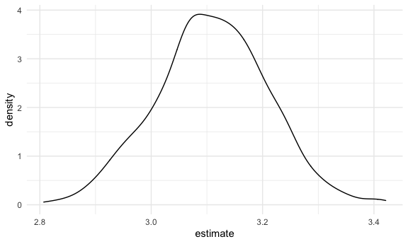

Bootstrapping
================

## Simulate data

``` r
n_samp = 250

sim_df_const =
  tibble(
    x = rnorm(n_samp, 1, 1),
    error = rnorm(n_samp, 0, 1),
    y = 2 + 3 * x + error
  )

sim_df_nonconst =
  sim_df_const %>% 
  mutate(
    error = error * .75 * x,
    y = 2 + 3 * x + error
  )
```

Plot the datasets

``` r
sim_df_const %>% 
  ggplot(aes(x = x, y = y)) +
  geom_point() +
  geom_smooth(method = "lm")
```

    ## `geom_smooth()` using formula 'y ~ x'


``` r
#Equal variances. Underlying assumption for linear regression

sim_df_nonconst %>% 
  ggplot(aes(x = x, y = y)) +
  geom_point() +
  geom_smooth(method = "lm")
```

    ## `geom_smooth()` using formula 'y ~ x'


``` r
#Unequal variance.  When x close to zero, residuals are very very small.  When x is far from zero, the residuals spread out.  Can still do linear regression, but one of the key assumptions - equal variance - is not met.  So difficult to make inferences - specifically difficult to construct confidence intervals.
#We will try to solve this problem using bootstrapping
```

``` r
lm(y ~ x, data = sim_df_const) %>%  broom::tidy()
```

    ## # A tibble: 2 x 5
    ##   term        estimate std.error statistic   p.value
    ##   <chr>          <dbl>     <dbl>     <dbl>     <dbl>
    ## 1 (Intercept)     1.98    0.0981      20.2 3.65e- 54
    ## 2 x               3.04    0.0699      43.5 3.84e-118

``` r
lm(y ~ x, data = sim_df_nonconst) %>%  broom::tidy()
```

    ## # A tibble: 2 x 5
    ##   term        estimate std.error statistic   p.value
    ##   <chr>          <dbl>     <dbl>     <dbl>     <dbl>
    ## 1 (Intercept)     1.93    0.105       18.5 1.88e- 48
    ## 2 x               3.11    0.0747      41.7 5.76e-114

Bootstrap Try to solve this issue of unequal variances with the
bootstrap What if I had another dataset like this one - get intercept
and slope Repeat Repeat Could I just then look and see what is the
actual variance of the intercept and slope under repeated sampling This
is what we are trying to do with the bootstrap

## Draw one bootstrap sample

First, write a bootstrap function The reason for this is so that later,
can repeat the function

``` r
boot_sample = function(df) {
  
  sample_frac(df, replace = TRUE) %>% 
#Why bootstrap sample should be the same size as original sample?  Because confidence intervals (variance estimates) are very sensitive to sample size.  Fewer point estimate = wider confidence interval and vice versa.  Mimicking sampling from the general population
    arrange(x)
#arrange because helps to visualize the data, but not an essential step - arrange doesn't actually change your results
    
}
```

Check if this works…

``` r
boot_sample(sim_df_nonconst) %>% 
  ggplot(aes(x = x, y = y)) +
  geom_point(alpha = .3) +
  geom_smooth(method = "lm") +
  ylim(-5, 16)
```

    ## `geom_smooth()` using formula 'y ~ x'


``` r
#fitted line moves slightly with each bootstrap sample

#next, can I actually estimate that intercept and slope, and save those across bootstrap samples??
```

``` r
boot_sample(sim_df_nonconst) %>% 
  lm(y ~ x, data = .) %>% 
  broom::tidy()
```

    ## # A tibble: 2 x 5
    ##   term        estimate std.error statistic   p.value
    ##   <chr>          <dbl>     <dbl>     <dbl>     <dbl>
    ## 1 (Intercept)     1.90    0.0982      19.3 2.45e- 51
    ## 2 x               3.14    0.0688      45.6 1.18e-122

``` r
#next, can I actually estimate that intercept and slope, and save those across bootstrap samples??
```

## Many samples and analysis

Generate many bootstrap samples with replace from this dataset

``` r
boot_straps =
  tibble(
    strap_number = 1:1000,
    strap_sample = rerun(1000, boot_sample(sim_df_nonconst))
  )

#so what you have is a tibble with strap_number from 1 to 1000 and strap_sample which are the result of boot_sample bootstrap samples each consisting of a tibble for 250 rows
#check to see what is inside each tibble

boot_straps %>% pull(strap_sample)
```

    ## [[1]]
    ## # A tibble: 250 x 3
    ##         x  error       y
    ##     <dbl>  <dbl>   <dbl>
    ##  1 -1.29   1.40  -0.454 
    ##  2 -0.989 -1.97  -2.93  
    ##  3 -0.914 -0.908 -1.65  
    ##  4 -0.914 -0.908 -1.65  
    ##  5 -0.805  0.292 -0.123 
    ##  6 -0.805  0.292 -0.123 
    ##  7 -0.665 -0.544 -0.539 
    ##  8 -0.641 -0.416 -0.338 
    ##  9 -0.606 -0.106  0.0774
    ## 10 -0.606 -0.106  0.0774
    ## # … with 240 more rows
    ## 
    ## [[2]]
    ## # A tibble: 250 x 3
    ##         x  error      y
    ##     <dbl>  <dbl>  <dbl>
    ##  1 -1.89   1.62  -2.04 
    ##  2 -1.89   1.62  -2.04 
    ##  3 -1.29   1.40  -0.454
    ##  4 -1.29   1.40  -0.454
    ##  5 -1.00   0.832 -0.169
    ##  6 -0.914 -0.908 -1.65 
    ##  7 -0.805  0.292 -0.123
    ##  8 -0.665 -0.544 -0.539
    ##  9 -0.665 -0.544 -0.539
    ## 10 -0.665 -0.544 -0.539
    ## # … with 240 more rows
    ## 
    ## [[3]]
    ## # A tibble: 250 x 3
    ##         x  error      y
    ##     <dbl>  <dbl>  <dbl>
    ##  1 -1.89   1.62  -2.04 
    ##  2 -1.89   1.62  -2.04 
    ##  3 -1.29   1.40  -0.454
    ##  4 -1.29   1.40  -0.454
    ##  5 -1.29   1.40  -0.454
    ##  6 -1.21  -0.781 -2.43 
    ##  7 -1.00   0.832 -0.169
    ##  8 -1.00   0.832 -0.169
    ##  9 -0.989 -1.97  -2.93 
    ## 10 -0.914 -0.908 -1.65 
    ## # … with 240 more rows
    ## 
    ## [[4]]
    ## # A tibble: 250 x 3
    ##         x  error      y
    ##     <dbl>  <dbl>  <dbl>
    ##  1 -1.89   1.62  -2.04 
    ##  2 -1.89   1.62  -2.04 
    ##  3 -1.29   1.40  -0.454
    ##  4 -1.21  -0.781 -2.43 
    ##  5 -1.21  -0.781 -2.43 
    ##  6 -1.21  -0.781 -2.43 
    ##  7 -1.00   0.832 -0.169
    ##  8 -0.989 -1.97  -2.93 
    ##  9 -0.989 -1.97  -2.93 
    ## 10 -0.733  0.447  0.248
    ## # … with 240 more rows
    ## 
    ## [[5]]
    ## # A tibble: 250 x 3
    ##         x  error      y
    ##     <dbl>  <dbl>  <dbl>
    ##  1 -1.89   1.62  -2.04 
    ##  2 -1.29   1.40  -0.454
    ##  3 -1.29   1.40  -0.454
    ##  4 -1.21  -0.781 -2.43 
    ##  5 -0.989 -1.97  -2.93 
    ##  6 -0.989 -1.97  -2.93 
    ##  7 -0.914 -0.908 -1.65 
    ##  8 -0.805  0.292 -0.123
    ##  9 -0.805  0.292 -0.123
    ## 10 -0.805  0.292 -0.123
    ## # … with 240 more rows
    ## 
    ## [[6]]
    ## # A tibble: 250 x 3
    ##         x   error      y
    ##     <dbl>   <dbl>  <dbl>
    ##  1 -1.89   1.62   -2.04 
    ##  2 -1.29   1.40   -0.454
    ##  3 -1.29   1.40   -0.454
    ##  4 -1.29   1.40   -0.454
    ##  5 -0.989 -1.97   -2.93 
    ##  6 -0.914 -0.908  -1.65 
    ##  7 -0.641 -0.416  -0.338
    ##  8 -0.641 -0.416  -0.338
    ##  9 -0.518 -0.0639  0.381
    ## 10 -0.518 -0.0639  0.381
    ## # … with 240 more rows
    ## 
    ## [[7]]
    ## # A tibble: 250 x 3
    ##         x   error      y
    ##     <dbl>   <dbl>  <dbl>
    ##  1 -1.89   1.62   -2.04 
    ##  2 -1.89   1.62   -2.04 
    ##  3 -1.29   1.40   -0.454
    ##  4 -1.21  -0.781  -2.43 
    ##  5 -0.914 -0.908  -1.65 
    ##  6 -0.733  0.447   0.248
    ##  7 -0.733  0.447   0.248
    ##  8 -0.641 -0.416  -0.338
    ##  9 -0.536  0.0227  0.413
    ## 10 -0.524 -0.536  -0.106
    ## # … with 240 more rows
    ## 
    ## [[8]]
    ## # A tibble: 250 x 3
    ##         x   error       y
    ##     <dbl>   <dbl>   <dbl>
    ##  1 -1.00   0.832  -0.169 
    ##  2 -0.989 -1.97   -2.93  
    ##  3 -0.914 -0.908  -1.65  
    ##  4 -0.733  0.447   0.248 
    ##  5 -0.733  0.447   0.248 
    ##  6 -0.733  0.447   0.248 
    ##  7 -0.665 -0.544  -0.539 
    ##  8 -0.606 -0.106   0.0774
    ##  9 -0.606 -0.106   0.0774
    ## 10 -0.536  0.0227  0.413 
    ## # … with 240 more rows
    ## 
    ## [[9]]
    ## # A tibble: 250 x 3
    ##         x  error      y
    ##     <dbl>  <dbl>  <dbl>
    ##  1 -1.89   1.62  -2.04 
    ##  2 -1.89   1.62  -2.04 
    ##  3 -1.89   1.62  -2.04 
    ##  4 -1.21  -0.781 -2.43 
    ##  5 -0.989 -1.97  -2.93 
    ##  6 -0.989 -1.97  -2.93 
    ##  7 -0.914 -0.908 -1.65 
    ##  8 -0.914 -0.908 -1.65 
    ##  9 -0.914 -0.908 -1.65 
    ## 10 -0.805  0.292 -0.123
    ## # … with 240 more rows
    ## 
    ## [[10]]
    ## # A tibble: 250 x 3
    ##         x  error      y
    ##     <dbl>  <dbl>  <dbl>
    ##  1 -1.89   1.62  -2.04 
    ##  2 -1.89   1.62  -2.04 
    ##  3 -1.29   1.40  -0.454
    ##  4 -1.21  -0.781 -2.43 
    ##  5 -1.21  -0.781 -2.43 
    ##  6 -1.21  -0.781 -2.43 
    ##  7 -1.00   0.832 -0.169
    ##  8 -1.00   0.832 -0.169
    ##  9 -1.00   0.832 -0.169
    ## 10 -0.914 -0.908 -1.65 
    ## # … with 240 more rows
    ## 
    ## [[11]]
    ## # A tibble: 250 x 3
    ##         x  error      y
    ##     <dbl>  <dbl>  <dbl>
    ##  1 -1.89   1.62  -2.04 
    ##  2 -1.89   1.62  -2.04 
    ##  3 -1.89   1.62  -2.04 
    ##  4 -1.89   1.62  -2.04 
    ##  5 -1.29   1.40  -0.454
    ##  6 -1.29   1.40  -0.454
    ##  7 -1.21  -0.781 -2.43 
    ##  8 -0.989 -1.97  -2.93 
    ##  9 -0.665 -0.544 -0.539
    ## 10 -0.665 -0.544 -0.539
    ## # … with 240 more rows
    ## 
    ## [[12]]
    ## # A tibble: 250 x 3
    ##         x  error      y
    ##     <dbl>  <dbl>  <dbl>
    ##  1 -1.89   1.62  -2.04 
    ##  2 -1.89   1.62  -2.04 
    ##  3 -1.21  -0.781 -2.43 
    ##  4 -1.21  -0.781 -2.43 
    ##  5 -1.00   0.832 -0.169
    ##  6 -0.989 -1.97  -2.93 
    ##  7 -0.914 -0.908 -1.65 
    ##  8 -0.914 -0.908 -1.65 
    ##  9 -0.805  0.292 -0.123
    ## 10 -0.805  0.292 -0.123
    ## # … with 240 more rows
    ## 
    ## [[13]]
    ## # A tibble: 250 x 3
    ##         x  error      y
    ##     <dbl>  <dbl>  <dbl>
    ##  1 -1.89   1.62  -2.04 
    ##  2 -1.89   1.62  -2.04 
    ##  3 -0.989 -1.97  -2.93 
    ##  4 -0.989 -1.97  -2.93 
    ##  5 -0.805  0.292 -0.123
    ##  6 -0.733  0.447  0.248
    ##  7 -0.733  0.447  0.248
    ##  8 -0.665 -0.544 -0.539
    ##  9 -0.641 -0.416 -0.338
    ## 10 -0.641 -0.416 -0.338
    ## # … with 240 more rows
    ## 
    ## [[14]]
    ## # A tibble: 250 x 3
    ##         x  error      y
    ##     <dbl>  <dbl>  <dbl>
    ##  1 -1.89   1.62  -2.04 
    ##  2 -1.21  -0.781 -2.43 
    ##  3 -0.989 -1.97  -2.93 
    ##  4 -0.989 -1.97  -2.93 
    ##  5 -0.914 -0.908 -1.65 
    ##  6 -0.914 -0.908 -1.65 
    ##  7 -0.805  0.292 -0.123
    ##  8 -0.665 -0.544 -0.539
    ##  9 -0.665 -0.544 -0.539
    ## 10 -0.665 -0.544 -0.539
    ## # … with 240 more rows
    ## 
    ## [[15]]
    ## # A tibble: 250 x 3
    ##         x  error       y
    ##     <dbl>  <dbl>   <dbl>
    ##  1 -1.89   1.62  -2.04  
    ##  2 -1.00   0.832 -0.169 
    ##  3 -0.989 -1.97  -2.93  
    ##  4 -0.989 -1.97  -2.93  
    ##  5 -0.989 -1.97  -2.93  
    ##  6 -0.733  0.447  0.248 
    ##  7 -0.606 -0.106  0.0774
    ##  8 -0.524 -0.536 -0.106 
    ##  9 -0.487  0.152  0.690 
    ## 10 -0.487  0.152  0.690 
    ## # … with 240 more rows
    ## 
    ## [[16]]
    ## # A tibble: 250 x 3
    ##         x  error      y
    ##     <dbl>  <dbl>  <dbl>
    ##  1 -1.89   1.62  -2.04 
    ##  2 -1.29   1.40  -0.454
    ##  3 -1.29   1.40  -0.454
    ##  4 -1.29   1.40  -0.454
    ##  5 -1.21  -0.781 -2.43 
    ##  6 -0.989 -1.97  -2.93 
    ##  7 -0.914 -0.908 -1.65 
    ##  8 -0.733  0.447  0.248
    ##  9 -0.733  0.447  0.248
    ## 10 -0.733  0.447  0.248
    ## # … with 240 more rows
    ## 
    ## [[17]]
    ## # A tibble: 250 x 3
    ##         x   error      y
    ##     <dbl>   <dbl>  <dbl>
    ##  1 -1.29   1.40   -0.454
    ##  2 -1.00   0.832  -0.169
    ##  3 -0.989 -1.97   -2.93 
    ##  4 -0.914 -0.908  -1.65 
    ##  5 -0.641 -0.416  -0.338
    ##  6 -0.641 -0.416  -0.338
    ##  7 -0.641 -0.416  -0.338
    ##  8 -0.536  0.0227  0.413
    ##  9 -0.518 -0.0639  0.381
    ## 10 -0.487  0.152   0.690
    ## # … with 240 more rows
    ## 
    ## [[18]]
    ## # A tibble: 250 x 3
    ##         x  error      y
    ##     <dbl>  <dbl>  <dbl>
    ##  1 -1.29   1.40  -0.454
    ##  2 -1.29   1.40  -0.454
    ##  3 -1.21  -0.781 -2.43 
    ##  4 -1.00   0.832 -0.169
    ##  5 -0.989 -1.97  -2.93 
    ##  6 -0.914 -0.908 -1.65 
    ##  7 -0.805  0.292 -0.123
    ##  8 -0.733  0.447  0.248
    ##  9 -0.665 -0.544 -0.539
    ## 10 -0.665 -0.544 -0.539
    ## # … with 240 more rows
    ## 
    ## [[19]]
    ## # A tibble: 250 x 3
    ##         x  error      y
    ##     <dbl>  <dbl>  <dbl>
    ##  1 -1.89   1.62  -2.04 
    ##  2 -1.29   1.40  -0.454
    ##  3 -1.29   1.40  -0.454
    ##  4 -1.29   1.40  -0.454
    ##  5 -1.29   1.40  -0.454
    ##  6 -0.989 -1.97  -2.93 
    ##  7 -0.914 -0.908 -1.65 
    ##  8 -0.914 -0.908 -1.65 
    ##  9 -0.914 -0.908 -1.65 
    ## 10 -0.805  0.292 -0.123
    ## # … with 240 more rows
    ## 
    ## [[20]]
    ## # A tibble: 250 x 3
    ##         x  error      y
    ##     <dbl>  <dbl>  <dbl>
    ##  1 -1.89   1.62  -2.04 
    ##  2 -1.89   1.62  -2.04 
    ##  3 -1.89   1.62  -2.04 
    ##  4 -1.29   1.40  -0.454
    ##  5 -1.29   1.40  -0.454
    ##  6 -1.21  -0.781 -2.43 
    ##  7 -1.00   0.832 -0.169
    ##  8 -1.00   0.832 -0.169
    ##  9 -0.989 -1.97  -2.93 
    ## 10 -0.989 -1.97  -2.93 
    ## # … with 240 more rows
    ## 
    ## [[21]]
    ## # A tibble: 250 x 3
    ##         x  error      y
    ##     <dbl>  <dbl>  <dbl>
    ##  1 -1.89   1.62  -2.04 
    ##  2 -1.89   1.62  -2.04 
    ##  3 -1.89   1.62  -2.04 
    ##  4 -1.00   0.832 -0.169
    ##  5 -1.00   0.832 -0.169
    ##  6 -0.989 -1.97  -2.93 
    ##  7 -0.805  0.292 -0.123
    ##  8 -0.733  0.447  0.248
    ##  9 -0.665 -0.544 -0.539
    ## 10 -0.641 -0.416 -0.338
    ## # … with 240 more rows
    ## 
    ## [[22]]
    ## # A tibble: 250 x 3
    ##         x  error      y
    ##     <dbl>  <dbl>  <dbl>
    ##  1 -1.89   1.62  -2.04 
    ##  2 -1.29   1.40  -0.454
    ##  3 -0.989 -1.97  -2.93 
    ##  4 -0.914 -0.908 -1.65 
    ##  5 -0.805  0.292 -0.123
    ##  6 -0.805  0.292 -0.123
    ##  7 -0.805  0.292 -0.123
    ##  8 -0.733  0.447  0.248
    ##  9 -0.733  0.447  0.248
    ## 10 -0.641 -0.416 -0.338
    ## # … with 240 more rows
    ## 
    ## [[23]]
    ## # A tibble: 250 x 3
    ##         x  error      y
    ##     <dbl>  <dbl>  <dbl>
    ##  1 -1.89   1.62  -2.04 
    ##  2 -1.29   1.40  -0.454
    ##  3 -1.21  -0.781 -2.43 
    ##  4 -1.00   0.832 -0.169
    ##  5 -1.00   0.832 -0.169
    ##  6 -0.914 -0.908 -1.65 
    ##  7 -0.805  0.292 -0.123
    ##  8 -0.733  0.447  0.248
    ##  9 -0.733  0.447  0.248
    ## 10 -0.665 -0.544 -0.539
    ## # … with 240 more rows
    ## 
    ## [[24]]
    ## # A tibble: 250 x 3
    ##         x   error      y
    ##     <dbl>   <dbl>  <dbl>
    ##  1 -1.29   1.40   -0.454
    ##  2 -1.21  -0.781  -2.43 
    ##  3 -1.21  -0.781  -2.43 
    ##  4 -1.00   0.832  -0.169
    ##  5 -1.00   0.832  -0.169
    ##  6 -0.914 -0.908  -1.65 
    ##  7 -0.665 -0.544  -0.539
    ##  8 -0.641 -0.416  -0.338
    ##  9 -0.641 -0.416  -0.338
    ## 10 -0.536  0.0227  0.413
    ## # … with 240 more rows
    ## 
    ## [[25]]
    ## # A tibble: 250 x 3
    ##         x  error      y
    ##     <dbl>  <dbl>  <dbl>
    ##  1 -1.89   1.62  -2.04 
    ##  2 -1.89   1.62  -2.04 
    ##  3 -1.29   1.40  -0.454
    ##  4 -1.21  -0.781 -2.43 
    ##  5 -0.989 -1.97  -2.93 
    ##  6 -0.989 -1.97  -2.93 
    ##  7 -0.989 -1.97  -2.93 
    ##  8 -0.914 -0.908 -1.65 
    ##  9 -0.805  0.292 -0.123
    ## 10 -0.805  0.292 -0.123
    ## # … with 240 more rows
    ## 
    ## [[26]]
    ## # A tibble: 250 x 3
    ##         x  error      y
    ##     <dbl>  <dbl>  <dbl>
    ##  1 -1.29   1.40  -0.454
    ##  2 -1.21  -0.781 -2.43 
    ##  3 -1.21  -0.781 -2.43 
    ##  4 -1.00   0.832 -0.169
    ##  5 -0.989 -1.97  -2.93 
    ##  6 -0.733  0.447  0.248
    ##  7 -0.665 -0.544 -0.539
    ##  8 -0.641 -0.416 -0.338
    ##  9 -0.641 -0.416 -0.338
    ## 10 -0.524 -0.536 -0.106
    ## # … with 240 more rows
    ## 
    ## [[27]]
    ## # A tibble: 250 x 3
    ##         x  error      y
    ##     <dbl>  <dbl>  <dbl>
    ##  1 -1.89   1.62  -2.04 
    ##  2 -1.89   1.62  -2.04 
    ##  3 -1.29   1.40  -0.454
    ##  4 -1.29   1.40  -0.454
    ##  5 -1.21  -0.781 -2.43 
    ##  6 -1.21  -0.781 -2.43 
    ##  7 -0.989 -1.97  -2.93 
    ##  8 -0.989 -1.97  -2.93 
    ##  9 -0.989 -1.97  -2.93 
    ## 10 -0.914 -0.908 -1.65 
    ## # … with 240 more rows
    ## 
    ## [[28]]
    ## # A tibble: 250 x 3
    ##         x   error      y
    ##     <dbl>   <dbl>  <dbl>
    ##  1 -1.89   1.62   -2.04 
    ##  2 -1.29   1.40   -0.454
    ##  3 -0.989 -1.97   -2.93 
    ##  4 -0.914 -0.908  -1.65 
    ##  5 -0.914 -0.908  -1.65 
    ##  6 -0.733  0.447   0.248
    ##  7 -0.733  0.447   0.248
    ##  8 -0.665 -0.544  -0.539
    ##  9 -0.665 -0.544  -0.539
    ## 10 -0.536  0.0227  0.413
    ## # … with 240 more rows
    ## 
    ## [[29]]
    ## # A tibble: 250 x 3
    ##         x  error      y
    ##     <dbl>  <dbl>  <dbl>
    ##  1 -1.29   1.40  -0.454
    ##  2 -1.00   0.832 -0.169
    ##  3 -0.989 -1.97  -2.93 
    ##  4 -0.989 -1.97  -2.93 
    ##  5 -0.914 -0.908 -1.65 
    ##  6 -0.914 -0.908 -1.65 
    ##  7 -0.805  0.292 -0.123
    ##  8 -0.805  0.292 -0.123
    ##  9 -0.733  0.447  0.248
    ## 10 -0.733  0.447  0.248
    ## # … with 240 more rows
    ## 
    ## [[30]]
    ## # A tibble: 250 x 3
    ##         x  error       y
    ##     <dbl>  <dbl>   <dbl>
    ##  1 -1.29   1.40  -0.454 
    ##  2 -1.00   0.832 -0.169 
    ##  3 -0.914 -0.908 -1.65  
    ##  4 -0.665 -0.544 -0.539 
    ##  5 -0.606 -0.106  0.0774
    ##  6 -0.606 -0.106  0.0774
    ##  7 -0.524 -0.536 -0.106 
    ##  8 -0.524 -0.536 -0.106 
    ##  9 -0.524 -0.536 -0.106 
    ## 10 -0.524 -0.536 -0.106 
    ## # … with 240 more rows
    ## 
    ## [[31]]
    ## # A tibble: 250 x 3
    ##         x   error       y
    ##     <dbl>   <dbl>   <dbl>
    ##  1 -1.89   1.62   -2.04  
    ##  2 -1.89   1.62   -2.04  
    ##  3 -1.29   1.40   -0.454 
    ##  4 -0.989 -1.97   -2.93  
    ##  5 -0.606 -0.106   0.0774
    ##  6 -0.606 -0.106   0.0774
    ##  7 -0.536  0.0227  0.413 
    ##  8 -0.518 -0.0639  0.381 
    ##  9 -0.518 -0.0639  0.381 
    ## 10 -0.487  0.152   0.690 
    ## # … with 240 more rows
    ## 
    ## [[32]]
    ## # A tibble: 250 x 3
    ##         x   error       y
    ##     <dbl>   <dbl>   <dbl>
    ##  1 -1.89   1.62   -2.04  
    ##  2 -1.21  -0.781  -2.43  
    ##  3 -0.989 -1.97   -2.93  
    ##  4 -0.733  0.447   0.248 
    ##  5 -0.665 -0.544  -0.539 
    ##  6 -0.641 -0.416  -0.338 
    ##  7 -0.606 -0.106   0.0774
    ##  8 -0.536  0.0227  0.413 
    ##  9 -0.524 -0.536  -0.106 
    ## 10 -0.518 -0.0639  0.381 
    ## # … with 240 more rows
    ## 
    ## [[33]]
    ## # A tibble: 250 x 3
    ##         x    error       y
    ##     <dbl>    <dbl>   <dbl>
    ##  1 -1.29   1.40    -0.454 
    ##  2 -1.29   1.40    -0.454 
    ##  3 -0.989 -1.97    -2.93  
    ##  4 -0.914 -0.908   -1.65  
    ##  5 -0.805  0.292   -0.123 
    ##  6 -0.733  0.447    0.248 
    ##  7 -0.606 -0.106    0.0774
    ##  8 -0.606 -0.106    0.0774
    ##  9 -0.518 -0.0639   0.381 
    ## 10 -0.467  0.00876  0.607 
    ## # … with 240 more rows
    ## 
    ## [[34]]
    ## # A tibble: 250 x 3
    ##         x  error      y
    ##     <dbl>  <dbl>  <dbl>
    ##  1 -1.89   1.62  -2.04 
    ##  2 -1.29   1.40  -0.454
    ##  3 -1.29   1.40  -0.454
    ##  4 -1.00   0.832 -0.169
    ##  5 -1.00   0.832 -0.169
    ##  6 -0.914 -0.908 -1.65 
    ##  7 -0.805  0.292 -0.123
    ##  8 -0.733  0.447  0.248
    ##  9 -0.733  0.447  0.248
    ## 10 -0.665 -0.544 -0.539
    ## # … with 240 more rows
    ## 
    ## [[35]]
    ## # A tibble: 250 x 3
    ##         x  error      y
    ##     <dbl>  <dbl>  <dbl>
    ##  1 -1.89   1.62  -2.04 
    ##  2 -1.21  -0.781 -2.43 
    ##  3 -0.989 -1.97  -2.93 
    ##  4 -0.989 -1.97  -2.93 
    ##  5 -0.989 -1.97  -2.93 
    ##  6 -0.914 -0.908 -1.65 
    ##  7 -0.805  0.292 -0.123
    ##  8 -0.733  0.447  0.248
    ##  9 -0.665 -0.544 -0.539
    ## 10 -0.487  0.152  0.690
    ## # … with 240 more rows
    ## 
    ## [[36]]
    ## # A tibble: 250 x 3
    ##         x  error      y
    ##     <dbl>  <dbl>  <dbl>
    ##  1 -1.89   1.62  -2.04 
    ##  2 -1.89   1.62  -2.04 
    ##  3 -1.21  -0.781 -2.43 
    ##  4 -1.21  -0.781 -2.43 
    ##  5 -1.00   0.832 -0.169
    ##  6 -1.00   0.832 -0.169
    ##  7 -1.00   0.832 -0.169
    ##  8 -0.989 -1.97  -2.93 
    ##  9 -0.989 -1.97  -2.93 
    ## 10 -0.989 -1.97  -2.93 
    ## # … with 240 more rows
    ## 
    ## [[37]]
    ## # A tibble: 250 x 3
    ##         x   error       y
    ##     <dbl>   <dbl>   <dbl>
    ##  1 -1.29   1.40   -0.454 
    ##  2 -1.00   0.832  -0.169 
    ##  3 -0.989 -1.97   -2.93  
    ##  4 -0.989 -1.97   -2.93  
    ##  5 -0.989 -1.97   -2.93  
    ##  6 -0.914 -0.908  -1.65  
    ##  7 -0.733  0.447   0.248 
    ##  8 -0.733  0.447   0.248 
    ##  9 -0.606 -0.106   0.0774
    ## 10 -0.536  0.0227  0.413 
    ## # … with 240 more rows
    ## 
    ## [[38]]
    ## # A tibble: 250 x 3
    ##         x  error      y
    ##     <dbl>  <dbl>  <dbl>
    ##  1 -1.29   1.40  -0.454
    ##  2 -1.21  -0.781 -2.43 
    ##  3 -1.00   0.832 -0.169
    ##  4 -0.914 -0.908 -1.65 
    ##  5 -0.733  0.447  0.248
    ##  6 -0.733  0.447  0.248
    ##  7 -0.665 -0.544 -0.539
    ##  8 -0.665 -0.544 -0.539
    ##  9 -0.641 -0.416 -0.338
    ## 10 -0.641 -0.416 -0.338
    ## # … with 240 more rows
    ## 
    ## [[39]]
    ## # A tibble: 250 x 3
    ##         x  error      y
    ##     <dbl>  <dbl>  <dbl>
    ##  1 -1.89   1.62  -2.04 
    ##  2 -1.89   1.62  -2.04 
    ##  3 -1.21  -0.781 -2.43 
    ##  4 -1.21  -0.781 -2.43 
    ##  5 -0.989 -1.97  -2.93 
    ##  6 -0.989 -1.97  -2.93 
    ##  7 -0.989 -1.97  -2.93 
    ##  8 -0.914 -0.908 -1.65 
    ##  9 -0.665 -0.544 -0.539
    ## 10 -0.641 -0.416 -0.338
    ## # … with 240 more rows
    ## 
    ## [[40]]
    ## # A tibble: 250 x 3
    ##         x  error       y
    ##     <dbl>  <dbl>   <dbl>
    ##  1 -1.29   1.40  -0.454 
    ##  2 -1.00   0.832 -0.169 
    ##  3 -1.00   0.832 -0.169 
    ##  4 -0.914 -0.908 -1.65  
    ##  5 -0.805  0.292 -0.123 
    ##  6 -0.665 -0.544 -0.539 
    ##  7 -0.641 -0.416 -0.338 
    ##  8 -0.606 -0.106  0.0774
    ##  9 -0.524 -0.536 -0.106 
    ## 10 -0.524 -0.536 -0.106 
    ## # … with 240 more rows
    ## 
    ## [[41]]
    ## # A tibble: 250 x 3
    ##         x  error      y
    ##     <dbl>  <dbl>  <dbl>
    ##  1 -1.29   1.40  -0.454
    ##  2 -1.00   0.832 -0.169
    ##  3 -0.989 -1.97  -2.93 
    ##  4 -0.989 -1.97  -2.93 
    ##  5 -0.989 -1.97  -2.93 
    ##  6 -0.989 -1.97  -2.93 
    ##  7 -0.914 -0.908 -1.65 
    ##  8 -0.665 -0.544 -0.539
    ##  9 -0.641 -0.416 -0.338
    ## 10 -0.641 -0.416 -0.338
    ## # … with 240 more rows
    ## 
    ## [[42]]
    ## # A tibble: 250 x 3
    ##         x  error      y
    ##     <dbl>  <dbl>  <dbl>
    ##  1 -1.29   1.40  -0.454
    ##  2 -1.21  -0.781 -2.43 
    ##  3 -1.21  -0.781 -2.43 
    ##  4 -1.00   0.832 -0.169
    ##  5 -1.00   0.832 -0.169
    ##  6 -0.989 -1.97  -2.93 
    ##  7 -0.805  0.292 -0.123
    ##  8 -0.733  0.447  0.248
    ##  9 -0.665 -0.544 -0.539
    ## 10 -0.641 -0.416 -0.338
    ## # … with 240 more rows
    ## 
    ## [[43]]
    ## # A tibble: 250 x 3
    ##         x  error      y
    ##     <dbl>  <dbl>  <dbl>
    ##  1 -1.29   1.40  -0.454
    ##  2 -1.29   1.40  -0.454
    ##  3 -1.00   0.832 -0.169
    ##  4 -0.989 -1.97  -2.93 
    ##  5 -0.989 -1.97  -2.93 
    ##  6 -0.805  0.292 -0.123
    ##  7 -0.805  0.292 -0.123
    ##  8 -0.805  0.292 -0.123
    ##  9 -0.733  0.447  0.248
    ## 10 -0.641 -0.416 -0.338
    ## # … with 240 more rows
    ## 
    ## [[44]]
    ## # A tibble: 250 x 3
    ##         x  error       y
    ##     <dbl>  <dbl>   <dbl>
    ##  1 -1.00   0.832 -0.169 
    ##  2 -1.00   0.832 -0.169 
    ##  3 -0.989 -1.97  -2.93  
    ##  4 -0.914 -0.908 -1.65  
    ##  5 -0.805  0.292 -0.123 
    ##  6 -0.733  0.447  0.248 
    ##  7 -0.665 -0.544 -0.539 
    ##  8 -0.665 -0.544 -0.539 
    ##  9 -0.641 -0.416 -0.338 
    ## 10 -0.606 -0.106  0.0774
    ## # … with 240 more rows
    ## 
    ## [[45]]
    ## # A tibble: 250 x 3
    ##         x  error      y
    ##     <dbl>  <dbl>  <dbl>
    ##  1 -1.89   1.62  -2.04 
    ##  2 -1.89   1.62  -2.04 
    ##  3 -1.29   1.40  -0.454
    ##  4 -1.21  -0.781 -2.43 
    ##  5 -1.21  -0.781 -2.43 
    ##  6 -1.21  -0.781 -2.43 
    ##  7 -1.21  -0.781 -2.43 
    ##  8 -0.989 -1.97  -2.93 
    ##  9 -0.805  0.292 -0.123
    ## 10 -0.805  0.292 -0.123
    ## # … with 240 more rows
    ## 
    ## [[46]]
    ## # A tibble: 250 x 3
    ##         x  error       y
    ##     <dbl>  <dbl>   <dbl>
    ##  1 -1.89   1.62  -2.04  
    ##  2 -1.29   1.40  -0.454 
    ##  3 -1.21  -0.781 -2.43  
    ##  4 -1.21  -0.781 -2.43  
    ##  5 -1.00   0.832 -0.169 
    ##  6 -1.00   0.832 -0.169 
    ##  7 -1.00   0.832 -0.169 
    ##  8 -0.914 -0.908 -1.65  
    ##  9 -0.641 -0.416 -0.338 
    ## 10 -0.606 -0.106  0.0774
    ## # … with 240 more rows
    ## 
    ## [[47]]
    ## # A tibble: 250 x 3
    ##         x   error      y
    ##     <dbl>   <dbl>  <dbl>
    ##  1 -1.29   1.40   -0.454
    ##  2 -1.00   0.832  -0.169
    ##  3 -0.914 -0.908  -1.65 
    ##  4 -0.805  0.292  -0.123
    ##  5 -0.733  0.447   0.248
    ##  6 -0.665 -0.544  -0.539
    ##  7 -0.665 -0.544  -0.539
    ##  8 -0.641 -0.416  -0.338
    ##  9 -0.641 -0.416  -0.338
    ## 10 -0.536  0.0227  0.413
    ## # … with 240 more rows
    ## 
    ## [[48]]
    ## # A tibble: 250 x 3
    ##         x  error      y
    ##     <dbl>  <dbl>  <dbl>
    ##  1 -1.29   1.40  -0.454
    ##  2 -1.21  -0.781 -2.43 
    ##  3 -1.00   0.832 -0.169
    ##  4 -0.805  0.292 -0.123
    ##  5 -0.805  0.292 -0.123
    ##  6 -0.805  0.292 -0.123
    ##  7 -0.805  0.292 -0.123
    ##  8 -0.733  0.447  0.248
    ##  9 -0.733  0.447  0.248
    ## 10 -0.733  0.447  0.248
    ## # … with 240 more rows
    ## 
    ## [[49]]
    ## # A tibble: 250 x 3
    ##         x  error       y
    ##     <dbl>  <dbl>   <dbl>
    ##  1 -1.29   1.40  -0.454 
    ##  2 -1.29   1.40  -0.454 
    ##  3 -1.21  -0.781 -2.43  
    ##  4 -0.914 -0.908 -1.65  
    ##  5 -0.805  0.292 -0.123 
    ##  6 -0.665 -0.544 -0.539 
    ##  7 -0.641 -0.416 -0.338 
    ##  8 -0.606 -0.106  0.0774
    ##  9 -0.606 -0.106  0.0774
    ## 10 -0.606 -0.106  0.0774
    ## # … with 240 more rows
    ## 
    ## [[50]]
    ## # A tibble: 250 x 3
    ##         x  error      y
    ##     <dbl>  <dbl>  <dbl>
    ##  1 -1.89   1.62  -2.04 
    ##  2 -1.89   1.62  -2.04 
    ##  3 -1.21  -0.781 -2.43 
    ##  4 -1.21  -0.781 -2.43 
    ##  5 -1.21  -0.781 -2.43 
    ##  6 -1.21  -0.781 -2.43 
    ##  7 -1.00   0.832 -0.169
    ##  8 -1.00   0.832 -0.169
    ##  9 -0.914 -0.908 -1.65 
    ## 10 -0.914 -0.908 -1.65 
    ## # … with 240 more rows
    ## 
    ## [[51]]
    ## # A tibble: 250 x 3
    ##         x   error       y
    ##     <dbl>   <dbl>   <dbl>
    ##  1 -1.29   1.40   -0.454 
    ##  2 -1.29   1.40   -0.454 
    ##  3 -0.914 -0.908  -1.65  
    ##  4 -0.805  0.292  -0.123 
    ##  5 -0.665 -0.544  -0.539 
    ##  6 -0.606 -0.106   0.0774
    ##  7 -0.524 -0.536  -0.106 
    ##  8 -0.424  0.0800  0.806 
    ##  9 -0.424  0.0800  0.806 
    ## 10 -0.424  0.0800  0.806 
    ## # … with 240 more rows
    ## 
    ## [[52]]
    ## # A tibble: 250 x 3
    ##         x  error       y
    ##     <dbl>  <dbl>   <dbl>
    ##  1 -1.29   1.40  -0.454 
    ##  2 -1.29   1.40  -0.454 
    ##  3 -1.29   1.40  -0.454 
    ##  4 -0.989 -1.97  -2.93  
    ##  5 -0.989 -1.97  -2.93  
    ##  6 -0.914 -0.908 -1.65  
    ##  7 -0.805  0.292 -0.123 
    ##  8 -0.805  0.292 -0.123 
    ##  9 -0.641 -0.416 -0.338 
    ## 10 -0.606 -0.106  0.0774
    ## # … with 240 more rows
    ## 
    ## [[53]]
    ## # A tibble: 250 x 3
    ##         x  error      y
    ##     <dbl>  <dbl>  <dbl>
    ##  1 -1.21  -0.781 -2.43 
    ##  2 -1.21  -0.781 -2.43 
    ##  3 -1.21  -0.781 -2.43 
    ##  4 -1.00   0.832 -0.169
    ##  5 -0.989 -1.97  -2.93 
    ##  6 -0.989 -1.97  -2.93 
    ##  7 -0.914 -0.908 -1.65 
    ##  8 -0.733  0.447  0.248
    ##  9 -0.733  0.447  0.248
    ## 10 -0.665 -0.544 -0.539
    ## # … with 240 more rows
    ## 
    ## [[54]]
    ## # A tibble: 250 x 3
    ##         x  error      y
    ##     <dbl>  <dbl>  <dbl>
    ##  1 -1.89   1.62  -2.04 
    ##  2 -1.89   1.62  -2.04 
    ##  3 -1.29   1.40  -0.454
    ##  4 -1.21  -0.781 -2.43 
    ##  5 -1.21  -0.781 -2.43 
    ##  6 -0.989 -1.97  -2.93 
    ##  7 -0.914 -0.908 -1.65 
    ##  8 -0.733  0.447  0.248
    ##  9 -0.733  0.447  0.248
    ## 10 -0.665 -0.544 -0.539
    ## # … with 240 more rows
    ## 
    ## [[55]]
    ## # A tibble: 250 x 3
    ##         x  error      y
    ##     <dbl>  <dbl>  <dbl>
    ##  1 -1.89   1.62  -2.04 
    ##  2 -1.29   1.40  -0.454
    ##  3 -1.21  -0.781 -2.43 
    ##  4 -1.21  -0.781 -2.43 
    ##  5 -0.805  0.292 -0.123
    ##  6 -0.733  0.447  0.248
    ##  7 -0.733  0.447  0.248
    ##  8 -0.665 -0.544 -0.539
    ##  9 -0.665 -0.544 -0.539
    ## 10 -0.641 -0.416 -0.338
    ## # … with 240 more rows
    ## 
    ## [[56]]
    ## # A tibble: 250 x 3
    ##         x  error      y
    ##     <dbl>  <dbl>  <dbl>
    ##  1 -1.89   1.62  -2.04 
    ##  2 -1.89   1.62  -2.04 
    ##  3 -1.29   1.40  -0.454
    ##  4 -1.21  -0.781 -2.43 
    ##  5 -1.21  -0.781 -2.43 
    ##  6 -1.21  -0.781 -2.43 
    ##  7 -1.00   0.832 -0.169
    ##  8 -0.805  0.292 -0.123
    ##  9 -0.805  0.292 -0.123
    ## 10 -0.805  0.292 -0.123
    ## # … with 240 more rows
    ## 
    ## [[57]]
    ## # A tibble: 250 x 3
    ##         x  error      y
    ##     <dbl>  <dbl>  <dbl>
    ##  1 -1.89   1.62  -2.04 
    ##  2 -1.89   1.62  -2.04 
    ##  3 -1.00   0.832 -0.169
    ##  4 -0.989 -1.97  -2.93 
    ##  5 -0.914 -0.908 -1.65 
    ##  6 -0.914 -0.908 -1.65 
    ##  7 -0.733  0.447  0.248
    ##  8 -0.733  0.447  0.248
    ##  9 -0.665 -0.544 -0.539
    ## 10 -0.641 -0.416 -0.338
    ## # … with 240 more rows
    ## 
    ## [[58]]
    ## # A tibble: 250 x 3
    ##         x   error       y
    ##     <dbl>   <dbl>   <dbl>
    ##  1 -1.29   1.40   -0.454 
    ##  2 -0.989 -1.97   -2.93  
    ##  3 -0.914 -0.908  -1.65  
    ##  4 -0.665 -0.544  -0.539 
    ##  5 -0.606 -0.106   0.0774
    ##  6 -0.524 -0.536  -0.106 
    ##  7 -0.487  0.152   0.690 
    ##  8 -0.487  0.152   0.690 
    ##  9 -0.424  0.0800  0.806 
    ## 10 -0.424  0.0800  0.806 
    ## # … with 240 more rows
    ## 
    ## [[59]]
    ## # A tibble: 250 x 3
    ##         x  error      y
    ##     <dbl>  <dbl>  <dbl>
    ##  1 -1.89   1.62  -2.04 
    ##  2 -1.29   1.40  -0.454
    ##  3 -1.29   1.40  -0.454
    ##  4 -1.21  -0.781 -2.43 
    ##  5 -0.989 -1.97  -2.93 
    ##  6 -0.914 -0.908 -1.65 
    ##  7 -0.914 -0.908 -1.65 
    ##  8 -0.805  0.292 -0.123
    ##  9 -0.805  0.292 -0.123
    ## 10 -0.665 -0.544 -0.539
    ## # … with 240 more rows
    ## 
    ## [[60]]
    ## # A tibble: 250 x 3
    ##         x  error      y
    ##     <dbl>  <dbl>  <dbl>
    ##  1 -1.89   1.62  -2.04 
    ##  2 -1.29   1.40  -0.454
    ##  3 -1.29   1.40  -0.454
    ##  4 -1.29   1.40  -0.454
    ##  5 -1.21  -0.781 -2.43 
    ##  6 -1.00   0.832 -0.169
    ##  7 -0.989 -1.97  -2.93 
    ##  8 -0.805  0.292 -0.123
    ##  9 -0.733  0.447  0.248
    ## 10 -0.665 -0.544 -0.539
    ## # … with 240 more rows
    ## 
    ## [[61]]
    ## # A tibble: 250 x 3
    ##         x   error      y
    ##     <dbl>   <dbl>  <dbl>
    ##  1 -1.89   1.62   -2.04 
    ##  2 -1.89   1.62   -2.04 
    ##  3 -1.21  -0.781  -2.43 
    ##  4 -0.914 -0.908  -1.65 
    ##  5 -0.805  0.292  -0.123
    ##  6 -0.805  0.292  -0.123
    ##  7 -0.805  0.292  -0.123
    ##  8 -0.805  0.292  -0.123
    ##  9 -0.665 -0.544  -0.539
    ## 10 -0.536  0.0227  0.413
    ## # … with 240 more rows
    ## 
    ## [[62]]
    ## # A tibble: 250 x 3
    ##         x    error      y
    ##     <dbl>    <dbl>  <dbl>
    ##  1 -1.00   0.832   -0.169
    ##  2 -1.00   0.832   -0.169
    ##  3 -0.989 -1.97    -2.93 
    ##  4 -0.989 -1.97    -2.93 
    ##  5 -0.733  0.447    0.248
    ##  6 -0.665 -0.544   -0.539
    ##  7 -0.536  0.0227   0.413
    ##  8 -0.524 -0.536   -0.106
    ##  9 -0.471 -0.262    0.326
    ## 10 -0.467  0.00876  0.607
    ## # … with 240 more rows
    ## 
    ## [[63]]
    ## # A tibble: 250 x 3
    ##         x  error      y
    ##     <dbl>  <dbl>  <dbl>
    ##  1 -1.89   1.62  -2.04 
    ##  2 -1.29   1.40  -0.454
    ##  3 -1.29   1.40  -0.454
    ##  4 -1.21  -0.781 -2.43 
    ##  5 -1.21  -0.781 -2.43 
    ##  6 -1.21  -0.781 -2.43 
    ##  7 -1.21  -0.781 -2.43 
    ##  8 -1.00   0.832 -0.169
    ##  9 -0.989 -1.97  -2.93 
    ## 10 -0.989 -1.97  -2.93 
    ## # … with 240 more rows
    ## 
    ## [[64]]
    ## # A tibble: 250 x 3
    ##         x  error      y
    ##     <dbl>  <dbl>  <dbl>
    ##  1 -1.29   1.40  -0.454
    ##  2 -1.29   1.40  -0.454
    ##  3 -1.21  -0.781 -2.43 
    ##  4 -1.00   0.832 -0.169
    ##  5 -0.805  0.292 -0.123
    ##  6 -0.805  0.292 -0.123
    ##  7 -0.733  0.447  0.248
    ##  8 -0.733  0.447  0.248
    ##  9 -0.665 -0.544 -0.539
    ## 10 -0.665 -0.544 -0.539
    ## # … with 240 more rows
    ## 
    ## [[65]]
    ## # A tibble: 250 x 3
    ##         x  error      y
    ##     <dbl>  <dbl>  <dbl>
    ##  1 -1.29   1.40  -0.454
    ##  2 -1.29   1.40  -0.454
    ##  3 -1.21  -0.781 -2.43 
    ##  4 -0.989 -1.97  -2.93 
    ##  5 -0.914 -0.908 -1.65 
    ##  6 -0.914 -0.908 -1.65 
    ##  7 -0.805  0.292 -0.123
    ##  8 -0.641 -0.416 -0.338
    ##  9 -0.641 -0.416 -0.338
    ## 10 -0.641 -0.416 -0.338
    ## # … with 240 more rows
    ## 
    ## [[66]]
    ## # A tibble: 250 x 3
    ##         x  error       y
    ##     <dbl>  <dbl>   <dbl>
    ##  1 -1.89   1.62  -2.04  
    ##  2 -1.21  -0.781 -2.43  
    ##  3 -0.989 -1.97  -2.93  
    ##  4 -0.914 -0.908 -1.65  
    ##  5 -0.914 -0.908 -1.65  
    ##  6 -0.914 -0.908 -1.65  
    ##  7 -0.733  0.447  0.248 
    ##  8 -0.641 -0.416 -0.338 
    ##  9 -0.606 -0.106  0.0774
    ## 10 -0.524 -0.536 -0.106 
    ## # … with 240 more rows
    ## 
    ## [[67]]
    ## # A tibble: 250 x 3
    ##         x  error      y
    ##     <dbl>  <dbl>  <dbl>
    ##  1 -1.89   1.62  -2.04 
    ##  2 -1.89   1.62  -2.04 
    ##  3 -1.29   1.40  -0.454
    ##  4 -1.21  -0.781 -2.43 
    ##  5 -1.21  -0.781 -2.43 
    ##  6 -0.914 -0.908 -1.65 
    ##  7 -0.914 -0.908 -1.65 
    ##  8 -0.805  0.292 -0.123
    ##  9 -0.805  0.292 -0.123
    ## 10 -0.641 -0.416 -0.338
    ## # … with 240 more rows
    ## 
    ## [[68]]
    ## # A tibble: 250 x 3
    ##         x   error       y
    ##     <dbl>   <dbl>   <dbl>
    ##  1 -1.89   1.62   -2.04  
    ##  2 -1.29   1.40   -0.454 
    ##  3 -0.989 -1.97   -2.93  
    ##  4 -0.914 -0.908  -1.65  
    ##  5 -0.805  0.292  -0.123 
    ##  6 -0.805  0.292  -0.123 
    ##  7 -0.733  0.447   0.248 
    ##  8 -0.606 -0.106   0.0774
    ##  9 -0.536  0.0227  0.413 
    ## 10 -0.536  0.0227  0.413 
    ## # … with 240 more rows
    ## 
    ## [[69]]
    ## # A tibble: 250 x 3
    ##         x  error      y
    ##     <dbl>  <dbl>  <dbl>
    ##  1 -1.89   1.62  -2.04 
    ##  2 -1.89   1.62  -2.04 
    ##  3 -1.29   1.40  -0.454
    ##  4 -1.21  -0.781 -2.43 
    ##  5 -0.989 -1.97  -2.93 
    ##  6 -0.989 -1.97  -2.93 
    ##  7 -0.989 -1.97  -2.93 
    ##  8 -0.805  0.292 -0.123
    ##  9 -0.805  0.292 -0.123
    ## 10 -0.665 -0.544 -0.539
    ## # … with 240 more rows
    ## 
    ## [[70]]
    ## # A tibble: 250 x 3
    ##         x  error      y
    ##     <dbl>  <dbl>  <dbl>
    ##  1 -1.89   1.62  -2.04 
    ##  2 -1.89   1.62  -2.04 
    ##  3 -1.89   1.62  -2.04 
    ##  4 -1.29   1.40  -0.454
    ##  5 -0.989 -1.97  -2.93 
    ##  6 -0.989 -1.97  -2.93 
    ##  7 -0.989 -1.97  -2.93 
    ##  8 -0.914 -0.908 -1.65 
    ##  9 -0.733  0.447  0.248
    ## 10 -0.733  0.447  0.248
    ## # … with 240 more rows
    ## 
    ## [[71]]
    ## # A tibble: 250 x 3
    ##         x  error      y
    ##     <dbl>  <dbl>  <dbl>
    ##  1 -1.89   1.62  -2.04 
    ##  2 -1.29   1.40  -0.454
    ##  3 -1.21  -0.781 -2.43 
    ##  4 -1.00   0.832 -0.169
    ##  5 -0.989 -1.97  -2.93 
    ##  6 -0.989 -1.97  -2.93 
    ##  7 -0.914 -0.908 -1.65 
    ##  8 -0.914 -0.908 -1.65 
    ##  9 -0.914 -0.908 -1.65 
    ## 10 -0.805  0.292 -0.123
    ## # … with 240 more rows
    ## 
    ## [[72]]
    ## # A tibble: 250 x 3
    ##         x   error       y
    ##     <dbl>   <dbl>   <dbl>
    ##  1 -1.89   1.62   -2.04  
    ##  2 -1.21  -0.781  -2.43  
    ##  3 -0.914 -0.908  -1.65  
    ##  4 -0.733  0.447   0.248 
    ##  5 -0.733  0.447   0.248 
    ##  6 -0.665 -0.544  -0.539 
    ##  7 -0.606 -0.106   0.0774
    ##  8 -0.518 -0.0639  0.381 
    ##  9 -0.487  0.152   0.690 
    ## 10 -0.487  0.152   0.690 
    ## # … with 240 more rows
    ## 
    ## [[73]]
    ## # A tibble: 250 x 3
    ##         x  error      y
    ##     <dbl>  <dbl>  <dbl>
    ##  1 -1.29   1.40  -0.454
    ##  2 -1.00   0.832 -0.169
    ##  3 -1.00   0.832 -0.169
    ##  4 -1.00   0.832 -0.169
    ##  5 -0.989 -1.97  -2.93 
    ##  6 -0.914 -0.908 -1.65 
    ##  7 -0.914 -0.908 -1.65 
    ##  8 -0.805  0.292 -0.123
    ##  9 -0.805  0.292 -0.123
    ## 10 -0.733  0.447  0.248
    ## # … with 240 more rows
    ## 
    ## [[74]]
    ## # A tibble: 250 x 3
    ##         x   error       y
    ##     <dbl>   <dbl>   <dbl>
    ##  1 -1.29   1.40   -0.454 
    ##  2 -1.21  -0.781  -2.43  
    ##  3 -1.00   0.832  -0.169 
    ##  4 -1.00   0.832  -0.169 
    ##  5 -0.914 -0.908  -1.65  
    ##  6 -0.914 -0.908  -1.65  
    ##  7 -0.606 -0.106   0.0774
    ##  8 -0.606 -0.106   0.0774
    ##  9 -0.536  0.0227  0.413 
    ## 10 -0.524 -0.536  -0.106 
    ## # … with 240 more rows
    ## 
    ## [[75]]
    ## # A tibble: 250 x 3
    ##         x   error       y
    ##     <dbl>   <dbl>   <dbl>
    ##  1 -1.89   1.62   -2.04  
    ##  2 -1.21  -0.781  -2.43  
    ##  3 -0.989 -1.97   -2.93  
    ##  4 -0.989 -1.97   -2.93  
    ##  5 -0.914 -0.908  -1.65  
    ##  6 -0.665 -0.544  -0.539 
    ##  7 -0.665 -0.544  -0.539 
    ##  8 -0.606 -0.106   0.0774
    ##  9 -0.536  0.0227  0.413 
    ## 10 -0.536  0.0227  0.413 
    ## # … with 240 more rows
    ## 
    ## [[76]]
    ## # A tibble: 250 x 3
    ##         x  error      y
    ##     <dbl>  <dbl>  <dbl>
    ##  1 -1.89   1.62  -2.04 
    ##  2 -1.29   1.40  -0.454
    ##  3 -1.29   1.40  -0.454
    ##  4 -1.29   1.40  -0.454
    ##  5 -1.21  -0.781 -2.43 
    ##  6 -1.00   0.832 -0.169
    ##  7 -0.805  0.292 -0.123
    ##  8 -0.805  0.292 -0.123
    ##  9 -0.665 -0.544 -0.539
    ## 10 -0.641 -0.416 -0.338
    ## # … with 240 more rows
    ## 
    ## [[77]]
    ## # A tibble: 250 x 3
    ##         x   error      y
    ##     <dbl>   <dbl>  <dbl>
    ##  1 -1.89   1.62   -2.04 
    ##  2 -1.21  -0.781  -2.43 
    ##  3 -0.989 -1.97   -2.93 
    ##  4 -0.989 -1.97   -2.93 
    ##  5 -0.914 -0.908  -1.65 
    ##  6 -0.805  0.292  -0.123
    ##  7 -0.733  0.447   0.248
    ##  8 -0.536  0.0227  0.413
    ##  9 -0.536  0.0227  0.413
    ## 10 -0.536  0.0227  0.413
    ## # … with 240 more rows
    ## 
    ## [[78]]
    ## # A tibble: 250 x 3
    ##         x   error      y
    ##     <dbl>   <dbl>  <dbl>
    ##  1 -1.89   1.62   -2.04 
    ##  2 -1.89   1.62   -2.04 
    ##  3 -1.89   1.62   -2.04 
    ##  4 -0.805  0.292  -0.123
    ##  5 -0.733  0.447   0.248
    ##  6 -0.665 -0.544  -0.539
    ##  7 -0.641 -0.416  -0.338
    ##  8 -0.641 -0.416  -0.338
    ##  9 -0.641 -0.416  -0.338
    ## 10 -0.536  0.0227  0.413
    ## # … with 240 more rows
    ## 
    ## [[79]]
    ## # A tibble: 250 x 3
    ##         x   error       y
    ##     <dbl>   <dbl>   <dbl>
    ##  1 -1.29   1.40   -0.454 
    ##  2 -1.29   1.40   -0.454 
    ##  3 -1.21  -0.781  -2.43  
    ##  4 -0.665 -0.544  -0.539 
    ##  5 -0.641 -0.416  -0.338 
    ##  6 -0.641 -0.416  -0.338 
    ##  7 -0.606 -0.106   0.0774
    ##  8 -0.606 -0.106   0.0774
    ##  9 -0.606 -0.106   0.0774
    ## 10 -0.518 -0.0639  0.381 
    ## # … with 240 more rows
    ## 
    ## [[80]]
    ## # A tibble: 250 x 3
    ##         x  error      y
    ##     <dbl>  <dbl>  <dbl>
    ##  1 -1.89   1.62  -2.04 
    ##  2 -1.29   1.40  -0.454
    ##  3 -1.21  -0.781 -2.43 
    ##  4 -1.00   0.832 -0.169
    ##  5 -1.00   0.832 -0.169
    ##  6 -0.914 -0.908 -1.65 
    ##  7 -0.914 -0.908 -1.65 
    ##  8 -0.914 -0.908 -1.65 
    ##  9 -0.805  0.292 -0.123
    ## 10 -0.805  0.292 -0.123
    ## # … with 240 more rows
    ## 
    ## [[81]]
    ## # A tibble: 250 x 3
    ##         x  error       y
    ##     <dbl>  <dbl>   <dbl>
    ##  1 -1.89   1.62  -2.04  
    ##  2 -1.00   0.832 -0.169 
    ##  3 -0.989 -1.97  -2.93  
    ##  4 -0.914 -0.908 -1.65  
    ##  5 -0.914 -0.908 -1.65  
    ##  6 -0.805  0.292 -0.123 
    ##  7 -0.805  0.292 -0.123 
    ##  8 -0.733  0.447  0.248 
    ##  9 -0.641 -0.416 -0.338 
    ## 10 -0.606 -0.106  0.0774
    ## # … with 240 more rows
    ## 
    ## [[82]]
    ## # A tibble: 250 x 3
    ##         x  error       y
    ##     <dbl>  <dbl>   <dbl>
    ##  1 -1.89   1.62  -2.04  
    ##  2 -1.00   0.832 -0.169 
    ##  3 -1.00   0.832 -0.169 
    ##  4 -0.914 -0.908 -1.65  
    ##  5 -0.914 -0.908 -1.65  
    ##  6 -0.805  0.292 -0.123 
    ##  7 -0.733  0.447  0.248 
    ##  8 -0.665 -0.544 -0.539 
    ##  9 -0.641 -0.416 -0.338 
    ## 10 -0.606 -0.106  0.0774
    ## # … with 240 more rows
    ## 
    ## [[83]]
    ## # A tibble: 250 x 3
    ##         x   error      y
    ##     <dbl>   <dbl>  <dbl>
    ##  1 -1.89   1.62   -2.04 
    ##  2 -1.89   1.62   -2.04 
    ##  3 -1.89   1.62   -2.04 
    ##  4 -1.89   1.62   -2.04 
    ##  5 -1.00   0.832  -0.169
    ##  6 -0.733  0.447   0.248
    ##  7 -0.665 -0.544  -0.539
    ##  8 -0.641 -0.416  -0.338
    ##  9 -0.641 -0.416  -0.338
    ## 10 -0.536  0.0227  0.413
    ## # … with 240 more rows
    ## 
    ## [[84]]
    ## # A tibble: 250 x 3
    ##         x  error      y
    ##     <dbl>  <dbl>  <dbl>
    ##  1 -1.89   1.62  -2.04 
    ##  2 -1.89   1.62  -2.04 
    ##  3 -1.29   1.40  -0.454
    ##  4 -1.29   1.40  -0.454
    ##  5 -1.29   1.40  -0.454
    ##  6 -1.00   0.832 -0.169
    ##  7 -0.989 -1.97  -2.93 
    ##  8 -0.989 -1.97  -2.93 
    ##  9 -0.733  0.447  0.248
    ## 10 -0.733  0.447  0.248
    ## # … with 240 more rows
    ## 
    ## [[85]]
    ## # A tibble: 250 x 3
    ##         x  error      y
    ##     <dbl>  <dbl>  <dbl>
    ##  1 -1.89   1.62  -2.04 
    ##  2 -1.21  -0.781 -2.43 
    ##  3 -1.00   0.832 -0.169
    ##  4 -0.914 -0.908 -1.65 
    ##  5 -0.805  0.292 -0.123
    ##  6 -0.733  0.447  0.248
    ##  7 -0.733  0.447  0.248
    ##  8 -0.665 -0.544 -0.539
    ##  9 -0.641 -0.416 -0.338
    ## 10 -0.641 -0.416 -0.338
    ## # … with 240 more rows
    ## 
    ## [[86]]
    ## # A tibble: 250 x 3
    ##         x  error      y
    ##     <dbl>  <dbl>  <dbl>
    ##  1 -1.89   1.62  -2.04 
    ##  2 -1.29   1.40  -0.454
    ##  3 -1.29   1.40  -0.454
    ##  4 -1.21  -0.781 -2.43 
    ##  5 -1.21  -0.781 -2.43 
    ##  6 -1.00   0.832 -0.169
    ##  7 -0.733  0.447  0.248
    ##  8 -0.733  0.447  0.248
    ##  9 -0.733  0.447  0.248
    ## 10 -0.733  0.447  0.248
    ## # … with 240 more rows
    ## 
    ## [[87]]
    ## # A tibble: 250 x 3
    ##         x  error       y
    ##     <dbl>  <dbl>   <dbl>
    ##  1 -1.89   1.62  -2.04  
    ##  2 -1.29   1.40  -0.454 
    ##  3 -1.29   1.40  -0.454 
    ##  4 -1.21  -0.781 -2.43  
    ##  5 -1.21  -0.781 -2.43  
    ##  6 -1.00   0.832 -0.169 
    ##  7 -0.989 -1.97  -2.93  
    ##  8 -0.805  0.292 -0.123 
    ##  9 -0.733  0.447  0.248 
    ## 10 -0.606 -0.106  0.0774
    ## # … with 240 more rows
    ## 
    ## [[88]]
    ## # A tibble: 250 x 3
    ##         x  error       y
    ##     <dbl>  <dbl>   <dbl>
    ##  1 -1.21  -0.781 -2.43  
    ##  2 -1.21  -0.781 -2.43  
    ##  3 -1.21  -0.781 -2.43  
    ##  4 -1.21  -0.781 -2.43  
    ##  5 -0.989 -1.97  -2.93  
    ##  6 -0.989 -1.97  -2.93  
    ##  7 -0.733  0.447  0.248 
    ##  8 -0.733  0.447  0.248 
    ##  9 -0.665 -0.544 -0.539 
    ## 10 -0.606 -0.106  0.0774
    ## # … with 240 more rows
    ## 
    ## [[89]]
    ## # A tibble: 250 x 3
    ##         x   error       y
    ##     <dbl>   <dbl>   <dbl>
    ##  1 -1.29   1.40   -0.454 
    ##  2 -0.914 -0.908  -1.65  
    ##  3 -0.914 -0.908  -1.65  
    ##  4 -0.805  0.292  -0.123 
    ##  5 -0.641 -0.416  -0.338 
    ##  6 -0.606 -0.106   0.0774
    ##  7 -0.536  0.0227  0.413 
    ##  8 -0.524 -0.536  -0.106 
    ##  9 -0.524 -0.536  -0.106 
    ## 10 -0.471 -0.262   0.326 
    ## # … with 240 more rows
    ## 
    ## [[90]]
    ## # A tibble: 250 x 3
    ##         x  error      y
    ##     <dbl>  <dbl>  <dbl>
    ##  1 -1.89   1.62  -2.04 
    ##  2 -1.29   1.40  -0.454
    ##  3 -1.29   1.40  -0.454
    ##  4 -1.21  -0.781 -2.43 
    ##  5 -1.00   0.832 -0.169
    ##  6 -1.00   0.832 -0.169
    ##  7 -1.00   0.832 -0.169
    ##  8 -0.989 -1.97  -2.93 
    ##  9 -0.805  0.292 -0.123
    ## 10 -0.733  0.447  0.248
    ## # … with 240 more rows
    ## 
    ## [[91]]
    ## # A tibble: 250 x 3
    ##         x  error      y
    ##     <dbl>  <dbl>  <dbl>
    ##  1 -1.21  -0.781 -2.43 
    ##  2 -1.21  -0.781 -2.43 
    ##  3 -1.21  -0.781 -2.43 
    ##  4 -1.00   0.832 -0.169
    ##  5 -0.989 -1.97  -2.93 
    ##  6 -0.914 -0.908 -1.65 
    ##  7 -0.914 -0.908 -1.65 
    ##  8 -0.914 -0.908 -1.65 
    ##  9 -0.805  0.292 -0.123
    ## 10 -0.733  0.447  0.248
    ## # … with 240 more rows
    ## 
    ## [[92]]
    ## # A tibble: 250 x 3
    ##         x  error      y
    ##     <dbl>  <dbl>  <dbl>
    ##  1 -1.29   1.40  -0.454
    ##  2 -1.29   1.40  -0.454
    ##  3 -1.21  -0.781 -2.43 
    ##  4 -0.989 -1.97  -2.93 
    ##  5 -0.805  0.292 -0.123
    ##  6 -0.733  0.447  0.248
    ##  7 -0.733  0.447  0.248
    ##  8 -0.733  0.447  0.248
    ##  9 -0.665 -0.544 -0.539
    ## 10 -0.641 -0.416 -0.338
    ## # … with 240 more rows
    ## 
    ## [[93]]
    ## # A tibble: 250 x 3
    ##         x  error      y
    ##     <dbl>  <dbl>  <dbl>
    ##  1 -1.89   1.62  -2.04 
    ##  2 -1.89   1.62  -2.04 
    ##  3 -1.89   1.62  -2.04 
    ##  4 -1.29   1.40  -0.454
    ##  5 -1.21  -0.781 -2.43 
    ##  6 -1.00   0.832 -0.169
    ##  7 -0.989 -1.97  -2.93 
    ##  8 -0.914 -0.908 -1.65 
    ##  9 -0.914 -0.908 -1.65 
    ## 10 -0.805  0.292 -0.123
    ## # … with 240 more rows
    ## 
    ## [[94]]
    ## # A tibble: 250 x 3
    ##         x  error      y
    ##     <dbl>  <dbl>  <dbl>
    ##  1 -1.29   1.40  -0.454
    ##  2 -1.29   1.40  -0.454
    ##  3 -1.21  -0.781 -2.43 
    ##  4 -0.989 -1.97  -2.93 
    ##  5 -0.914 -0.908 -1.65 
    ##  6 -0.914 -0.908 -1.65 
    ##  7 -0.805  0.292 -0.123
    ##  8 -0.805  0.292 -0.123
    ##  9 -0.733  0.447  0.248
    ## 10 -0.733  0.447  0.248
    ## # … with 240 more rows
    ## 
    ## [[95]]
    ## # A tibble: 250 x 3
    ##         x  error      y
    ##     <dbl>  <dbl>  <dbl>
    ##  1 -1.89   1.62  -2.04 
    ##  2 -1.29   1.40  -0.454
    ##  3 -1.21  -0.781 -2.43 
    ##  4 -1.00   0.832 -0.169
    ##  5 -1.00   0.832 -0.169
    ##  6 -0.989 -1.97  -2.93 
    ##  7 -0.733  0.447  0.248
    ##  8 -0.733  0.447  0.248
    ##  9 -0.665 -0.544 -0.539
    ## 10 -0.641 -0.416 -0.338
    ## # … with 240 more rows
    ## 
    ## [[96]]
    ## # A tibble: 250 x 3
    ##         x   error      y
    ##     <dbl>   <dbl>  <dbl>
    ##  1 -1.89   1.62   -2.04 
    ##  2 -1.89   1.62   -2.04 
    ##  3 -1.00   0.832  -0.169
    ##  4 -0.989 -1.97   -2.93 
    ##  5 -0.914 -0.908  -1.65 
    ##  6 -0.733  0.447   0.248
    ##  7 -0.665 -0.544  -0.539
    ##  8 -0.665 -0.544  -0.539
    ##  9 -0.536  0.0227  0.413
    ## 10 -0.518 -0.0639  0.381
    ## # … with 240 more rows
    ## 
    ## [[97]]
    ## # A tibble: 250 x 3
    ##         x   error       y
    ##     <dbl>   <dbl>   <dbl>
    ##  1 -1.29   1.40   -0.454 
    ##  2 -1.29   1.40   -0.454 
    ##  3 -1.00   0.832  -0.169 
    ##  4 -0.914 -0.908  -1.65  
    ##  5 -0.805  0.292  -0.123 
    ##  6 -0.805  0.292  -0.123 
    ##  7 -0.805  0.292  -0.123 
    ##  8 -0.606 -0.106   0.0774
    ##  9 -0.536  0.0227  0.413 
    ## 10 -0.524 -0.536  -0.106 
    ## # … with 240 more rows
    ## 
    ## [[98]]
    ## # A tibble: 250 x 3
    ##         x  error       y
    ##     <dbl>  <dbl>   <dbl>
    ##  1 -1.89   1.62  -2.04  
    ##  2 -1.29   1.40  -0.454 
    ##  3 -1.00   0.832 -0.169 
    ##  4 -0.989 -1.97  -2.93  
    ##  5 -0.914 -0.908 -1.65  
    ##  6 -0.805  0.292 -0.123 
    ##  7 -0.665 -0.544 -0.539 
    ##  8 -0.641 -0.416 -0.338 
    ##  9 -0.641 -0.416 -0.338 
    ## 10 -0.606 -0.106  0.0774
    ## # … with 240 more rows
    ## 
    ## [[99]]
    ## # A tibble: 250 x 3
    ##         x  error      y
    ##     <dbl>  <dbl>  <dbl>
    ##  1 -1.29   1.40  -0.454
    ##  2 -1.29   1.40  -0.454
    ##  3 -1.29   1.40  -0.454
    ##  4 -1.00   0.832 -0.169
    ##  5 -0.989 -1.97  -2.93 
    ##  6 -0.989 -1.97  -2.93 
    ##  7 -0.914 -0.908 -1.65 
    ##  8 -0.914 -0.908 -1.65 
    ##  9 -0.805  0.292 -0.123
    ## 10 -0.665 -0.544 -0.539
    ## # … with 240 more rows
    ## 
    ## [[100]]
    ## # A tibble: 250 x 3
    ##         x  error       y
    ##     <dbl>  <dbl>   <dbl>
    ##  1 -1.29   1.40  -0.454 
    ##  2 -1.29   1.40  -0.454 
    ##  3 -0.914 -0.908 -1.65  
    ##  4 -0.805  0.292 -0.123 
    ##  5 -0.733  0.447  0.248 
    ##  6 -0.733  0.447  0.248 
    ##  7 -0.733  0.447  0.248 
    ##  8 -0.665 -0.544 -0.539 
    ##  9 -0.665 -0.544 -0.539 
    ## 10 -0.606 -0.106  0.0774
    ## # … with 240 more rows
    ## 
    ## [[101]]
    ## # A tibble: 250 x 3
    ##         x  error      y
    ##     <dbl>  <dbl>  <dbl>
    ##  1 -1.29   1.40  -0.454
    ##  2 -1.00   0.832 -0.169
    ##  3 -0.989 -1.97  -2.93 
    ##  4 -0.989 -1.97  -2.93 
    ##  5 -0.805  0.292 -0.123
    ##  6 -0.805  0.292 -0.123
    ##  7 -0.805  0.292 -0.123
    ##  8 -0.805  0.292 -0.123
    ##  9 -0.733  0.447  0.248
    ## 10 -0.733  0.447  0.248
    ## # … with 240 more rows
    ## 
    ## [[102]]
    ## # A tibble: 250 x 3
    ##         x   error      y
    ##     <dbl>   <dbl>  <dbl>
    ##  1 -1.29   1.40   -0.454
    ##  2 -1.21  -0.781  -2.43 
    ##  3 -1.21  -0.781  -2.43 
    ##  4 -1.21  -0.781  -2.43 
    ##  5 -0.914 -0.908  -1.65 
    ##  6 -0.733  0.447   0.248
    ##  7 -0.536  0.0227  0.413
    ##  8 -0.524 -0.536  -0.106
    ##  9 -0.518 -0.0639  0.381
    ## 10 -0.518 -0.0639  0.381
    ## # … with 240 more rows
    ## 
    ## [[103]]
    ## # A tibble: 250 x 3
    ##         x  error      y
    ##     <dbl>  <dbl>  <dbl>
    ##  1 -1.89   1.62  -2.04 
    ##  2 -1.29   1.40  -0.454
    ##  3 -1.29   1.40  -0.454
    ##  4 -1.00   0.832 -0.169
    ##  5 -0.914 -0.908 -1.65 
    ##  6 -0.805  0.292 -0.123
    ##  7 -0.805  0.292 -0.123
    ##  8 -0.805  0.292 -0.123
    ##  9 -0.733  0.447  0.248
    ## 10 -0.733  0.447  0.248
    ## # … with 240 more rows
    ## 
    ## [[104]]
    ## # A tibble: 250 x 3
    ##         x  error       y
    ##     <dbl>  <dbl>   <dbl>
    ##  1 -1.29   1.40  -0.454 
    ##  2 -1.21  -0.781 -2.43  
    ##  3 -1.00   0.832 -0.169 
    ##  4 -1.00   0.832 -0.169 
    ##  5 -0.805  0.292 -0.123 
    ##  6 -0.805  0.292 -0.123 
    ##  7 -0.733  0.447  0.248 
    ##  8 -0.665 -0.544 -0.539 
    ##  9 -0.606 -0.106  0.0774
    ## 10 -0.606 -0.106  0.0774
    ## # … with 240 more rows
    ## 
    ## [[105]]
    ## # A tibble: 250 x 3
    ##         x  error      y
    ##     <dbl>  <dbl>  <dbl>
    ##  1 -1.89   1.62  -2.04 
    ##  2 -1.89   1.62  -2.04 
    ##  3 -1.21  -0.781 -2.43 
    ##  4 -1.21  -0.781 -2.43 
    ##  5 -0.989 -1.97  -2.93 
    ##  6 -0.914 -0.908 -1.65 
    ##  7 -0.733  0.447  0.248
    ##  8 -0.665 -0.544 -0.539
    ##  9 -0.665 -0.544 -0.539
    ## 10 -0.665 -0.544 -0.539
    ## # … with 240 more rows
    ## 
    ## [[106]]
    ## # A tibble: 250 x 3
    ##         x   error      y
    ##     <dbl>   <dbl>  <dbl>
    ##  1 -1.89   1.62   -2.04 
    ##  2 -1.00   0.832  -0.169
    ##  3 -0.733  0.447   0.248
    ##  4 -0.733  0.447   0.248
    ##  5 -0.641 -0.416  -0.338
    ##  6 -0.641 -0.416  -0.338
    ##  7 -0.536  0.0227  0.413
    ##  8 -0.524 -0.536  -0.106
    ##  9 -0.518 -0.0639  0.381
    ## 10 -0.518 -0.0639  0.381
    ## # … with 240 more rows
    ## 
    ## [[107]]
    ## # A tibble: 250 x 3
    ##         x  error      y
    ##     <dbl>  <dbl>  <dbl>
    ##  1 -1.89   1.62  -2.04 
    ##  2 -1.29   1.40  -0.454
    ##  3 -1.00   0.832 -0.169
    ##  4 -0.989 -1.97  -2.93 
    ##  5 -0.989 -1.97  -2.93 
    ##  6 -0.989 -1.97  -2.93 
    ##  7 -0.914 -0.908 -1.65 
    ##  8 -0.914 -0.908 -1.65 
    ##  9 -0.805  0.292 -0.123
    ## 10 -0.733  0.447  0.248
    ## # … with 240 more rows
    ## 
    ## [[108]]
    ## # A tibble: 250 x 3
    ##         x  error       y
    ##     <dbl>  <dbl>   <dbl>
    ##  1 -0.914 -0.908 -1.65  
    ##  2 -0.914 -0.908 -1.65  
    ##  3 -0.805  0.292 -0.123 
    ##  4 -0.733  0.447  0.248 
    ##  5 -0.733  0.447  0.248 
    ##  6 -0.733  0.447  0.248 
    ##  7 -0.665 -0.544 -0.539 
    ##  8 -0.641 -0.416 -0.338 
    ##  9 -0.606 -0.106  0.0774
    ## 10 -0.471 -0.262  0.326 
    ## # … with 240 more rows
    ## 
    ## [[109]]
    ## # A tibble: 250 x 3
    ##         x   error       y
    ##     <dbl>   <dbl>   <dbl>
    ##  1 -1.89   1.62   -2.04  
    ##  2 -1.21  -0.781  -2.43  
    ##  3 -1.00   0.832  -0.169 
    ##  4 -0.805  0.292  -0.123 
    ##  5 -0.733  0.447   0.248 
    ##  6 -0.606 -0.106   0.0774
    ##  7 -0.606 -0.106   0.0774
    ##  8 -0.524 -0.536  -0.106 
    ##  9 -0.518 -0.0639  0.381 
    ## 10 -0.518 -0.0639  0.381 
    ## # … with 240 more rows
    ## 
    ## [[110]]
    ## # A tibble: 250 x 3
    ##         x  error       y
    ##     <dbl>  <dbl>   <dbl>
    ##  1 -1.89   1.62  -2.04  
    ##  2 -1.89   1.62  -2.04  
    ##  3 -1.29   1.40  -0.454 
    ##  4 -1.21  -0.781 -2.43  
    ##  5 -1.00   0.832 -0.169 
    ##  6 -0.989 -1.97  -2.93  
    ##  7 -0.989 -1.97  -2.93  
    ##  8 -0.665 -0.544 -0.539 
    ##  9 -0.665 -0.544 -0.539 
    ## 10 -0.606 -0.106  0.0774
    ## # … with 240 more rows
    ## 
    ## [[111]]
    ## # A tibble: 250 x 3
    ##         x   error      y
    ##     <dbl>   <dbl>  <dbl>
    ##  1 -1.89   1.62   -2.04 
    ##  2 -1.00   0.832  -0.169
    ##  3 -0.989 -1.97   -2.93 
    ##  4 -0.989 -1.97   -2.93 
    ##  5 -0.805  0.292  -0.123
    ##  6 -0.641 -0.416  -0.338
    ##  7 -0.641 -0.416  -0.338
    ##  8 -0.536  0.0227  0.413
    ##  9 -0.536  0.0227  0.413
    ## 10 -0.524 -0.536  -0.106
    ## # … with 240 more rows
    ## 
    ## [[112]]
    ## # A tibble: 250 x 3
    ##         x  error      y
    ##     <dbl>  <dbl>  <dbl>
    ##  1 -1.29   1.40  -0.454
    ##  2 -1.29   1.40  -0.454
    ##  3 -1.29   1.40  -0.454
    ##  4 -0.989 -1.97  -2.93 
    ##  5 -0.989 -1.97  -2.93 
    ##  6 -0.914 -0.908 -1.65 
    ##  7 -0.805  0.292 -0.123
    ##  8 -0.733  0.447  0.248
    ##  9 -0.733  0.447  0.248
    ## 10 -0.641 -0.416 -0.338
    ## # … with 240 more rows
    ## 
    ## [[113]]
    ## # A tibble: 250 x 3
    ##         x  error      y
    ##     <dbl>  <dbl>  <dbl>
    ##  1 -1.89   1.62  -2.04 
    ##  2 -1.29   1.40  -0.454
    ##  3 -0.989 -1.97  -2.93 
    ##  4 -0.914 -0.908 -1.65 
    ##  5 -0.805  0.292 -0.123
    ##  6 -0.805  0.292 -0.123
    ##  7 -0.805  0.292 -0.123
    ##  8 -0.733  0.447  0.248
    ##  9 -0.641 -0.416 -0.338
    ## 10 -0.641 -0.416 -0.338
    ## # … with 240 more rows
    ## 
    ## [[114]]
    ## # A tibble: 250 x 3
    ##         x   error       y
    ##     <dbl>   <dbl>   <dbl>
    ##  1 -0.914 -0.908  -1.65  
    ##  2 -0.733  0.447   0.248 
    ##  3 -0.733  0.447   0.248 
    ##  4 -0.641 -0.416  -0.338 
    ##  5 -0.641 -0.416  -0.338 
    ##  6 -0.641 -0.416  -0.338 
    ##  7 -0.641 -0.416  -0.338 
    ##  8 -0.606 -0.106   0.0774
    ##  9 -0.536  0.0227  0.413 
    ## 10 -0.536  0.0227  0.413 
    ## # … with 240 more rows
    ## 
    ## [[115]]
    ## # A tibble: 250 x 3
    ##         x  error      y
    ##     <dbl>  <dbl>  <dbl>
    ##  1 -1.89   1.62  -2.04 
    ##  2 -1.29   1.40  -0.454
    ##  3 -1.29   1.40  -0.454
    ##  4 -1.29   1.40  -0.454
    ##  5 -1.21  -0.781 -2.43 
    ##  6 -0.989 -1.97  -2.93 
    ##  7 -0.914 -0.908 -1.65 
    ##  8 -0.805  0.292 -0.123
    ##  9 -0.733  0.447  0.248
    ## 10 -0.665 -0.544 -0.539
    ## # … with 240 more rows
    ## 
    ## [[116]]
    ## # A tibble: 250 x 3
    ##         x  error      y
    ##     <dbl>  <dbl>  <dbl>
    ##  1 -1.89   1.62  -2.04 
    ##  2 -1.21  -0.781 -2.43 
    ##  3 -1.21  -0.781 -2.43 
    ##  4 -1.00   0.832 -0.169
    ##  5 -0.914 -0.908 -1.65 
    ##  6 -0.733  0.447  0.248
    ##  7 -0.733  0.447  0.248
    ##  8 -0.665 -0.544 -0.539
    ##  9 -0.641 -0.416 -0.338
    ## 10 -0.641 -0.416 -0.338
    ## # … with 240 more rows
    ## 
    ## [[117]]
    ## # A tibble: 250 x 3
    ##         x   error       y
    ##     <dbl>   <dbl>   <dbl>
    ##  1 -1.89   1.62   -2.04  
    ##  2 -1.21  -0.781  -2.43  
    ##  3 -0.989 -1.97   -2.93  
    ##  4 -0.914 -0.908  -1.65  
    ##  5 -0.805  0.292  -0.123 
    ##  6 -0.665 -0.544  -0.539 
    ##  7 -0.606 -0.106   0.0774
    ##  8 -0.536  0.0227  0.413 
    ##  9 -0.536  0.0227  0.413 
    ## 10 -0.536  0.0227  0.413 
    ## # … with 240 more rows
    ## 
    ## [[118]]
    ## # A tibble: 250 x 3
    ##         x  error      y
    ##     <dbl>  <dbl>  <dbl>
    ##  1 -1.89   1.62  -2.04 
    ##  2 -1.21  -0.781 -2.43 
    ##  3 -1.21  -0.781 -2.43 
    ##  4 -1.21  -0.781 -2.43 
    ##  5 -0.914 -0.908 -1.65 
    ##  6 -0.805  0.292 -0.123
    ##  7 -0.805  0.292 -0.123
    ##  8 -0.665 -0.544 -0.539
    ##  9 -0.665 -0.544 -0.539
    ## 10 -0.665 -0.544 -0.539
    ## # … with 240 more rows
    ## 
    ## [[119]]
    ## # A tibble: 250 x 3
    ##         x  error      y
    ##     <dbl>  <dbl>  <dbl>
    ##  1 -1.89   1.62  -2.04 
    ##  2 -1.21  -0.781 -2.43 
    ##  3 -1.00   0.832 -0.169
    ##  4 -1.00   0.832 -0.169
    ##  5 -1.00   0.832 -0.169
    ##  6 -1.00   0.832 -0.169
    ##  7 -1.00   0.832 -0.169
    ##  8 -0.989 -1.97  -2.93 
    ##  9 -0.805  0.292 -0.123
    ## 10 -0.733  0.447  0.248
    ## # … with 240 more rows
    ## 
    ## [[120]]
    ## # A tibble: 250 x 3
    ##         x  error      y
    ##     <dbl>  <dbl>  <dbl>
    ##  1 -1.89   1.62  -2.04 
    ##  2 -1.89   1.62  -2.04 
    ##  3 -1.89   1.62  -2.04 
    ##  4 -1.89   1.62  -2.04 
    ##  5 -0.989 -1.97  -2.93 
    ##  6 -0.914 -0.908 -1.65 
    ##  7 -0.914 -0.908 -1.65 
    ##  8 -0.733  0.447  0.248
    ##  9 -0.733  0.447  0.248
    ## 10 -0.665 -0.544 -0.539
    ## # … with 240 more rows
    ## 
    ## [[121]]
    ## # A tibble: 250 x 3
    ##         x   error       y
    ##     <dbl>   <dbl>   <dbl>
    ##  1 -1.89   1.62   -2.04  
    ##  2 -1.89   1.62   -2.04  
    ##  3 -1.29   1.40   -0.454 
    ##  4 -0.805  0.292  -0.123 
    ##  5 -0.641 -0.416  -0.338 
    ##  6 -0.641 -0.416  -0.338 
    ##  7 -0.606 -0.106   0.0774
    ##  8 -0.536  0.0227  0.413 
    ##  9 -0.524 -0.536  -0.106 
    ## 10 -0.524 -0.536  -0.106 
    ## # … with 240 more rows
    ## 
    ## [[122]]
    ## # A tibble: 250 x 3
    ##         x  error      y
    ##     <dbl>  <dbl>  <dbl>
    ##  1 -1.89   1.62  -2.04 
    ##  2 -1.29   1.40  -0.454
    ##  3 -1.29   1.40  -0.454
    ##  4 -1.21  -0.781 -2.43 
    ##  5 -1.00   0.832 -0.169
    ##  6 -0.989 -1.97  -2.93 
    ##  7 -0.914 -0.908 -1.65 
    ##  8 -0.733  0.447  0.248
    ##  9 -0.665 -0.544 -0.539
    ## 10 -0.641 -0.416 -0.338
    ## # … with 240 more rows
    ## 
    ## [[123]]
    ## # A tibble: 250 x 3
    ##         x   error       y
    ##     <dbl>   <dbl>   <dbl>
    ##  1 -0.989 -1.97   -2.93  
    ##  2 -0.914 -0.908  -1.65  
    ##  3 -0.914 -0.908  -1.65  
    ##  4 -0.805  0.292  -0.123 
    ##  5 -0.733  0.447   0.248 
    ##  6 -0.641 -0.416  -0.338 
    ##  7 -0.641 -0.416  -0.338 
    ##  8 -0.606 -0.106   0.0774
    ##  9 -0.536  0.0227  0.413 
    ## 10 -0.518 -0.0639  0.381 
    ## # … with 240 more rows
    ## 
    ## [[124]]
    ## # A tibble: 250 x 3
    ##         x   error       y
    ##     <dbl>   <dbl>   <dbl>
    ##  1 -1.89   1.62   -2.04  
    ##  2 -1.00   0.832  -0.169 
    ##  3 -0.989 -1.97   -2.93  
    ##  4 -0.989 -1.97   -2.93  
    ##  5 -0.805  0.292  -0.123 
    ##  6 -0.733  0.447   0.248 
    ##  7 -0.665 -0.544  -0.539 
    ##  8 -0.606 -0.106   0.0774
    ##  9 -0.524 -0.536  -0.106 
    ## 10 -0.518 -0.0639  0.381 
    ## # … with 240 more rows
    ## 
    ## [[125]]
    ## # A tibble: 250 x 3
    ##         x   error       y
    ##     <dbl>   <dbl>   <dbl>
    ##  1 -1.29   1.40   -0.454 
    ##  2 -1.21  -0.781  -2.43  
    ##  3 -1.00   0.832  -0.169 
    ##  4 -0.914 -0.908  -1.65  
    ##  5 -0.733  0.447   0.248 
    ##  6 -0.733  0.447   0.248 
    ##  7 -0.665 -0.544  -0.539 
    ##  8 -0.641 -0.416  -0.338 
    ##  9 -0.606 -0.106   0.0774
    ## 10 -0.536  0.0227  0.413 
    ## # … with 240 more rows
    ## 
    ## [[126]]
    ## # A tibble: 250 x 3
    ##         x   error      y
    ##     <dbl>   <dbl>  <dbl>
    ##  1 -1.29   1.40   -0.454
    ##  2 -1.00   0.832  -0.169
    ##  3 -0.805  0.292  -0.123
    ##  4 -0.805  0.292  -0.123
    ##  5 -0.733  0.447   0.248
    ##  6 -0.665 -0.544  -0.539
    ##  7 -0.536  0.0227  0.413
    ##  8 -0.518 -0.0639  0.381
    ##  9 -0.487  0.152   0.690
    ## 10 -0.471 -0.262   0.326
    ## # … with 240 more rows
    ## 
    ## [[127]]
    ## # A tibble: 250 x 3
    ##         x  error       y
    ##     <dbl>  <dbl>   <dbl>
    ##  1 -1.29   1.40  -0.454 
    ##  2 -1.21  -0.781 -2.43  
    ##  3 -1.00   0.832 -0.169 
    ##  4 -0.914 -0.908 -1.65  
    ##  5 -0.914 -0.908 -1.65  
    ##  6 -0.733  0.447  0.248 
    ##  7 -0.665 -0.544 -0.539 
    ##  8 -0.641 -0.416 -0.338 
    ##  9 -0.641 -0.416 -0.338 
    ## 10 -0.606 -0.106  0.0774
    ## # … with 240 more rows
    ## 
    ## [[128]]
    ## # A tibble: 250 x 3
    ##         x  error      y
    ##     <dbl>  <dbl>  <dbl>
    ##  1 -1.89   1.62  -2.04 
    ##  2 -1.89   1.62  -2.04 
    ##  3 -1.29   1.40  -0.454
    ##  4 -1.29   1.40  -0.454
    ##  5 -1.21  -0.781 -2.43 
    ##  6 -1.00   0.832 -0.169
    ##  7 -0.989 -1.97  -2.93 
    ##  8 -0.914 -0.908 -1.65 
    ##  9 -0.805  0.292 -0.123
    ## 10 -0.733  0.447  0.248
    ## # … with 240 more rows
    ## 
    ## [[129]]
    ## # A tibble: 250 x 3
    ##         x  error      y
    ##     <dbl>  <dbl>  <dbl>
    ##  1 -1.89   1.62  -2.04 
    ##  2 -1.89   1.62  -2.04 
    ##  3 -1.29   1.40  -0.454
    ##  4 -1.21  -0.781 -2.43 
    ##  5 -0.989 -1.97  -2.93 
    ##  6 -0.914 -0.908 -1.65 
    ##  7 -0.805  0.292 -0.123
    ##  8 -0.733  0.447  0.248
    ##  9 -0.665 -0.544 -0.539
    ## 10 -0.665 -0.544 -0.539
    ## # … with 240 more rows
    ## 
    ## [[130]]
    ## # A tibble: 250 x 3
    ##         x   error       y
    ##     <dbl>   <dbl>   <dbl>
    ##  1 -1.89   1.62   -2.04  
    ##  2 -1.21  -0.781  -2.43  
    ##  3 -1.21  -0.781  -2.43  
    ##  4 -1.21  -0.781  -2.43  
    ##  5 -1.00   0.832  -0.169 
    ##  6 -0.914 -0.908  -1.65  
    ##  7 -0.805  0.292  -0.123 
    ##  8 -0.641 -0.416  -0.338 
    ##  9 -0.606 -0.106   0.0774
    ## 10 -0.536  0.0227  0.413 
    ## # … with 240 more rows
    ## 
    ## [[131]]
    ## # A tibble: 250 x 3
    ##         x  error      y
    ##     <dbl>  <dbl>  <dbl>
    ##  1 -1.89   1.62  -2.04 
    ##  2 -1.21  -0.781 -2.43 
    ##  3 -1.21  -0.781 -2.43 
    ##  4 -1.21  -0.781 -2.43 
    ##  5 -1.00   0.832 -0.169
    ##  6 -0.989 -1.97  -2.93 
    ##  7 -0.989 -1.97  -2.93 
    ##  8 -0.733  0.447  0.248
    ##  9 -0.733  0.447  0.248
    ## 10 -0.524 -0.536 -0.106
    ## # … with 240 more rows
    ## 
    ## [[132]]
    ## # A tibble: 250 x 3
    ##         x  error      y
    ##     <dbl>  <dbl>  <dbl>
    ##  1 -1.89   1.62  -2.04 
    ##  2 -1.21  -0.781 -2.43 
    ##  3 -1.21  -0.781 -2.43 
    ##  4 -1.00   0.832 -0.169
    ##  5 -1.00   0.832 -0.169
    ##  6 -0.989 -1.97  -2.93 
    ##  7 -0.989 -1.97  -2.93 
    ##  8 -0.914 -0.908 -1.65 
    ##  9 -0.805  0.292 -0.123
    ## 10 -0.733  0.447  0.248
    ## # … with 240 more rows
    ## 
    ## [[133]]
    ## # A tibble: 250 x 3
    ##         x   error       y
    ##     <dbl>   <dbl>   <dbl>
    ##  1 -1.21  -0.781  -2.43  
    ##  2 -1.00   0.832  -0.169 
    ##  3 -0.989 -1.97   -2.93  
    ##  4 -0.989 -1.97   -2.93  
    ##  5 -0.914 -0.908  -1.65  
    ##  6 -0.805  0.292  -0.123 
    ##  7 -0.665 -0.544  -0.539 
    ##  8 -0.665 -0.544  -0.539 
    ##  9 -0.606 -0.106   0.0774
    ## 10 -0.536  0.0227  0.413 
    ## # … with 240 more rows
    ## 
    ## [[134]]
    ## # A tibble: 250 x 3
    ##         x  error      y
    ##     <dbl>  <dbl>  <dbl>
    ##  1 -1.89   1.62  -2.04 
    ##  2 -1.89   1.62  -2.04 
    ##  3 -1.89   1.62  -2.04 
    ##  4 -1.00   0.832 -0.169
    ##  5 -0.989 -1.97  -2.93 
    ##  6 -0.989 -1.97  -2.93 
    ##  7 -0.914 -0.908 -1.65 
    ##  8 -0.805  0.292 -0.123
    ##  9 -0.733  0.447  0.248
    ## 10 -0.733  0.447  0.248
    ## # … with 240 more rows
    ## 
    ## [[135]]
    ## # A tibble: 250 x 3
    ##         x   error       y
    ##     <dbl>   <dbl>   <dbl>
    ##  1 -1.89   1.62   -2.04  
    ##  2 -1.29   1.40   -0.454 
    ##  3 -1.21  -0.781  -2.43  
    ##  4 -1.00   0.832  -0.169 
    ##  5 -1.00   0.832  -0.169 
    ##  6 -0.989 -1.97   -2.93  
    ##  7 -0.733  0.447   0.248 
    ##  8 -0.665 -0.544  -0.539 
    ##  9 -0.606 -0.106   0.0774
    ## 10 -0.536  0.0227  0.413 
    ## # … with 240 more rows
    ## 
    ## [[136]]
    ## # A tibble: 250 x 3
    ##         x  error      y
    ##     <dbl>  <dbl>  <dbl>
    ##  1 -1.89   1.62  -2.04 
    ##  2 -1.29   1.40  -0.454
    ##  3 -1.00   0.832 -0.169
    ##  4 -1.00   0.832 -0.169
    ##  5 -1.00   0.832 -0.169
    ##  6 -0.989 -1.97  -2.93 
    ##  7 -0.989 -1.97  -2.93 
    ##  8 -0.989 -1.97  -2.93 
    ##  9 -0.805  0.292 -0.123
    ## 10 -0.665 -0.544 -0.539
    ## # … with 240 more rows
    ## 
    ## [[137]]
    ## # A tibble: 250 x 3
    ##         x  error      y
    ##     <dbl>  <dbl>  <dbl>
    ##  1 -1.89   1.62  -2.04 
    ##  2 -1.89   1.62  -2.04 
    ##  3 -1.29   1.40  -0.454
    ##  4 -1.00   0.832 -0.169
    ##  5 -0.989 -1.97  -2.93 
    ##  6 -0.914 -0.908 -1.65 
    ##  7 -0.914 -0.908 -1.65 
    ##  8 -0.665 -0.544 -0.539
    ##  9 -0.641 -0.416 -0.338
    ## 10 -0.641 -0.416 -0.338
    ## # … with 240 more rows
    ## 
    ## [[138]]
    ## # A tibble: 250 x 3
    ##         x  error      y
    ##     <dbl>  <dbl>  <dbl>
    ##  1 -1.89   1.62  -2.04 
    ##  2 -1.89   1.62  -2.04 
    ##  3 -0.989 -1.97  -2.93 
    ##  4 -0.914 -0.908 -1.65 
    ##  5 -0.914 -0.908 -1.65 
    ##  6 -0.914 -0.908 -1.65 
    ##  7 -0.805  0.292 -0.123
    ##  8 -0.805  0.292 -0.123
    ##  9 -0.805  0.292 -0.123
    ## 10 -0.641 -0.416 -0.338
    ## # … with 240 more rows
    ## 
    ## [[139]]
    ## # A tibble: 250 x 3
    ##         x  error      y
    ##     <dbl>  <dbl>  <dbl>
    ##  1 -1.89   1.62  -2.04 
    ##  2 -1.00   0.832 -0.169
    ##  3 -0.914 -0.908 -1.65 
    ##  4 -0.914 -0.908 -1.65 
    ##  5 -0.914 -0.908 -1.65 
    ##  6 -0.914 -0.908 -1.65 
    ##  7 -0.805  0.292 -0.123
    ##  8 -0.733  0.447  0.248
    ##  9 -0.733  0.447  0.248
    ## 10 -0.641 -0.416 -0.338
    ## # … with 240 more rows
    ## 
    ## [[140]]
    ## # A tibble: 250 x 3
    ##         x  error       y
    ##     <dbl>  <dbl>   <dbl>
    ##  1 -1.29   1.40  -0.454 
    ##  2 -1.21  -0.781 -2.43  
    ##  3 -1.00   0.832 -0.169 
    ##  4 -0.989 -1.97  -2.93  
    ##  5 -0.805  0.292 -0.123 
    ##  6 -0.606 -0.106  0.0774
    ##  7 -0.524 -0.536 -0.106 
    ##  8 -0.524 -0.536 -0.106 
    ##  9 -0.487  0.152  0.690 
    ## 10 -0.471 -0.262  0.326 
    ## # … with 240 more rows
    ## 
    ## [[141]]
    ## # A tibble: 250 x 3
    ##         x  error      y
    ##     <dbl>  <dbl>  <dbl>
    ##  1 -1.21  -0.781 -2.43 
    ##  2 -1.00   0.832 -0.169
    ##  3 -0.989 -1.97  -2.93 
    ##  4 -0.989 -1.97  -2.93 
    ##  5 -0.914 -0.908 -1.65 
    ##  6 -0.914 -0.908 -1.65 
    ##  7 -0.914 -0.908 -1.65 
    ##  8 -0.914 -0.908 -1.65 
    ##  9 -0.805  0.292 -0.123
    ## 10 -0.805  0.292 -0.123
    ## # … with 240 more rows
    ## 
    ## [[142]]
    ## # A tibble: 250 x 3
    ##         x  error       y
    ##     <dbl>  <dbl>   <dbl>
    ##  1 -1.21  -0.781 -2.43  
    ##  2 -0.989 -1.97  -2.93  
    ##  3 -0.989 -1.97  -2.93  
    ##  4 -0.989 -1.97  -2.93  
    ##  5 -0.914 -0.908 -1.65  
    ##  6 -0.914 -0.908 -1.65  
    ##  7 -0.805  0.292 -0.123 
    ##  8 -0.805  0.292 -0.123 
    ##  9 -0.805  0.292 -0.123 
    ## 10 -0.606 -0.106  0.0774
    ## # … with 240 more rows
    ## 
    ## [[143]]
    ## # A tibble: 250 x 3
    ##         x  error      y
    ##     <dbl>  <dbl>  <dbl>
    ##  1 -1.89   1.62  -2.04 
    ##  2 -1.89   1.62  -2.04 
    ##  3 -1.29   1.40  -0.454
    ##  4 -1.29   1.40  -0.454
    ##  5 -1.21  -0.781 -2.43 
    ##  6 -0.914 -0.908 -1.65 
    ##  7 -0.805  0.292 -0.123
    ##  8 -0.805  0.292 -0.123
    ##  9 -0.665 -0.544 -0.539
    ## 10 -0.665 -0.544 -0.539
    ## # … with 240 more rows
    ## 
    ## [[144]]
    ## # A tibble: 250 x 3
    ##         x  error      y
    ##     <dbl>  <dbl>  <dbl>
    ##  1 -1.89   1.62  -2.04 
    ##  2 -1.89   1.62  -2.04 
    ##  3 -1.89   1.62  -2.04 
    ##  4 -1.21  -0.781 -2.43 
    ##  5 -1.21  -0.781 -2.43 
    ##  6 -1.00   0.832 -0.169
    ##  7 -0.989 -1.97  -2.93 
    ##  8 -0.989 -1.97  -2.93 
    ##  9 -0.914 -0.908 -1.65 
    ## 10 -0.914 -0.908 -1.65 
    ## # … with 240 more rows
    ## 
    ## [[145]]
    ## # A tibble: 250 x 3
    ##         x  error       y
    ##     <dbl>  <dbl>   <dbl>
    ##  1 -1.89   1.62  -2.04  
    ##  2 -1.29   1.40  -0.454 
    ##  3 -1.21  -0.781 -2.43  
    ##  4 -1.21  -0.781 -2.43  
    ##  5 -1.00   0.832 -0.169 
    ##  6 -0.989 -1.97  -2.93  
    ##  7 -0.805  0.292 -0.123 
    ##  8 -0.665 -0.544 -0.539 
    ##  9 -0.641 -0.416 -0.338 
    ## 10 -0.606 -0.106  0.0774
    ## # … with 240 more rows
    ## 
    ## [[146]]
    ## # A tibble: 250 x 3
    ##         x   error       y
    ##     <dbl>   <dbl>   <dbl>
    ##  1 -1.00   0.832  -0.169 
    ##  2 -0.989 -1.97   -2.93  
    ##  3 -0.914 -0.908  -1.65  
    ##  4 -0.665 -0.544  -0.539 
    ##  5 -0.641 -0.416  -0.338 
    ##  6 -0.606 -0.106   0.0774
    ##  7 -0.536  0.0227  0.413 
    ##  8 -0.524 -0.536  -0.106 
    ##  9 -0.524 -0.536  -0.106 
    ## 10 -0.471 -0.262   0.326 
    ## # … with 240 more rows
    ## 
    ## [[147]]
    ## # A tibble: 250 x 3
    ##         x  error       y
    ##     <dbl>  <dbl>   <dbl>
    ##  1 -0.989 -1.97  -2.93  
    ##  2 -0.914 -0.908 -1.65  
    ##  3 -0.914 -0.908 -1.65  
    ##  4 -0.733  0.447  0.248 
    ##  5 -0.665 -0.544 -0.539 
    ##  6 -0.665 -0.544 -0.539 
    ##  7 -0.641 -0.416 -0.338 
    ##  8 -0.606 -0.106  0.0774
    ##  9 -0.606 -0.106  0.0774
    ## 10 -0.487  0.152  0.690 
    ## # … with 240 more rows
    ## 
    ## [[148]]
    ## # A tibble: 250 x 3
    ##         x  error      y
    ##     <dbl>  <dbl>  <dbl>
    ##  1 -1.89   1.62  -2.04 
    ##  2 -1.00   0.832 -0.169
    ##  3 -1.00   0.832 -0.169
    ##  4 -0.914 -0.908 -1.65 
    ##  5 -0.805  0.292 -0.123
    ##  6 -0.805  0.292 -0.123
    ##  7 -0.733  0.447  0.248
    ##  8 -0.665 -0.544 -0.539
    ##  9 -0.641 -0.416 -0.338
    ## 10 -0.641 -0.416 -0.338
    ## # … with 240 more rows
    ## 
    ## [[149]]
    ## # A tibble: 250 x 3
    ##         x  error      y
    ##     <dbl>  <dbl>  <dbl>
    ##  1 -1.89   1.62  -2.04 
    ##  2 -1.89   1.62  -2.04 
    ##  3 -1.00   0.832 -0.169
    ##  4 -0.733  0.447  0.248
    ##  5 -0.733  0.447  0.248
    ##  6 -0.733  0.447  0.248
    ##  7 -0.733  0.447  0.248
    ##  8 -0.524 -0.536 -0.106
    ##  9 -0.524 -0.536 -0.106
    ## 10 -0.524 -0.536 -0.106
    ## # … with 240 more rows
    ## 
    ## [[150]]
    ## # A tibble: 250 x 3
    ##         x  error      y
    ##     <dbl>  <dbl>  <dbl>
    ##  1 -1.89   1.62  -2.04 
    ##  2 -1.89   1.62  -2.04 
    ##  3 -1.89   1.62  -2.04 
    ##  4 -1.21  -0.781 -2.43 
    ##  5 -1.00   0.832 -0.169
    ##  6 -0.805  0.292 -0.123
    ##  7 -0.805  0.292 -0.123
    ##  8 -0.805  0.292 -0.123
    ##  9 -0.805  0.292 -0.123
    ## 10 -0.805  0.292 -0.123
    ## # … with 240 more rows
    ## 
    ## [[151]]
    ## # A tibble: 250 x 3
    ##         x    error      y
    ##     <dbl>    <dbl>  <dbl>
    ##  1 -1.89   1.62    -2.04 
    ##  2 -1.89   1.62    -2.04 
    ##  3 -1.29   1.40    -0.454
    ##  4 -0.733  0.447    0.248
    ##  5 -0.733  0.447    0.248
    ##  6 -0.733  0.447    0.248
    ##  7 -0.665 -0.544   -0.539
    ##  8 -0.536  0.0227   0.413
    ##  9 -0.524 -0.536   -0.106
    ## 10 -0.467  0.00876  0.607
    ## # … with 240 more rows
    ## 
    ## [[152]]
    ## # A tibble: 250 x 3
    ##         x  error      y
    ##     <dbl>  <dbl>  <dbl>
    ##  1 -1.89   1.62  -2.04 
    ##  2 -1.89   1.62  -2.04 
    ##  3 -1.29   1.40  -0.454
    ##  4 -1.29   1.40  -0.454
    ##  5 -1.21  -0.781 -2.43 
    ##  6 -1.00   0.832 -0.169
    ##  7 -1.00   0.832 -0.169
    ##  8 -0.914 -0.908 -1.65 
    ##  9 -0.914 -0.908 -1.65 
    ## 10 -0.914 -0.908 -1.65 
    ## # … with 240 more rows
    ## 
    ## [[153]]
    ## # A tibble: 250 x 3
    ##         x  error      y
    ##     <dbl>  <dbl>  <dbl>
    ##  1 -1.89   1.62  -2.04 
    ##  2 -1.29   1.40  -0.454
    ##  3 -1.21  -0.781 -2.43 
    ##  4 -1.21  -0.781 -2.43 
    ##  5 -0.989 -1.97  -2.93 
    ##  6 -0.989 -1.97  -2.93 
    ##  7 -0.989 -1.97  -2.93 
    ##  8 -0.914 -0.908 -1.65 
    ##  9 -0.914 -0.908 -1.65 
    ## 10 -0.733  0.447  0.248
    ## # … with 240 more rows
    ## 
    ## [[154]]
    ## # A tibble: 250 x 3
    ##         x  error      y
    ##     <dbl>  <dbl>  <dbl>
    ##  1 -1.89   1.62  -2.04 
    ##  2 -1.89   1.62  -2.04 
    ##  3 -1.29   1.40  -0.454
    ##  4 -1.29   1.40  -0.454
    ##  5 -1.21  -0.781 -2.43 
    ##  6 -1.21  -0.781 -2.43 
    ##  7 -0.914 -0.908 -1.65 
    ##  8 -0.805  0.292 -0.123
    ##  9 -0.733  0.447  0.248
    ## 10 -0.641 -0.416 -0.338
    ## # … with 240 more rows
    ## 
    ## [[155]]
    ## # A tibble: 250 x 3
    ##         x  error       y
    ##     <dbl>  <dbl>   <dbl>
    ##  1 -1.89   1.62  -2.04  
    ##  2 -1.89   1.62  -2.04  
    ##  3 -1.21  -0.781 -2.43  
    ##  4 -0.914 -0.908 -1.65  
    ##  5 -0.805  0.292 -0.123 
    ##  6 -0.733  0.447  0.248 
    ##  7 -0.665 -0.544 -0.539 
    ##  8 -0.665 -0.544 -0.539 
    ##  9 -0.665 -0.544 -0.539 
    ## 10 -0.606 -0.106  0.0774
    ## # … with 240 more rows
    ## 
    ## [[156]]
    ## # A tibble: 250 x 3
    ##         x  error      y
    ##     <dbl>  <dbl>  <dbl>
    ##  1 -1.89   1.62  -2.04 
    ##  2 -1.29   1.40  -0.454
    ##  3 -1.29   1.40  -0.454
    ##  4 -1.00   0.832 -0.169
    ##  5 -0.989 -1.97  -2.93 
    ##  6 -0.989 -1.97  -2.93 
    ##  7 -0.914 -0.908 -1.65 
    ##  8 -0.914 -0.908 -1.65 
    ##  9 -0.805  0.292 -0.123
    ## 10 -0.805  0.292 -0.123
    ## # … with 240 more rows
    ## 
    ## [[157]]
    ## # A tibble: 250 x 3
    ##         x  error      y
    ##     <dbl>  <dbl>  <dbl>
    ##  1 -1.29   1.40  -0.454
    ##  2 -1.29   1.40  -0.454
    ##  3 -1.00   0.832 -0.169
    ##  4 -0.989 -1.97  -2.93 
    ##  5 -0.989 -1.97  -2.93 
    ##  6 -0.914 -0.908 -1.65 
    ##  7 -0.914 -0.908 -1.65 
    ##  8 -0.805  0.292 -0.123
    ##  9 -0.733  0.447  0.248
    ## 10 -0.665 -0.544 -0.539
    ## # … with 240 more rows
    ## 
    ## [[158]]
    ## # A tibble: 250 x 3
    ##         x  error      y
    ##     <dbl>  <dbl>  <dbl>
    ##  1 -1.29   1.40  -0.454
    ##  2 -1.29   1.40  -0.454
    ##  3 -1.21  -0.781 -2.43 
    ##  4 -1.00   0.832 -0.169
    ##  5 -1.00   0.832 -0.169
    ##  6 -1.00   0.832 -0.169
    ##  7 -0.989 -1.97  -2.93 
    ##  8 -0.914 -0.908 -1.65 
    ##  9 -0.914 -0.908 -1.65 
    ## 10 -0.914 -0.908 -1.65 
    ## # … with 240 more rows
    ## 
    ## [[159]]
    ## # A tibble: 250 x 3
    ##         x   error      y
    ##     <dbl>   <dbl>  <dbl>
    ##  1 -1.89   1.62   -2.04 
    ##  2 -1.89   1.62   -2.04 
    ##  3 -1.00   0.832  -0.169
    ##  4 -1.00   0.832  -0.169
    ##  5 -0.989 -1.97   -2.93 
    ##  6 -0.914 -0.908  -1.65 
    ##  7 -0.805  0.292  -0.123
    ##  8 -0.805  0.292  -0.123
    ##  9 -0.665 -0.544  -0.539
    ## 10 -0.536  0.0227  0.413
    ## # … with 240 more rows
    ## 
    ## [[160]]
    ## # A tibble: 250 x 3
    ##         x   error      y
    ##     <dbl>   <dbl>  <dbl>
    ##  1 -1.89   1.62   -2.04 
    ##  2 -1.21  -0.781  -2.43 
    ##  3 -1.00   0.832  -0.169
    ##  4 -0.989 -1.97   -2.93 
    ##  5 -0.665 -0.544  -0.539
    ##  6 -0.536  0.0227  0.413
    ##  7 -0.536  0.0227  0.413
    ##  8 -0.524 -0.536  -0.106
    ##  9 -0.518 -0.0639  0.381
    ## 10 -0.487  0.152   0.690
    ## # … with 240 more rows
    ## 
    ## [[161]]
    ## # A tibble: 250 x 3
    ##         x   error      y
    ##     <dbl>   <dbl>  <dbl>
    ##  1 -1.89   1.62   -2.04 
    ##  2 -1.29   1.40   -0.454
    ##  3 -0.989 -1.97   -2.93 
    ##  4 -0.914 -0.908  -1.65 
    ##  5 -0.733  0.447   0.248
    ##  6 -0.733  0.447   0.248
    ##  7 -0.665 -0.544  -0.539
    ##  8 -0.665 -0.544  -0.539
    ##  9 -0.518 -0.0639  0.381
    ## 10 -0.487  0.152   0.690
    ## # … with 240 more rows
    ## 
    ## [[162]]
    ## # A tibble: 250 x 3
    ##         x  error      y
    ##     <dbl>  <dbl>  <dbl>
    ##  1 -1.89   1.62  -2.04 
    ##  2 -1.29   1.40  -0.454
    ##  3 -1.21  -0.781 -2.43 
    ##  4 -1.21  -0.781 -2.43 
    ##  5 -0.989 -1.97  -2.93 
    ##  6 -0.914 -0.908 -1.65 
    ##  7 -0.914 -0.908 -1.65 
    ##  8 -0.805  0.292 -0.123
    ##  9 -0.733  0.447  0.248
    ## 10 -0.733  0.447  0.248
    ## # … with 240 more rows
    ## 
    ## [[163]]
    ## # A tibble: 250 x 3
    ##         x   error       y
    ##     <dbl>   <dbl>   <dbl>
    ##  1 -1.29   1.40   -0.454 
    ##  2 -1.00   0.832  -0.169 
    ##  3 -0.989 -1.97   -2.93  
    ##  4 -0.805  0.292  -0.123 
    ##  5 -0.733  0.447   0.248 
    ##  6 -0.665 -0.544  -0.539 
    ##  7 -0.641 -0.416  -0.338 
    ##  8 -0.641 -0.416  -0.338 
    ##  9 -0.606 -0.106   0.0774
    ## 10 -0.536  0.0227  0.413 
    ## # … with 240 more rows
    ## 
    ## [[164]]
    ## # A tibble: 250 x 3
    ##         x  error      y
    ##     <dbl>  <dbl>  <dbl>
    ##  1 -1.89   1.62  -2.04 
    ##  2 -1.29   1.40  -0.454
    ##  3 -1.21  -0.781 -2.43 
    ##  4 -1.21  -0.781 -2.43 
    ##  5 -1.00   0.832 -0.169
    ##  6 -1.00   0.832 -0.169
    ##  7 -0.989 -1.97  -2.93 
    ##  8 -0.914 -0.908 -1.65 
    ##  9 -0.665 -0.544 -0.539
    ## 10 -0.665 -0.544 -0.539
    ## # … with 240 more rows
    ## 
    ## [[165]]
    ## # A tibble: 250 x 3
    ##         x  error      y
    ##     <dbl>  <dbl>  <dbl>
    ##  1 -1.89   1.62  -2.04 
    ##  2 -1.21  -0.781 -2.43 
    ##  3 -1.21  -0.781 -2.43 
    ##  4 -0.989 -1.97  -2.93 
    ##  5 -0.805  0.292 -0.123
    ##  6 -0.805  0.292 -0.123
    ##  7 -0.805  0.292 -0.123
    ##  8 -0.805  0.292 -0.123
    ##  9 -0.805  0.292 -0.123
    ## 10 -0.665 -0.544 -0.539
    ## # … with 240 more rows
    ## 
    ## [[166]]
    ## # A tibble: 250 x 3
    ##         x   error      y
    ##     <dbl>   <dbl>  <dbl>
    ##  1 -1.89   1.62   -2.04 
    ##  2 -1.89   1.62   -2.04 
    ##  3 -0.989 -1.97   -2.93 
    ##  4 -0.914 -0.908  -1.65 
    ##  5 -0.914 -0.908  -1.65 
    ##  6 -0.805  0.292  -0.123
    ##  7 -0.536  0.0227  0.413
    ##  8 -0.524 -0.536  -0.106
    ##  9 -0.487  0.152   0.690
    ## 10 -0.487  0.152   0.690
    ## # … with 240 more rows
    ## 
    ## [[167]]
    ## # A tibble: 250 x 3
    ##         x   error      y
    ##     <dbl>   <dbl>  <dbl>
    ##  1 -0.989 -1.97   -2.93 
    ##  2 -0.914 -0.908  -1.65 
    ##  3 -0.733  0.447   0.248
    ##  4 -0.665 -0.544  -0.539
    ##  5 -0.665 -0.544  -0.539
    ##  6 -0.665 -0.544  -0.539
    ##  7 -0.665 -0.544  -0.539
    ##  8 -0.641 -0.416  -0.338
    ##  9 -0.641 -0.416  -0.338
    ## 10 -0.536  0.0227  0.413
    ## # … with 240 more rows
    ## 
    ## [[168]]
    ## # A tibble: 250 x 3
    ##         x    error       y
    ##     <dbl>    <dbl>   <dbl>
    ##  1 -1.21  -0.781   -2.43  
    ##  2 -1.00   0.832   -0.169 
    ##  3 -0.989 -1.97    -2.93  
    ##  4 -0.665 -0.544   -0.539 
    ##  5 -0.606 -0.106    0.0774
    ##  6 -0.606 -0.106    0.0774
    ##  7 -0.467  0.00876  0.607 
    ##  8 -0.467  0.00876  0.607 
    ##  9 -0.424  0.0800   0.806 
    ## 10 -0.424  0.0800   0.806 
    ## # … with 240 more rows
    ## 
    ## [[169]]
    ## # A tibble: 250 x 3
    ##         x   error      y
    ##     <dbl>   <dbl>  <dbl>
    ##  1 -1.89   1.62   -2.04 
    ##  2 -1.29   1.40   -0.454
    ##  3 -1.21  -0.781  -2.43 
    ##  4 -1.21  -0.781  -2.43 
    ##  5 -0.989 -1.97   -2.93 
    ##  6 -0.914 -0.908  -1.65 
    ##  7 -0.914 -0.908  -1.65 
    ##  8 -0.536  0.0227  0.413
    ##  9 -0.524 -0.536  -0.106
    ## 10 -0.487  0.152   0.690
    ## # … with 240 more rows
    ## 
    ## [[170]]
    ## # A tibble: 250 x 3
    ##         x  error      y
    ##     <dbl>  <dbl>  <dbl>
    ##  1 -1.89   1.62  -2.04 
    ##  2 -1.89   1.62  -2.04 
    ##  3 -1.29   1.40  -0.454
    ##  4 -1.29   1.40  -0.454
    ##  5 -1.21  -0.781 -2.43 
    ##  6 -0.989 -1.97  -2.93 
    ##  7 -0.989 -1.97  -2.93 
    ##  8 -0.914 -0.908 -1.65 
    ##  9 -0.733  0.447  0.248
    ## 10 -0.665 -0.544 -0.539
    ## # … with 240 more rows
    ## 
    ## [[171]]
    ## # A tibble: 250 x 3
    ##         x  error      y
    ##     <dbl>  <dbl>  <dbl>
    ##  1 -1.89   1.62  -2.04 
    ##  2 -1.29   1.40  -0.454
    ##  3 -1.21  -0.781 -2.43 
    ##  4 -1.21  -0.781 -2.43 
    ##  5 -1.00   0.832 -0.169
    ##  6 -0.989 -1.97  -2.93 
    ##  7 -0.914 -0.908 -1.65 
    ##  8 -0.805  0.292 -0.123
    ##  9 -0.665 -0.544 -0.539
    ## 10 -0.665 -0.544 -0.539
    ## # … with 240 more rows
    ## 
    ## [[172]]
    ## # A tibble: 250 x 3
    ##         x   error      y
    ##     <dbl>   <dbl>  <dbl>
    ##  1 -1.89   1.62   -2.04 
    ##  2 -1.00   0.832  -0.169
    ##  3 -0.989 -1.97   -2.93 
    ##  4 -0.805  0.292  -0.123
    ##  5 -0.733  0.447   0.248
    ##  6 -0.641 -0.416  -0.338
    ##  7 -0.536  0.0227  0.413
    ##  8 -0.524 -0.536  -0.106
    ##  9 -0.487  0.152   0.690
    ## 10 -0.487  0.152   0.690
    ## # … with 240 more rows
    ## 
    ## [[173]]
    ## # A tibble: 250 x 3
    ##         x  error      y
    ##     <dbl>  <dbl>  <dbl>
    ##  1 -1.89   1.62  -2.04 
    ##  2 -1.89   1.62  -2.04 
    ##  3 -1.29   1.40  -0.454
    ##  4 -1.00   0.832 -0.169
    ##  5 -1.00   0.832 -0.169
    ##  6 -1.00   0.832 -0.169
    ##  7 -0.914 -0.908 -1.65 
    ##  8 -0.733  0.447  0.248
    ##  9 -0.665 -0.544 -0.539
    ## 10 -0.641 -0.416 -0.338
    ## # … with 240 more rows
    ## 
    ## [[174]]
    ## # A tibble: 250 x 3
    ##         x  error      y
    ##     <dbl>  <dbl>  <dbl>
    ##  1 -1.29   1.40  -0.454
    ##  2 -0.989 -1.97  -2.93 
    ##  3 -0.914 -0.908 -1.65 
    ##  4 -0.805  0.292 -0.123
    ##  5 -0.805  0.292 -0.123
    ##  6 -0.805  0.292 -0.123
    ##  7 -0.805  0.292 -0.123
    ##  8 -0.805  0.292 -0.123
    ##  9 -0.733  0.447  0.248
    ## 10 -0.733  0.447  0.248
    ## # … with 240 more rows
    ## 
    ## [[175]]
    ## # A tibble: 250 x 3
    ##         x  error      y
    ##     <dbl>  <dbl>  <dbl>
    ##  1 -1.89   1.62  -2.04 
    ##  2 -1.29   1.40  -0.454
    ##  3 -1.00   0.832 -0.169
    ##  4 -0.914 -0.908 -1.65 
    ##  5 -0.805  0.292 -0.123
    ##  6 -0.805  0.292 -0.123
    ##  7 -0.805  0.292 -0.123
    ##  8 -0.805  0.292 -0.123
    ##  9 -0.805  0.292 -0.123
    ## 10 -0.665 -0.544 -0.539
    ## # … with 240 more rows
    ## 
    ## [[176]]
    ## # A tibble: 250 x 3
    ##         x  error      y
    ##     <dbl>  <dbl>  <dbl>
    ##  1 -1.21  -0.781 -2.43 
    ##  2 -1.00   0.832 -0.169
    ##  3 -1.00   0.832 -0.169
    ##  4 -0.914 -0.908 -1.65 
    ##  5 -0.805  0.292 -0.123
    ##  6 -0.805  0.292 -0.123
    ##  7 -0.805  0.292 -0.123
    ##  8 -0.805  0.292 -0.123
    ##  9 -0.733  0.447  0.248
    ## 10 -0.665 -0.544 -0.539
    ## # … with 240 more rows
    ## 
    ## [[177]]
    ## # A tibble: 250 x 3
    ##         x  error      y
    ##     <dbl>  <dbl>  <dbl>
    ##  1 -1.89   1.62  -2.04 
    ##  2 -1.89   1.62  -2.04 
    ##  3 -1.29   1.40  -0.454
    ##  4 -1.21  -0.781 -2.43 
    ##  5 -1.00   0.832 -0.169
    ##  6 -0.989 -1.97  -2.93 
    ##  7 -0.914 -0.908 -1.65 
    ##  8 -0.914 -0.908 -1.65 
    ##  9 -0.914 -0.908 -1.65 
    ## 10 -0.805  0.292 -0.123
    ## # … with 240 more rows
    ## 
    ## [[178]]
    ## # A tibble: 250 x 3
    ##         x  error      y
    ##     <dbl>  <dbl>  <dbl>
    ##  1 -1.89   1.62  -2.04 
    ##  2 -1.21  -0.781 -2.43 
    ##  3 -1.00   0.832 -0.169
    ##  4 -1.00   0.832 -0.169
    ##  5 -0.989 -1.97  -2.93 
    ##  6 -0.989 -1.97  -2.93 
    ##  7 -0.989 -1.97  -2.93 
    ##  8 -0.733  0.447  0.248
    ##  9 -0.665 -0.544 -0.539
    ## 10 -0.665 -0.544 -0.539
    ## # … with 240 more rows
    ## 
    ## [[179]]
    ## # A tibble: 250 x 3
    ##         x  error       y
    ##     <dbl>  <dbl>   <dbl>
    ##  1 -1.29   1.40  -0.454 
    ##  2 -1.29   1.40  -0.454 
    ##  3 -1.21  -0.781 -2.43  
    ##  4 -0.989 -1.97  -2.93  
    ##  5 -0.989 -1.97  -2.93  
    ##  6 -0.914 -0.908 -1.65  
    ##  7 -0.805  0.292 -0.123 
    ##  8 -0.805  0.292 -0.123 
    ##  9 -0.641 -0.416 -0.338 
    ## 10 -0.606 -0.106  0.0774
    ## # … with 240 more rows
    ## 
    ## [[180]]
    ## # A tibble: 250 x 3
    ##         x   error       y
    ##     <dbl>   <dbl>   <dbl>
    ##  1 -1.29   1.40   -0.454 
    ##  2 -0.606 -0.106   0.0774
    ##  3 -0.536  0.0227  0.413 
    ##  4 -0.524 -0.536  -0.106 
    ##  5 -0.524 -0.536  -0.106 
    ##  6 -0.518 -0.0639  0.381 
    ##  7 -0.518 -0.0639  0.381 
    ##  8 -0.487  0.152   0.690 
    ##  9 -0.487  0.152   0.690 
    ## 10 -0.487  0.152   0.690 
    ## # … with 240 more rows
    ## 
    ## [[181]]
    ## # A tibble: 250 x 3
    ##         x  error      y
    ##     <dbl>  <dbl>  <dbl>
    ##  1 -1.89   1.62  -2.04 
    ##  2 -1.89   1.62  -2.04 
    ##  3 -1.89   1.62  -2.04 
    ##  4 -1.29   1.40  -0.454
    ##  5 -1.29   1.40  -0.454
    ##  6 -1.21  -0.781 -2.43 
    ##  7 -0.989 -1.97  -2.93 
    ##  8 -0.914 -0.908 -1.65 
    ##  9 -0.914 -0.908 -1.65 
    ## 10 -0.733  0.447  0.248
    ## # … with 240 more rows
    ## 
    ## [[182]]
    ## # A tibble: 250 x 3
    ##         x   error      y
    ##     <dbl>   <dbl>  <dbl>
    ##  1 -1.29   1.40   -0.454
    ##  2 -1.29   1.40   -0.454
    ##  3 -1.29   1.40   -0.454
    ##  4 -0.989 -1.97   -2.93 
    ##  5 -0.989 -1.97   -2.93 
    ##  6 -0.989 -1.97   -2.93 
    ##  7 -0.805  0.292  -0.123
    ##  8 -0.733  0.447   0.248
    ##  9 -0.536  0.0227  0.413
    ## 10 -0.518 -0.0639  0.381
    ## # … with 240 more rows
    ## 
    ## [[183]]
    ## # A tibble: 250 x 3
    ##         x   error       y
    ##     <dbl>   <dbl>   <dbl>
    ##  1 -0.989 -1.97   -2.93  
    ##  2 -0.989 -1.97   -2.93  
    ##  3 -0.914 -0.908  -1.65  
    ##  4 -0.733  0.447   0.248 
    ##  5 -0.733  0.447   0.248 
    ##  6 -0.641 -0.416  -0.338 
    ##  7 -0.606 -0.106   0.0774
    ##  8 -0.536  0.0227  0.413 
    ##  9 -0.518 -0.0639  0.381 
    ## 10 -0.471 -0.262   0.326 
    ## # … with 240 more rows
    ## 
    ## [[184]]
    ## # A tibble: 250 x 3
    ##         x  error      y
    ##     <dbl>  <dbl>  <dbl>
    ##  1 -1.29   1.40  -0.454
    ##  2 -1.00   0.832 -0.169
    ##  3 -1.00   0.832 -0.169
    ##  4 -0.914 -0.908 -1.65 
    ##  5 -0.805  0.292 -0.123
    ##  6 -0.733  0.447  0.248
    ##  7 -0.665 -0.544 -0.539
    ##  8 -0.665 -0.544 -0.539
    ##  9 -0.665 -0.544 -0.539
    ## 10 -0.641 -0.416 -0.338
    ## # … with 240 more rows
    ## 
    ## [[185]]
    ## # A tibble: 250 x 3
    ##         x   error       y
    ##     <dbl>   <dbl>   <dbl>
    ##  1 -1.89   1.62   -2.04  
    ##  2 -1.89   1.62   -2.04  
    ##  3 -1.89   1.62   -2.04  
    ##  4 -1.29   1.40   -0.454 
    ##  5 -1.29   1.40   -0.454 
    ##  6 -1.00   0.832  -0.169 
    ##  7 -0.733  0.447   0.248 
    ##  8 -0.641 -0.416  -0.338 
    ##  9 -0.606 -0.106   0.0774
    ## 10 -0.536  0.0227  0.413 
    ## # … with 240 more rows
    ## 
    ## [[186]]
    ## # A tibble: 250 x 3
    ##         x   error      y
    ##     <dbl>   <dbl>  <dbl>
    ##  1 -1.21  -0.781  -2.43 
    ##  2 -1.21  -0.781  -2.43 
    ##  3 -1.00   0.832  -0.169
    ##  4 -1.00   0.832  -0.169
    ##  5 -1.00   0.832  -0.169
    ##  6 -0.733  0.447   0.248
    ##  7 -0.733  0.447   0.248
    ##  8 -0.641 -0.416  -0.338
    ##  9 -0.641 -0.416  -0.338
    ## 10 -0.536  0.0227  0.413
    ## # … with 240 more rows
    ## 
    ## [[187]]
    ## # A tibble: 250 x 3
    ##         x  error      y
    ##     <dbl>  <dbl>  <dbl>
    ##  1 -1.89   1.62  -2.04 
    ##  2 -1.89   1.62  -2.04 
    ##  3 -1.21  -0.781 -2.43 
    ##  4 -1.21  -0.781 -2.43 
    ##  5 -1.00   0.832 -0.169
    ##  6 -0.914 -0.908 -1.65 
    ##  7 -0.805  0.292 -0.123
    ##  8 -0.805  0.292 -0.123
    ##  9 -0.733  0.447  0.248
    ## 10 -0.665 -0.544 -0.539
    ## # … with 240 more rows
    ## 
    ## [[188]]
    ## # A tibble: 250 x 3
    ##         x  error      y
    ##     <dbl>  <dbl>  <dbl>
    ##  1 -1.89   1.62  -2.04 
    ##  2 -1.89   1.62  -2.04 
    ##  3 -1.21  -0.781 -2.43 
    ##  4 -1.21  -0.781 -2.43 
    ##  5 -1.00   0.832 -0.169
    ##  6 -0.989 -1.97  -2.93 
    ##  7 -0.805  0.292 -0.123
    ##  8 -0.665 -0.544 -0.539
    ##  9 -0.641 -0.416 -0.338
    ## 10 -0.641 -0.416 -0.338
    ## # … with 240 more rows
    ## 
    ## [[189]]
    ## # A tibble: 250 x 3
    ##         x   error      y
    ##     <dbl>   <dbl>  <dbl>
    ##  1 -1.89   1.62   -2.04 
    ##  2 -1.21  -0.781  -2.43 
    ##  3 -0.914 -0.908  -1.65 
    ##  4 -0.805  0.292  -0.123
    ##  5 -0.805  0.292  -0.123
    ##  6 -0.665 -0.544  -0.539
    ##  7 -0.665 -0.544  -0.539
    ##  8 -0.641 -0.416  -0.338
    ##  9 -0.536  0.0227  0.413
    ## 10 -0.536  0.0227  0.413
    ## # … with 240 more rows
    ## 
    ## [[190]]
    ## # A tibble: 250 x 3
    ##         x  error       y
    ##     <dbl>  <dbl>   <dbl>
    ##  1 -1.89   1.62  -2.04  
    ##  2 -1.89   1.62  -2.04  
    ##  3 -1.29   1.40  -0.454 
    ##  4 -1.21  -0.781 -2.43  
    ##  5 -1.21  -0.781 -2.43  
    ##  6 -0.989 -1.97  -2.93  
    ##  7 -0.914 -0.908 -1.65  
    ##  8 -0.805  0.292 -0.123 
    ##  9 -0.733  0.447  0.248 
    ## 10 -0.606 -0.106  0.0774
    ## # … with 240 more rows
    ## 
    ## [[191]]
    ## # A tibble: 250 x 3
    ##         x  error      y
    ##     <dbl>  <dbl>  <dbl>
    ##  1 -1.21  -0.781 -2.43 
    ##  2 -1.00   0.832 -0.169
    ##  3 -1.00   0.832 -0.169
    ##  4 -1.00   0.832 -0.169
    ##  5 -0.989 -1.97  -2.93 
    ##  6 -0.989 -1.97  -2.93 
    ##  7 -0.989 -1.97  -2.93 
    ##  8 -0.989 -1.97  -2.93 
    ##  9 -0.805  0.292 -0.123
    ## 10 -0.805  0.292 -0.123
    ## # … with 240 more rows
    ## 
    ## [[192]]
    ## # A tibble: 250 x 3
    ##         x  error      y
    ##     <dbl>  <dbl>  <dbl>
    ##  1 -1.89   1.62  -2.04 
    ##  2 -1.89   1.62  -2.04 
    ##  3 -1.89   1.62  -2.04 
    ##  4 -1.29   1.40  -0.454
    ##  5 -1.29   1.40  -0.454
    ##  6 -0.989 -1.97  -2.93 
    ##  7 -0.914 -0.908 -1.65 
    ##  8 -0.914 -0.908 -1.65 
    ##  9 -0.665 -0.544 -0.539
    ## 10 -0.665 -0.544 -0.539
    ## # … with 240 more rows
    ## 
    ## [[193]]
    ## # A tibble: 250 x 3
    ##         x  error      y
    ##     <dbl>  <dbl>  <dbl>
    ##  1 -1.89   1.62  -2.04 
    ##  2 -1.21  -0.781 -2.43 
    ##  3 -1.21  -0.781 -2.43 
    ##  4 -1.21  -0.781 -2.43 
    ##  5 -1.00   0.832 -0.169
    ##  6 -1.00   0.832 -0.169
    ##  7 -0.989 -1.97  -2.93 
    ##  8 -0.914 -0.908 -1.65 
    ##  9 -0.914 -0.908 -1.65 
    ## 10 -0.733  0.447  0.248
    ## # … with 240 more rows
    ## 
    ## [[194]]
    ## # A tibble: 250 x 3
    ##         x   error       y
    ##     <dbl>   <dbl>   <dbl>
    ##  1 -1.29   1.40   -0.454 
    ##  2 -1.21  -0.781  -2.43  
    ##  3 -1.00   0.832  -0.169 
    ##  4 -0.989 -1.97   -2.93  
    ##  5 -0.914 -0.908  -1.65  
    ##  6 -0.805  0.292  -0.123 
    ##  7 -0.665 -0.544  -0.539 
    ##  8 -0.641 -0.416  -0.338 
    ##  9 -0.606 -0.106   0.0774
    ## 10 -0.536  0.0227  0.413 
    ## # … with 240 more rows
    ## 
    ## [[195]]
    ## # A tibble: 250 x 3
    ##         x  error      y
    ##     <dbl>  <dbl>  <dbl>
    ##  1 -1.89   1.62  -2.04 
    ##  2 -1.29   1.40  -0.454
    ##  3 -1.29   1.40  -0.454
    ##  4 -1.29   1.40  -0.454
    ##  5 -1.21  -0.781 -2.43 
    ##  6 -0.914 -0.908 -1.65 
    ##  7 -0.805  0.292 -0.123
    ##  8 -0.665 -0.544 -0.539
    ##  9 -0.665 -0.544 -0.539
    ## 10 -0.665 -0.544 -0.539
    ## # … with 240 more rows
    ## 
    ## [[196]]
    ## # A tibble: 250 x 3
    ##         x   error      y
    ##     <dbl>   <dbl>  <dbl>
    ##  1 -1.89   1.62   -2.04 
    ##  2 -1.29   1.40   -0.454
    ##  3 -1.00   0.832  -0.169
    ##  4 -0.914 -0.908  -1.65 
    ##  5 -0.733  0.447   0.248
    ##  6 -0.665 -0.544  -0.539
    ##  7 -0.641 -0.416  -0.338
    ##  8 -0.536  0.0227  0.413
    ##  9 -0.524 -0.536  -0.106
    ## 10 -0.518 -0.0639  0.381
    ## # … with 240 more rows
    ## 
    ## [[197]]
    ## # A tibble: 250 x 3
    ##         x   error      y
    ##     <dbl>   <dbl>  <dbl>
    ##  1 -1.21  -0.781  -2.43 
    ##  2 -0.989 -1.97   -2.93 
    ##  3 -0.989 -1.97   -2.93 
    ##  4 -0.733  0.447   0.248
    ##  5 -0.733  0.447   0.248
    ##  6 -0.665 -0.544  -0.539
    ##  7 -0.536  0.0227  0.413
    ##  8 -0.524 -0.536  -0.106
    ##  9 -0.524 -0.536  -0.106
    ## 10 -0.524 -0.536  -0.106
    ## # … with 240 more rows
    ## 
    ## [[198]]
    ## # A tibble: 250 x 3
    ##         x  error      y
    ##     <dbl>  <dbl>  <dbl>
    ##  1 -1.89   1.62  -2.04 
    ##  2 -1.29   1.40  -0.454
    ##  3 -1.21  -0.781 -2.43 
    ##  4 -0.989 -1.97  -2.93 
    ##  5 -0.914 -0.908 -1.65 
    ##  6 -0.733  0.447  0.248
    ##  7 -0.733  0.447  0.248
    ##  8 -0.665 -0.544 -0.539
    ##  9 -0.665 -0.544 -0.539
    ## 10 -0.641 -0.416 -0.338
    ## # … with 240 more rows
    ## 
    ## [[199]]
    ## # A tibble: 250 x 3
    ##         x  error      y
    ##     <dbl>  <dbl>  <dbl>
    ##  1 -1.29   1.40  -0.454
    ##  2 -1.29   1.40  -0.454
    ##  3 -1.29   1.40  -0.454
    ##  4 -1.29   1.40  -0.454
    ##  5 -1.21  -0.781 -2.43 
    ##  6 -1.00   0.832 -0.169
    ##  7 -0.914 -0.908 -1.65 
    ##  8 -0.805  0.292 -0.123
    ##  9 -0.665 -0.544 -0.539
    ## 10 -0.641 -0.416 -0.338
    ## # … with 240 more rows
    ## 
    ## [[200]]
    ## # A tibble: 250 x 3
    ##         x   error      y
    ##     <dbl>   <dbl>  <dbl>
    ##  1 -1.29   1.40   -0.454
    ##  2 -1.21  -0.781  -2.43 
    ##  3 -0.989 -1.97   -2.93 
    ##  4 -0.733  0.447   0.248
    ##  5 -0.665 -0.544  -0.539
    ##  6 -0.524 -0.536  -0.106
    ##  7 -0.487  0.152   0.690
    ##  8 -0.471 -0.262   0.326
    ##  9 -0.471 -0.262   0.326
    ## 10 -0.424  0.0800  0.806
    ## # … with 240 more rows
    ## 
    ## [[201]]
    ## # A tibble: 250 x 3
    ##         x  error      y
    ##     <dbl>  <dbl>  <dbl>
    ##  1 -1.29   1.40  -0.454
    ##  2 -1.21  -0.781 -2.43 
    ##  3 -1.21  -0.781 -2.43 
    ##  4 -1.21  -0.781 -2.43 
    ##  5 -1.00   0.832 -0.169
    ##  6 -0.989 -1.97  -2.93 
    ##  7 -0.989 -1.97  -2.93 
    ##  8 -0.805  0.292 -0.123
    ##  9 -0.805  0.292 -0.123
    ## 10 -0.733  0.447  0.248
    ## # … with 240 more rows
    ## 
    ## [[202]]
    ## # A tibble: 250 x 3
    ##         x  error      y
    ##     <dbl>  <dbl>  <dbl>
    ##  1 -1.89   1.62  -2.04 
    ##  2 -1.89   1.62  -2.04 
    ##  3 -1.89   1.62  -2.04 
    ##  4 -1.29   1.40  -0.454
    ##  5 -1.29   1.40  -0.454
    ##  6 -1.29   1.40  -0.454
    ##  7 -0.989 -1.97  -2.93 
    ##  8 -0.989 -1.97  -2.93 
    ##  9 -0.989 -1.97  -2.93 
    ## 10 -0.665 -0.544 -0.539
    ## # … with 240 more rows
    ## 
    ## [[203]]
    ## # A tibble: 250 x 3
    ##         x  error      y
    ##     <dbl>  <dbl>  <dbl>
    ##  1 -1.89   1.62  -2.04 
    ##  2 -1.89   1.62  -2.04 
    ##  3 -1.89   1.62  -2.04 
    ##  4 -1.89   1.62  -2.04 
    ##  5 -1.21  -0.781 -2.43 
    ##  6 -1.21  -0.781 -2.43 
    ##  7 -0.989 -1.97  -2.93 
    ##  8 -0.989 -1.97  -2.93 
    ##  9 -0.914 -0.908 -1.65 
    ## 10 -0.805  0.292 -0.123
    ## # … with 240 more rows
    ## 
    ## [[204]]
    ## # A tibble: 250 x 3
    ##         x   error       y
    ##     <dbl>   <dbl>   <dbl>
    ##  1 -1.29   1.40   -0.454 
    ##  2 -1.00   0.832  -0.169 
    ##  3 -0.914 -0.908  -1.65  
    ##  4 -0.733  0.447   0.248 
    ##  5 -0.665 -0.544  -0.539 
    ##  6 -0.641 -0.416  -0.338 
    ##  7 -0.641 -0.416  -0.338 
    ##  8 -0.606 -0.106   0.0774
    ##  9 -0.606 -0.106   0.0774
    ## 10 -0.536  0.0227  0.413 
    ## # … with 240 more rows
    ## 
    ## [[205]]
    ## # A tibble: 250 x 3
    ##         x  error      y
    ##     <dbl>  <dbl>  <dbl>
    ##  1 -1.29   1.40  -0.454
    ##  2 -1.21  -0.781 -2.43 
    ##  3 -1.21  -0.781 -2.43 
    ##  4 -1.21  -0.781 -2.43 
    ##  5 -1.21  -0.781 -2.43 
    ##  6 -1.00   0.832 -0.169
    ##  7 -0.989 -1.97  -2.93 
    ##  8 -0.914 -0.908 -1.65 
    ##  9 -0.805  0.292 -0.123
    ## 10 -0.733  0.447  0.248
    ## # … with 240 more rows
    ## 
    ## [[206]]
    ## # A tibble: 250 x 3
    ##         x   error      y
    ##     <dbl>   <dbl>  <dbl>
    ##  1 -1.21  -0.781  -2.43 
    ##  2 -1.00   0.832  -0.169
    ##  3 -0.989 -1.97   -2.93 
    ##  4 -0.733  0.447   0.248
    ##  5 -0.733  0.447   0.248
    ##  6 -0.665 -0.544  -0.539
    ##  7 -0.536  0.0227  0.413
    ##  8 -0.524 -0.536  -0.106
    ##  9 -0.524 -0.536  -0.106
    ## 10 -0.518 -0.0639  0.381
    ## # … with 240 more rows
    ## 
    ## [[207]]
    ## # A tibble: 250 x 3
    ##         x  error      y
    ##     <dbl>  <dbl>  <dbl>
    ##  1 -1.29   1.40  -0.454
    ##  2 -1.21  -0.781 -2.43 
    ##  3 -1.21  -0.781 -2.43 
    ##  4 -1.21  -0.781 -2.43 
    ##  5 -1.00   0.832 -0.169
    ##  6 -1.00   0.832 -0.169
    ##  7 -1.00   0.832 -0.169
    ##  8 -0.989 -1.97  -2.93 
    ##  9 -0.805  0.292 -0.123
    ## 10 -0.805  0.292 -0.123
    ## # … with 240 more rows
    ## 
    ## [[208]]
    ## # A tibble: 250 x 3
    ##         x  error      y
    ##     <dbl>  <dbl>  <dbl>
    ##  1 -1.89   1.62  -2.04 
    ##  2 -1.29   1.40  -0.454
    ##  3 -1.21  -0.781 -2.43 
    ##  4 -1.21  -0.781 -2.43 
    ##  5 -1.00   0.832 -0.169
    ##  6 -1.00   0.832 -0.169
    ##  7 -0.989 -1.97  -2.93 
    ##  8 -0.914 -0.908 -1.65 
    ##  9 -0.805  0.292 -0.123
    ## 10 -0.805  0.292 -0.123
    ## # … with 240 more rows
    ## 
    ## [[209]]
    ## # A tibble: 250 x 3
    ##         x  error       y
    ##     <dbl>  <dbl>   <dbl>
    ##  1 -1.89   1.62  -2.04  
    ##  2 -1.89   1.62  -2.04  
    ##  3 -1.89   1.62  -2.04  
    ##  4 -1.89   1.62  -2.04  
    ##  5 -1.29   1.40  -0.454 
    ##  6 -1.21  -0.781 -2.43  
    ##  7 -0.914 -0.908 -1.65  
    ##  8 -0.914 -0.908 -1.65  
    ##  9 -0.641 -0.416 -0.338 
    ## 10 -0.606 -0.106  0.0774
    ## # … with 240 more rows
    ## 
    ## [[210]]
    ## # A tibble: 250 x 3
    ##         x  error      y
    ##     <dbl>  <dbl>  <dbl>
    ##  1 -1.89   1.62  -2.04 
    ##  2 -1.29   1.40  -0.454
    ##  3 -1.29   1.40  -0.454
    ##  4 -1.00   0.832 -0.169
    ##  5 -0.805  0.292 -0.123
    ##  6 -0.805  0.292 -0.123
    ##  7 -0.805  0.292 -0.123
    ##  8 -0.733  0.447  0.248
    ##  9 -0.733  0.447  0.248
    ## 10 -0.665 -0.544 -0.539
    ## # … with 240 more rows
    ## 
    ## [[211]]
    ## # A tibble: 250 x 3
    ##         x  error      y
    ##     <dbl>  <dbl>  <dbl>
    ##  1 -1.89   1.62  -2.04 
    ##  2 -1.89   1.62  -2.04 
    ##  3 -1.21  -0.781 -2.43 
    ##  4 -1.21  -0.781 -2.43 
    ##  5 -1.00   0.832 -0.169
    ##  6 -1.00   0.832 -0.169
    ##  7 -1.00   0.832 -0.169
    ##  8 -0.733  0.447  0.248
    ##  9 -0.665 -0.544 -0.539
    ## 10 -0.641 -0.416 -0.338
    ## # … with 240 more rows
    ## 
    ## [[212]]
    ## # A tibble: 250 x 3
    ##         x  error      y
    ##     <dbl>  <dbl>  <dbl>
    ##  1 -1.89   1.62  -2.04 
    ##  2 -1.21  -0.781 -2.43 
    ##  3 -1.21  -0.781 -2.43 
    ##  4 -1.00   0.832 -0.169
    ##  5 -1.00   0.832 -0.169
    ##  6 -1.00   0.832 -0.169
    ##  7 -0.989 -1.97  -2.93 
    ##  8 -0.989 -1.97  -2.93 
    ##  9 -0.914 -0.908 -1.65 
    ## 10 -0.733  0.447  0.248
    ## # … with 240 more rows
    ## 
    ## [[213]]
    ## # A tibble: 250 x 3
    ##         x   error       y
    ##     <dbl>   <dbl>   <dbl>
    ##  1 -0.989 -1.97   -2.93  
    ##  2 -0.914 -0.908  -1.65  
    ##  3 -0.805  0.292  -0.123 
    ##  4 -0.665 -0.544  -0.539 
    ##  5 -0.641 -0.416  -0.338 
    ##  6 -0.641 -0.416  -0.338 
    ##  7 -0.606 -0.106   0.0774
    ##  8 -0.536  0.0227  0.413 
    ##  9 -0.524 -0.536  -0.106 
    ## 10 -0.524 -0.536  -0.106 
    ## # … with 240 more rows
    ## 
    ## [[214]]
    ## # A tibble: 250 x 3
    ##         x   error       y
    ##     <dbl>   <dbl>   <dbl>
    ##  1 -1.89   1.62   -2.04  
    ##  2 -1.21  -0.781  -2.43  
    ##  3 -1.21  -0.781  -2.43  
    ##  4 -1.00   0.832  -0.169 
    ##  5 -0.665 -0.544  -0.539 
    ##  6 -0.606 -0.106   0.0774
    ##  7 -0.606 -0.106   0.0774
    ##  8 -0.524 -0.536  -0.106 
    ##  9 -0.518 -0.0639  0.381 
    ## 10 -0.471 -0.262   0.326 
    ## # … with 240 more rows
    ## 
    ## [[215]]
    ## # A tibble: 250 x 3
    ##         x  error      y
    ##     <dbl>  <dbl>  <dbl>
    ##  1 -1.29   1.40  -0.454
    ##  2 -1.29   1.40  -0.454
    ##  3 -1.29   1.40  -0.454
    ##  4 -1.00   0.832 -0.169
    ##  5 -0.989 -1.97  -2.93 
    ##  6 -0.805  0.292 -0.123
    ##  7 -0.733  0.447  0.248
    ##  8 -0.665 -0.544 -0.539
    ##  9 -0.524 -0.536 -0.106
    ## 10 -0.471 -0.262  0.326
    ## # … with 240 more rows
    ## 
    ## [[216]]
    ## # A tibble: 250 x 3
    ##         x   error      y
    ##     <dbl>   <dbl>  <dbl>
    ##  1 -1.29   1.40   -0.454
    ##  2 -0.989 -1.97   -2.93 
    ##  3 -0.805  0.292  -0.123
    ##  4 -0.805  0.292  -0.123
    ##  5 -0.733  0.447   0.248
    ##  6 -0.665 -0.544  -0.539
    ##  7 -0.665 -0.544  -0.539
    ##  8 -0.536  0.0227  0.413
    ##  9 -0.536  0.0227  0.413
    ## 10 -0.524 -0.536  -0.106
    ## # … with 240 more rows
    ## 
    ## [[217]]
    ## # A tibble: 250 x 3
    ##         x   error       y
    ##     <dbl>   <dbl>   <dbl>
    ##  1 -1.29   1.40   -0.454 
    ##  2 -1.00   0.832  -0.169 
    ##  3 -1.00   0.832  -0.169 
    ##  4 -0.989 -1.97   -2.93  
    ##  5 -0.989 -1.97   -2.93  
    ##  6 -0.989 -1.97   -2.93  
    ##  7 -0.641 -0.416  -0.338 
    ##  8 -0.641 -0.416  -0.338 
    ##  9 -0.606 -0.106   0.0774
    ## 10 -0.536  0.0227  0.413 
    ## # … with 240 more rows
    ## 
    ## [[218]]
    ## # A tibble: 250 x 3
    ##         x   error       y
    ##     <dbl>   <dbl>   <dbl>
    ##  1 -1.89   1.62   -2.04  
    ##  2 -1.00   0.832  -0.169 
    ##  3 -0.805  0.292  -0.123 
    ##  4 -0.665 -0.544  -0.539 
    ##  5 -0.665 -0.544  -0.539 
    ##  6 -0.606 -0.106   0.0774
    ##  7 -0.524 -0.536  -0.106 
    ##  8 -0.524 -0.536  -0.106 
    ##  9 -0.518 -0.0639  0.381 
    ## 10 -0.487  0.152   0.690 
    ## # … with 240 more rows
    ## 
    ## [[219]]
    ## # A tibble: 250 x 3
    ##         x  error       y
    ##     <dbl>  <dbl>   <dbl>
    ##  1 -1.29   1.40  -0.454 
    ##  2 -1.21  -0.781 -2.43  
    ##  3 -0.989 -1.97  -2.93  
    ##  4 -0.805  0.292 -0.123 
    ##  5 -0.733  0.447  0.248 
    ##  6 -0.733  0.447  0.248 
    ##  7 -0.665 -0.544 -0.539 
    ##  8 -0.641 -0.416 -0.338 
    ##  9 -0.641 -0.416 -0.338 
    ## 10 -0.606 -0.106  0.0774
    ## # … with 240 more rows
    ## 
    ## [[220]]
    ## # A tibble: 250 x 3
    ##         x  error      y
    ##     <dbl>  <dbl>  <dbl>
    ##  1 -1.29   1.40  -0.454
    ##  2 -0.989 -1.97  -2.93 
    ##  3 -0.989 -1.97  -2.93 
    ##  4 -0.914 -0.908 -1.65 
    ##  5 -0.805  0.292 -0.123
    ##  6 -0.805  0.292 -0.123
    ##  7 -0.805  0.292 -0.123
    ##  8 -0.665 -0.544 -0.539
    ##  9 -0.665 -0.544 -0.539
    ## 10 -0.665 -0.544 -0.539
    ## # … with 240 more rows
    ## 
    ## [[221]]
    ## # A tibble: 250 x 3
    ##         x  error      y
    ##     <dbl>  <dbl>  <dbl>
    ##  1 -1.29   1.40  -0.454
    ##  2 -1.21  -0.781 -2.43 
    ##  3 -1.00   0.832 -0.169
    ##  4 -0.914 -0.908 -1.65 
    ##  5 -0.805  0.292 -0.123
    ##  6 -0.733  0.447  0.248
    ##  7 -0.665 -0.544 -0.539
    ##  8 -0.665 -0.544 -0.539
    ##  9 -0.665 -0.544 -0.539
    ## 10 -0.641 -0.416 -0.338
    ## # … with 240 more rows
    ## 
    ## [[222]]
    ## # A tibble: 250 x 3
    ##         x  error      y
    ##     <dbl>  <dbl>  <dbl>
    ##  1 -1.29   1.40  -0.454
    ##  2 -1.21  -0.781 -2.43 
    ##  3 -0.989 -1.97  -2.93 
    ##  4 -0.989 -1.97  -2.93 
    ##  5 -0.989 -1.97  -2.93 
    ##  6 -0.805  0.292 -0.123
    ##  7 -0.733  0.447  0.248
    ##  8 -0.733  0.447  0.248
    ##  9 -0.665 -0.544 -0.539
    ## 10 -0.641 -0.416 -0.338
    ## # … with 240 more rows
    ## 
    ## [[223]]
    ## # A tibble: 250 x 3
    ##         x  error      y
    ##     <dbl>  <dbl>  <dbl>
    ##  1 -1.89   1.62  -2.04 
    ##  2 -1.21  -0.781 -2.43 
    ##  3 -0.989 -1.97  -2.93 
    ##  4 -0.989 -1.97  -2.93 
    ##  5 -0.989 -1.97  -2.93 
    ##  6 -0.914 -0.908 -1.65 
    ##  7 -0.914 -0.908 -1.65 
    ##  8 -0.914 -0.908 -1.65 
    ##  9 -0.733  0.447  0.248
    ## 10 -0.665 -0.544 -0.539
    ## # … with 240 more rows
    ## 
    ## [[224]]
    ## # A tibble: 250 x 3
    ##         x  error      y
    ##     <dbl>  <dbl>  <dbl>
    ##  1 -0.989 -1.97  -2.93 
    ##  2 -0.989 -1.97  -2.93 
    ##  3 -0.914 -0.908 -1.65 
    ##  4 -0.914 -0.908 -1.65 
    ##  5 -0.914 -0.908 -1.65 
    ##  6 -0.733  0.447  0.248
    ##  7 -0.733  0.447  0.248
    ##  8 -0.733  0.447  0.248
    ##  9 -0.665 -0.544 -0.539
    ## 10 -0.641 -0.416 -0.338
    ## # … with 240 more rows
    ## 
    ## [[225]]
    ## # A tibble: 250 x 3
    ##         x   error      y
    ##     <dbl>   <dbl>  <dbl>
    ##  1 -1.29   1.40   -0.454
    ##  2 -1.00   0.832  -0.169
    ##  3 -0.989 -1.97   -2.93 
    ##  4 -0.914 -0.908  -1.65 
    ##  5 -0.733  0.447   0.248
    ##  6 -0.641 -0.416  -0.338
    ##  7 -0.641 -0.416  -0.338
    ##  8 -0.641 -0.416  -0.338
    ##  9 -0.536  0.0227  0.413
    ## 10 -0.524 -0.536  -0.106
    ## # … with 240 more rows
    ## 
    ## [[226]]
    ## # A tibble: 250 x 3
    ##         x   error       y
    ##     <dbl>   <dbl>   <dbl>
    ##  1 -0.989 -1.97   -2.93  
    ##  2 -0.805  0.292  -0.123 
    ##  3 -0.733  0.447   0.248 
    ##  4 -0.606 -0.106   0.0774
    ##  5 -0.536  0.0227  0.413 
    ##  6 -0.536  0.0227  0.413 
    ##  7 -0.524 -0.536  -0.106 
    ##  8 -0.524 -0.536  -0.106 
    ##  9 -0.524 -0.536  -0.106 
    ## 10 -0.471 -0.262   0.326 
    ## # … with 240 more rows
    ## 
    ## [[227]]
    ## # A tibble: 250 x 3
    ##         x  error      y
    ##     <dbl>  <dbl>  <dbl>
    ##  1 -1.29   1.40  -0.454
    ##  2 -1.21  -0.781 -2.43 
    ##  3 -0.914 -0.908 -1.65 
    ##  4 -0.733  0.447  0.248
    ##  5 -0.641 -0.416 -0.338
    ##  6 -0.487  0.152  0.690
    ##  7 -0.487  0.152  0.690
    ##  8 -0.487  0.152  0.690
    ##  9 -0.487  0.152  0.690
    ## 10 -0.471 -0.262  0.326
    ## # … with 240 more rows
    ## 
    ## [[228]]
    ## # A tibble: 250 x 3
    ##         x  error      y
    ##     <dbl>  <dbl>  <dbl>
    ##  1 -1.89   1.62  -2.04 
    ##  2 -1.00   0.832 -0.169
    ##  3 -1.00   0.832 -0.169
    ##  4 -0.989 -1.97  -2.93 
    ##  5 -0.989 -1.97  -2.93 
    ##  6 -0.805  0.292 -0.123
    ##  7 -0.733  0.447  0.248
    ##  8 -0.733  0.447  0.248
    ##  9 -0.665 -0.544 -0.539
    ## 10 -0.641 -0.416 -0.338
    ## # … with 240 more rows
    ## 
    ## [[229]]
    ## # A tibble: 250 x 3
    ##         x  error      y
    ##     <dbl>  <dbl>  <dbl>
    ##  1 -1.89   1.62  -2.04 
    ##  2 -1.29   1.40  -0.454
    ##  3 -1.21  -0.781 -2.43 
    ##  4 -1.21  -0.781 -2.43 
    ##  5 -1.00   0.832 -0.169
    ##  6 -0.989 -1.97  -2.93 
    ##  7 -0.914 -0.908 -1.65 
    ##  8 -0.805  0.292 -0.123
    ##  9 -0.805  0.292 -0.123
    ## 10 -0.805  0.292 -0.123
    ## # … with 240 more rows
    ## 
    ## [[230]]
    ## # A tibble: 250 x 3
    ##         x  error      y
    ##     <dbl>  <dbl>  <dbl>
    ##  1 -1.29   1.40  -0.454
    ##  2 -1.21  -0.781 -2.43 
    ##  3 -0.989 -1.97  -2.93 
    ##  4 -0.989 -1.97  -2.93 
    ##  5 -0.914 -0.908 -1.65 
    ##  6 -0.805  0.292 -0.123
    ##  7 -0.805  0.292 -0.123
    ##  8 -0.733  0.447  0.248
    ##  9 -0.665 -0.544 -0.539
    ## 10 -0.665 -0.544 -0.539
    ## # … with 240 more rows
    ## 
    ## [[231]]
    ## # A tibble: 250 x 3
    ##         x   error       y
    ##     <dbl>   <dbl>   <dbl>
    ##  1 -1.21  -0.781  -2.43  
    ##  2 -0.989 -1.97   -2.93  
    ##  3 -0.989 -1.97   -2.93  
    ##  4 -0.989 -1.97   -2.93  
    ##  5 -0.805  0.292  -0.123 
    ##  6 -0.641 -0.416  -0.338 
    ##  7 -0.606 -0.106   0.0774
    ##  8 -0.606 -0.106   0.0774
    ##  9 -0.606 -0.106   0.0774
    ## 10 -0.518 -0.0639  0.381 
    ## # … with 240 more rows
    ## 
    ## [[232]]
    ## # A tibble: 250 x 3
    ##         x  error      y
    ##     <dbl>  <dbl>  <dbl>
    ##  1 -1.29   1.40  -0.454
    ##  2 -1.21  -0.781 -2.43 
    ##  3 -1.21  -0.781 -2.43 
    ##  4 -1.21  -0.781 -2.43 
    ##  5 -1.21  -0.781 -2.43 
    ##  6 -1.21  -0.781 -2.43 
    ##  7 -1.00   0.832 -0.169
    ##  8 -0.989 -1.97  -2.93 
    ##  9 -0.989 -1.97  -2.93 
    ## 10 -0.914 -0.908 -1.65 
    ## # … with 240 more rows
    ## 
    ## [[233]]
    ## # A tibble: 250 x 3
    ##         x  error       y
    ##     <dbl>  <dbl>   <dbl>
    ##  1 -1.21  -0.781 -2.43  
    ##  2 -1.00   0.832 -0.169 
    ##  3 -0.914 -0.908 -1.65  
    ##  4 -0.805  0.292 -0.123 
    ##  5 -0.665 -0.544 -0.539 
    ##  6 -0.641 -0.416 -0.338 
    ##  7 -0.606 -0.106  0.0774
    ##  8 -0.606 -0.106  0.0774
    ##  9 -0.606 -0.106  0.0774
    ## 10 -0.606 -0.106  0.0774
    ## # … with 240 more rows
    ## 
    ## [[234]]
    ## # A tibble: 250 x 3
    ##         x   error       y
    ##     <dbl>   <dbl>   <dbl>
    ##  1 -1.29   1.40   -0.454 
    ##  2 -1.21  -0.781  -2.43  
    ##  3 -1.00   0.832  -0.169 
    ##  4 -1.00   0.832  -0.169 
    ##  5 -1.00   0.832  -0.169 
    ##  6 -0.914 -0.908  -1.65  
    ##  7 -0.641 -0.416  -0.338 
    ##  8 -0.641 -0.416  -0.338 
    ##  9 -0.606 -0.106   0.0774
    ## 10 -0.536  0.0227  0.413 
    ## # … with 240 more rows
    ## 
    ## [[235]]
    ## # A tibble: 250 x 3
    ##         x  error      y
    ##     <dbl>  <dbl>  <dbl>
    ##  1 -1.89   1.62  -2.04 
    ##  2 -1.89   1.62  -2.04 
    ##  3 -1.29   1.40  -0.454
    ##  4 -1.00   0.832 -0.169
    ##  5 -0.989 -1.97  -2.93 
    ##  6 -0.914 -0.908 -1.65 
    ##  7 -0.914 -0.908 -1.65 
    ##  8 -0.805  0.292 -0.123
    ##  9 -0.665 -0.544 -0.539
    ## 10 -0.665 -0.544 -0.539
    ## # … with 240 more rows
    ## 
    ## [[236]]
    ## # A tibble: 250 x 3
    ##         x  error      y
    ##     <dbl>  <dbl>  <dbl>
    ##  1 -1.89   1.62  -2.04 
    ##  2 -1.89   1.62  -2.04 
    ##  3 -1.21  -0.781 -2.43 
    ##  4 -1.21  -0.781 -2.43 
    ##  5 -1.00   0.832 -0.169
    ##  6 -0.989 -1.97  -2.93 
    ##  7 -0.989 -1.97  -2.93 
    ##  8 -0.914 -0.908 -1.65 
    ##  9 -0.914 -0.908 -1.65 
    ## 10 -0.641 -0.416 -0.338
    ## # … with 240 more rows
    ## 
    ## [[237]]
    ## # A tibble: 250 x 3
    ##         x  error       y
    ##     <dbl>  <dbl>   <dbl>
    ##  1 -1.29   1.40  -0.454 
    ##  2 -1.00   0.832 -0.169 
    ##  3 -0.989 -1.97  -2.93  
    ##  4 -0.989 -1.97  -2.93  
    ##  5 -0.914 -0.908 -1.65  
    ##  6 -0.733  0.447  0.248 
    ##  7 -0.733  0.447  0.248 
    ##  8 -0.733  0.447  0.248 
    ##  9 -0.641 -0.416 -0.338 
    ## 10 -0.606 -0.106  0.0774
    ## # … with 240 more rows
    ## 
    ## [[238]]
    ## # A tibble: 250 x 3
    ##         x  error      y
    ##     <dbl>  <dbl>  <dbl>
    ##  1 -1.29   1.40  -0.454
    ##  2 -1.21  -0.781 -2.43 
    ##  3 -1.00   0.832 -0.169
    ##  4 -0.989 -1.97  -2.93 
    ##  5 -0.989 -1.97  -2.93 
    ##  6 -0.989 -1.97  -2.93 
    ##  7 -0.805  0.292 -0.123
    ##  8 -0.733  0.447  0.248
    ##  9 -0.733  0.447  0.248
    ## 10 -0.733  0.447  0.248
    ## # … with 240 more rows
    ## 
    ## [[239]]
    ## # A tibble: 250 x 3
    ##         x  error      y
    ##     <dbl>  <dbl>  <dbl>
    ##  1 -1.89   1.62  -2.04 
    ##  2 -1.29   1.40  -0.454
    ##  3 -1.21  -0.781 -2.43 
    ##  4 -1.21  -0.781 -2.43 
    ##  5 -1.00   0.832 -0.169
    ##  6 -1.00   0.832 -0.169
    ##  7 -1.00   0.832 -0.169
    ##  8 -1.00   0.832 -0.169
    ##  9 -0.733  0.447  0.248
    ## 10 -0.665 -0.544 -0.539
    ## # … with 240 more rows
    ## 
    ## [[240]]
    ## # A tibble: 250 x 3
    ##         x  error      y
    ##     <dbl>  <dbl>  <dbl>
    ##  1 -1.29   1.40  -0.454
    ##  2 -1.21  -0.781 -2.43 
    ##  3 -1.21  -0.781 -2.43 
    ##  4 -1.00   0.832 -0.169
    ##  5 -1.00   0.832 -0.169
    ##  6 -0.989 -1.97  -2.93 
    ##  7 -0.989 -1.97  -2.93 
    ##  8 -0.914 -0.908 -1.65 
    ##  9 -0.665 -0.544 -0.539
    ## 10 -0.665 -0.544 -0.539
    ## # … with 240 more rows
    ## 
    ## [[241]]
    ## # A tibble: 250 x 3
    ##         x  error      y
    ##     <dbl>  <dbl>  <dbl>
    ##  1 -1.89   1.62  -2.04 
    ##  2 -1.29   1.40  -0.454
    ##  3 -1.29   1.40  -0.454
    ##  4 -1.21  -0.781 -2.43 
    ##  5 -1.00   0.832 -0.169
    ##  6 -1.00   0.832 -0.169
    ##  7 -1.00   0.832 -0.169
    ##  8 -0.989 -1.97  -2.93 
    ##  9 -0.989 -1.97  -2.93 
    ## 10 -0.805  0.292 -0.123
    ## # … with 240 more rows
    ## 
    ## [[242]]
    ## # A tibble: 250 x 3
    ##         x  error      y
    ##     <dbl>  <dbl>  <dbl>
    ##  1 -1.89   1.62  -2.04 
    ##  2 -1.89   1.62  -2.04 
    ##  3 -1.21  -0.781 -2.43 
    ##  4 -1.21  -0.781 -2.43 
    ##  5 -1.00   0.832 -0.169
    ##  6 -1.00   0.832 -0.169
    ##  7 -1.00   0.832 -0.169
    ##  8 -0.989 -1.97  -2.93 
    ##  9 -0.914 -0.908 -1.65 
    ## 10 -0.805  0.292 -0.123
    ## # … with 240 more rows
    ## 
    ## [[243]]
    ## # A tibble: 250 x 3
    ##         x  error      y
    ##     <dbl>  <dbl>  <dbl>
    ##  1 -1.29   1.40  -0.454
    ##  2 -1.29   1.40  -0.454
    ##  3 -1.21  -0.781 -2.43 
    ##  4 -1.21  -0.781 -2.43 
    ##  5 -1.21  -0.781 -2.43 
    ##  6 -1.00   0.832 -0.169
    ##  7 -1.00   0.832 -0.169
    ##  8 -0.989 -1.97  -2.93 
    ##  9 -0.989 -1.97  -2.93 
    ## 10 -0.805  0.292 -0.123
    ## # … with 240 more rows
    ## 
    ## [[244]]
    ## # A tibble: 250 x 3
    ##         x   error      y
    ##     <dbl>   <dbl>  <dbl>
    ##  1 -1.89   1.62   -2.04 
    ##  2 -1.29   1.40   -0.454
    ##  3 -1.21  -0.781  -2.43 
    ##  4 -1.21  -0.781  -2.43 
    ##  5 -0.989 -1.97   -2.93 
    ##  6 -0.805  0.292  -0.123
    ##  7 -0.665 -0.544  -0.539
    ##  8 -0.536  0.0227  0.413
    ##  9 -0.487  0.152   0.690
    ## 10 -0.487  0.152   0.690
    ## # … with 240 more rows
    ## 
    ## [[245]]
    ## # A tibble: 250 x 3
    ##         x   error      y
    ##     <dbl>   <dbl>  <dbl>
    ##  1 -1.89   1.62   -2.04 
    ##  2 -0.989 -1.97   -2.93 
    ##  3 -0.989 -1.97   -2.93 
    ##  4 -0.914 -0.908  -1.65 
    ##  5 -0.805  0.292  -0.123
    ##  6 -0.641 -0.416  -0.338
    ##  7 -0.536  0.0227  0.413
    ##  8 -0.524 -0.536  -0.106
    ##  9 -0.524 -0.536  -0.106
    ## 10 -0.524 -0.536  -0.106
    ## # … with 240 more rows
    ## 
    ## [[246]]
    ## # A tibble: 250 x 3
    ##         x  error       y
    ##     <dbl>  <dbl>   <dbl>
    ##  1 -1.89   1.62  -2.04  
    ##  2 -1.00   0.832 -0.169 
    ##  3 -1.00   0.832 -0.169 
    ##  4 -0.989 -1.97  -2.93  
    ##  5 -0.914 -0.908 -1.65  
    ##  6 -0.805  0.292 -0.123 
    ##  7 -0.665 -0.544 -0.539 
    ##  8 -0.606 -0.106  0.0774
    ##  9 -0.606 -0.106  0.0774
    ## 10 -0.487  0.152  0.690 
    ## # … with 240 more rows
    ## 
    ## [[247]]
    ## # A tibble: 250 x 3
    ##         x  error      y
    ##     <dbl>  <dbl>  <dbl>
    ##  1 -1.89   1.62  -2.04 
    ##  2 -1.21  -0.781 -2.43 
    ##  3 -1.00   0.832 -0.169
    ##  4 -0.914 -0.908 -1.65 
    ##  5 -0.733  0.447  0.248
    ##  6 -0.733  0.447  0.248
    ##  7 -0.733  0.447  0.248
    ##  8 -0.665 -0.544 -0.539
    ##  9 -0.665 -0.544 -0.539
    ## 10 -0.665 -0.544 -0.539
    ## # … with 240 more rows
    ## 
    ## [[248]]
    ## # A tibble: 250 x 3
    ##         x   error      y
    ##     <dbl>   <dbl>  <dbl>
    ##  1 -1.21  -0.781  -2.43 
    ##  2 -1.00   0.832  -0.169
    ##  3 -1.00   0.832  -0.169
    ##  4 -1.00   0.832  -0.169
    ##  5 -0.989 -1.97   -2.93 
    ##  6 -0.914 -0.908  -1.65 
    ##  7 -0.805  0.292  -0.123
    ##  8 -0.641 -0.416  -0.338
    ##  9 -0.518 -0.0639  0.381
    ## 10 -0.487  0.152   0.690
    ## # … with 240 more rows
    ## 
    ## [[249]]
    ## # A tibble: 250 x 3
    ##         x  error      y
    ##     <dbl>  <dbl>  <dbl>
    ##  1 -1.89   1.62  -2.04 
    ##  2 -1.89   1.62  -2.04 
    ##  3 -1.29   1.40  -0.454
    ##  4 -1.29   1.40  -0.454
    ##  5 -1.29   1.40  -0.454
    ##  6 -1.21  -0.781 -2.43 
    ##  7 -1.21  -0.781 -2.43 
    ##  8 -1.00   0.832 -0.169
    ##  9 -1.00   0.832 -0.169
    ## 10 -0.989 -1.97  -2.93 
    ## # … with 240 more rows
    ## 
    ## [[250]]
    ## # A tibble: 250 x 3
    ##         x  error       y
    ##     <dbl>  <dbl>   <dbl>
    ##  1 -1.29   1.40  -0.454 
    ##  2 -1.29   1.40  -0.454 
    ##  3 -1.29   1.40  -0.454 
    ##  4 -1.21  -0.781 -2.43  
    ##  5 -0.914 -0.908 -1.65  
    ##  6 -0.805  0.292 -0.123 
    ##  7 -0.805  0.292 -0.123 
    ##  8 -0.733  0.447  0.248 
    ##  9 -0.733  0.447  0.248 
    ## 10 -0.606 -0.106  0.0774
    ## # … with 240 more rows
    ## 
    ## [[251]]
    ## # A tibble: 250 x 3
    ##         x   error       y
    ##     <dbl>   <dbl>   <dbl>
    ##  1 -1.89   1.62   -2.04  
    ##  2 -1.29   1.40   -0.454 
    ##  3 -1.21  -0.781  -2.43  
    ##  4 -1.21  -0.781  -2.43  
    ##  5 -1.21  -0.781  -2.43  
    ##  6 -0.914 -0.908  -1.65  
    ##  7 -0.733  0.447   0.248 
    ##  8 -0.606 -0.106   0.0774
    ##  9 -0.536  0.0227  0.413 
    ## 10 -0.536  0.0227  0.413 
    ## # … with 240 more rows
    ## 
    ## [[252]]
    ## # A tibble: 250 x 3
    ##         x  error      y
    ##     <dbl>  <dbl>  <dbl>
    ##  1 -1.89   1.62  -2.04 
    ##  2 -1.89   1.62  -2.04 
    ##  3 -1.29   1.40  -0.454
    ##  4 -1.29   1.40  -0.454
    ##  5 -1.29   1.40  -0.454
    ##  6 -1.00   0.832 -0.169
    ##  7 -1.00   0.832 -0.169
    ##  8 -0.989 -1.97  -2.93 
    ##  9 -0.914 -0.908 -1.65 
    ## 10 -0.805  0.292 -0.123
    ## # … with 240 more rows
    ## 
    ## [[253]]
    ## # A tibble: 250 x 3
    ##         x  error      y
    ##     <dbl>  <dbl>  <dbl>
    ##  1 -1.89   1.62  -2.04 
    ##  2 -1.89   1.62  -2.04 
    ##  3 -1.29   1.40  -0.454
    ##  4 -1.21  -0.781 -2.43 
    ##  5 -1.21  -0.781 -2.43 
    ##  6 -1.00   0.832 -0.169
    ##  7 -0.989 -1.97  -2.93 
    ##  8 -0.989 -1.97  -2.93 
    ##  9 -0.989 -1.97  -2.93 
    ## 10 -0.989 -1.97  -2.93 
    ## # … with 240 more rows
    ## 
    ## [[254]]
    ## # A tibble: 250 x 3
    ##         x  error      y
    ##     <dbl>  <dbl>  <dbl>
    ##  1 -1.89   1.62  -2.04 
    ##  2 -1.29   1.40  -0.454
    ##  3 -1.21  -0.781 -2.43 
    ##  4 -1.21  -0.781 -2.43 
    ##  5 -1.00   0.832 -0.169
    ##  6 -1.00   0.832 -0.169
    ##  7 -0.989 -1.97  -2.93 
    ##  8 -0.989 -1.97  -2.93 
    ##  9 -0.989 -1.97  -2.93 
    ## 10 -0.914 -0.908 -1.65 
    ## # … with 240 more rows
    ## 
    ## [[255]]
    ## # A tibble: 250 x 3
    ##         x   error       y
    ##     <dbl>   <dbl>   <dbl>
    ##  1 -1.29   1.40   -0.454 
    ##  2 -1.29   1.40   -0.454 
    ##  3 -1.21  -0.781  -2.43  
    ##  4 -1.21  -0.781  -2.43  
    ##  5 -1.00   0.832  -0.169 
    ##  6 -0.606 -0.106   0.0774
    ##  7 -0.524 -0.536  -0.106 
    ##  8 -0.518 -0.0639  0.381 
    ##  9 -0.487  0.152   0.690 
    ## 10 -0.487  0.152   0.690 
    ## # … with 240 more rows
    ## 
    ## [[256]]
    ## # A tibble: 250 x 3
    ##         x    error      y
    ##     <dbl>    <dbl>  <dbl>
    ##  1 -1.89   1.62    -2.04 
    ##  2 -1.89   1.62    -2.04 
    ##  3 -1.00   0.832   -0.169
    ##  4 -1.00   0.832   -0.169
    ##  5 -0.914 -0.908   -1.65 
    ##  6 -0.805  0.292   -0.123
    ##  7 -0.536  0.0227   0.413
    ##  8 -0.524 -0.536   -0.106
    ##  9 -0.487  0.152    0.690
    ## 10 -0.467  0.00876  0.607
    ## # … with 240 more rows
    ## 
    ## [[257]]
    ## # A tibble: 250 x 3
    ##         x   error      y
    ##     <dbl>   <dbl>  <dbl>
    ##  1 -1.29   1.40   -0.454
    ##  2 -1.29   1.40   -0.454
    ##  3 -1.21  -0.781  -2.43 
    ##  4 -1.21  -0.781  -2.43 
    ##  5 -1.00   0.832  -0.169
    ##  6 -0.989 -1.97   -2.93 
    ##  7 -0.914 -0.908  -1.65 
    ##  8 -0.665 -0.544  -0.539
    ##  9 -0.536  0.0227  0.413
    ## 10 -0.524 -0.536  -0.106
    ## # … with 240 more rows
    ## 
    ## [[258]]
    ## # A tibble: 250 x 3
    ##         x  error      y
    ##     <dbl>  <dbl>  <dbl>
    ##  1 -1.89   1.62  -2.04 
    ##  2 -1.89   1.62  -2.04 
    ##  3 -1.29   1.40  -0.454
    ##  4 -1.29   1.40  -0.454
    ##  5 -1.21  -0.781 -2.43 
    ##  6 -1.21  -0.781 -2.43 
    ##  7 -1.21  -0.781 -2.43 
    ##  8 -1.00   0.832 -0.169
    ##  9 -1.00   0.832 -0.169
    ## 10 -0.805  0.292 -0.123
    ## # … with 240 more rows
    ## 
    ## [[259]]
    ## # A tibble: 250 x 3
    ##         x   error       y
    ##     <dbl>   <dbl>   <dbl>
    ##  1 -1.21  -0.781  -2.43  
    ##  2 -0.914 -0.908  -1.65  
    ##  3 -0.665 -0.544  -0.539 
    ##  4 -0.665 -0.544  -0.539 
    ##  5 -0.606 -0.106   0.0774
    ##  6 -0.606 -0.106   0.0774
    ##  7 -0.606 -0.106   0.0774
    ##  8 -0.536  0.0227  0.413 
    ##  9 -0.536  0.0227  0.413 
    ## 10 -0.524 -0.536  -0.106 
    ## # … with 240 more rows
    ## 
    ## [[260]]
    ## # A tibble: 250 x 3
    ##         x   error      y
    ##     <dbl>   <dbl>  <dbl>
    ##  1 -1.29   1.40   -0.454
    ##  2 -1.00   0.832  -0.169
    ##  3 -0.989 -1.97   -2.93 
    ##  4 -0.914 -0.908  -1.65 
    ##  5 -0.665 -0.544  -0.539
    ##  6 -0.641 -0.416  -0.338
    ##  7 -0.536  0.0227  0.413
    ##  8 -0.524 -0.536  -0.106
    ##  9 -0.518 -0.0639  0.381
    ## 10 -0.518 -0.0639  0.381
    ## # … with 240 more rows
    ## 
    ## [[261]]
    ## # A tibble: 250 x 3
    ##         x  error       y
    ##     <dbl>  <dbl>   <dbl>
    ##  1 -1.21  -0.781 -2.43  
    ##  2 -1.21  -0.781 -2.43  
    ##  3 -1.00   0.832 -0.169 
    ##  4 -1.00   0.832 -0.169 
    ##  5 -0.665 -0.544 -0.539 
    ##  6 -0.665 -0.544 -0.539 
    ##  7 -0.641 -0.416 -0.338 
    ##  8 -0.606 -0.106  0.0774
    ##  9 -0.606 -0.106  0.0774
    ## 10 -0.606 -0.106  0.0774
    ## # … with 240 more rows
    ## 
    ## [[262]]
    ## # A tibble: 250 x 3
    ##         x  error       y
    ##     <dbl>  <dbl>   <dbl>
    ##  1 -1.29   1.40  -0.454 
    ##  2 -1.00   0.832 -0.169 
    ##  3 -0.805  0.292 -0.123 
    ##  4 -0.805  0.292 -0.123 
    ##  5 -0.733  0.447  0.248 
    ##  6 -0.733  0.447  0.248 
    ##  7 -0.665 -0.544 -0.539 
    ##  8 -0.641 -0.416 -0.338 
    ##  9 -0.606 -0.106  0.0774
    ## 10 -0.524 -0.536 -0.106 
    ## # … with 240 more rows
    ## 
    ## [[263]]
    ## # A tibble: 250 x 3
    ##         x  error      y
    ##     <dbl>  <dbl>  <dbl>
    ##  1 -1.89   1.62  -2.04 
    ##  2 -1.29   1.40  -0.454
    ##  3 -1.21  -0.781 -2.43 
    ##  4 -1.21  -0.781 -2.43 
    ##  5 -1.00   0.832 -0.169
    ##  6 -1.00   0.832 -0.169
    ##  7 -0.989 -1.97  -2.93 
    ##  8 -0.805  0.292 -0.123
    ##  9 -0.805  0.292 -0.123
    ## 10 -0.733  0.447  0.248
    ## # … with 240 more rows
    ## 
    ## [[264]]
    ## # A tibble: 250 x 3
    ##         x   error       y
    ##     <dbl>   <dbl>   <dbl>
    ##  1 -1.29   1.40   -0.454 
    ##  2 -0.914 -0.908  -1.65  
    ##  3 -0.914 -0.908  -1.65  
    ##  4 -0.805  0.292  -0.123 
    ##  5 -0.733  0.447   0.248 
    ##  6 -0.606 -0.106   0.0774
    ##  7 -0.536  0.0227  0.413 
    ##  8 -0.536  0.0227  0.413 
    ##  9 -0.536  0.0227  0.413 
    ## 10 -0.524 -0.536  -0.106 
    ## # … with 240 more rows
    ## 
    ## [[265]]
    ## # A tibble: 250 x 3
    ##         x   error       y
    ##     <dbl>   <dbl>   <dbl>
    ##  1 -0.989 -1.97   -2.93  
    ##  2 -0.989 -1.97   -2.93  
    ##  3 -0.914 -0.908  -1.65  
    ##  4 -0.606 -0.106   0.0774
    ##  5 -0.606 -0.106   0.0774
    ##  6 -0.606 -0.106   0.0774
    ##  7 -0.536  0.0227  0.413 
    ##  8 -0.536  0.0227  0.413 
    ##  9 -0.536  0.0227  0.413 
    ## 10 -0.524 -0.536  -0.106 
    ## # … with 240 more rows
    ## 
    ## [[266]]
    ## # A tibble: 250 x 3
    ##         x  error       y
    ##     <dbl>  <dbl>   <dbl>
    ##  1 -1.89   1.62  -2.04  
    ##  2 -1.29   1.40  -0.454 
    ##  3 -1.29   1.40  -0.454 
    ##  4 -1.21  -0.781 -2.43  
    ##  5 -0.665 -0.544 -0.539 
    ##  6 -0.665 -0.544 -0.539 
    ##  7 -0.641 -0.416 -0.338 
    ##  8 -0.641 -0.416 -0.338 
    ##  9 -0.606 -0.106  0.0774
    ## 10 -0.606 -0.106  0.0774
    ## # … with 240 more rows
    ## 
    ## [[267]]
    ## # A tibble: 250 x 3
    ##         x  error      y
    ##     <dbl>  <dbl>  <dbl>
    ##  1 -1.89   1.62  -2.04 
    ##  2 -1.21  -0.781 -2.43 
    ##  3 -1.00   0.832 -0.169
    ##  4 -1.00   0.832 -0.169
    ##  5 -1.00   0.832 -0.169
    ##  6 -0.989 -1.97  -2.93 
    ##  7 -0.805  0.292 -0.123
    ##  8 -0.805  0.292 -0.123
    ##  9 -0.805  0.292 -0.123
    ## 10 -0.733  0.447  0.248
    ## # … with 240 more rows
    ## 
    ## [[268]]
    ## # A tibble: 250 x 3
    ##         x  error      y
    ##     <dbl>  <dbl>  <dbl>
    ##  1 -1.29   1.40  -0.454
    ##  2 -1.21  -0.781 -2.43 
    ##  3 -1.00   0.832 -0.169
    ##  4 -0.989 -1.97  -2.93 
    ##  5 -0.914 -0.908 -1.65 
    ##  6 -0.914 -0.908 -1.65 
    ##  7 -0.733  0.447  0.248
    ##  8 -0.733  0.447  0.248
    ##  9 -0.641 -0.416 -0.338
    ## 10 -0.641 -0.416 -0.338
    ## # … with 240 more rows
    ## 
    ## [[269]]
    ## # A tibble: 250 x 3
    ##         x  error      y
    ##     <dbl>  <dbl>  <dbl>
    ##  1 -1.89   1.62  -2.04 
    ##  2 -1.89   1.62  -2.04 
    ##  3 -1.29   1.40  -0.454
    ##  4 -1.29   1.40  -0.454
    ##  5 -1.00   0.832 -0.169
    ##  6 -0.914 -0.908 -1.65 
    ##  7 -0.914 -0.908 -1.65 
    ##  8 -0.805  0.292 -0.123
    ##  9 -0.805  0.292 -0.123
    ## 10 -0.733  0.447  0.248
    ## # … with 240 more rows
    ## 
    ## [[270]]
    ## # A tibble: 250 x 3
    ##         x   error       y
    ##     <dbl>   <dbl>   <dbl>
    ##  1 -1.29   1.40   -0.454 
    ##  2 -1.21  -0.781  -2.43  
    ##  3 -1.21  -0.781  -2.43  
    ##  4 -0.914 -0.908  -1.65  
    ##  5 -0.733  0.447   0.248 
    ##  6 -0.665 -0.544  -0.539 
    ##  7 -0.606 -0.106   0.0774
    ##  8 -0.536  0.0227  0.413 
    ##  9 -0.524 -0.536  -0.106 
    ## 10 -0.487  0.152   0.690 
    ## # … with 240 more rows
    ## 
    ## [[271]]
    ## # A tibble: 250 x 3
    ##         x  error      y
    ##     <dbl>  <dbl>  <dbl>
    ##  1 -1.29   1.40  -0.454
    ##  2 -1.21  -0.781 -2.43 
    ##  3 -0.989 -1.97  -2.93 
    ##  4 -0.989 -1.97  -2.93 
    ##  5 -0.805  0.292 -0.123
    ##  6 -0.805  0.292 -0.123
    ##  7 -0.805  0.292 -0.123
    ##  8 -0.665 -0.544 -0.539
    ##  9 -0.641 -0.416 -0.338
    ## 10 -0.641 -0.416 -0.338
    ## # … with 240 more rows
    ## 
    ## [[272]]
    ## # A tibble: 250 x 3
    ##         x  error      y
    ##     <dbl>  <dbl>  <dbl>
    ##  1 -1.89   1.62  -2.04 
    ##  2 -1.29   1.40  -0.454
    ##  3 -1.29   1.40  -0.454
    ##  4 -1.00   0.832 -0.169
    ##  5 -1.00   0.832 -0.169
    ##  6 -0.914 -0.908 -1.65 
    ##  7 -0.914 -0.908 -1.65 
    ##  8 -0.805  0.292 -0.123
    ##  9 -0.805  0.292 -0.123
    ## 10 -0.733  0.447  0.248
    ## # … with 240 more rows
    ## 
    ## [[273]]
    ## # A tibble: 250 x 3
    ##         x  error      y
    ##     <dbl>  <dbl>  <dbl>
    ##  1 -1.89   1.62  -2.04 
    ##  2 -1.89   1.62  -2.04 
    ##  3 -1.89   1.62  -2.04 
    ##  4 -1.29   1.40  -0.454
    ##  5 -1.29   1.40  -0.454
    ##  6 -1.00   0.832 -0.169
    ##  7 -0.989 -1.97  -2.93 
    ##  8 -0.989 -1.97  -2.93 
    ##  9 -0.989 -1.97  -2.93 
    ## 10 -0.914 -0.908 -1.65 
    ## # … with 240 more rows
    ## 
    ## [[274]]
    ## # A tibble: 250 x 3
    ##         x  error      y
    ##     <dbl>  <dbl>  <dbl>
    ##  1 -1.21  -0.781 -2.43 
    ##  2 -1.21  -0.781 -2.43 
    ##  3 -1.00   0.832 -0.169
    ##  4 -0.805  0.292 -0.123
    ##  5 -0.805  0.292 -0.123
    ##  6 -0.805  0.292 -0.123
    ##  7 -0.733  0.447  0.248
    ##  8 -0.733  0.447  0.248
    ##  9 -0.665 -0.544 -0.539
    ## 10 -0.665 -0.544 -0.539
    ## # … with 240 more rows
    ## 
    ## [[275]]
    ## # A tibble: 250 x 3
    ##         x  error      y
    ##     <dbl>  <dbl>  <dbl>
    ##  1 -1.21  -0.781 -2.43 
    ##  2 -1.21  -0.781 -2.43 
    ##  3 -1.21  -0.781 -2.43 
    ##  4 -0.989 -1.97  -2.93 
    ##  5 -0.805  0.292 -0.123
    ##  6 -0.805  0.292 -0.123
    ##  7 -0.805  0.292 -0.123
    ##  8 -0.665 -0.544 -0.539
    ##  9 -0.665 -0.544 -0.539
    ## 10 -0.665 -0.544 -0.539
    ## # … with 240 more rows
    ## 
    ## [[276]]
    ## # A tibble: 250 x 3
    ##         x  error       y
    ##     <dbl>  <dbl>   <dbl>
    ##  1 -1.89   1.62  -2.04  
    ##  2 -1.29   1.40  -0.454 
    ##  3 -1.29   1.40  -0.454 
    ##  4 -1.29   1.40  -0.454 
    ##  5 -0.914 -0.908 -1.65  
    ##  6 -0.733  0.447  0.248 
    ##  7 -0.665 -0.544 -0.539 
    ##  8 -0.641 -0.416 -0.338 
    ##  9 -0.641 -0.416 -0.338 
    ## 10 -0.606 -0.106  0.0774
    ## # … with 240 more rows
    ## 
    ## [[277]]
    ## # A tibble: 250 x 3
    ##         x  error      y
    ##     <dbl>  <dbl>  <dbl>
    ##  1 -1.89   1.62  -2.04 
    ##  2 -1.29   1.40  -0.454
    ##  3 -1.29   1.40  -0.454
    ##  4 -1.21  -0.781 -2.43 
    ##  5 -1.21  -0.781 -2.43 
    ##  6 -0.989 -1.97  -2.93 
    ##  7 -0.914 -0.908 -1.65 
    ##  8 -0.805  0.292 -0.123
    ##  9 -0.805  0.292 -0.123
    ## 10 -0.665 -0.544 -0.539
    ## # … with 240 more rows
    ## 
    ## [[278]]
    ## # A tibble: 250 x 3
    ##         x  error      y
    ##     <dbl>  <dbl>  <dbl>
    ##  1 -1.21  -0.781 -2.43 
    ##  2 -1.00   0.832 -0.169
    ##  3 -1.00   0.832 -0.169
    ##  4 -1.00   0.832 -0.169
    ##  5 -0.989 -1.97  -2.93 
    ##  6 -0.914 -0.908 -1.65 
    ##  7 -0.914 -0.908 -1.65 
    ##  8 -0.733  0.447  0.248
    ##  9 -0.733  0.447  0.248
    ## 10 -0.733  0.447  0.248
    ## # … with 240 more rows
    ## 
    ## [[279]]
    ## # A tibble: 250 x 3
    ##         x  error      y
    ##     <dbl>  <dbl>  <dbl>
    ##  1 -1.89   1.62  -2.04 
    ##  2 -1.89   1.62  -2.04 
    ##  3 -1.89   1.62  -2.04 
    ##  4 -1.89   1.62  -2.04 
    ##  5 -1.29   1.40  -0.454
    ##  6 -1.29   1.40  -0.454
    ##  7 -1.29   1.40  -0.454
    ##  8 -1.00   0.832 -0.169
    ##  9 -0.989 -1.97  -2.93 
    ## 10 -0.914 -0.908 -1.65 
    ## # … with 240 more rows
    ## 
    ## [[280]]
    ## # A tibble: 250 x 3
    ##         x   error       y
    ##     <dbl>   <dbl>   <dbl>
    ##  1 -1.89   1.62   -2.04  
    ##  2 -1.29   1.40   -0.454 
    ##  3 -1.00   0.832  -0.169 
    ##  4 -0.989 -1.97   -2.93  
    ##  5 -0.989 -1.97   -2.93  
    ##  6 -0.733  0.447   0.248 
    ##  7 -0.733  0.447   0.248 
    ##  8 -0.606 -0.106   0.0774
    ##  9 -0.536  0.0227  0.413 
    ## 10 -0.524 -0.536  -0.106 
    ## # … with 240 more rows
    ## 
    ## [[281]]
    ## # A tibble: 250 x 3
    ##         x  error      y
    ##     <dbl>  <dbl>  <dbl>
    ##  1 -1.89   1.62  -2.04 
    ##  2 -1.29   1.40  -0.454
    ##  3 -1.21  -0.781 -2.43 
    ##  4 -1.21  -0.781 -2.43 
    ##  5 -1.00   0.832 -0.169
    ##  6 -0.989 -1.97  -2.93 
    ##  7 -0.989 -1.97  -2.93 
    ##  8 -0.989 -1.97  -2.93 
    ##  9 -0.914 -0.908 -1.65 
    ## 10 -0.914 -0.908 -1.65 
    ## # … with 240 more rows
    ## 
    ## [[282]]
    ## # A tibble: 250 x 3
    ##         x  error      y
    ##     <dbl>  <dbl>  <dbl>
    ##  1 -1.89   1.62  -2.04 
    ##  2 -1.21  -0.781 -2.43 
    ##  3 -1.00   0.832 -0.169
    ##  4 -0.733  0.447  0.248
    ##  5 -0.665 -0.544 -0.539
    ##  6 -0.641 -0.416 -0.338
    ##  7 -0.524 -0.536 -0.106
    ##  8 -0.524 -0.536 -0.106
    ##  9 -0.524 -0.536 -0.106
    ## 10 -0.524 -0.536 -0.106
    ## # … with 240 more rows
    ## 
    ## [[283]]
    ## # A tibble: 250 x 3
    ##         x  error      y
    ##     <dbl>  <dbl>  <dbl>
    ##  1 -1.89   1.62  -2.04 
    ##  2 -1.21  -0.781 -2.43 
    ##  3 -1.00   0.832 -0.169
    ##  4 -1.00   0.832 -0.169
    ##  5 -0.914 -0.908 -1.65 
    ##  6 -0.914 -0.908 -1.65 
    ##  7 -0.733  0.447  0.248
    ##  8 -0.733  0.447  0.248
    ##  9 -0.665 -0.544 -0.539
    ## 10 -0.665 -0.544 -0.539
    ## # … with 240 more rows
    ## 
    ## [[284]]
    ## # A tibble: 250 x 3
    ##         x   error       y
    ##     <dbl>   <dbl>   <dbl>
    ##  1 -1.89   1.62   -2.04  
    ##  2 -1.21  -0.781  -2.43  
    ##  3 -0.989 -1.97   -2.93  
    ##  4 -0.733  0.447   0.248 
    ##  5 -0.665 -0.544  -0.539 
    ##  6 -0.641 -0.416  -0.338 
    ##  7 -0.606 -0.106   0.0774
    ##  8 -0.606 -0.106   0.0774
    ##  9 -0.536  0.0227  0.413 
    ## 10 -0.518 -0.0639  0.381 
    ## # … with 240 more rows
    ## 
    ## [[285]]
    ## # A tibble: 250 x 3
    ##         x  error       y
    ##     <dbl>  <dbl>   <dbl>
    ##  1 -1.89   1.62  -2.04  
    ##  2 -1.89   1.62  -2.04  
    ##  3 -1.29   1.40  -0.454 
    ##  4 -1.00   0.832 -0.169 
    ##  5 -1.00   0.832 -0.169 
    ##  6 -0.989 -1.97  -2.93  
    ##  7 -0.733  0.447  0.248 
    ##  8 -0.641 -0.416 -0.338 
    ##  9 -0.606 -0.106  0.0774
    ## 10 -0.606 -0.106  0.0774
    ## # … with 240 more rows
    ## 
    ## [[286]]
    ## # A tibble: 250 x 3
    ##         x  error      y
    ##     <dbl>  <dbl>  <dbl>
    ##  1 -1.29   1.40  -0.454
    ##  2 -1.29   1.40  -0.454
    ##  3 -1.21  -0.781 -2.43 
    ##  4 -1.21  -0.781 -2.43 
    ##  5 -1.21  -0.781 -2.43 
    ##  6 -1.00   0.832 -0.169
    ##  7 -1.00   0.832 -0.169
    ##  8 -1.00   0.832 -0.169
    ##  9 -1.00   0.832 -0.169
    ## 10 -0.733  0.447  0.248
    ## # … with 240 more rows
    ## 
    ## [[287]]
    ## # A tibble: 250 x 3
    ##         x  error       y
    ##     <dbl>  <dbl>   <dbl>
    ##  1 -1.89   1.62  -2.04  
    ##  2 -1.89   1.62  -2.04  
    ##  3 -1.29   1.40  -0.454 
    ##  4 -0.989 -1.97  -2.93  
    ##  5 -0.989 -1.97  -2.93  
    ##  6 -0.914 -0.908 -1.65  
    ##  7 -0.805  0.292 -0.123 
    ##  8 -0.805  0.292 -0.123 
    ##  9 -0.733  0.447  0.248 
    ## 10 -0.606 -0.106  0.0774
    ## # … with 240 more rows
    ## 
    ## [[288]]
    ## # A tibble: 250 x 3
    ##         x  error      y
    ##     <dbl>  <dbl>  <dbl>
    ##  1 -1.89   1.62  -2.04 
    ##  2 -1.29   1.40  -0.454
    ##  3 -1.29   1.40  -0.454
    ##  4 -1.21  -0.781 -2.43 
    ##  5 -0.914 -0.908 -1.65 
    ##  6 -0.805  0.292 -0.123
    ##  7 -0.733  0.447  0.248
    ##  8 -0.733  0.447  0.248
    ##  9 -0.665 -0.544 -0.539
    ## 10 -0.641 -0.416 -0.338
    ## # … with 240 more rows
    ## 
    ## [[289]]
    ## # A tibble: 250 x 3
    ##         x  error      y
    ##     <dbl>  <dbl>  <dbl>
    ##  1 -1.89   1.62  -2.04 
    ##  2 -1.21  -0.781 -2.43 
    ##  3 -1.00   0.832 -0.169
    ##  4 -0.914 -0.908 -1.65 
    ##  5 -0.914 -0.908 -1.65 
    ##  6 -0.914 -0.908 -1.65 
    ##  7 -0.805  0.292 -0.123
    ##  8 -0.641 -0.416 -0.338
    ##  9 -0.641 -0.416 -0.338
    ## 10 -0.641 -0.416 -0.338
    ## # … with 240 more rows
    ## 
    ## [[290]]
    ## # A tibble: 250 x 3
    ##         x  error      y
    ##     <dbl>  <dbl>  <dbl>
    ##  1 -1.29   1.40  -0.454
    ##  2 -1.29   1.40  -0.454
    ##  3 -1.29   1.40  -0.454
    ##  4 -1.29   1.40  -0.454
    ##  5 -1.21  -0.781 -2.43 
    ##  6 -1.00   0.832 -0.169
    ##  7 -1.00   0.832 -0.169
    ##  8 -0.989 -1.97  -2.93 
    ##  9 -0.989 -1.97  -2.93 
    ## 10 -0.805  0.292 -0.123
    ## # … with 240 more rows
    ## 
    ## [[291]]
    ## # A tibble: 250 x 3
    ##         x   error      y
    ##     <dbl>   <dbl>  <dbl>
    ##  1 -1.29   1.40   -0.454
    ##  2 -1.29   1.40   -0.454
    ##  3 -1.21  -0.781  -2.43 
    ##  4 -1.21  -0.781  -2.43 
    ##  5 -1.21  -0.781  -2.43 
    ##  6 -0.805  0.292  -0.123
    ##  7 -0.733  0.447   0.248
    ##  8 -0.733  0.447   0.248
    ##  9 -0.536  0.0227  0.413
    ## 10 -0.471 -0.262   0.326
    ## # … with 240 more rows
    ## 
    ## [[292]]
    ## # A tibble: 250 x 3
    ##         x  error      y
    ##     <dbl>  <dbl>  <dbl>
    ##  1 -1.89   1.62  -2.04 
    ##  2 -1.89   1.62  -2.04 
    ##  3 -1.21  -0.781 -2.43 
    ##  4 -1.21  -0.781 -2.43 
    ##  5 -0.805  0.292 -0.123
    ##  6 -0.805  0.292 -0.123
    ##  7 -0.733  0.447  0.248
    ##  8 -0.733  0.447  0.248
    ##  9 -0.641 -0.416 -0.338
    ## 10 -0.641 -0.416 -0.338
    ## # … with 240 more rows
    ## 
    ## [[293]]
    ## # A tibble: 250 x 3
    ##         x   error      y
    ##     <dbl>   <dbl>  <dbl>
    ##  1 -1.21  -0.781  -2.43 
    ##  2 -0.914 -0.908  -1.65 
    ##  3 -0.805  0.292  -0.123
    ##  4 -0.733  0.447   0.248
    ##  5 -0.641 -0.416  -0.338
    ##  6 -0.536  0.0227  0.413
    ##  7 -0.524 -0.536  -0.106
    ##  8 -0.518 -0.0639  0.381
    ##  9 -0.487  0.152   0.690
    ## 10 -0.487  0.152   0.690
    ## # … with 240 more rows
    ## 
    ## [[294]]
    ## # A tibble: 250 x 3
    ##         x  error      y
    ##     <dbl>  <dbl>  <dbl>
    ##  1 -1.29   1.40  -0.454
    ##  2 -1.21  -0.781 -2.43 
    ##  3 -1.21  -0.781 -2.43 
    ##  4 -1.00   0.832 -0.169
    ##  5 -0.914 -0.908 -1.65 
    ##  6 -0.805  0.292 -0.123
    ##  7 -0.805  0.292 -0.123
    ##  8 -0.805  0.292 -0.123
    ##  9 -0.733  0.447  0.248
    ## 10 -0.665 -0.544 -0.539
    ## # … with 240 more rows
    ## 
    ## [[295]]
    ## # A tibble: 250 x 3
    ##         x  error      y
    ##     <dbl>  <dbl>  <dbl>
    ##  1 -1.89   1.62  -2.04 
    ##  2 -1.29   1.40  -0.454
    ##  3 -1.29   1.40  -0.454
    ##  4 -1.29   1.40  -0.454
    ##  5 -1.21  -0.781 -2.43 
    ##  6 -1.21  -0.781 -2.43 
    ##  7 -1.00   0.832 -0.169
    ##  8 -0.989 -1.97  -2.93 
    ##  9 -0.989 -1.97  -2.93 
    ## 10 -0.805  0.292 -0.123
    ## # … with 240 more rows
    ## 
    ## [[296]]
    ## # A tibble: 250 x 3
    ##         x  error       y
    ##     <dbl>  <dbl>   <dbl>
    ##  1 -1.89   1.62  -2.04  
    ##  2 -1.89   1.62  -2.04  
    ##  3 -0.914 -0.908 -1.65  
    ##  4 -0.914 -0.908 -1.65  
    ##  5 -0.733  0.447  0.248 
    ##  6 -0.733  0.447  0.248 
    ##  7 -0.733  0.447  0.248 
    ##  8 -0.641 -0.416 -0.338 
    ##  9 -0.641 -0.416 -0.338 
    ## 10 -0.606 -0.106  0.0774
    ## # … with 240 more rows
    ## 
    ## [[297]]
    ## # A tibble: 250 x 3
    ##         x  error      y
    ##     <dbl>  <dbl>  <dbl>
    ##  1 -1.89   1.62  -2.04 
    ##  2 -1.89   1.62  -2.04 
    ##  3 -1.89   1.62  -2.04 
    ##  4 -1.29   1.40  -0.454
    ##  5 -0.989 -1.97  -2.93 
    ##  6 -0.989 -1.97  -2.93 
    ##  7 -0.914 -0.908 -1.65 
    ##  8 -0.914 -0.908 -1.65 
    ##  9 -0.805  0.292 -0.123
    ## 10 -0.805  0.292 -0.123
    ## # … with 240 more rows
    ## 
    ## [[298]]
    ## # A tibble: 250 x 3
    ##         x  error      y
    ##     <dbl>  <dbl>  <dbl>
    ##  1 -1.29   1.40  -0.454
    ##  2 -1.21  -0.781 -2.43 
    ##  3 -1.21  -0.781 -2.43 
    ##  4 -1.21  -0.781 -2.43 
    ##  5 -1.00   0.832 -0.169
    ##  6 -0.989 -1.97  -2.93 
    ##  7 -0.989 -1.97  -2.93 
    ##  8 -0.805  0.292 -0.123
    ##  9 -0.733  0.447  0.248
    ## 10 -0.733  0.447  0.248
    ## # … with 240 more rows
    ## 
    ## [[299]]
    ## # A tibble: 250 x 3
    ##         x  error      y
    ##     <dbl>  <dbl>  <dbl>
    ##  1 -1.89   1.62  -2.04 
    ##  2 -1.21  -0.781 -2.43 
    ##  3 -1.21  -0.781 -2.43 
    ##  4 -1.00   0.832 -0.169
    ##  5 -0.989 -1.97  -2.93 
    ##  6 -0.989 -1.97  -2.93 
    ##  7 -0.989 -1.97  -2.93 
    ##  8 -0.733  0.447  0.248
    ##  9 -0.733  0.447  0.248
    ## 10 -0.665 -0.544 -0.539
    ## # … with 240 more rows
    ## 
    ## [[300]]
    ## # A tibble: 250 x 3
    ##         x   error       y
    ##     <dbl>   <dbl>   <dbl>
    ##  1 -1.89   1.62   -2.04  
    ##  2 -1.00   0.832  -0.169 
    ##  3 -0.989 -1.97   -2.93  
    ##  4 -0.665 -0.544  -0.539 
    ##  5 -0.606 -0.106   0.0774
    ##  6 -0.536  0.0227  0.413 
    ##  7 -0.524 -0.536  -0.106 
    ##  8 -0.524 -0.536  -0.106 
    ##  9 -0.524 -0.536  -0.106 
    ## 10 -0.524 -0.536  -0.106 
    ## # … with 240 more rows
    ## 
    ## [[301]]
    ## # A tibble: 250 x 3
    ##         x   error       y
    ##     <dbl>   <dbl>   <dbl>
    ##  1 -1.00   0.832  -0.169 
    ##  2 -0.989 -1.97   -2.93  
    ##  3 -0.805  0.292  -0.123 
    ##  4 -0.641 -0.416  -0.338 
    ##  5 -0.641 -0.416  -0.338 
    ##  6 -0.641 -0.416  -0.338 
    ##  7 -0.606 -0.106   0.0774
    ##  8 -0.536  0.0227  0.413 
    ##  9 -0.536  0.0227  0.413 
    ## 10 -0.518 -0.0639  0.381 
    ## # … with 240 more rows
    ## 
    ## [[302]]
    ## # A tibble: 250 x 3
    ##         x   error       y
    ##     <dbl>   <dbl>   <dbl>
    ##  1 -1.89   1.62   -2.04  
    ##  2 -1.21  -0.781  -2.43  
    ##  3 -0.733  0.447   0.248 
    ##  4 -0.665 -0.544  -0.539 
    ##  5 -0.606 -0.106   0.0774
    ##  6 -0.606 -0.106   0.0774
    ##  7 -0.536  0.0227  0.413 
    ##  8 -0.536  0.0227  0.413 
    ##  9 -0.536  0.0227  0.413 
    ## 10 -0.487  0.152   0.690 
    ## # … with 240 more rows
    ## 
    ## [[303]]
    ## # A tibble: 250 x 3
    ##         x  error       y
    ##     <dbl>  <dbl>   <dbl>
    ##  1 -1.29   1.40  -0.454 
    ##  2 -1.21  -0.781 -2.43  
    ##  3 -1.21  -0.781 -2.43  
    ##  4 -1.00   0.832 -0.169 
    ##  5 -0.914 -0.908 -1.65  
    ##  6 -0.733  0.447  0.248 
    ##  7 -0.665 -0.544 -0.539 
    ##  8 -0.665 -0.544 -0.539 
    ##  9 -0.606 -0.106  0.0774
    ## 10 -0.606 -0.106  0.0774
    ## # … with 240 more rows
    ## 
    ## [[304]]
    ## # A tibble: 250 x 3
    ##         x   error      y
    ##     <dbl>   <dbl>  <dbl>
    ##  1 -1.89   1.62   -2.04 
    ##  2 -1.29   1.40   -0.454
    ##  3 -1.29   1.40   -0.454
    ##  4 -1.21  -0.781  -2.43 
    ##  5 -0.989 -1.97   -2.93 
    ##  6 -0.733  0.447   0.248
    ##  7 -0.665 -0.544  -0.539
    ##  8 -0.665 -0.544  -0.539
    ##  9 -0.536  0.0227  0.413
    ## 10 -0.536  0.0227  0.413
    ## # … with 240 more rows
    ## 
    ## [[305]]
    ## # A tibble: 250 x 3
    ##         x  error      y
    ##     <dbl>  <dbl>  <dbl>
    ##  1 -1.89   1.62  -2.04 
    ##  2 -1.89   1.62  -2.04 
    ##  3 -1.89   1.62  -2.04 
    ##  4 -1.00   0.832 -0.169
    ##  5 -1.00   0.832 -0.169
    ##  6 -0.989 -1.97  -2.93 
    ##  7 -0.989 -1.97  -2.93 
    ##  8 -0.989 -1.97  -2.93 
    ##  9 -0.914 -0.908 -1.65 
    ## 10 -0.805  0.292 -0.123
    ## # … with 240 more rows
    ## 
    ## [[306]]
    ## # A tibble: 250 x 3
    ##         x   error       y
    ##     <dbl>   <dbl>   <dbl>
    ##  1 -1.21  -0.781  -2.43  
    ##  2 -0.989 -1.97   -2.93  
    ##  3 -0.733  0.447   0.248 
    ##  4 -0.733  0.447   0.248 
    ##  5 -0.665 -0.544  -0.539 
    ##  6 -0.641 -0.416  -0.338 
    ##  7 -0.606 -0.106   0.0774
    ##  8 -0.606 -0.106   0.0774
    ##  9 -0.536  0.0227  0.413 
    ## 10 -0.536  0.0227  0.413 
    ## # … with 240 more rows
    ## 
    ## [[307]]
    ## # A tibble: 250 x 3
    ##         x   error      y
    ##     <dbl>   <dbl>  <dbl>
    ##  1 -1.89   1.62   -2.04 
    ##  2 -1.21  -0.781  -2.43 
    ##  3 -1.00   0.832  -0.169
    ##  4 -1.00   0.832  -0.169
    ##  5 -0.805  0.292  -0.123
    ##  6 -0.665 -0.544  -0.539
    ##  7 -0.641 -0.416  -0.338
    ##  8 -0.536  0.0227  0.413
    ##  9 -0.518 -0.0639  0.381
    ## 10 -0.487  0.152   0.690
    ## # … with 240 more rows
    ## 
    ## [[308]]
    ## # A tibble: 250 x 3
    ##         x  error      y
    ##     <dbl>  <dbl>  <dbl>
    ##  1 -1.89   1.62  -2.04 
    ##  2 -1.29   1.40  -0.454
    ##  3 -1.21  -0.781 -2.43 
    ##  4 -0.989 -1.97  -2.93 
    ##  5 -0.733  0.447  0.248
    ##  6 -0.733  0.447  0.248
    ##  7 -0.733  0.447  0.248
    ##  8 -0.665 -0.544 -0.539
    ##  9 -0.665 -0.544 -0.539
    ## 10 -0.641 -0.416 -0.338
    ## # … with 240 more rows
    ## 
    ## [[309]]
    ## # A tibble: 250 x 3
    ##         x  error       y
    ##     <dbl>  <dbl>   <dbl>
    ##  1 -1.89   1.62  -2.04  
    ##  2 -1.29   1.40  -0.454 
    ##  3 -0.989 -1.97  -2.93  
    ##  4 -0.989 -1.97  -2.93  
    ##  5 -0.805  0.292 -0.123 
    ##  6 -0.733  0.447  0.248 
    ##  7 -0.665 -0.544 -0.539 
    ##  8 -0.665 -0.544 -0.539 
    ##  9 -0.606 -0.106  0.0774
    ## 10 -0.606 -0.106  0.0774
    ## # … with 240 more rows
    ## 
    ## [[310]]
    ## # A tibble: 250 x 3
    ##         x  error      y
    ##     <dbl>  <dbl>  <dbl>
    ##  1 -1.89   1.62  -2.04 
    ##  2 -1.89   1.62  -2.04 
    ##  3 -1.89   1.62  -2.04 
    ##  4 -1.29   1.40  -0.454
    ##  5 -1.29   1.40  -0.454
    ##  6 -1.21  -0.781 -2.43 
    ##  7 -1.00   0.832 -0.169
    ##  8 -1.00   0.832 -0.169
    ##  9 -0.989 -1.97  -2.93 
    ## 10 -0.914 -0.908 -1.65 
    ## # … with 240 more rows
    ## 
    ## [[311]]
    ## # A tibble: 250 x 3
    ##         x   error      y
    ##     <dbl>   <dbl>  <dbl>
    ##  1 -0.733  0.447   0.248
    ##  2 -0.733  0.447   0.248
    ##  3 -0.733  0.447   0.248
    ##  4 -0.733  0.447   0.248
    ##  5 -0.536  0.0227  0.413
    ##  6 -0.536  0.0227  0.413
    ##  7 -0.536  0.0227  0.413
    ##  8 -0.524 -0.536  -0.106
    ##  9 -0.524 -0.536  -0.106
    ## 10 -0.524 -0.536  -0.106
    ## # … with 240 more rows
    ## 
    ## [[312]]
    ## # A tibble: 250 x 3
    ##         x  error      y
    ##     <dbl>  <dbl>  <dbl>
    ##  1 -1.89   1.62  -2.04 
    ##  2 -1.00   0.832 -0.169
    ##  3 -1.00   0.832 -0.169
    ##  4 -0.989 -1.97  -2.93 
    ##  5 -0.989 -1.97  -2.93 
    ##  6 -0.914 -0.908 -1.65 
    ##  7 -0.914 -0.908 -1.65 
    ##  8 -0.805  0.292 -0.123
    ##  9 -0.733  0.447  0.248
    ## 10 -0.641 -0.416 -0.338
    ## # … with 240 more rows
    ## 
    ## [[313]]
    ## # A tibble: 250 x 3
    ##         x  error      y
    ##     <dbl>  <dbl>  <dbl>
    ##  1 -1.89   1.62  -2.04 
    ##  2 -1.89   1.62  -2.04 
    ##  3 -1.29   1.40  -0.454
    ##  4 -1.29   1.40  -0.454
    ##  5 -1.21  -0.781 -2.43 
    ##  6 -1.00   0.832 -0.169
    ##  7 -1.00   0.832 -0.169
    ##  8 -0.989 -1.97  -2.93 
    ##  9 -0.805  0.292 -0.123
    ## 10 -0.641 -0.416 -0.338
    ## # … with 240 more rows
    ## 
    ## [[314]]
    ## # A tibble: 250 x 3
    ##         x  error       y
    ##     <dbl>  <dbl>   <dbl>
    ##  1 -1.89   1.62  -2.04  
    ##  2 -1.00   0.832 -0.169 
    ##  3 -0.989 -1.97  -2.93  
    ##  4 -0.914 -0.908 -1.65  
    ##  5 -0.665 -0.544 -0.539 
    ##  6 -0.665 -0.544 -0.539 
    ##  7 -0.641 -0.416 -0.338 
    ##  8 -0.641 -0.416 -0.338 
    ##  9 -0.606 -0.106  0.0774
    ## 10 -0.606 -0.106  0.0774
    ## # … with 240 more rows
    ## 
    ## [[315]]
    ## # A tibble: 250 x 3
    ##         x   error      y
    ##     <dbl>   <dbl>  <dbl>
    ##  1 -1.21  -0.781  -2.43 
    ##  2 -0.989 -1.97   -2.93 
    ##  3 -0.805  0.292  -0.123
    ##  4 -0.805  0.292  -0.123
    ##  5 -0.518 -0.0639  0.381
    ##  6 -0.518 -0.0639  0.381
    ##  7 -0.487  0.152   0.690
    ##  8 -0.471 -0.262   0.326
    ##  9 -0.471 -0.262   0.326
    ## 10 -0.424  0.0800  0.806
    ## # … with 240 more rows
    ## 
    ## [[316]]
    ## # A tibble: 250 x 3
    ##         x   error       y
    ##     <dbl>   <dbl>   <dbl>
    ##  1 -1.89   1.62   -2.04  
    ##  2 -1.89   1.62   -2.04  
    ##  3 -1.00   0.832  -0.169 
    ##  4 -0.733  0.447   0.248 
    ##  5 -0.665 -0.544  -0.539 
    ##  6 -0.641 -0.416  -0.338 
    ##  7 -0.606 -0.106   0.0774
    ##  8 -0.524 -0.536  -0.106 
    ##  9 -0.524 -0.536  -0.106 
    ## 10 -0.518 -0.0639  0.381 
    ## # … with 240 more rows
    ## 
    ## [[317]]
    ## # A tibble: 250 x 3
    ##         x  error       y
    ##     <dbl>  <dbl>   <dbl>
    ##  1 -1.89   1.62  -2.04  
    ##  2 -1.89   1.62  -2.04  
    ##  3 -1.21  -0.781 -2.43  
    ##  4 -1.00   0.832 -0.169 
    ##  5 -1.00   0.832 -0.169 
    ##  6 -0.914 -0.908 -1.65  
    ##  7 -0.665 -0.544 -0.539 
    ##  8 -0.665 -0.544 -0.539 
    ##  9 -0.641 -0.416 -0.338 
    ## 10 -0.606 -0.106  0.0774
    ## # … with 240 more rows
    ## 
    ## [[318]]
    ## # A tibble: 250 x 3
    ##         x  error      y
    ##     <dbl>  <dbl>  <dbl>
    ##  1 -1.29   1.40  -0.454
    ##  2 -1.29   1.40  -0.454
    ##  3 -1.21  -0.781 -2.43 
    ##  4 -1.00   0.832 -0.169
    ##  5 -1.00   0.832 -0.169
    ##  6 -0.989 -1.97  -2.93 
    ##  7 -0.914 -0.908 -1.65 
    ##  8 -0.914 -0.908 -1.65 
    ##  9 -0.914 -0.908 -1.65 
    ## 10 -0.733  0.447  0.248
    ## # … with 240 more rows
    ## 
    ## [[319]]
    ## # A tibble: 250 x 3
    ##         x   error      y
    ##     <dbl>   <dbl>  <dbl>
    ##  1 -1.89   1.62   -2.04 
    ##  2 -1.29   1.40   -0.454
    ##  3 -1.29   1.40   -0.454
    ##  4 -1.00   0.832  -0.169
    ##  5 -0.914 -0.908  -1.65 
    ##  6 -0.914 -0.908  -1.65 
    ##  7 -0.805  0.292  -0.123
    ##  8 -0.641 -0.416  -0.338
    ##  9 -0.524 -0.536  -0.106
    ## 10 -0.518 -0.0639  0.381
    ## # … with 240 more rows
    ## 
    ## [[320]]
    ## # A tibble: 250 x 3
    ##         x  error      y
    ##     <dbl>  <dbl>  <dbl>
    ##  1 -1.89   1.62  -2.04 
    ##  2 -1.00   0.832 -0.169
    ##  3 -1.00   0.832 -0.169
    ##  4 -0.989 -1.97  -2.93 
    ##  5 -0.914 -0.908 -1.65 
    ##  6 -0.914 -0.908 -1.65 
    ##  7 -0.805  0.292 -0.123
    ##  8 -0.805  0.292 -0.123
    ##  9 -0.733  0.447  0.248
    ## 10 -0.665 -0.544 -0.539
    ## # … with 240 more rows
    ## 
    ## [[321]]
    ## # A tibble: 250 x 3
    ##         x  error       y
    ##     <dbl>  <dbl>   <dbl>
    ##  1 -1.89   1.62  -2.04  
    ##  2 -1.00   0.832 -0.169 
    ##  3 -0.989 -1.97  -2.93  
    ##  4 -0.914 -0.908 -1.65  
    ##  5 -0.914 -0.908 -1.65  
    ##  6 -0.914 -0.908 -1.65  
    ##  7 -0.805  0.292 -0.123 
    ##  8 -0.641 -0.416 -0.338 
    ##  9 -0.606 -0.106  0.0774
    ## 10 -0.606 -0.106  0.0774
    ## # … with 240 more rows
    ## 
    ## [[322]]
    ## # A tibble: 250 x 3
    ##         x  error      y
    ##     <dbl>  <dbl>  <dbl>
    ##  1 -1.89   1.62  -2.04 
    ##  2 -1.89   1.62  -2.04 
    ##  3 -1.29   1.40  -0.454
    ##  4 -1.21  -0.781 -2.43 
    ##  5 -1.21  -0.781 -2.43 
    ##  6 -1.21  -0.781 -2.43 
    ##  7 -0.914 -0.908 -1.65 
    ##  8 -0.914 -0.908 -1.65 
    ##  9 -0.733  0.447  0.248
    ## 10 -0.733  0.447  0.248
    ## # … with 240 more rows
    ## 
    ## [[323]]
    ## # A tibble: 250 x 3
    ##         x  error      y
    ##     <dbl>  <dbl>  <dbl>
    ##  1 -1.89   1.62  -2.04 
    ##  2 -1.21  -0.781 -2.43 
    ##  3 -1.21  -0.781 -2.43 
    ##  4 -1.21  -0.781 -2.43 
    ##  5 -1.00   0.832 -0.169
    ##  6 -1.00   0.832 -0.169
    ##  7 -0.914 -0.908 -1.65 
    ##  8 -0.805  0.292 -0.123
    ##  9 -0.805  0.292 -0.123
    ## 10 -0.733  0.447  0.248
    ## # … with 240 more rows
    ## 
    ## [[324]]
    ## # A tibble: 250 x 3
    ##         x  error       y
    ##     <dbl>  <dbl>   <dbl>
    ##  1 -1.89   1.62  -2.04  
    ##  2 -1.21  -0.781 -2.43  
    ##  3 -1.00   0.832 -0.169 
    ##  4 -0.914 -0.908 -1.65  
    ##  5 -0.805  0.292 -0.123 
    ##  6 -0.665 -0.544 -0.539 
    ##  7 -0.606 -0.106  0.0774
    ##  8 -0.524 -0.536 -0.106 
    ##  9 -0.487  0.152  0.690 
    ## 10 -0.487  0.152  0.690 
    ## # … with 240 more rows
    ## 
    ## [[325]]
    ## # A tibble: 250 x 3
    ##         x  error       y
    ##     <dbl>  <dbl>   <dbl>
    ##  1 -1.89   1.62  -2.04  
    ##  2 -1.89   1.62  -2.04  
    ##  3 -1.29   1.40  -0.454 
    ##  4 -1.29   1.40  -0.454 
    ##  5 -1.21  -0.781 -2.43  
    ##  6 -1.21  -0.781 -2.43  
    ##  7 -1.21  -0.781 -2.43  
    ##  8 -0.989 -1.97  -2.93  
    ##  9 -0.641 -0.416 -0.338 
    ## 10 -0.606 -0.106  0.0774
    ## # … with 240 more rows
    ## 
    ## [[326]]
    ## # A tibble: 250 x 3
    ##         x  error      y
    ##     <dbl>  <dbl>  <dbl>
    ##  1 -1.89   1.62  -2.04 
    ##  2 -1.89   1.62  -2.04 
    ##  3 -1.89   1.62  -2.04 
    ##  4 -1.00   0.832 -0.169
    ##  5 -1.00   0.832 -0.169
    ##  6 -1.00   0.832 -0.169
    ##  7 -0.989 -1.97  -2.93 
    ##  8 -0.989 -1.97  -2.93 
    ##  9 -0.733  0.447  0.248
    ## 10 -0.733  0.447  0.248
    ## # … with 240 more rows
    ## 
    ## [[327]]
    ## # A tibble: 250 x 3
    ##         x  error      y
    ##     <dbl>  <dbl>  <dbl>
    ##  1 -1.89   1.62  -2.04 
    ##  2 -1.29   1.40  -0.454
    ##  3 -1.21  -0.781 -2.43 
    ##  4 -1.21  -0.781 -2.43 
    ##  5 -1.00   0.832 -0.169
    ##  6 -1.00   0.832 -0.169
    ##  7 -1.00   0.832 -0.169
    ##  8 -0.989 -1.97  -2.93 
    ##  9 -0.989 -1.97  -2.93 
    ## 10 -0.805  0.292 -0.123
    ## # … with 240 more rows
    ## 
    ## [[328]]
    ## # A tibble: 250 x 3
    ##         x   error      y
    ##     <dbl>   <dbl>  <dbl>
    ##  1 -1.89   1.62   -2.04 
    ##  2 -1.89   1.62   -2.04 
    ##  3 -1.29   1.40   -0.454
    ##  4 -0.914 -0.908  -1.65 
    ##  5 -0.914 -0.908  -1.65 
    ##  6 -0.914 -0.908  -1.65 
    ##  7 -0.805  0.292  -0.123
    ##  8 -0.665 -0.544  -0.539
    ##  9 -0.665 -0.544  -0.539
    ## 10 -0.536  0.0227  0.413
    ## # … with 240 more rows
    ## 
    ## [[329]]
    ## # A tibble: 250 x 3
    ##         x  error      y
    ##     <dbl>  <dbl>  <dbl>
    ##  1 -1.89   1.62  -2.04 
    ##  2 -1.29   1.40  -0.454
    ##  3 -1.21  -0.781 -2.43 
    ##  4 -1.21  -0.781 -2.43 
    ##  5 -1.21  -0.781 -2.43 
    ##  6 -1.21  -0.781 -2.43 
    ##  7 -0.989 -1.97  -2.93 
    ##  8 -0.914 -0.908 -1.65 
    ##  9 -0.805  0.292 -0.123
    ## 10 -0.733  0.447  0.248
    ## # … with 240 more rows
    ## 
    ## [[330]]
    ## # A tibble: 250 x 3
    ##         x  error      y
    ##     <dbl>  <dbl>  <dbl>
    ##  1 -1.89   1.62  -2.04 
    ##  2 -1.29   1.40  -0.454
    ##  3 -1.29   1.40  -0.454
    ##  4 -1.21  -0.781 -2.43 
    ##  5 -1.21  -0.781 -2.43 
    ##  6 -1.21  -0.781 -2.43 
    ##  7 -1.21  -0.781 -2.43 
    ##  8 -1.00   0.832 -0.169
    ##  9 -0.989 -1.97  -2.93 
    ## 10 -0.989 -1.97  -2.93 
    ## # … with 240 more rows
    ## 
    ## [[331]]
    ## # A tibble: 250 x 3
    ##         x    error      y
    ##     <dbl>    <dbl>  <dbl>
    ##  1 -1.89   1.62    -2.04 
    ##  2 -1.21  -0.781   -2.43 
    ##  3 -0.989 -1.97    -2.93 
    ##  4 -0.805  0.292   -0.123
    ##  5 -0.733  0.447    0.248
    ##  6 -0.733  0.447    0.248
    ##  7 -0.524 -0.536   -0.106
    ##  8 -0.467  0.00876  0.607
    ##  9 -0.377  0.164    1.03 
    ## 10 -0.370 -0.165    0.724
    ## # … with 240 more rows
    ## 
    ## [[332]]
    ## # A tibble: 250 x 3
    ##         x  error      y
    ##     <dbl>  <dbl>  <dbl>
    ##  1 -1.89   1.62  -2.04 
    ##  2 -1.89   1.62  -2.04 
    ##  3 -1.89   1.62  -2.04 
    ##  4 -1.89   1.62  -2.04 
    ##  5 -1.29   1.40  -0.454
    ##  6 -1.21  -0.781 -2.43 
    ##  7 -1.00   0.832 -0.169
    ##  8 -1.00   0.832 -0.169
    ##  9 -1.00   0.832 -0.169
    ## 10 -0.914 -0.908 -1.65 
    ## # … with 240 more rows
    ## 
    ## [[333]]
    ## # A tibble: 250 x 3
    ##         x   error      y
    ##     <dbl>   <dbl>  <dbl>
    ##  1 -1.00   0.832  -0.169
    ##  2 -1.00   0.832  -0.169
    ##  3 -0.914 -0.908  -1.65 
    ##  4 -0.733  0.447   0.248
    ##  5 -0.641 -0.416  -0.338
    ##  6 -0.536  0.0227  0.413
    ##  7 -0.536  0.0227  0.413
    ##  8 -0.524 -0.536  -0.106
    ##  9 -0.518 -0.0639  0.381
    ## 10 -0.487  0.152   0.690
    ## # … with 240 more rows
    ## 
    ## [[334]]
    ## # A tibble: 250 x 3
    ##         x   error      y
    ##     <dbl>   <dbl>  <dbl>
    ##  1 -1.89   1.62   -2.04 
    ##  2 -1.89   1.62   -2.04 
    ##  3 -1.00   0.832  -0.169
    ##  4 -1.00   0.832  -0.169
    ##  5 -0.989 -1.97   -2.93 
    ##  6 -0.914 -0.908  -1.65 
    ##  7 -0.805  0.292  -0.123
    ##  8 -0.733  0.447   0.248
    ##  9 -0.536  0.0227  0.413
    ## 10 -0.536  0.0227  0.413
    ## # … with 240 more rows
    ## 
    ## [[335]]
    ## # A tibble: 250 x 3
    ##         x  error       y
    ##     <dbl>  <dbl>   <dbl>
    ##  1 -1.89   1.62  -2.04  
    ##  2 -1.89   1.62  -2.04  
    ##  3 -1.21  -0.781 -2.43  
    ##  4 -1.21  -0.781 -2.43  
    ##  5 -1.21  -0.781 -2.43  
    ##  6 -0.805  0.292 -0.123 
    ##  7 -0.805  0.292 -0.123 
    ##  8 -0.665 -0.544 -0.539 
    ##  9 -0.665 -0.544 -0.539 
    ## 10 -0.606 -0.106  0.0774
    ## # … with 240 more rows
    ## 
    ## [[336]]
    ## # A tibble: 250 x 3
    ##         x    error       y
    ##     <dbl>    <dbl>   <dbl>
    ##  1 -1.89   1.62    -2.04  
    ##  2 -1.89   1.62    -2.04  
    ##  3 -1.21  -0.781   -2.43  
    ##  4 -0.805  0.292   -0.123 
    ##  5 -0.641 -0.416   -0.338 
    ##  6 -0.606 -0.106    0.0774
    ##  7 -0.606 -0.106    0.0774
    ##  8 -0.536  0.0227   0.413 
    ##  9 -0.471 -0.262    0.326 
    ## 10 -0.467  0.00876  0.607 
    ## # … with 240 more rows
    ## 
    ## [[337]]
    ## # A tibble: 250 x 3
    ##         x  error       y
    ##     <dbl>  <dbl>   <dbl>
    ##  1 -1.29   1.40  -0.454 
    ##  2 -1.29   1.40  -0.454 
    ##  3 -1.29   1.40  -0.454 
    ##  4 -1.29   1.40  -0.454 
    ##  5 -1.21  -0.781 -2.43  
    ##  6 -0.989 -1.97  -2.93  
    ##  7 -0.805  0.292 -0.123 
    ##  8 -0.805  0.292 -0.123 
    ##  9 -0.805  0.292 -0.123 
    ## 10 -0.606 -0.106  0.0774
    ## # … with 240 more rows
    ## 
    ## [[338]]
    ## # A tibble: 250 x 3
    ##         x  error      y
    ##     <dbl>  <dbl>  <dbl>
    ##  1 -1.89   1.62  -2.04 
    ##  2 -1.29   1.40  -0.454
    ##  3 -1.21  -0.781 -2.43 
    ##  4 -0.914 -0.908 -1.65 
    ##  5 -0.914 -0.908 -1.65 
    ##  6 -0.914 -0.908 -1.65 
    ##  7 -0.805  0.292 -0.123
    ##  8 -0.805  0.292 -0.123
    ##  9 -0.805  0.292 -0.123
    ## 10 -0.805  0.292 -0.123
    ## # … with 240 more rows
    ## 
    ## [[339]]
    ## # A tibble: 250 x 3
    ##         x  error      y
    ##     <dbl>  <dbl>  <dbl>
    ##  1 -1.89   1.62  -2.04 
    ##  2 -1.21  -0.781 -2.43 
    ##  3 -1.00   0.832 -0.169
    ##  4 -0.989 -1.97  -2.93 
    ##  5 -0.989 -1.97  -2.93 
    ##  6 -0.989 -1.97  -2.93 
    ##  7 -0.989 -1.97  -2.93 
    ##  8 -0.914 -0.908 -1.65 
    ##  9 -0.805  0.292 -0.123
    ## 10 -0.805  0.292 -0.123
    ## # … with 240 more rows
    ## 
    ## [[340]]
    ## # A tibble: 250 x 3
    ##         x  error      y
    ##     <dbl>  <dbl>  <dbl>
    ##  1 -1.89   1.62  -2.04 
    ##  2 -1.00   0.832 -0.169
    ##  3 -1.00   0.832 -0.169
    ##  4 -1.00   0.832 -0.169
    ##  5 -0.914 -0.908 -1.65 
    ##  6 -0.805  0.292 -0.123
    ##  7 -0.733  0.447  0.248
    ##  8 -0.665 -0.544 -0.539
    ##  9 -0.641 -0.416 -0.338
    ## 10 -0.524 -0.536 -0.106
    ## # … with 240 more rows
    ## 
    ## [[341]]
    ## # A tibble: 250 x 3
    ##         x   error       y
    ##     <dbl>   <dbl>   <dbl>
    ##  1 -1.21  -0.781  -2.43  
    ##  2 -1.00   0.832  -0.169 
    ##  3 -1.00   0.832  -0.169 
    ##  4 -0.989 -1.97   -2.93  
    ##  5 -0.665 -0.544  -0.539 
    ##  6 -0.606 -0.106   0.0774
    ##  7 -0.606 -0.106   0.0774
    ##  8 -0.536  0.0227  0.413 
    ##  9 -0.518 -0.0639  0.381 
    ## 10 -0.518 -0.0639  0.381 
    ## # … with 240 more rows
    ## 
    ## [[342]]
    ## # A tibble: 250 x 3
    ##         x  error       y
    ##     <dbl>  <dbl>   <dbl>
    ##  1 -1.29   1.40  -0.454 
    ##  2 -1.29   1.40  -0.454 
    ##  3 -1.29   1.40  -0.454 
    ##  4 -1.21  -0.781 -2.43  
    ##  5 -0.989 -1.97  -2.93  
    ##  6 -0.805  0.292 -0.123 
    ##  7 -0.733  0.447  0.248 
    ##  8 -0.665 -0.544 -0.539 
    ##  9 -0.665 -0.544 -0.539 
    ## 10 -0.606 -0.106  0.0774
    ## # … with 240 more rows
    ## 
    ## [[343]]
    ## # A tibble: 250 x 3
    ##         x  error      y
    ##     <dbl>  <dbl>  <dbl>
    ##  1 -1.89   1.62  -2.04 
    ##  2 -1.21  -0.781 -2.43 
    ##  3 -1.00   0.832 -0.169
    ##  4 -0.989 -1.97  -2.93 
    ##  5 -0.989 -1.97  -2.93 
    ##  6 -0.989 -1.97  -2.93 
    ##  7 -0.805  0.292 -0.123
    ##  8 -0.805  0.292 -0.123
    ##  9 -0.733  0.447  0.248
    ## 10 -0.641 -0.416 -0.338
    ## # … with 240 more rows
    ## 
    ## [[344]]
    ## # A tibble: 250 x 3
    ##         x  error      y
    ##     <dbl>  <dbl>  <dbl>
    ##  1 -1.21  -0.781 -2.43 
    ##  2 -1.21  -0.781 -2.43 
    ##  3 -1.00   0.832 -0.169
    ##  4 -1.00   0.832 -0.169
    ##  5 -0.989 -1.97  -2.93 
    ##  6 -0.914 -0.908 -1.65 
    ##  7 -0.805  0.292 -0.123
    ##  8 -0.805  0.292 -0.123
    ##  9 -0.733  0.447  0.248
    ## 10 -0.641 -0.416 -0.338
    ## # … with 240 more rows
    ## 
    ## [[345]]
    ## # A tibble: 250 x 3
    ##         x  error      y
    ##     <dbl>  <dbl>  <dbl>
    ##  1 -1.29   1.40  -0.454
    ##  2 -1.29   1.40  -0.454
    ##  3 -1.21  -0.781 -2.43 
    ##  4 -1.00   0.832 -0.169
    ##  5 -0.989 -1.97  -2.93 
    ##  6 -0.914 -0.908 -1.65 
    ##  7 -0.805  0.292 -0.123
    ##  8 -0.733  0.447  0.248
    ##  9 -0.733  0.447  0.248
    ## 10 -0.733  0.447  0.248
    ## # … with 240 more rows
    ## 
    ## [[346]]
    ## # A tibble: 250 x 3
    ##         x  error      y
    ##     <dbl>  <dbl>  <dbl>
    ##  1 -1.89   1.62  -2.04 
    ##  2 -1.89   1.62  -2.04 
    ##  3 -1.89   1.62  -2.04 
    ##  4 -1.89   1.62  -2.04 
    ##  5 -1.29   1.40  -0.454
    ##  6 -1.00   0.832 -0.169
    ##  7 -1.00   0.832 -0.169
    ##  8 -0.989 -1.97  -2.93 
    ##  9 -0.733  0.447  0.248
    ## 10 -0.665 -0.544 -0.539
    ## # … with 240 more rows
    ## 
    ## [[347]]
    ## # A tibble: 250 x 3
    ##         x  error      y
    ##     <dbl>  <dbl>  <dbl>
    ##  1 -1.89   1.62  -2.04 
    ##  2 -1.21  -0.781 -2.43 
    ##  3 -1.21  -0.781 -2.43 
    ##  4 -1.00   0.832 -0.169
    ##  5 -1.00   0.832 -0.169
    ##  6 -0.914 -0.908 -1.65 
    ##  7 -0.805  0.292 -0.123
    ##  8 -0.805  0.292 -0.123
    ##  9 -0.733  0.447  0.248
    ## 10 -0.733  0.447  0.248
    ## # … with 240 more rows
    ## 
    ## [[348]]
    ## # A tibble: 250 x 3
    ##         x  error      y
    ##     <dbl>  <dbl>  <dbl>
    ##  1 -1.21  -0.781 -2.43 
    ##  2 -1.00   0.832 -0.169
    ##  3 -0.989 -1.97  -2.93 
    ##  4 -0.914 -0.908 -1.65 
    ##  5 -0.914 -0.908 -1.65 
    ##  6 -0.914 -0.908 -1.65 
    ##  7 -0.914 -0.908 -1.65 
    ##  8 -0.805  0.292 -0.123
    ##  9 -0.805  0.292 -0.123
    ## 10 -0.805  0.292 -0.123
    ## # … with 240 more rows
    ## 
    ## [[349]]
    ## # A tibble: 250 x 3
    ##         x  error      y
    ##     <dbl>  <dbl>  <dbl>
    ##  1 -1.29   1.40  -0.454
    ##  2 -1.29   1.40  -0.454
    ##  3 -1.29   1.40  -0.454
    ##  4 -1.21  -0.781 -2.43 
    ##  5 -0.914 -0.908 -1.65 
    ##  6 -0.914 -0.908 -1.65 
    ##  7 -0.914 -0.908 -1.65 
    ##  8 -0.805  0.292 -0.123
    ##  9 -0.805  0.292 -0.123
    ## 10 -0.805  0.292 -0.123
    ## # … with 240 more rows
    ## 
    ## [[350]]
    ## # A tibble: 250 x 3
    ##         x  error      y
    ##     <dbl>  <dbl>  <dbl>
    ##  1 -1.89   1.62  -2.04 
    ##  2 -1.29   1.40  -0.454
    ##  3 -1.29   1.40  -0.454
    ##  4 -1.21  -0.781 -2.43 
    ##  5 -1.21  -0.781 -2.43 
    ##  6 -1.00   0.832 -0.169
    ##  7 -0.989 -1.97  -2.93 
    ##  8 -0.989 -1.97  -2.93 
    ##  9 -0.914 -0.908 -1.65 
    ## 10 -0.914 -0.908 -1.65 
    ## # … with 240 more rows
    ## 
    ## [[351]]
    ## # A tibble: 250 x 3
    ##         x  error       y
    ##     <dbl>  <dbl>   <dbl>
    ##  1 -1.89   1.62  -2.04  
    ##  2 -1.21  -0.781 -2.43  
    ##  3 -1.21  -0.781 -2.43  
    ##  4 -1.00   0.832 -0.169 
    ##  5 -0.989 -1.97  -2.93  
    ##  6 -0.914 -0.908 -1.65  
    ##  7 -0.641 -0.416 -0.338 
    ##  8 -0.641 -0.416 -0.338 
    ##  9 -0.641 -0.416 -0.338 
    ## 10 -0.606 -0.106  0.0774
    ## # … with 240 more rows
    ## 
    ## [[352]]
    ## # A tibble: 250 x 3
    ##         x  error      y
    ##     <dbl>  <dbl>  <dbl>
    ##  1 -1.89   1.62  -2.04 
    ##  2 -1.21  -0.781 -2.43 
    ##  3 -1.00   0.832 -0.169
    ##  4 -1.00   0.832 -0.169
    ##  5 -0.989 -1.97  -2.93 
    ##  6 -0.914 -0.908 -1.65 
    ##  7 -0.914 -0.908 -1.65 
    ##  8 -0.733  0.447  0.248
    ##  9 -0.641 -0.416 -0.338
    ## 10 -0.641 -0.416 -0.338
    ## # … with 240 more rows
    ## 
    ## [[353]]
    ## # A tibble: 250 x 3
    ##         x  error       y
    ##     <dbl>  <dbl>   <dbl>
    ##  1 -1.89   1.62  -2.04  
    ##  2 -1.29   1.40  -0.454 
    ##  3 -1.00   0.832 -0.169 
    ##  4 -0.914 -0.908 -1.65  
    ##  5 -0.805  0.292 -0.123 
    ##  6 -0.733  0.447  0.248 
    ##  7 -0.733  0.447  0.248 
    ##  8 -0.641 -0.416 -0.338 
    ##  9 -0.606 -0.106  0.0774
    ## 10 -0.524 -0.536 -0.106 
    ## # … with 240 more rows
    ## 
    ## [[354]]
    ## # A tibble: 250 x 3
    ##         x   error       y
    ##     <dbl>   <dbl>   <dbl>
    ##  1 -1.21  -0.781  -2.43  
    ##  2 -1.00   0.832  -0.169 
    ##  3 -0.989 -1.97   -2.93  
    ##  4 -0.914 -0.908  -1.65  
    ##  5 -0.805  0.292  -0.123 
    ##  6 -0.733  0.447   0.248 
    ##  7 -0.641 -0.416  -0.338 
    ##  8 -0.641 -0.416  -0.338 
    ##  9 -0.606 -0.106   0.0774
    ## 10 -0.536  0.0227  0.413 
    ## # … with 240 more rows
    ## 
    ## [[355]]
    ## # A tibble: 250 x 3
    ##         x  error      y
    ##     <dbl>  <dbl>  <dbl>
    ##  1 -0.989 -1.97  -2.93 
    ##  2 -0.914 -0.908 -1.65 
    ##  3 -0.914 -0.908 -1.65 
    ##  4 -0.805  0.292 -0.123
    ##  5 -0.805  0.292 -0.123
    ##  6 -0.733  0.447  0.248
    ##  7 -0.733  0.447  0.248
    ##  8 -0.733  0.447  0.248
    ##  9 -0.665 -0.544 -0.539
    ## 10 -0.641 -0.416 -0.338
    ## # … with 240 more rows
    ## 
    ## [[356]]
    ## # A tibble: 250 x 3
    ##         x   error       y
    ##     <dbl>   <dbl>   <dbl>
    ##  1 -1.29   1.40   -0.454 
    ##  2 -1.29   1.40   -0.454 
    ##  3 -1.21  -0.781  -2.43  
    ##  4 -1.00   0.832  -0.169 
    ##  5 -0.733  0.447   0.248 
    ##  6 -0.665 -0.544  -0.539 
    ##  7 -0.606 -0.106   0.0774
    ##  8 -0.606 -0.106   0.0774
    ##  9 -0.536  0.0227  0.413 
    ## 10 -0.536  0.0227  0.413 
    ## # … with 240 more rows
    ## 
    ## [[357]]
    ## # A tibble: 250 x 3
    ##         x  error      y
    ##     <dbl>  <dbl>  <dbl>
    ##  1 -1.89   1.62  -2.04 
    ##  2 -1.89   1.62  -2.04 
    ##  3 -1.29   1.40  -0.454
    ##  4 -1.21  -0.781 -2.43 
    ##  5 -1.00   0.832 -0.169
    ##  6 -1.00   0.832 -0.169
    ##  7 -1.00   0.832 -0.169
    ##  8 -1.00   0.832 -0.169
    ##  9 -0.989 -1.97  -2.93 
    ## 10 -0.733  0.447  0.248
    ## # … with 240 more rows
    ## 
    ## [[358]]
    ## # A tibble: 250 x 3
    ##         x  error      y
    ##     <dbl>  <dbl>  <dbl>
    ##  1 -1.89   1.62  -2.04 
    ##  2 -1.89   1.62  -2.04 
    ##  3 -1.89   1.62  -2.04 
    ##  4 -1.29   1.40  -0.454
    ##  5 -1.29   1.40  -0.454
    ##  6 -1.21  -0.781 -2.43 
    ##  7 -1.21  -0.781 -2.43 
    ##  8 -1.00   0.832 -0.169
    ##  9 -0.914 -0.908 -1.65 
    ## 10 -0.665 -0.544 -0.539
    ## # … with 240 more rows
    ## 
    ## [[359]]
    ## # A tibble: 250 x 3
    ##         x  error      y
    ##     <dbl>  <dbl>  <dbl>
    ##  1 -1.89   1.62  -2.04 
    ##  2 -1.29   1.40  -0.454
    ##  3 -1.29   1.40  -0.454
    ##  4 -1.29   1.40  -0.454
    ##  5 -1.21  -0.781 -2.43 
    ##  6 -1.00   0.832 -0.169
    ##  7 -0.989 -1.97  -2.93 
    ##  8 -0.989 -1.97  -2.93 
    ##  9 -0.989 -1.97  -2.93 
    ## 10 -0.989 -1.97  -2.93 
    ## # … with 240 more rows
    ## 
    ## [[360]]
    ## # A tibble: 250 x 3
    ##         x  error      y
    ##     <dbl>  <dbl>  <dbl>
    ##  1 -1.29   1.40  -0.454
    ##  2 -1.29   1.40  -0.454
    ##  3 -1.29   1.40  -0.454
    ##  4 -1.29   1.40  -0.454
    ##  5 -0.914 -0.908 -1.65 
    ##  6 -0.914 -0.908 -1.65 
    ##  7 -0.805  0.292 -0.123
    ##  8 -0.805  0.292 -0.123
    ##  9 -0.733  0.447  0.248
    ## 10 -0.665 -0.544 -0.539
    ## # … with 240 more rows
    ## 
    ## [[361]]
    ## # A tibble: 250 x 3
    ##         x  error       y
    ##     <dbl>  <dbl>   <dbl>
    ##  1 -1.29   1.40  -0.454 
    ##  2 -1.29   1.40  -0.454 
    ##  3 -1.29   1.40  -0.454 
    ##  4 -1.00   0.832 -0.169 
    ##  5 -0.989 -1.97  -2.93  
    ##  6 -0.989 -1.97  -2.93  
    ##  7 -0.641 -0.416 -0.338 
    ##  8 -0.641 -0.416 -0.338 
    ##  9 -0.641 -0.416 -0.338 
    ## 10 -0.606 -0.106  0.0774
    ## # … with 240 more rows
    ## 
    ## [[362]]
    ## # A tibble: 250 x 3
    ##         x  error      y
    ##     <dbl>  <dbl>  <dbl>
    ##  1 -1.89   1.62  -2.04 
    ##  2 -1.89   1.62  -2.04 
    ##  3 -1.21  -0.781 -2.43 
    ##  4 -1.00   0.832 -0.169
    ##  5 -1.00   0.832 -0.169
    ##  6 -0.914 -0.908 -1.65 
    ##  7 -0.914 -0.908 -1.65 
    ##  8 -0.805  0.292 -0.123
    ##  9 -0.805  0.292 -0.123
    ## 10 -0.805  0.292 -0.123
    ## # … with 240 more rows
    ## 
    ## [[363]]
    ## # A tibble: 250 x 3
    ##         x   error       y
    ##     <dbl>   <dbl>   <dbl>
    ##  1 -1.89   1.62   -2.04  
    ##  2 -1.00   0.832  -0.169 
    ##  3 -0.989 -1.97   -2.93  
    ##  4 -0.989 -1.97   -2.93  
    ##  5 -0.989 -1.97   -2.93  
    ##  6 -0.805  0.292  -0.123 
    ##  7 -0.805  0.292  -0.123 
    ##  8 -0.665 -0.544  -0.539 
    ##  9 -0.606 -0.106   0.0774
    ## 10 -0.518 -0.0639  0.381 
    ## # … with 240 more rows
    ## 
    ## [[364]]
    ## # A tibble: 250 x 3
    ##         x  error      y
    ##     <dbl>  <dbl>  <dbl>
    ##  1 -1.89   1.62  -2.04 
    ##  2 -1.89   1.62  -2.04 
    ##  3 -1.21  -0.781 -2.43 
    ##  4 -1.21  -0.781 -2.43 
    ##  5 -1.21  -0.781 -2.43 
    ##  6 -1.00   0.832 -0.169
    ##  7 -1.00   0.832 -0.169
    ##  8 -0.805  0.292 -0.123
    ##  9 -0.665 -0.544 -0.539
    ## 10 -0.665 -0.544 -0.539
    ## # … with 240 more rows
    ## 
    ## [[365]]
    ## # A tibble: 250 x 3
    ##         x  error       y
    ##     <dbl>  <dbl>   <dbl>
    ##  1 -1.29   1.40  -0.454 
    ##  2 -1.21  -0.781 -2.43  
    ##  3 -1.00   0.832 -0.169 
    ##  4 -0.733  0.447  0.248 
    ##  5 -0.665 -0.544 -0.539 
    ##  6 -0.665 -0.544 -0.539 
    ##  7 -0.665 -0.544 -0.539 
    ##  8 -0.665 -0.544 -0.539 
    ##  9 -0.606 -0.106  0.0774
    ## 10 -0.606 -0.106  0.0774
    ## # … with 240 more rows
    ## 
    ## [[366]]
    ## # A tibble: 250 x 3
    ##         x  error      y
    ##     <dbl>  <dbl>  <dbl>
    ##  1 -1.21  -0.781 -2.43 
    ##  2 -1.21  -0.781 -2.43 
    ##  3 -1.21  -0.781 -2.43 
    ##  4 -1.21  -0.781 -2.43 
    ##  5 -1.21  -0.781 -2.43 
    ##  6 -0.989 -1.97  -2.93 
    ##  7 -0.733  0.447  0.248
    ##  8 -0.665 -0.544 -0.539
    ##  9 -0.641 -0.416 -0.338
    ## 10 -0.641 -0.416 -0.338
    ## # … with 240 more rows
    ## 
    ## [[367]]
    ## # A tibble: 250 x 3
    ##         x   error       y
    ##     <dbl>   <dbl>   <dbl>
    ##  1 -1.00   0.832  -0.169 
    ##  2 -1.00   0.832  -0.169 
    ##  3 -0.989 -1.97   -2.93  
    ##  4 -0.805  0.292  -0.123 
    ##  5 -0.665 -0.544  -0.539 
    ##  6 -0.606 -0.106   0.0774
    ##  7 -0.606 -0.106   0.0774
    ##  8 -0.536  0.0227  0.413 
    ##  9 -0.524 -0.536  -0.106 
    ## 10 -0.471 -0.262   0.326 
    ## # … with 240 more rows
    ## 
    ## [[368]]
    ## # A tibble: 250 x 3
    ##         x  error      y
    ##     <dbl>  <dbl>  <dbl>
    ##  1 -1.89   1.62  -2.04 
    ##  2 -1.89   1.62  -2.04 
    ##  3 -1.89   1.62  -2.04 
    ##  4 -1.29   1.40  -0.454
    ##  5 -1.29   1.40  -0.454
    ##  6 -1.29   1.40  -0.454
    ##  7 -1.00   0.832 -0.169
    ##  8 -0.989 -1.97  -2.93 
    ##  9 -0.805  0.292 -0.123
    ## 10 -0.805  0.292 -0.123
    ## # … with 240 more rows
    ## 
    ## [[369]]
    ## # A tibble: 250 x 3
    ##         x  error      y
    ##     <dbl>  <dbl>  <dbl>
    ##  1 -1.89   1.62  -2.04 
    ##  2 -1.89   1.62  -2.04 
    ##  3 -1.89   1.62  -2.04 
    ##  4 -1.29   1.40  -0.454
    ##  5 -0.989 -1.97  -2.93 
    ##  6 -0.914 -0.908 -1.65 
    ##  7 -0.733  0.447  0.248
    ##  8 -0.733  0.447  0.248
    ##  9 -0.733  0.447  0.248
    ## 10 -0.733  0.447  0.248
    ## # … with 240 more rows
    ## 
    ## [[370]]
    ## # A tibble: 250 x 3
    ##         x  error      y
    ##     <dbl>  <dbl>  <dbl>
    ##  1 -1.89   1.62  -2.04 
    ##  2 -1.29   1.40  -0.454
    ##  3 -1.21  -0.781 -2.43 
    ##  4 -1.00   0.832 -0.169
    ##  5 -0.914 -0.908 -1.65 
    ##  6 -0.805  0.292 -0.123
    ##  7 -0.805  0.292 -0.123
    ##  8 -0.805  0.292 -0.123
    ##  9 -0.733  0.447  0.248
    ## 10 -0.665 -0.544 -0.539
    ## # … with 240 more rows
    ## 
    ## [[371]]
    ## # A tibble: 250 x 3
    ##         x   error       y
    ##     <dbl>   <dbl>   <dbl>
    ##  1 -1.29   1.40   -0.454 
    ##  2 -1.00   0.832  -0.169 
    ##  3 -1.00   0.832  -0.169 
    ##  4 -0.914 -0.908  -1.65  
    ##  5 -0.914 -0.908  -1.65  
    ##  6 -0.805  0.292  -0.123 
    ##  7 -0.665 -0.544  -0.539 
    ##  8 -0.606 -0.106   0.0774
    ##  9 -0.536  0.0227  0.413 
    ## 10 -0.524 -0.536  -0.106 
    ## # … with 240 more rows
    ## 
    ## [[372]]
    ## # A tibble: 250 x 3
    ##         x  error      y
    ##     <dbl>  <dbl>  <dbl>
    ##  1 -1.29   1.40  -0.454
    ##  2 -1.29   1.40  -0.454
    ##  3 -1.29   1.40  -0.454
    ##  4 -1.29   1.40  -0.454
    ##  5 -1.00   0.832 -0.169
    ##  6 -0.989 -1.97  -2.93 
    ##  7 -0.989 -1.97  -2.93 
    ##  8 -0.989 -1.97  -2.93 
    ##  9 -0.914 -0.908 -1.65 
    ## 10 -0.914 -0.908 -1.65 
    ## # … with 240 more rows
    ## 
    ## [[373]]
    ## # A tibble: 250 x 3
    ##         x   error      y
    ##     <dbl>   <dbl>  <dbl>
    ##  1 -1.29   1.40   -0.454
    ##  2 -1.21  -0.781  -2.43 
    ##  3 -1.21  -0.781  -2.43 
    ##  4 -1.21  -0.781  -2.43 
    ##  5 -1.00   0.832  -0.169
    ##  6 -0.989 -1.97   -2.93 
    ##  7 -0.733  0.447   0.248
    ##  8 -0.665 -0.544  -0.539
    ##  9 -0.641 -0.416  -0.338
    ## 10 -0.536  0.0227  0.413
    ## # … with 240 more rows
    ## 
    ## [[374]]
    ## # A tibble: 250 x 3
    ##         x   error      y
    ##     <dbl>   <dbl>  <dbl>
    ##  1 -1.89   1.62   -2.04 
    ##  2 -1.89   1.62   -2.04 
    ##  3 -1.29   1.40   -0.454
    ##  4 -1.21  -0.781  -2.43 
    ##  5 -0.989 -1.97   -2.93 
    ##  6 -0.989 -1.97   -2.93 
    ##  7 -0.805  0.292  -0.123
    ##  8 -0.641 -0.416  -0.338
    ##  9 -0.536  0.0227  0.413
    ## 10 -0.536  0.0227  0.413
    ## # … with 240 more rows
    ## 
    ## [[375]]
    ## # A tibble: 250 x 3
    ##         x  error      y
    ##     <dbl>  <dbl>  <dbl>
    ##  1 -1.89   1.62  -2.04 
    ##  2 -1.89   1.62  -2.04 
    ##  3 -1.89   1.62  -2.04 
    ##  4 -1.29   1.40  -0.454
    ##  5 -1.29   1.40  -0.454
    ##  6 -1.29   1.40  -0.454
    ##  7 -1.29   1.40  -0.454
    ##  8 -1.00   0.832 -0.169
    ##  9 -0.989 -1.97  -2.93 
    ## 10 -0.733  0.447  0.248
    ## # … with 240 more rows
    ## 
    ## [[376]]
    ## # A tibble: 250 x 3
    ##         x  error      y
    ##     <dbl>  <dbl>  <dbl>
    ##  1 -1.29   1.40  -0.454
    ##  2 -1.29   1.40  -0.454
    ##  3 -1.21  -0.781 -2.43 
    ##  4 -1.00   0.832 -0.169
    ##  5 -0.989 -1.97  -2.93 
    ##  6 -0.989 -1.97  -2.93 
    ##  7 -0.805  0.292 -0.123
    ##  8 -0.805  0.292 -0.123
    ##  9 -0.524 -0.536 -0.106
    ## 10 -0.524 -0.536 -0.106
    ## # … with 240 more rows
    ## 
    ## [[377]]
    ## # A tibble: 250 x 3
    ##         x   error      y
    ##     <dbl>   <dbl>  <dbl>
    ##  1 -0.989 -1.97   -2.93 
    ##  2 -0.914 -0.908  -1.65 
    ##  3 -0.914 -0.908  -1.65 
    ##  4 -0.805  0.292  -0.123
    ##  5 -0.805  0.292  -0.123
    ##  6 -0.665 -0.544  -0.539
    ##  7 -0.641 -0.416  -0.338
    ##  8 -0.641 -0.416  -0.338
    ##  9 -0.536  0.0227  0.413
    ## 10 -0.471 -0.262   0.326
    ## # … with 240 more rows
    ## 
    ## [[378]]
    ## # A tibble: 250 x 3
    ##         x  error      y
    ##     <dbl>  <dbl>  <dbl>
    ##  1 -1.89   1.62  -2.04 
    ##  2 -1.29   1.40  -0.454
    ##  3 -1.21  -0.781 -2.43 
    ##  4 -0.914 -0.908 -1.65 
    ##  5 -0.914 -0.908 -1.65 
    ##  6 -0.914 -0.908 -1.65 
    ##  7 -0.805  0.292 -0.123
    ##  8 -0.733  0.447  0.248
    ##  9 -0.733  0.447  0.248
    ## 10 -0.665 -0.544 -0.539
    ## # … with 240 more rows
    ## 
    ## [[379]]
    ## # A tibble: 250 x 3
    ##         x  error      y
    ##     <dbl>  <dbl>  <dbl>
    ##  1 -1.89   1.62  -2.04 
    ##  2 -1.89   1.62  -2.04 
    ##  3 -1.29   1.40  -0.454
    ##  4 -1.00   0.832 -0.169
    ##  5 -1.00   0.832 -0.169
    ##  6 -1.00   0.832 -0.169
    ##  7 -0.914 -0.908 -1.65 
    ##  8 -0.914 -0.908 -1.65 
    ##  9 -0.805  0.292 -0.123
    ## 10 -0.805  0.292 -0.123
    ## # … with 240 more rows
    ## 
    ## [[380]]
    ## # A tibble: 250 x 3
    ##         x  error      y
    ##     <dbl>  <dbl>  <dbl>
    ##  1 -1.89   1.62  -2.04 
    ##  2 -1.89   1.62  -2.04 
    ##  3 -1.89   1.62  -2.04 
    ##  4 -1.89   1.62  -2.04 
    ##  5 -0.733  0.447  0.248
    ##  6 -0.733  0.447  0.248
    ##  7 -0.665 -0.544 -0.539
    ##  8 -0.665 -0.544 -0.539
    ##  9 -0.641 -0.416 -0.338
    ## 10 -0.641 -0.416 -0.338
    ## # … with 240 more rows
    ## 
    ## [[381]]
    ## # A tibble: 250 x 3
    ##         x  error      y
    ##     <dbl>  <dbl>  <dbl>
    ##  1 -1.89   1.62  -2.04 
    ##  2 -1.29   1.40  -0.454
    ##  3 -1.29   1.40  -0.454
    ##  4 -1.29   1.40  -0.454
    ##  5 -1.21  -0.781 -2.43 
    ##  6 -1.21  -0.781 -2.43 
    ##  7 -1.21  -0.781 -2.43 
    ##  8 -0.989 -1.97  -2.93 
    ##  9 -0.989 -1.97  -2.93 
    ## 10 -0.805  0.292 -0.123
    ## # … with 240 more rows
    ## 
    ## [[382]]
    ## # A tibble: 250 x 3
    ##         x  error      y
    ##     <dbl>  <dbl>  <dbl>
    ##  1 -1.89   1.62  -2.04 
    ##  2 -1.29   1.40  -0.454
    ##  3 -1.21  -0.781 -2.43 
    ##  4 -1.21  -0.781 -2.43 
    ##  5 -1.00   0.832 -0.169
    ##  6 -1.00   0.832 -0.169
    ##  7 -0.989 -1.97  -2.93 
    ##  8 -0.914 -0.908 -1.65 
    ##  9 -0.805  0.292 -0.123
    ## 10 -0.665 -0.544 -0.539
    ## # … with 240 more rows
    ## 
    ## [[383]]
    ## # A tibble: 250 x 3
    ##         x   error       y
    ##     <dbl>   <dbl>   <dbl>
    ##  1 -1.89   1.62   -2.04  
    ##  2 -1.00   0.832  -0.169 
    ##  3 -0.733  0.447   0.248 
    ##  4 -0.665 -0.544  -0.539 
    ##  5 -0.665 -0.544  -0.539 
    ##  6 -0.641 -0.416  -0.338 
    ##  7 -0.606 -0.106   0.0774
    ##  8 -0.524 -0.536  -0.106 
    ##  9 -0.524 -0.536  -0.106 
    ## 10 -0.518 -0.0639  0.381 
    ## # … with 240 more rows
    ## 
    ## [[384]]
    ## # A tibble: 250 x 3
    ##         x  error       y
    ##     <dbl>  <dbl>   <dbl>
    ##  1 -1.89   1.62  -2.04  
    ##  2 -1.89   1.62  -2.04  
    ##  3 -1.89   1.62  -2.04  
    ##  4 -1.89   1.62  -2.04  
    ##  5 -1.29   1.40  -0.454 
    ##  6 -0.989 -1.97  -2.93  
    ##  7 -0.805  0.292 -0.123 
    ##  8 -0.641 -0.416 -0.338 
    ##  9 -0.606 -0.106  0.0774
    ## 10 -0.524 -0.536 -0.106 
    ## # … with 240 more rows
    ## 
    ## [[385]]
    ## # A tibble: 250 x 3
    ##         x  error      y
    ##     <dbl>  <dbl>  <dbl>
    ##  1 -1.89   1.62  -2.04 
    ##  2 -1.89   1.62  -2.04 
    ##  3 -1.29   1.40  -0.454
    ##  4 -1.29   1.40  -0.454
    ##  5 -1.21  -0.781 -2.43 
    ##  6 -1.00   0.832 -0.169
    ##  7 -0.805  0.292 -0.123
    ##  8 -0.805  0.292 -0.123
    ##  9 -0.805  0.292 -0.123
    ## 10 -0.665 -0.544 -0.539
    ## # … with 240 more rows
    ## 
    ## [[386]]
    ## # A tibble: 250 x 3
    ##         x   error      y
    ##     <dbl>   <dbl>  <dbl>
    ##  1 -1.29   1.40   -0.454
    ##  2 -1.21  -0.781  -2.43 
    ##  3 -1.21  -0.781  -2.43 
    ##  4 -1.00   0.832  -0.169
    ##  5 -0.914 -0.908  -1.65 
    ##  6 -0.805  0.292  -0.123
    ##  7 -0.733  0.447   0.248
    ##  8 -0.641 -0.416  -0.338
    ##  9 -0.641 -0.416  -0.338
    ## 10 -0.536  0.0227  0.413
    ## # … with 240 more rows
    ## 
    ## [[387]]
    ## # A tibble: 250 x 3
    ##         x  error       y
    ##     <dbl>  <dbl>   <dbl>
    ##  1 -1.21  -0.781 -2.43  
    ##  2 -1.00   0.832 -0.169 
    ##  3 -0.989 -1.97  -2.93  
    ##  4 -0.989 -1.97  -2.93  
    ##  5 -0.914 -0.908 -1.65  
    ##  6 -0.805  0.292 -0.123 
    ##  7 -0.805  0.292 -0.123 
    ##  8 -0.805  0.292 -0.123 
    ##  9 -0.606 -0.106  0.0774
    ## 10 -0.524 -0.536 -0.106 
    ## # … with 240 more rows
    ## 
    ## [[388]]
    ## # A tibble: 250 x 3
    ##         x  error       y
    ##     <dbl>  <dbl>   <dbl>
    ##  1 -1.89   1.62  -2.04  
    ##  2 -1.89   1.62  -2.04  
    ##  3 -1.89   1.62  -2.04  
    ##  4 -1.89   1.62  -2.04  
    ##  5 -1.29   1.40  -0.454 
    ##  6 -1.21  -0.781 -2.43  
    ##  7 -1.00   0.832 -0.169 
    ##  8 -1.00   0.832 -0.169 
    ##  9 -0.989 -1.97  -2.93  
    ## 10 -0.606 -0.106  0.0774
    ## # … with 240 more rows
    ## 
    ## [[389]]
    ## # A tibble: 250 x 3
    ##         x  error      y
    ##     <dbl>  <dbl>  <dbl>
    ##  1 -1.29   1.40  -0.454
    ##  2 -1.29   1.40  -0.454
    ##  3 -1.00   0.832 -0.169
    ##  4 -0.914 -0.908 -1.65 
    ##  5 -0.805  0.292 -0.123
    ##  6 -0.665 -0.544 -0.539
    ##  7 -0.665 -0.544 -0.539
    ##  8 -0.524 -0.536 -0.106
    ##  9 -0.487  0.152  0.690
    ## 10 -0.471 -0.262  0.326
    ## # … with 240 more rows
    ## 
    ## [[390]]
    ## # A tibble: 250 x 3
    ##         x  error       y
    ##     <dbl>  <dbl>   <dbl>
    ##  1 -1.89   1.62  -2.04  
    ##  2 -1.89   1.62  -2.04  
    ##  3 -1.29   1.40  -0.454 
    ##  4 -1.21  -0.781 -2.43  
    ##  5 -0.733  0.447  0.248 
    ##  6 -0.665 -0.544 -0.539 
    ##  7 -0.665 -0.544 -0.539 
    ##  8 -0.641 -0.416 -0.338 
    ##  9 -0.641 -0.416 -0.338 
    ## 10 -0.606 -0.106  0.0774
    ## # … with 240 more rows
    ## 
    ## [[391]]
    ## # A tibble: 250 x 3
    ##         x  error      y
    ##     <dbl>  <dbl>  <dbl>
    ##  1 -1.29   1.40  -0.454
    ##  2 -1.21  -0.781 -2.43 
    ##  3 -1.21  -0.781 -2.43 
    ##  4 -1.00   0.832 -0.169
    ##  5 -0.989 -1.97  -2.93 
    ##  6 -0.989 -1.97  -2.93 
    ##  7 -0.914 -0.908 -1.65 
    ##  8 -0.733  0.447  0.248
    ##  9 -0.733  0.447  0.248
    ## 10 -0.733  0.447  0.248
    ## # … with 240 more rows
    ## 
    ## [[392]]
    ## # A tibble: 250 x 3
    ##         x  error      y
    ##     <dbl>  <dbl>  <dbl>
    ##  1 -1.29   1.40  -0.454
    ##  2 -1.29   1.40  -0.454
    ##  3 -1.21  -0.781 -2.43 
    ##  4 -1.21  -0.781 -2.43 
    ##  5 -1.21  -0.781 -2.43 
    ##  6 -1.00   0.832 -0.169
    ##  7 -0.914 -0.908 -1.65 
    ##  8 -0.914 -0.908 -1.65 
    ##  9 -0.914 -0.908 -1.65 
    ## 10 -0.733  0.447  0.248
    ## # … with 240 more rows
    ## 
    ## [[393]]
    ## # A tibble: 250 x 3
    ##         x  error      y
    ##     <dbl>  <dbl>  <dbl>
    ##  1 -1.29   1.40  -0.454
    ##  2 -1.21  -0.781 -2.43 
    ##  3 -1.00   0.832 -0.169
    ##  4 -1.00   0.832 -0.169
    ##  5 -0.989 -1.97  -2.93 
    ##  6 -0.733  0.447  0.248
    ##  7 -0.733  0.447  0.248
    ##  8 -0.733  0.447  0.248
    ##  9 -0.641 -0.416 -0.338
    ## 10 -0.641 -0.416 -0.338
    ## # … with 240 more rows
    ## 
    ## [[394]]
    ## # A tibble: 250 x 3
    ##         x  error      y
    ##     <dbl>  <dbl>  <dbl>
    ##  1 -1.89   1.62  -2.04 
    ##  2 -1.89   1.62  -2.04 
    ##  3 -1.89   1.62  -2.04 
    ##  4 -1.29   1.40  -0.454
    ##  5 -0.989 -1.97  -2.93 
    ##  6 -0.989 -1.97  -2.93 
    ##  7 -0.914 -0.908 -1.65 
    ##  8 -0.914 -0.908 -1.65 
    ##  9 -0.805  0.292 -0.123
    ## 10 -0.733  0.447  0.248
    ## # … with 240 more rows
    ## 
    ## [[395]]
    ## # A tibble: 250 x 3
    ##         x  error       y
    ##     <dbl>  <dbl>   <dbl>
    ##  1 -1.89   1.62  -2.04  
    ##  2 -1.29   1.40  -0.454 
    ##  3 -1.29   1.40  -0.454 
    ##  4 -1.21  -0.781 -2.43  
    ##  5 -0.914 -0.908 -1.65  
    ##  6 -0.805  0.292 -0.123 
    ##  7 -0.641 -0.416 -0.338 
    ##  8 -0.641 -0.416 -0.338 
    ##  9 -0.606 -0.106  0.0774
    ## 10 -0.606 -0.106  0.0774
    ## # … with 240 more rows
    ## 
    ## [[396]]
    ## # A tibble: 250 x 3
    ##         x   error      y
    ##     <dbl>   <dbl>  <dbl>
    ##  1 -1.00   0.832  -0.169
    ##  2 -1.00   0.832  -0.169
    ##  3 -0.805  0.292  -0.123
    ##  4 -0.536  0.0227  0.413
    ##  5 -0.536  0.0227  0.413
    ##  6 -0.536  0.0227  0.413
    ##  7 -0.524 -0.536  -0.106
    ##  8 -0.524 -0.536  -0.106
    ##  9 -0.524 -0.536  -0.106
    ## 10 -0.518 -0.0639  0.381
    ## # … with 240 more rows
    ## 
    ## [[397]]
    ## # A tibble: 250 x 3
    ##         x  error      y
    ##     <dbl>  <dbl>  <dbl>
    ##  1 -1.29   1.40  -0.454
    ##  2 -1.29   1.40  -0.454
    ##  3 -1.21  -0.781 -2.43 
    ##  4 -1.21  -0.781 -2.43 
    ##  5 -1.21  -0.781 -2.43 
    ##  6 -1.21  -0.781 -2.43 
    ##  7 -1.21  -0.781 -2.43 
    ##  8 -1.00   0.832 -0.169
    ##  9 -1.00   0.832 -0.169
    ## 10 -0.989 -1.97  -2.93 
    ## # … with 240 more rows
    ## 
    ## [[398]]
    ## # A tibble: 250 x 3
    ##         x  error       y
    ##     <dbl>  <dbl>   <dbl>
    ##  1 -1.89   1.62  -2.04  
    ##  2 -1.29   1.40  -0.454 
    ##  3 -1.00   0.832 -0.169 
    ##  4 -1.00   0.832 -0.169 
    ##  5 -0.989 -1.97  -2.93  
    ##  6 -0.805  0.292 -0.123 
    ##  7 -0.733  0.447  0.248 
    ##  8 -0.641 -0.416 -0.338 
    ##  9 -0.641 -0.416 -0.338 
    ## 10 -0.606 -0.106  0.0774
    ## # … with 240 more rows
    ## 
    ## [[399]]
    ## # A tibble: 250 x 3
    ##         x  error      y
    ##     <dbl>  <dbl>  <dbl>
    ##  1 -1.89   1.62  -2.04 
    ##  2 -1.89   1.62  -2.04 
    ##  3 -1.89   1.62  -2.04 
    ##  4 -1.29   1.40  -0.454
    ##  5 -1.29   1.40  -0.454
    ##  6 -1.21  -0.781 -2.43 
    ##  7 -1.00   0.832 -0.169
    ##  8 -0.805  0.292 -0.123
    ##  9 -0.733  0.447  0.248
    ## 10 -0.641 -0.416 -0.338
    ## # … with 240 more rows
    ## 
    ## [[400]]
    ## # A tibble: 250 x 3
    ##         x  error      y
    ##     <dbl>  <dbl>  <dbl>
    ##  1 -1.89   1.62  -2.04 
    ##  2 -1.29   1.40  -0.454
    ##  3 -1.00   0.832 -0.169
    ##  4 -0.989 -1.97  -2.93 
    ##  5 -0.989 -1.97  -2.93 
    ##  6 -0.805  0.292 -0.123
    ##  7 -0.665 -0.544 -0.539
    ##  8 -0.641 -0.416 -0.338
    ##  9 -0.641 -0.416 -0.338
    ## 10 -0.641 -0.416 -0.338
    ## # … with 240 more rows
    ## 
    ## [[401]]
    ## # A tibble: 250 x 3
    ##         x  error      y
    ##     <dbl>  <dbl>  <dbl>
    ##  1 -1.29   1.40  -0.454
    ##  2 -1.21  -0.781 -2.43 
    ##  3 -1.21  -0.781 -2.43 
    ##  4 -1.21  -0.781 -2.43 
    ##  5 -1.00   0.832 -0.169
    ##  6 -1.00   0.832 -0.169
    ##  7 -0.914 -0.908 -1.65 
    ##  8 -0.733  0.447  0.248
    ##  9 -0.733  0.447  0.248
    ## 10 -0.641 -0.416 -0.338
    ## # … with 240 more rows
    ## 
    ## [[402]]
    ## # A tibble: 250 x 3
    ##         x  error      y
    ##     <dbl>  <dbl>  <dbl>
    ##  1 -1.89   1.62  -2.04 
    ##  2 -1.89   1.62  -2.04 
    ##  3 -1.29   1.40  -0.454
    ##  4 -1.29   1.40  -0.454
    ##  5 -1.21  -0.781 -2.43 
    ##  6 -1.00   0.832 -0.169
    ##  7 -0.989 -1.97  -2.93 
    ##  8 -0.914 -0.908 -1.65 
    ##  9 -0.805  0.292 -0.123
    ## 10 -0.805  0.292 -0.123
    ## # … with 240 more rows
    ## 
    ## [[403]]
    ## # A tibble: 250 x 3
    ##         x  error      y
    ##     <dbl>  <dbl>  <dbl>
    ##  1 -1.89   1.62  -2.04 
    ##  2 -1.89   1.62  -2.04 
    ##  3 -1.29   1.40  -0.454
    ##  4 -1.21  -0.781 -2.43 
    ##  5 -1.00   0.832 -0.169
    ##  6 -0.989 -1.97  -2.93 
    ##  7 -0.914 -0.908 -1.65 
    ##  8 -0.914 -0.908 -1.65 
    ##  9 -0.914 -0.908 -1.65 
    ## 10 -0.914 -0.908 -1.65 
    ## # … with 240 more rows
    ## 
    ## [[404]]
    ## # A tibble: 250 x 3
    ##         x  error      y
    ##     <dbl>  <dbl>  <dbl>
    ##  1 -1.89   1.62  -2.04 
    ##  2 -1.89   1.62  -2.04 
    ##  3 -1.89   1.62  -2.04 
    ##  4 -1.29   1.40  -0.454
    ##  5 -1.21  -0.781 -2.43 
    ##  6 -1.21  -0.781 -2.43 
    ##  7 -1.21  -0.781 -2.43 
    ##  8 -1.21  -0.781 -2.43 
    ##  9 -1.00   0.832 -0.169
    ## 10 -0.989 -1.97  -2.93 
    ## # … with 240 more rows
    ## 
    ## [[405]]
    ## # A tibble: 250 x 3
    ##         x  error      y
    ##     <dbl>  <dbl>  <dbl>
    ##  1 -1.89   1.62  -2.04 
    ##  2 -1.29   1.40  -0.454
    ##  3 -1.00   0.832 -0.169
    ##  4 -1.00   0.832 -0.169
    ##  5 -0.989 -1.97  -2.93 
    ##  6 -0.989 -1.97  -2.93 
    ##  7 -0.805  0.292 -0.123
    ##  8 -0.733  0.447  0.248
    ##  9 -0.733  0.447  0.248
    ## 10 -0.665 -0.544 -0.539
    ## # … with 240 more rows
    ## 
    ## [[406]]
    ## # A tibble: 250 x 3
    ##         x   error      y
    ##     <dbl>   <dbl>  <dbl>
    ##  1 -1.89   1.62   -2.04 
    ##  2 -1.29   1.40   -0.454
    ##  3 -0.989 -1.97   -2.93 
    ##  4 -0.989 -1.97   -2.93 
    ##  5 -0.805  0.292  -0.123
    ##  6 -0.805  0.292  -0.123
    ##  7 -0.805  0.292  -0.123
    ##  8 -0.665 -0.544  -0.539
    ##  9 -0.536  0.0227  0.413
    ## 10 -0.536  0.0227  0.413
    ## # … with 240 more rows
    ## 
    ## [[407]]
    ## # A tibble: 250 x 3
    ##         x  error      y
    ##     <dbl>  <dbl>  <dbl>
    ##  1 -1.89   1.62  -2.04 
    ##  2 -1.89   1.62  -2.04 
    ##  3 -1.89   1.62  -2.04 
    ##  4 -1.29   1.40  -0.454
    ##  5 -1.29   1.40  -0.454
    ##  6 -1.21  -0.781 -2.43 
    ##  7 -1.00   0.832 -0.169
    ##  8 -1.00   0.832 -0.169
    ##  9 -0.914 -0.908 -1.65 
    ## 10 -0.914 -0.908 -1.65 
    ## # … with 240 more rows
    ## 
    ## [[408]]
    ## # A tibble: 250 x 3
    ##         x   error       y
    ##     <dbl>   <dbl>   <dbl>
    ##  1 -1.29   1.40   -0.454 
    ##  2 -1.29   1.40   -0.454 
    ##  3 -1.00   0.832  -0.169 
    ##  4 -0.805  0.292  -0.123 
    ##  5 -0.665 -0.544  -0.539 
    ##  6 -0.641 -0.416  -0.338 
    ##  7 -0.641 -0.416  -0.338 
    ##  8 -0.606 -0.106   0.0774
    ##  9 -0.536  0.0227  0.413 
    ## 10 -0.524 -0.536  -0.106 
    ## # … with 240 more rows
    ## 
    ## [[409]]
    ## # A tibble: 250 x 3
    ##         x  error      y
    ##     <dbl>  <dbl>  <dbl>
    ##  1 -1.29   1.40  -0.454
    ##  2 -1.29   1.40  -0.454
    ##  3 -1.29   1.40  -0.454
    ##  4 -0.733  0.447  0.248
    ##  5 -0.733  0.447  0.248
    ##  6 -0.733  0.447  0.248
    ##  7 -0.733  0.447  0.248
    ##  8 -0.665 -0.544 -0.539
    ##  9 -0.641 -0.416 -0.338
    ## 10 -0.641 -0.416 -0.338
    ## # … with 240 more rows
    ## 
    ## [[410]]
    ## # A tibble: 250 x 3
    ##         x  error      y
    ##     <dbl>  <dbl>  <dbl>
    ##  1 -1.89   1.62  -2.04 
    ##  2 -1.29   1.40  -0.454
    ##  3 -1.29   1.40  -0.454
    ##  4 -1.21  -0.781 -2.43 
    ##  5 -1.00   0.832 -0.169
    ##  6 -1.00   0.832 -0.169
    ##  7 -1.00   0.832 -0.169
    ##  8 -1.00   0.832 -0.169
    ##  9 -1.00   0.832 -0.169
    ## 10 -0.989 -1.97  -2.93 
    ## # … with 240 more rows
    ## 
    ## [[411]]
    ## # A tibble: 250 x 3
    ##         x   error       y
    ##     <dbl>   <dbl>   <dbl>
    ##  1 -1.29   1.40   -0.454 
    ##  2 -1.21  -0.781  -2.43  
    ##  3 -1.00   0.832  -0.169 
    ##  4 -1.00   0.832  -0.169 
    ##  5 -0.733  0.447   0.248 
    ##  6 -0.665 -0.544  -0.539 
    ##  7 -0.606 -0.106   0.0774
    ##  8 -0.524 -0.536  -0.106 
    ##  9 -0.518 -0.0639  0.381 
    ## 10 -0.518 -0.0639  0.381 
    ## # … with 240 more rows
    ## 
    ## [[412]]
    ## # A tibble: 250 x 3
    ##         x  error       y
    ##     <dbl>  <dbl>   <dbl>
    ##  1 -1.89   1.62  -2.04  
    ##  2 -1.29   1.40  -0.454 
    ##  3 -1.29   1.40  -0.454 
    ##  4 -1.21  -0.781 -2.43  
    ##  5 -1.00   0.832 -0.169 
    ##  6 -1.00   0.832 -0.169 
    ##  7 -1.00   0.832 -0.169 
    ##  8 -0.665 -0.544 -0.539 
    ##  9 -0.606 -0.106  0.0774
    ## 10 -0.487  0.152  0.690 
    ## # … with 240 more rows
    ## 
    ## [[413]]
    ## # A tibble: 250 x 3
    ##         x   error       y
    ##     <dbl>   <dbl>   <dbl>
    ##  1 -1.29   1.40   -0.454 
    ##  2 -1.21  -0.781  -2.43  
    ##  3 -1.00   0.832  -0.169 
    ##  4 -0.641 -0.416  -0.338 
    ##  5 -0.606 -0.106   0.0774
    ##  6 -0.606 -0.106   0.0774
    ##  7 -0.536  0.0227  0.413 
    ##  8 -0.524 -0.536  -0.106 
    ##  9 -0.524 -0.536  -0.106 
    ## 10 -0.518 -0.0639  0.381 
    ## # … with 240 more rows
    ## 
    ## [[414]]
    ## # A tibble: 250 x 3
    ##         x   error       y
    ##     <dbl>   <dbl>   <dbl>
    ##  1 -1.29   1.40   -0.454 
    ##  2 -1.00   0.832  -0.169 
    ##  3 -1.00   0.832  -0.169 
    ##  4 -1.00   0.832  -0.169 
    ##  5 -0.805  0.292  -0.123 
    ##  6 -0.641 -0.416  -0.338 
    ##  7 -0.606 -0.106   0.0774
    ##  8 -0.536  0.0227  0.413 
    ##  9 -0.524 -0.536  -0.106 
    ## 10 -0.518 -0.0639  0.381 
    ## # … with 240 more rows
    ## 
    ## [[415]]
    ## # A tibble: 250 x 3
    ##         x   error       y
    ##     <dbl>   <dbl>   <dbl>
    ##  1 -1.29   1.40   -0.454 
    ##  2 -1.29   1.40   -0.454 
    ##  3 -1.29   1.40   -0.454 
    ##  4 -0.805  0.292  -0.123 
    ##  5 -0.641 -0.416  -0.338 
    ##  6 -0.606 -0.106   0.0774
    ##  7 -0.536  0.0227  0.413 
    ##  8 -0.536  0.0227  0.413 
    ##  9 -0.524 -0.536  -0.106 
    ## 10 -0.524 -0.536  -0.106 
    ## # … with 240 more rows
    ## 
    ## [[416]]
    ## # A tibble: 250 x 3
    ##         x  error      y
    ##     <dbl>  <dbl>  <dbl>
    ##  1 -1.29   1.40  -0.454
    ##  2 -1.21  -0.781 -2.43 
    ##  3 -1.00   0.832 -0.169
    ##  4 -0.989 -1.97  -2.93 
    ##  5 -0.989 -1.97  -2.93 
    ##  6 -0.914 -0.908 -1.65 
    ##  7 -0.805  0.292 -0.123
    ##  8 -0.733  0.447  0.248
    ##  9 -0.733  0.447  0.248
    ## 10 -0.641 -0.416 -0.338
    ## # … with 240 more rows
    ## 
    ## [[417]]
    ## # A tibble: 250 x 3
    ##         x  error      y
    ##     <dbl>  <dbl>  <dbl>
    ##  1 -1.89   1.62  -2.04 
    ##  2 -1.29   1.40  -0.454
    ##  3 -1.29   1.40  -0.454
    ##  4 -1.21  -0.781 -2.43 
    ##  5 -0.989 -1.97  -2.93 
    ##  6 -0.989 -1.97  -2.93 
    ##  7 -0.989 -1.97  -2.93 
    ##  8 -0.914 -0.908 -1.65 
    ##  9 -0.733  0.447  0.248
    ## 10 -0.733  0.447  0.248
    ## # … with 240 more rows
    ## 
    ## [[418]]
    ## # A tibble: 250 x 3
    ##        x  error      y
    ##    <dbl>  <dbl>  <dbl>
    ##  1 -1.89  1.62  -2.04 
    ##  2 -1.89  1.62  -2.04 
    ##  3 -1.89  1.62  -2.04 
    ##  4 -1.29  1.40  -0.454
    ##  5 -1.29  1.40  -0.454
    ##  6 -1.21 -0.781 -2.43 
    ##  7 -1.21 -0.781 -2.43 
    ##  8 -1.21 -0.781 -2.43 
    ##  9 -1.21 -0.781 -2.43 
    ## 10 -1.00  0.832 -0.169
    ## # … with 240 more rows
    ## 
    ## [[419]]
    ## # A tibble: 250 x 3
    ##         x   error       y
    ##     <dbl>   <dbl>   <dbl>
    ##  1 -1.21  -0.781  -2.43  
    ##  2 -1.00   0.832  -0.169 
    ##  3 -0.914 -0.908  -1.65  
    ##  4 -0.805  0.292  -0.123 
    ##  5 -0.733  0.447   0.248 
    ##  6 -0.665 -0.544  -0.539 
    ##  7 -0.665 -0.544  -0.539 
    ##  8 -0.606 -0.106   0.0774
    ##  9 -0.536  0.0227  0.413 
    ## 10 -0.536  0.0227  0.413 
    ## # … with 240 more rows
    ## 
    ## [[420]]
    ## # A tibble: 250 x 3
    ##         x  error      y
    ##     <dbl>  <dbl>  <dbl>
    ##  1 -1.89   1.62  -2.04 
    ##  2 -1.29   1.40  -0.454
    ##  3 -1.00   0.832 -0.169
    ##  4 -0.989 -1.97  -2.93 
    ##  5 -0.989 -1.97  -2.93 
    ##  6 -0.914 -0.908 -1.65 
    ##  7 -0.805  0.292 -0.123
    ##  8 -0.733  0.447  0.248
    ##  9 -0.733  0.447  0.248
    ## 10 -0.524 -0.536 -0.106
    ## # … with 240 more rows
    ## 
    ## [[421]]
    ## # A tibble: 250 x 3
    ##         x  error      y
    ##     <dbl>  <dbl>  <dbl>
    ##  1 -1.29   1.40  -0.454
    ##  2 -1.21  -0.781 -2.43 
    ##  3 -1.00   0.832 -0.169
    ##  4 -0.989 -1.97  -2.93 
    ##  5 -0.989 -1.97  -2.93 
    ##  6 -0.989 -1.97  -2.93 
    ##  7 -0.989 -1.97  -2.93 
    ##  8 -0.914 -0.908 -1.65 
    ##  9 -0.805  0.292 -0.123
    ## 10 -0.733  0.447  0.248
    ## # … with 240 more rows
    ## 
    ## [[422]]
    ## # A tibble: 250 x 3
    ##         x  error      y
    ##     <dbl>  <dbl>  <dbl>
    ##  1 -1.29   1.40  -0.454
    ##  2 -1.29   1.40  -0.454
    ##  3 -1.29   1.40  -0.454
    ##  4 -1.29   1.40  -0.454
    ##  5 -1.00   0.832 -0.169
    ##  6 -1.00   0.832 -0.169
    ##  7 -0.989 -1.97  -2.93 
    ##  8 -0.989 -1.97  -2.93 
    ##  9 -0.989 -1.97  -2.93 
    ## 10 -0.989 -1.97  -2.93 
    ## # … with 240 more rows
    ## 
    ## [[423]]
    ## # A tibble: 250 x 3
    ##         x  error      y
    ##     <dbl>  <dbl>  <dbl>
    ##  1 -1.29   1.40  -0.454
    ##  2 -1.29   1.40  -0.454
    ##  3 -0.989 -1.97  -2.93 
    ##  4 -0.989 -1.97  -2.93 
    ##  5 -0.805  0.292 -0.123
    ##  6 -0.805  0.292 -0.123
    ##  7 -0.733  0.447  0.248
    ##  8 -0.665 -0.544 -0.539
    ##  9 -0.665 -0.544 -0.539
    ## 10 -0.641 -0.416 -0.338
    ## # … with 240 more rows
    ## 
    ## [[424]]
    ## # A tibble: 250 x 3
    ##         x  error      y
    ##     <dbl>  <dbl>  <dbl>
    ##  1 -1.29   1.40  -0.454
    ##  2 -1.00   0.832 -0.169
    ##  3 -1.00   0.832 -0.169
    ##  4 -0.989 -1.97  -2.93 
    ##  5 -0.914 -0.908 -1.65 
    ##  6 -0.805  0.292 -0.123
    ##  7 -0.805  0.292 -0.123
    ##  8 -0.805  0.292 -0.123
    ##  9 -0.733  0.447  0.248
    ## 10 -0.665 -0.544 -0.539
    ## # … with 240 more rows
    ## 
    ## [[425]]
    ## # A tibble: 250 x 3
    ##         x  error      y
    ##     <dbl>  <dbl>  <dbl>
    ##  1 -1.29   1.40  -0.454
    ##  2 -1.29   1.40  -0.454
    ##  3 -1.29   1.40  -0.454
    ##  4 -1.21  -0.781 -2.43 
    ##  5 -1.21  -0.781 -2.43 
    ##  6 -1.00   0.832 -0.169
    ##  7 -1.00   0.832 -0.169
    ##  8 -0.989 -1.97  -2.93 
    ##  9 -0.989 -1.97  -2.93 
    ## 10 -0.989 -1.97  -2.93 
    ## # … with 240 more rows
    ## 
    ## [[426]]
    ## # A tibble: 250 x 3
    ##         x  error      y
    ##     <dbl>  <dbl>  <dbl>
    ##  1 -1.89   1.62  -2.04 
    ##  2 -1.89   1.62  -2.04 
    ##  3 -1.89   1.62  -2.04 
    ##  4 -1.89   1.62  -2.04 
    ##  5 -1.29   1.40  -0.454
    ##  6 -1.00   0.832 -0.169
    ##  7 -1.00   0.832 -0.169
    ##  8 -0.989 -1.97  -2.93 
    ##  9 -0.914 -0.908 -1.65 
    ## 10 -0.914 -0.908 -1.65 
    ## # … with 240 more rows
    ## 
    ## [[427]]
    ## # A tibble: 250 x 3
    ##         x  error      y
    ##     <dbl>  <dbl>  <dbl>
    ##  1 -1.89   1.62  -2.04 
    ##  2 -1.89   1.62  -2.04 
    ##  3 -1.89   1.62  -2.04 
    ##  4 -1.29   1.40  -0.454
    ##  5 -1.21  -0.781 -2.43 
    ##  6 -0.989 -1.97  -2.93 
    ##  7 -0.914 -0.908 -1.65 
    ##  8 -0.914 -0.908 -1.65 
    ##  9 -0.805  0.292 -0.123
    ## 10 -0.805  0.292 -0.123
    ## # … with 240 more rows
    ## 
    ## [[428]]
    ## # A tibble: 250 x 3
    ##         x  error      y
    ##     <dbl>  <dbl>  <dbl>
    ##  1 -1.89   1.62  -2.04 
    ##  2 -1.89   1.62  -2.04 
    ##  3 -1.29   1.40  -0.454
    ##  4 -1.00   0.832 -0.169
    ##  5 -0.914 -0.908 -1.65 
    ##  6 -0.914 -0.908 -1.65 
    ##  7 -0.733  0.447  0.248
    ##  8 -0.641 -0.416 -0.338
    ##  9 -0.524 -0.536 -0.106
    ## 10 -0.524 -0.536 -0.106
    ## # … with 240 more rows
    ## 
    ## [[429]]
    ## # A tibble: 250 x 3
    ##         x   error       y
    ##     <dbl>   <dbl>   <dbl>
    ##  1 -1.29   1.40   -0.454 
    ##  2 -1.21  -0.781  -2.43  
    ##  3 -0.733  0.447   0.248 
    ##  4 -0.665 -0.544  -0.539 
    ##  5 -0.641 -0.416  -0.338 
    ##  6 -0.606 -0.106   0.0774
    ##  7 -0.606 -0.106   0.0774
    ##  8 -0.536  0.0227  0.413 
    ##  9 -0.524 -0.536  -0.106 
    ## 10 -0.487  0.152   0.690 
    ## # … with 240 more rows
    ## 
    ## [[430]]
    ## # A tibble: 250 x 3
    ##         x   error      y
    ##     <dbl>   <dbl>  <dbl>
    ##  1 -1.89   1.62   -2.04 
    ##  2 -1.29   1.40   -0.454
    ##  3 -0.989 -1.97   -2.93 
    ##  4 -0.914 -0.908  -1.65 
    ##  5 -0.805  0.292  -0.123
    ##  6 -0.665 -0.544  -0.539
    ##  7 -0.641 -0.416  -0.338
    ##  8 -0.641 -0.416  -0.338
    ##  9 -0.536  0.0227  0.413
    ## 10 -0.536  0.0227  0.413
    ## # … with 240 more rows
    ## 
    ## [[431]]
    ## # A tibble: 250 x 3
    ##         x  error      y
    ##     <dbl>  <dbl>  <dbl>
    ##  1 -1.21  -0.781 -2.43 
    ##  2 -1.00   0.832 -0.169
    ##  3 -0.989 -1.97  -2.93 
    ##  4 -0.914 -0.908 -1.65 
    ##  5 -0.914 -0.908 -1.65 
    ##  6 -0.805  0.292 -0.123
    ##  7 -0.805  0.292 -0.123
    ##  8 -0.733  0.447  0.248
    ##  9 -0.733  0.447  0.248
    ## 10 -0.665 -0.544 -0.539
    ## # … with 240 more rows
    ## 
    ## [[432]]
    ## # A tibble: 250 x 3
    ##         x  error       y
    ##     <dbl>  <dbl>   <dbl>
    ##  1 -1.29   1.40  -0.454 
    ##  2 -1.29   1.40  -0.454 
    ##  3 -1.00   0.832 -0.169 
    ##  4 -1.00   0.832 -0.169 
    ##  5 -0.914 -0.908 -1.65  
    ##  6 -0.914 -0.908 -1.65  
    ##  7 -0.665 -0.544 -0.539 
    ##  8 -0.641 -0.416 -0.338 
    ##  9 -0.606 -0.106  0.0774
    ## 10 -0.606 -0.106  0.0774
    ## # … with 240 more rows
    ## 
    ## [[433]]
    ## # A tibble: 250 x 3
    ##         x  error      y
    ##     <dbl>  <dbl>  <dbl>
    ##  1 -1.29   1.40  -0.454
    ##  2 -1.21  -0.781 -2.43 
    ##  3 -1.21  -0.781 -2.43 
    ##  4 -0.989 -1.97  -2.93 
    ##  5 -0.914 -0.908 -1.65 
    ##  6 -0.914 -0.908 -1.65 
    ##  7 -0.805  0.292 -0.123
    ##  8 -0.733  0.447  0.248
    ##  9 -0.733  0.447  0.248
    ## 10 -0.733  0.447  0.248
    ## # … with 240 more rows
    ## 
    ## [[434]]
    ## # A tibble: 250 x 3
    ##         x  error      y
    ##     <dbl>  <dbl>  <dbl>
    ##  1 -1.29   1.40  -0.454
    ##  2 -1.00   0.832 -0.169
    ##  3 -1.00   0.832 -0.169
    ##  4 -1.00   0.832 -0.169
    ##  5 -0.914 -0.908 -1.65 
    ##  6 -0.805  0.292 -0.123
    ##  7 -0.733  0.447  0.248
    ##  8 -0.733  0.447  0.248
    ##  9 -0.665 -0.544 -0.539
    ## 10 -0.641 -0.416 -0.338
    ## # … with 240 more rows
    ## 
    ## [[435]]
    ## # A tibble: 250 x 3
    ##         x  error      y
    ##     <dbl>  <dbl>  <dbl>
    ##  1 -1.89   1.62  -2.04 
    ##  2 -1.89   1.62  -2.04 
    ##  3 -1.00   0.832 -0.169
    ##  4 -0.989 -1.97  -2.93 
    ##  5 -0.989 -1.97  -2.93 
    ##  6 -0.989 -1.97  -2.93 
    ##  7 -0.914 -0.908 -1.65 
    ##  8 -0.805  0.292 -0.123
    ##  9 -0.805  0.292 -0.123
    ## 10 -0.641 -0.416 -0.338
    ## # … with 240 more rows
    ## 
    ## [[436]]
    ## # A tibble: 250 x 3
    ##         x  error      y
    ##     <dbl>  <dbl>  <dbl>
    ##  1 -1.89   1.62  -2.04 
    ##  2 -1.29   1.40  -0.454
    ##  3 -1.29   1.40  -0.454
    ##  4 -1.00   0.832 -0.169
    ##  5 -1.00   0.832 -0.169
    ##  6 -0.805  0.292 -0.123
    ##  7 -0.805  0.292 -0.123
    ##  8 -0.665 -0.544 -0.539
    ##  9 -0.665 -0.544 -0.539
    ## 10 -0.641 -0.416 -0.338
    ## # … with 240 more rows
    ## 
    ## [[437]]
    ## # A tibble: 250 x 3
    ##         x  error      y
    ##     <dbl>  <dbl>  <dbl>
    ##  1 -1.89   1.62  -2.04 
    ##  2 -1.29   1.40  -0.454
    ##  3 -1.21  -0.781 -2.43 
    ##  4 -1.00   0.832 -0.169
    ##  5 -0.989 -1.97  -2.93 
    ##  6 -0.989 -1.97  -2.93 
    ##  7 -0.914 -0.908 -1.65 
    ##  8 -0.914 -0.908 -1.65 
    ##  9 -0.733  0.447  0.248
    ## 10 -0.665 -0.544 -0.539
    ## # … with 240 more rows
    ## 
    ## [[438]]
    ## # A tibble: 250 x 3
    ##         x   error      y
    ##     <dbl>   <dbl>  <dbl>
    ##  1 -1.89   1.62   -2.04 
    ##  2 -1.89   1.62   -2.04 
    ##  3 -1.21  -0.781  -2.43 
    ##  4 -1.21  -0.781  -2.43 
    ##  5 -0.989 -1.97   -2.93 
    ##  6 -0.914 -0.908  -1.65 
    ##  7 -0.805  0.292  -0.123
    ##  8 -0.805  0.292  -0.123
    ##  9 -0.665 -0.544  -0.539
    ## 10 -0.536  0.0227  0.413
    ## # … with 240 more rows
    ## 
    ## [[439]]
    ## # A tibble: 250 x 3
    ##         x  error      y
    ##     <dbl>  <dbl>  <dbl>
    ##  1 -1.89   1.62  -2.04 
    ##  2 -1.89   1.62  -2.04 
    ##  3 -1.21  -0.781 -2.43 
    ##  4 -1.21  -0.781 -2.43 
    ##  5 -1.00   0.832 -0.169
    ##  6 -0.989 -1.97  -2.93 
    ##  7 -0.989 -1.97  -2.93 
    ##  8 -0.989 -1.97  -2.93 
    ##  9 -0.989 -1.97  -2.93 
    ## 10 -0.805  0.292 -0.123
    ## # … with 240 more rows
    ## 
    ## [[440]]
    ## # A tibble: 250 x 3
    ##         x  error      y
    ##     <dbl>  <dbl>  <dbl>
    ##  1 -1.29   1.40  -0.454
    ##  2 -1.21  -0.781 -2.43 
    ##  3 -1.21  -0.781 -2.43 
    ##  4 -1.00   0.832 -0.169
    ##  5 -0.914 -0.908 -1.65 
    ##  6 -0.914 -0.908 -1.65 
    ##  7 -0.805  0.292 -0.123
    ##  8 -0.665 -0.544 -0.539
    ##  9 -0.665 -0.544 -0.539
    ## 10 -0.641 -0.416 -0.338
    ## # … with 240 more rows
    ## 
    ## [[441]]
    ## # A tibble: 250 x 3
    ##         x  error      y
    ##     <dbl>  <dbl>  <dbl>
    ##  1 -1.89   1.62  -2.04 
    ##  2 -1.89   1.62  -2.04 
    ##  3 -1.29   1.40  -0.454
    ##  4 -1.29   1.40  -0.454
    ##  5 -1.00   0.832 -0.169
    ##  6 -0.989 -1.97  -2.93 
    ##  7 -0.914 -0.908 -1.65 
    ##  8 -0.733  0.447  0.248
    ##  9 -0.665 -0.544 -0.539
    ## 10 -0.641 -0.416 -0.338
    ## # … with 240 more rows
    ## 
    ## [[442]]
    ## # A tibble: 250 x 3
    ##         x  error      y
    ##     <dbl>  <dbl>  <dbl>
    ##  1 -1.89   1.62  -2.04 
    ##  2 -1.89   1.62  -2.04 
    ##  3 -1.89   1.62  -2.04 
    ##  4 -1.29   1.40  -0.454
    ##  5 -1.29   1.40  -0.454
    ##  6 -1.29   1.40  -0.454
    ##  7 -1.29   1.40  -0.454
    ##  8 -1.21  -0.781 -2.43 
    ##  9 -1.00   0.832 -0.169
    ## 10 -0.914 -0.908 -1.65 
    ## # … with 240 more rows
    ## 
    ## [[443]]
    ## # A tibble: 250 x 3
    ##         x  error      y
    ##     <dbl>  <dbl>  <dbl>
    ##  1 -1.89   1.62  -2.04 
    ##  2 -1.29   1.40  -0.454
    ##  3 -1.21  -0.781 -2.43 
    ##  4 -1.00   0.832 -0.169
    ##  5 -0.989 -1.97  -2.93 
    ##  6 -0.989 -1.97  -2.93 
    ##  7 -0.805  0.292 -0.123
    ##  8 -0.733  0.447  0.248
    ##  9 -0.665 -0.544 -0.539
    ## 10 -0.641 -0.416 -0.338
    ## # … with 240 more rows
    ## 
    ## [[444]]
    ## # A tibble: 250 x 3
    ##         x  error      y
    ##     <dbl>  <dbl>  <dbl>
    ##  1 -1.89   1.62  -2.04 
    ##  2 -1.89   1.62  -2.04 
    ##  3 -1.00   0.832 -0.169
    ##  4 -1.00   0.832 -0.169
    ##  5 -0.989 -1.97  -2.93 
    ##  6 -0.805  0.292 -0.123
    ##  7 -0.524 -0.536 -0.106
    ##  8 -0.524 -0.536 -0.106
    ##  9 -0.524 -0.536 -0.106
    ## 10 -0.524 -0.536 -0.106
    ## # … with 240 more rows
    ## 
    ## [[445]]
    ## # A tibble: 250 x 3
    ##         x   error      y
    ##     <dbl>   <dbl>  <dbl>
    ##  1 -1.89   1.62   -2.04 
    ##  2 -1.29   1.40   -0.454
    ##  3 -1.00   0.832  -0.169
    ##  4 -0.989 -1.97   -2.93 
    ##  5 -0.914 -0.908  -1.65 
    ##  6 -0.805  0.292  -0.123
    ##  7 -0.733  0.447   0.248
    ##  8 -0.733  0.447   0.248
    ##  9 -0.536  0.0227  0.413
    ## 10 -0.524 -0.536  -0.106
    ## # … with 240 more rows
    ## 
    ## [[446]]
    ## # A tibble: 250 x 3
    ##         x  error      y
    ##     <dbl>  <dbl>  <dbl>
    ##  1 -1.89   1.62  -2.04 
    ##  2 -1.29   1.40  -0.454
    ##  3 -1.29   1.40  -0.454
    ##  4 -1.21  -0.781 -2.43 
    ##  5 -1.21  -0.781 -2.43 
    ##  6 -1.00   0.832 -0.169
    ##  7 -0.914 -0.908 -1.65 
    ##  8 -0.805  0.292 -0.123
    ##  9 -0.733  0.447  0.248
    ## 10 -0.733  0.447  0.248
    ## # … with 240 more rows
    ## 
    ## [[447]]
    ## # A tibble: 250 x 3
    ##         x  error      y
    ##     <dbl>  <dbl>  <dbl>
    ##  1 -1.29   1.40  -0.454
    ##  2 -1.29   1.40  -0.454
    ##  3 -0.989 -1.97  -2.93 
    ##  4 -0.805  0.292 -0.123
    ##  5 -0.805  0.292 -0.123
    ##  6 -0.733  0.447  0.248
    ##  7 -0.733  0.447  0.248
    ##  8 -0.641 -0.416 -0.338
    ##  9 -0.641 -0.416 -0.338
    ## 10 -0.524 -0.536 -0.106
    ## # … with 240 more rows
    ## 
    ## [[448]]
    ## # A tibble: 250 x 3
    ##         x   error       y
    ##     <dbl>   <dbl>   <dbl>
    ##  1 -1.89   1.62   -2.04  
    ##  2 -0.914 -0.908  -1.65  
    ##  3 -0.805  0.292  -0.123 
    ##  4 -0.733  0.447   0.248 
    ##  5 -0.733  0.447   0.248 
    ##  6 -0.665 -0.544  -0.539 
    ##  7 -0.665 -0.544  -0.539 
    ##  8 -0.606 -0.106   0.0774
    ##  9 -0.536  0.0227  0.413 
    ## 10 -0.524 -0.536  -0.106 
    ## # … with 240 more rows
    ## 
    ## [[449]]
    ## # A tibble: 250 x 3
    ##         x   error       y
    ##     <dbl>   <dbl>   <dbl>
    ##  1 -1.89   1.62   -2.04  
    ##  2 -0.733  0.447   0.248 
    ##  3 -0.733  0.447   0.248 
    ##  4 -0.665 -0.544  -0.539 
    ##  5 -0.665 -0.544  -0.539 
    ##  6 -0.641 -0.416  -0.338 
    ##  7 -0.606 -0.106   0.0774
    ##  8 -0.536  0.0227  0.413 
    ##  9 -0.524 -0.536  -0.106 
    ## 10 -0.518 -0.0639  0.381 
    ## # … with 240 more rows
    ## 
    ## [[450]]
    ## # A tibble: 250 x 3
    ##         x  error      y
    ##     <dbl>  <dbl>  <dbl>
    ##  1 -1.89   1.62  -2.04 
    ##  2 -1.29   1.40  -0.454
    ##  3 -1.29   1.40  -0.454
    ##  4 -1.29   1.40  -0.454
    ##  5 -1.21  -0.781 -2.43 
    ##  6 -1.21  -0.781 -2.43 
    ##  7 -0.805  0.292 -0.123
    ##  8 -0.733  0.447  0.248
    ##  9 -0.733  0.447  0.248
    ## 10 -0.733  0.447  0.248
    ## # … with 240 more rows
    ## 
    ## [[451]]
    ## # A tibble: 250 x 3
    ##         x  error      y
    ##     <dbl>  <dbl>  <dbl>
    ##  1 -1.89   1.62  -2.04 
    ##  2 -1.89   1.62  -2.04 
    ##  3 -1.89   1.62  -2.04 
    ##  4 -1.21  -0.781 -2.43 
    ##  5 -1.21  -0.781 -2.43 
    ##  6 -1.00   0.832 -0.169
    ##  7 -0.989 -1.97  -2.93 
    ##  8 -0.989 -1.97  -2.93 
    ##  9 -0.805  0.292 -0.123
    ## 10 -0.733  0.447  0.248
    ## # … with 240 more rows
    ## 
    ## [[452]]
    ## # A tibble: 250 x 3
    ##         x  error      y
    ##     <dbl>  <dbl>  <dbl>
    ##  1 -1.89   1.62  -2.04 
    ##  2 -1.89   1.62  -2.04 
    ##  3 -1.89   1.62  -2.04 
    ##  4 -1.29   1.40  -0.454
    ##  5 -0.989 -1.97  -2.93 
    ##  6 -0.914 -0.908 -1.65 
    ##  7 -0.914 -0.908 -1.65 
    ##  8 -0.733  0.447  0.248
    ##  9 -0.733  0.447  0.248
    ## 10 -0.665 -0.544 -0.539
    ## # … with 240 more rows
    ## 
    ## [[453]]
    ## # A tibble: 250 x 3
    ##         x  error      y
    ##     <dbl>  <dbl>  <dbl>
    ##  1 -1.21  -0.781 -2.43 
    ##  2 -1.21  -0.781 -2.43 
    ##  3 -1.00   0.832 -0.169
    ##  4 -0.989 -1.97  -2.93 
    ##  5 -0.989 -1.97  -2.93 
    ##  6 -0.914 -0.908 -1.65 
    ##  7 -0.805  0.292 -0.123
    ##  8 -0.805  0.292 -0.123
    ##  9 -0.805  0.292 -0.123
    ## 10 -0.733  0.447  0.248
    ## # … with 240 more rows
    ## 
    ## [[454]]
    ## # A tibble: 250 x 3
    ##         x  error      y
    ##     <dbl>  <dbl>  <dbl>
    ##  1 -1.89   1.62  -2.04 
    ##  2 -1.89   1.62  -2.04 
    ##  3 -1.29   1.40  -0.454
    ##  4 -0.989 -1.97  -2.93 
    ##  5 -0.989 -1.97  -2.93 
    ##  6 -0.733  0.447  0.248
    ##  7 -0.665 -0.544 -0.539
    ##  8 -0.665 -0.544 -0.539
    ##  9 -0.665 -0.544 -0.539
    ## 10 -0.665 -0.544 -0.539
    ## # … with 240 more rows
    ## 
    ## [[455]]
    ## # A tibble: 250 x 3
    ##         x  error      y
    ##     <dbl>  <dbl>  <dbl>
    ##  1 -1.89   1.62  -2.04 
    ##  2 -1.21  -0.781 -2.43 
    ##  3 -1.00   0.832 -0.169
    ##  4 -0.989 -1.97  -2.93 
    ##  5 -0.989 -1.97  -2.93 
    ##  6 -0.805  0.292 -0.123
    ##  7 -0.805  0.292 -0.123
    ##  8 -0.805  0.292 -0.123
    ##  9 -0.733  0.447  0.248
    ## 10 -0.733  0.447  0.248
    ## # … with 240 more rows
    ## 
    ## [[456]]
    ## # A tibble: 250 x 3
    ##         x  error       y
    ##     <dbl>  <dbl>   <dbl>
    ##  1 -1.29   1.40  -0.454 
    ##  2 -1.21  -0.781 -2.43  
    ##  3 -0.989 -1.97  -2.93  
    ##  4 -0.914 -0.908 -1.65  
    ##  5 -0.914 -0.908 -1.65  
    ##  6 -0.733  0.447  0.248 
    ##  7 -0.733  0.447  0.248 
    ##  8 -0.665 -0.544 -0.539 
    ##  9 -0.641 -0.416 -0.338 
    ## 10 -0.606 -0.106  0.0774
    ## # … with 240 more rows
    ## 
    ## [[457]]
    ## # A tibble: 250 x 3
    ##         x  error      y
    ##     <dbl>  <dbl>  <dbl>
    ##  1 -1.89   1.62  -2.04 
    ##  2 -1.89   1.62  -2.04 
    ##  3 -1.89   1.62  -2.04 
    ##  4 -1.29   1.40  -0.454
    ##  5 -1.21  -0.781 -2.43 
    ##  6 -1.21  -0.781 -2.43 
    ##  7 -0.989 -1.97  -2.93 
    ##  8 -0.914 -0.908 -1.65 
    ##  9 -0.914 -0.908 -1.65 
    ## 10 -0.914 -0.908 -1.65 
    ## # … with 240 more rows
    ## 
    ## [[458]]
    ## # A tibble: 250 x 3
    ##         x  error      y
    ##     <dbl>  <dbl>  <dbl>
    ##  1 -1.89   1.62  -2.04 
    ##  2 -1.89   1.62  -2.04 
    ##  3 -1.00   0.832 -0.169
    ##  4 -0.989 -1.97  -2.93 
    ##  5 -0.914 -0.908 -1.65 
    ##  6 -0.914 -0.908 -1.65 
    ##  7 -0.914 -0.908 -1.65 
    ##  8 -0.805  0.292 -0.123
    ##  9 -0.805  0.292 -0.123
    ## 10 -0.805  0.292 -0.123
    ## # … with 240 more rows
    ## 
    ## [[459]]
    ## # A tibble: 250 x 3
    ##         x  error      y
    ##     <dbl>  <dbl>  <dbl>
    ##  1 -1.89   1.62  -2.04 
    ##  2 -1.29   1.40  -0.454
    ##  3 -1.21  -0.781 -2.43 
    ##  4 -1.00   0.832 -0.169
    ##  5 -1.00   0.832 -0.169
    ##  6 -1.00   0.832 -0.169
    ##  7 -0.989 -1.97  -2.93 
    ##  8 -0.805  0.292 -0.123
    ##  9 -0.805  0.292 -0.123
    ## 10 -0.733  0.447  0.248
    ## # … with 240 more rows
    ## 
    ## [[460]]
    ## # A tibble: 250 x 3
    ##         x  error      y
    ##     <dbl>  <dbl>  <dbl>
    ##  1 -1.29   1.40  -0.454
    ##  2 -1.21  -0.781 -2.43 
    ##  3 -1.00   0.832 -0.169
    ##  4 -1.00   0.832 -0.169
    ##  5 -1.00   0.832 -0.169
    ##  6 -0.989 -1.97  -2.93 
    ##  7 -0.989 -1.97  -2.93 
    ##  8 -0.989 -1.97  -2.93 
    ##  9 -0.914 -0.908 -1.65 
    ## 10 -0.914 -0.908 -1.65 
    ## # … with 240 more rows
    ## 
    ## [[461]]
    ## # A tibble: 250 x 3
    ##         x  error      y
    ##     <dbl>  <dbl>  <dbl>
    ##  1 -1.89   1.62  -2.04 
    ##  2 -1.29   1.40  -0.454
    ##  3 -1.00   0.832 -0.169
    ##  4 -1.00   0.832 -0.169
    ##  5 -0.989 -1.97  -2.93 
    ##  6 -0.805  0.292 -0.123
    ##  7 -0.805  0.292 -0.123
    ##  8 -0.733  0.447  0.248
    ##  9 -0.641 -0.416 -0.338
    ## 10 -0.641 -0.416 -0.338
    ## # … with 240 more rows
    ## 
    ## [[462]]
    ## # A tibble: 250 x 3
    ##         x  error       y
    ##     <dbl>  <dbl>   <dbl>
    ##  1 -1.89   1.62  -2.04  
    ##  2 -1.29   1.40  -0.454 
    ##  3 -1.21  -0.781 -2.43  
    ##  4 -0.914 -0.908 -1.65  
    ##  5 -0.805  0.292 -0.123 
    ##  6 -0.606 -0.106  0.0774
    ##  7 -0.487  0.152  0.690 
    ##  8 -0.471 -0.262  0.326 
    ##  9 -0.471 -0.262  0.326 
    ## 10 -0.471 -0.262  0.326 
    ## # … with 240 more rows
    ## 
    ## [[463]]
    ## # A tibble: 250 x 3
    ##         x  error      y
    ##     <dbl>  <dbl>  <dbl>
    ##  1 -1.89   1.62  -2.04 
    ##  2 -1.89   1.62  -2.04 
    ##  3 -1.29   1.40  -0.454
    ##  4 -1.00   0.832 -0.169
    ##  5 -0.989 -1.97  -2.93 
    ##  6 -0.989 -1.97  -2.93 
    ##  7 -0.733  0.447  0.248
    ##  8 -0.733  0.447  0.248
    ##  9 -0.733  0.447  0.248
    ## 10 -0.665 -0.544 -0.539
    ## # … with 240 more rows
    ## 
    ## [[464]]
    ## # A tibble: 250 x 3
    ##         x  error      y
    ##     <dbl>  <dbl>  <dbl>
    ##  1 -1.89   1.62  -2.04 
    ##  2 -1.29   1.40  -0.454
    ##  3 -1.29   1.40  -0.454
    ##  4 -1.29   1.40  -0.454
    ##  5 -1.21  -0.781 -2.43 
    ##  6 -1.00   0.832 -0.169
    ##  7 -0.805  0.292 -0.123
    ##  8 -0.805  0.292 -0.123
    ##  9 -0.733  0.447  0.248
    ## 10 -0.733  0.447  0.248
    ## # … with 240 more rows
    ## 
    ## [[465]]
    ## # A tibble: 250 x 3
    ##         x  error      y
    ##     <dbl>  <dbl>  <dbl>
    ##  1 -1.89   1.62  -2.04 
    ##  2 -1.89   1.62  -2.04 
    ##  3 -1.21  -0.781 -2.43 
    ##  4 -1.00   0.832 -0.169
    ##  5 -0.989 -1.97  -2.93 
    ##  6 -0.914 -0.908 -1.65 
    ##  7 -0.914 -0.908 -1.65 
    ##  8 -0.805  0.292 -0.123
    ##  9 -0.733  0.447  0.248
    ## 10 -0.665 -0.544 -0.539
    ## # … with 240 more rows
    ## 
    ## [[466]]
    ## # A tibble: 250 x 3
    ##         x  error      y
    ##     <dbl>  <dbl>  <dbl>
    ##  1 -1.89   1.62  -2.04 
    ##  2 -1.89   1.62  -2.04 
    ##  3 -1.29   1.40  -0.454
    ##  4 -1.21  -0.781 -2.43 
    ##  5 -1.00   0.832 -0.169
    ##  6 -1.00   0.832 -0.169
    ##  7 -0.989 -1.97  -2.93 
    ##  8 -0.805  0.292 -0.123
    ##  9 -0.665 -0.544 -0.539
    ## 10 -0.641 -0.416 -0.338
    ## # … with 240 more rows
    ## 
    ## [[467]]
    ## # A tibble: 250 x 3
    ##         x  error      y
    ##     <dbl>  <dbl>  <dbl>
    ##  1 -1.89   1.62  -2.04 
    ##  2 -1.21  -0.781 -2.43 
    ##  3 -1.00   0.832 -0.169
    ##  4 -0.989 -1.97  -2.93 
    ##  5 -0.914 -0.908 -1.65 
    ##  6 -0.914 -0.908 -1.65 
    ##  7 -0.805  0.292 -0.123
    ##  8 -0.733  0.447  0.248
    ##  9 -0.665 -0.544 -0.539
    ## 10 -0.665 -0.544 -0.539
    ## # … with 240 more rows
    ## 
    ## [[468]]
    ## # A tibble: 250 x 3
    ##         x   error       y
    ##     <dbl>   <dbl>   <dbl>
    ##  1 -1.89   1.62   -2.04  
    ##  2 -0.989 -1.97   -2.93  
    ##  3 -0.665 -0.544  -0.539 
    ##  4 -0.606 -0.106   0.0774
    ##  5 -0.606 -0.106   0.0774
    ##  6 -0.524 -0.536  -0.106 
    ##  7 -0.524 -0.536  -0.106 
    ##  8 -0.518 -0.0639  0.381 
    ##  9 -0.518 -0.0639  0.381 
    ## 10 -0.487  0.152   0.690 
    ## # … with 240 more rows
    ## 
    ## [[469]]
    ## # A tibble: 250 x 3
    ##         x   error      y
    ##     <dbl>   <dbl>  <dbl>
    ##  1 -1.21  -0.781  -2.43 
    ##  2 -0.989 -1.97   -2.93 
    ##  3 -0.805  0.292  -0.123
    ##  4 -0.733  0.447   0.248
    ##  5 -0.665 -0.544  -0.539
    ##  6 -0.641 -0.416  -0.338
    ##  7 -0.641 -0.416  -0.338
    ##  8 -0.536  0.0227  0.413
    ##  9 -0.536  0.0227  0.413
    ## 10 -0.536  0.0227  0.413
    ## # … with 240 more rows
    ## 
    ## [[470]]
    ## # A tibble: 250 x 3
    ##         x  error      y
    ##     <dbl>  <dbl>  <dbl>
    ##  1 -1.89   1.62  -2.04 
    ##  2 -1.89   1.62  -2.04 
    ##  3 -1.21  -0.781 -2.43 
    ##  4 -0.989 -1.97  -2.93 
    ##  5 -0.989 -1.97  -2.93 
    ##  6 -0.805  0.292 -0.123
    ##  7 -0.805  0.292 -0.123
    ##  8 -0.733  0.447  0.248
    ##  9 -0.733  0.447  0.248
    ## 10 -0.641 -0.416 -0.338
    ## # … with 240 more rows
    ## 
    ## [[471]]
    ## # A tibble: 250 x 3
    ##         x  error      y
    ##     <dbl>  <dbl>  <dbl>
    ##  1 -1.89   1.62  -2.04 
    ##  2 -1.89   1.62  -2.04 
    ##  3 -1.89   1.62  -2.04 
    ##  4 -1.29   1.40  -0.454
    ##  5 -1.29   1.40  -0.454
    ##  6 -1.21  -0.781 -2.43 
    ##  7 -1.00   0.832 -0.169
    ##  8 -1.00   0.832 -0.169
    ##  9 -0.989 -1.97  -2.93 
    ## 10 -0.914 -0.908 -1.65 
    ## # … with 240 more rows
    ## 
    ## [[472]]
    ## # A tibble: 250 x 3
    ##         x  error       y
    ##     <dbl>  <dbl>   <dbl>
    ##  1 -1.89   1.62  -2.04  
    ##  2 -1.89   1.62  -2.04  
    ##  3 -1.29   1.40  -0.454 
    ##  4 -1.29   1.40  -0.454 
    ##  5 -1.00   0.832 -0.169 
    ##  6 -0.989 -1.97  -2.93  
    ##  7 -0.914 -0.908 -1.65  
    ##  8 -0.805  0.292 -0.123 
    ##  9 -0.606 -0.106  0.0774
    ## 10 -0.606 -0.106  0.0774
    ## # … with 240 more rows
    ## 
    ## [[473]]
    ## # A tibble: 250 x 3
    ##         x  error      y
    ##     <dbl>  <dbl>  <dbl>
    ##  1 -1.89   1.62  -2.04 
    ##  2 -1.89   1.62  -2.04 
    ##  3 -1.21  -0.781 -2.43 
    ##  4 -1.21  -0.781 -2.43 
    ##  5 -1.00   0.832 -0.169
    ##  6 -1.00   0.832 -0.169
    ##  7 -0.989 -1.97  -2.93 
    ##  8 -0.989 -1.97  -2.93 
    ##  9 -0.805  0.292 -0.123
    ## 10 -0.665 -0.544 -0.539
    ## # … with 240 more rows
    ## 
    ## [[474]]
    ## # A tibble: 250 x 3
    ##         x   error       y
    ##     <dbl>   <dbl>   <dbl>
    ##  1 -1.21  -0.781  -2.43  
    ##  2 -0.665 -0.544  -0.539 
    ##  3 -0.641 -0.416  -0.338 
    ##  4 -0.606 -0.106   0.0774
    ##  5 -0.536  0.0227  0.413 
    ##  6 -0.536  0.0227  0.413 
    ##  7 -0.524 -0.536  -0.106 
    ##  8 -0.487  0.152   0.690 
    ##  9 -0.487  0.152   0.690 
    ## 10 -0.471 -0.262   0.326 
    ## # … with 240 more rows
    ## 
    ## [[475]]
    ## # A tibble: 250 x 3
    ##         x  error      y
    ##     <dbl>  <dbl>  <dbl>
    ##  1 -1.89   1.62  -2.04 
    ##  2 -1.29   1.40  -0.454
    ##  3 -1.29   1.40  -0.454
    ##  4 -1.21  -0.781 -2.43 
    ##  5 -1.00   0.832 -0.169
    ##  6 -0.989 -1.97  -2.93 
    ##  7 -0.989 -1.97  -2.93 
    ##  8 -0.805  0.292 -0.123
    ##  9 -0.641 -0.416 -0.338
    ## 10 -0.641 -0.416 -0.338
    ## # … with 240 more rows
    ## 
    ## [[476]]
    ## # A tibble: 250 x 3
    ##         x   error      y
    ##     <dbl>   <dbl>  <dbl>
    ##  1 -1.29   1.40   -0.454
    ##  2 -1.21  -0.781  -2.43 
    ##  3 -1.21  -0.781  -2.43 
    ##  4 -1.00   0.832  -0.169
    ##  5 -1.00   0.832  -0.169
    ##  6 -0.914 -0.908  -1.65 
    ##  7 -0.914 -0.908  -1.65 
    ##  8 -0.805  0.292  -0.123
    ##  9 -0.524 -0.536  -0.106
    ## 10 -0.518 -0.0639  0.381
    ## # … with 240 more rows
    ## 
    ## [[477]]
    ## # A tibble: 250 x 3
    ##         x  error      y
    ##     <dbl>  <dbl>  <dbl>
    ##  1 -1.89   1.62  -2.04 
    ##  2 -1.89   1.62  -2.04 
    ##  3 -1.89   1.62  -2.04 
    ##  4 -1.21  -0.781 -2.43 
    ##  5 -1.00   0.832 -0.169
    ##  6 -0.989 -1.97  -2.93 
    ##  7 -0.914 -0.908 -1.65 
    ##  8 -0.914 -0.908 -1.65 
    ##  9 -0.805  0.292 -0.123
    ## 10 -0.733  0.447  0.248
    ## # … with 240 more rows
    ## 
    ## [[478]]
    ## # A tibble: 250 x 3
    ##         x   error      y
    ##     <dbl>   <dbl>  <dbl>
    ##  1 -1.89   1.62   -2.04 
    ##  2 -1.00   0.832  -0.169
    ##  3 -0.989 -1.97   -2.93 
    ##  4 -0.914 -0.908  -1.65 
    ##  5 -0.733  0.447   0.248
    ##  6 -0.665 -0.544  -0.539
    ##  7 -0.536  0.0227  0.413
    ##  8 -0.524 -0.536  -0.106
    ##  9 -0.487  0.152   0.690
    ## 10 -0.471 -0.262   0.326
    ## # … with 240 more rows
    ## 
    ## [[479]]
    ## # A tibble: 250 x 3
    ##         x  error       y
    ##     <dbl>  <dbl>   <dbl>
    ##  1 -1.29   1.40  -0.454 
    ##  2 -0.989 -1.97  -2.93  
    ##  3 -0.989 -1.97  -2.93  
    ##  4 -0.805  0.292 -0.123 
    ##  5 -0.733  0.447  0.248 
    ##  6 -0.665 -0.544 -0.539 
    ##  7 -0.665 -0.544 -0.539 
    ##  8 -0.641 -0.416 -0.338 
    ##  9 -0.606 -0.106  0.0774
    ## 10 -0.487  0.152  0.690 
    ## # … with 240 more rows
    ## 
    ## [[480]]
    ## # A tibble: 250 x 3
    ##         x   error      y
    ##     <dbl>   <dbl>  <dbl>
    ##  1 -1.89   1.62   -2.04 
    ##  2 -1.29   1.40   -0.454
    ##  3 -1.29   1.40   -0.454
    ##  4 -1.29   1.40   -0.454
    ##  5 -0.989 -1.97   -2.93 
    ##  6 -0.914 -0.908  -1.65 
    ##  7 -0.805  0.292  -0.123
    ##  8 -0.805  0.292  -0.123
    ##  9 -0.733  0.447   0.248
    ## 10 -0.536  0.0227  0.413
    ## # … with 240 more rows
    ## 
    ## [[481]]
    ## # A tibble: 250 x 3
    ##         x  error      y
    ##     <dbl>  <dbl>  <dbl>
    ##  1 -1.89   1.62  -2.04 
    ##  2 -1.89   1.62  -2.04 
    ##  3 -1.21  -0.781 -2.43 
    ##  4 -1.00   0.832 -0.169
    ##  5 -1.00   0.832 -0.169
    ##  6 -0.914 -0.908 -1.65 
    ##  7 -0.733  0.447  0.248
    ##  8 -0.665 -0.544 -0.539
    ##  9 -0.665 -0.544 -0.539
    ## 10 -0.524 -0.536 -0.106
    ## # … with 240 more rows
    ## 
    ## [[482]]
    ## # A tibble: 250 x 3
    ##         x  error      y
    ##     <dbl>  <dbl>  <dbl>
    ##  1 -1.29   1.40  -0.454
    ##  2 -1.21  -0.781 -2.43 
    ##  3 -1.21  -0.781 -2.43 
    ##  4 -0.914 -0.908 -1.65 
    ##  5 -0.914 -0.908 -1.65 
    ##  6 -0.914 -0.908 -1.65 
    ##  7 -0.733  0.447  0.248
    ##  8 -0.665 -0.544 -0.539
    ##  9 -0.665 -0.544 -0.539
    ## 10 -0.641 -0.416 -0.338
    ## # … with 240 more rows
    ## 
    ## [[483]]
    ## # A tibble: 250 x 3
    ##         x  error      y
    ##     <dbl>  <dbl>  <dbl>
    ##  1 -1.29   1.40  -0.454
    ##  2 -1.29   1.40  -0.454
    ##  3 -1.00   0.832 -0.169
    ##  4 -0.914 -0.908 -1.65 
    ##  5 -0.914 -0.908 -1.65 
    ##  6 -0.914 -0.908 -1.65 
    ##  7 -0.733  0.447  0.248
    ##  8 -0.641 -0.416 -0.338
    ##  9 -0.641 -0.416 -0.338
    ## 10 -0.641 -0.416 -0.338
    ## # … with 240 more rows
    ## 
    ## [[484]]
    ## # A tibble: 250 x 3
    ##         x  error       y
    ##     <dbl>  <dbl>   <dbl>
    ##  1 -1.89   1.62  -2.04  
    ##  2 -0.805  0.292 -0.123 
    ##  3 -0.805  0.292 -0.123 
    ##  4 -0.733  0.447  0.248 
    ##  5 -0.665 -0.544 -0.539 
    ##  6 -0.641 -0.416 -0.338 
    ##  7 -0.641 -0.416 -0.338 
    ##  8 -0.641 -0.416 -0.338 
    ##  9 -0.606 -0.106  0.0774
    ## 10 -0.487  0.152  0.690 
    ## # … with 240 more rows
    ## 
    ## [[485]]
    ## # A tibble: 250 x 3
    ##         x  error      y
    ##     <dbl>  <dbl>  <dbl>
    ##  1 -1.29   1.40  -0.454
    ##  2 -1.21  -0.781 -2.43 
    ##  3 -1.00   0.832 -0.169
    ##  4 -1.00   0.832 -0.169
    ##  5 -0.989 -1.97  -2.93 
    ##  6 -0.989 -1.97  -2.93 
    ##  7 -0.914 -0.908 -1.65 
    ##  8 -0.805  0.292 -0.123
    ##  9 -0.733  0.447  0.248
    ## 10 -0.665 -0.544 -0.539
    ## # … with 240 more rows
    ## 
    ## [[486]]
    ## # A tibble: 250 x 3
    ##         x  error      y
    ##     <dbl>  <dbl>  <dbl>
    ##  1 -1.89   1.62  -2.04 
    ##  2 -1.29   1.40  -0.454
    ##  3 -1.29   1.40  -0.454
    ##  4 -1.21  -0.781 -2.43 
    ##  5 -1.21  -0.781 -2.43 
    ##  6 -1.00   0.832 -0.169
    ##  7 -1.00   0.832 -0.169
    ##  8 -0.914 -0.908 -1.65 
    ##  9 -0.805  0.292 -0.123
    ## 10 -0.733  0.447  0.248
    ## # … with 240 more rows
    ## 
    ## [[487]]
    ## # A tibble: 250 x 3
    ##         x  error      y
    ##     <dbl>  <dbl>  <dbl>
    ##  1 -1.89   1.62  -2.04 
    ##  2 -1.89   1.62  -2.04 
    ##  3 -1.29   1.40  -0.454
    ##  4 -1.29   1.40  -0.454
    ##  5 -1.21  -0.781 -2.43 
    ##  6 -1.21  -0.781 -2.43 
    ##  7 -0.989 -1.97  -2.93 
    ##  8 -0.914 -0.908 -1.65 
    ##  9 -0.805  0.292 -0.123
    ## 10 -0.733  0.447  0.248
    ## # … with 240 more rows
    ## 
    ## [[488]]
    ## # A tibble: 250 x 3
    ##         x  error      y
    ##     <dbl>  <dbl>  <dbl>
    ##  1 -1.00   0.832 -0.169
    ##  2 -1.00   0.832 -0.169
    ##  3 -0.989 -1.97  -2.93 
    ##  4 -0.914 -0.908 -1.65 
    ##  5 -0.805  0.292 -0.123
    ##  6 -0.805  0.292 -0.123
    ##  7 -0.665 -0.544 -0.539
    ##  8 -0.641 -0.416 -0.338
    ##  9 -0.641 -0.416 -0.338
    ## 10 -0.641 -0.416 -0.338
    ## # … with 240 more rows
    ## 
    ## [[489]]
    ## # A tibble: 250 x 3
    ##         x  error      y
    ##     <dbl>  <dbl>  <dbl>
    ##  1 -1.89   1.62  -2.04 
    ##  2 -1.89   1.62  -2.04 
    ##  3 -1.89   1.62  -2.04 
    ##  4 -1.29   1.40  -0.454
    ##  5 -1.29   1.40  -0.454
    ##  6 -1.00   0.832 -0.169
    ##  7 -0.989 -1.97  -2.93 
    ##  8 -0.914 -0.908 -1.65 
    ##  9 -0.914 -0.908 -1.65 
    ## 10 -0.805  0.292 -0.123
    ## # … with 240 more rows
    ## 
    ## [[490]]
    ## # A tibble: 250 x 3
    ##         x   error      y
    ##     <dbl>   <dbl>  <dbl>
    ##  1 -1.89   1.62   -2.04 
    ##  2 -1.29   1.40   -0.454
    ##  3 -1.29   1.40   -0.454
    ##  4 -1.21  -0.781  -2.43 
    ##  5 -1.00   0.832  -0.169
    ##  6 -1.00   0.832  -0.169
    ##  7 -1.00   0.832  -0.169
    ##  8 -1.00   0.832  -0.169
    ##  9 -0.914 -0.908  -1.65 
    ## 10 -0.536  0.0227  0.413
    ## # … with 240 more rows
    ## 
    ## [[491]]
    ## # A tibble: 250 x 3
    ##         x   error      y
    ##     <dbl>   <dbl>  <dbl>
    ##  1 -1.89   1.62   -2.04 
    ##  2 -1.29   1.40   -0.454
    ##  3 -1.21  -0.781  -2.43 
    ##  4 -1.00   0.832  -0.169
    ##  5 -1.00   0.832  -0.169
    ##  6 -0.914 -0.908  -1.65 
    ##  7 -0.805  0.292  -0.123
    ##  8 -0.641 -0.416  -0.338
    ##  9 -0.536  0.0227  0.413
    ## 10 -0.524 -0.536  -0.106
    ## # … with 240 more rows
    ## 
    ## [[492]]
    ## # A tibble: 250 x 3
    ##         x  error       y
    ##     <dbl>  <dbl>   <dbl>
    ##  1 -1.89   1.62  -2.04  
    ##  2 -1.89   1.62  -2.04  
    ##  3 -1.00   0.832 -0.169 
    ##  4 -0.914 -0.908 -1.65  
    ##  5 -0.914 -0.908 -1.65  
    ##  6 -0.914 -0.908 -1.65  
    ##  7 -0.665 -0.544 -0.539 
    ##  8 -0.641 -0.416 -0.338 
    ##  9 -0.641 -0.416 -0.338 
    ## 10 -0.606 -0.106  0.0774
    ## # … with 240 more rows
    ## 
    ## [[493]]
    ## # A tibble: 250 x 3
    ##         x  error      y
    ##     <dbl>  <dbl>  <dbl>
    ##  1 -1.29   1.40  -0.454
    ##  2 -1.21  -0.781 -2.43 
    ##  3 -0.914 -0.908 -1.65 
    ##  4 -0.805  0.292 -0.123
    ##  5 -0.805  0.292 -0.123
    ##  6 -0.733  0.447  0.248
    ##  7 -0.665 -0.544 -0.539
    ##  8 -0.665 -0.544 -0.539
    ##  9 -0.665 -0.544 -0.539
    ## 10 -0.641 -0.416 -0.338
    ## # … with 240 more rows
    ## 
    ## [[494]]
    ## # A tibble: 250 x 3
    ##         x  error      y
    ##     <dbl>  <dbl>  <dbl>
    ##  1 -1.89   1.62  -2.04 
    ##  2 -1.21  -0.781 -2.43 
    ##  3 -1.21  -0.781 -2.43 
    ##  4 -1.00   0.832 -0.169
    ##  5 -1.00   0.832 -0.169
    ##  6 -0.989 -1.97  -2.93 
    ##  7 -0.989 -1.97  -2.93 
    ##  8 -0.805  0.292 -0.123
    ##  9 -0.805  0.292 -0.123
    ## 10 -0.805  0.292 -0.123
    ## # … with 240 more rows
    ## 
    ## [[495]]
    ## # A tibble: 250 x 3
    ##         x  error      y
    ##     <dbl>  <dbl>  <dbl>
    ##  1 -1.89   1.62  -2.04 
    ##  2 -1.21  -0.781 -2.43 
    ##  3 -1.21  -0.781 -2.43 
    ##  4 -1.00   0.832 -0.169
    ##  5 -0.989 -1.97  -2.93 
    ##  6 -0.733  0.447  0.248
    ##  7 -0.665 -0.544 -0.539
    ##  8 -0.665 -0.544 -0.539
    ##  9 -0.641 -0.416 -0.338
    ## 10 -0.641 -0.416 -0.338
    ## # … with 240 more rows
    ## 
    ## [[496]]
    ## # A tibble: 250 x 3
    ##         x  error      y
    ##     <dbl>  <dbl>  <dbl>
    ##  1 -1.21  -0.781 -2.43 
    ##  2 -1.21  -0.781 -2.43 
    ##  3 -1.00   0.832 -0.169
    ##  4 -1.00   0.832 -0.169
    ##  5 -0.989 -1.97  -2.93 
    ##  6 -0.989 -1.97  -2.93 
    ##  7 -0.914 -0.908 -1.65 
    ##  8 -0.805  0.292 -0.123
    ##  9 -0.805  0.292 -0.123
    ## 10 -0.733  0.447  0.248
    ## # … with 240 more rows
    ## 
    ## [[497]]
    ## # A tibble: 250 x 3
    ##         x   error      y
    ##     <dbl>   <dbl>  <dbl>
    ##  1 -1.00   0.832  -0.169
    ##  2 -0.989 -1.97   -2.93 
    ##  3 -0.914 -0.908  -1.65 
    ##  4 -0.733  0.447   0.248
    ##  5 -0.641 -0.416  -0.338
    ##  6 -0.641 -0.416  -0.338
    ##  7 -0.536  0.0227  0.413
    ##  8 -0.524 -0.536  -0.106
    ##  9 -0.524 -0.536  -0.106
    ## 10 -0.518 -0.0639  0.381
    ## # … with 240 more rows
    ## 
    ## [[498]]
    ## # A tibble: 250 x 3
    ##         x  error      y
    ##     <dbl>  <dbl>  <dbl>
    ##  1 -1.89   1.62  -2.04 
    ##  2 -1.21  -0.781 -2.43 
    ##  3 -1.21  -0.781 -2.43 
    ##  4 -1.21  -0.781 -2.43 
    ##  5 -1.00   0.832 -0.169
    ##  6 -0.989 -1.97  -2.93 
    ##  7 -0.989 -1.97  -2.93 
    ##  8 -0.914 -0.908 -1.65 
    ##  9 -0.914 -0.908 -1.65 
    ## 10 -0.665 -0.544 -0.539
    ## # … with 240 more rows
    ## 
    ## [[499]]
    ## # A tibble: 250 x 3
    ##         x   error       y
    ##     <dbl>   <dbl>   <dbl>
    ##  1 -1.29   1.40   -0.454 
    ##  2 -0.989 -1.97   -2.93  
    ##  3 -0.805  0.292  -0.123 
    ##  4 -0.665 -0.544  -0.539 
    ##  5 -0.665 -0.544  -0.539 
    ##  6 -0.606 -0.106   0.0774
    ##  7 -0.606 -0.106   0.0774
    ##  8 -0.606 -0.106   0.0774
    ##  9 -0.536  0.0227  0.413 
    ## 10 -0.524 -0.536  -0.106 
    ## # … with 240 more rows
    ## 
    ## [[500]]
    ## # A tibble: 250 x 3
    ##         x  error      y
    ##     <dbl>  <dbl>  <dbl>
    ##  1 -1.89   1.62  -2.04 
    ##  2 -1.00   0.832 -0.169
    ##  3 -0.805  0.292 -0.123
    ##  4 -0.805  0.292 -0.123
    ##  5 -0.733  0.447  0.248
    ##  6 -0.665 -0.544 -0.539
    ##  7 -0.665 -0.544 -0.539
    ##  8 -0.641 -0.416 -0.338
    ##  9 -0.641 -0.416 -0.338
    ## 10 -0.641 -0.416 -0.338
    ## # … with 240 more rows
    ## 
    ## [[501]]
    ## # A tibble: 250 x 3
    ##         x   error      y
    ##     <dbl>   <dbl>  <dbl>
    ##  1 -1.89   1.62   -2.04 
    ##  2 -1.21  -0.781  -2.43 
    ##  3 -0.989 -1.97   -2.93 
    ##  4 -0.989 -1.97   -2.93 
    ##  5 -0.805  0.292  -0.123
    ##  6 -0.733  0.447   0.248
    ##  7 -0.524 -0.536  -0.106
    ##  8 -0.518 -0.0639  0.381
    ##  9 -0.518 -0.0639  0.381
    ## 10 -0.487  0.152   0.690
    ## # … with 240 more rows
    ## 
    ## [[502]]
    ## # A tibble: 250 x 3
    ##         x  error      y
    ##     <dbl>  <dbl>  <dbl>
    ##  1 -1.89   1.62  -2.04 
    ##  2 -1.89   1.62  -2.04 
    ##  3 -1.89   1.62  -2.04 
    ##  4 -1.29   1.40  -0.454
    ##  5 -1.21  -0.781 -2.43 
    ##  6 -1.00   0.832 -0.169
    ##  7 -0.805  0.292 -0.123
    ##  8 -0.733  0.447  0.248
    ##  9 -0.665 -0.544 -0.539
    ## 10 -0.665 -0.544 -0.539
    ## # … with 240 more rows
    ## 
    ## [[503]]
    ## # A tibble: 250 x 3
    ##         x   error       y
    ##     <dbl>   <dbl>   <dbl>
    ##  1 -1.89   1.62   -2.04  
    ##  2 -1.89   1.62   -2.04  
    ##  3 -1.00   0.832  -0.169 
    ##  4 -0.989 -1.97   -2.93  
    ##  5 -0.805  0.292  -0.123 
    ##  6 -0.665 -0.544  -0.539 
    ##  7 -0.606 -0.106   0.0774
    ##  8 -0.606 -0.106   0.0774
    ##  9 -0.524 -0.536  -0.106 
    ## 10 -0.518 -0.0639  0.381 
    ## # … with 240 more rows
    ## 
    ## [[504]]
    ## # A tibble: 250 x 3
    ##         x  error      y
    ##     <dbl>  <dbl>  <dbl>
    ##  1 -1.89   1.62  -2.04 
    ##  2 -1.89   1.62  -2.04 
    ##  3 -1.29   1.40  -0.454
    ##  4 -0.989 -1.97  -2.93 
    ##  5 -0.914 -0.908 -1.65 
    ##  6 -0.805  0.292 -0.123
    ##  7 -0.733  0.447  0.248
    ##  8 -0.665 -0.544 -0.539
    ##  9 -0.641 -0.416 -0.338
    ## 10 -0.641 -0.416 -0.338
    ## # … with 240 more rows
    ## 
    ## [[505]]
    ## # A tibble: 250 x 3
    ##         x  error      y
    ##     <dbl>  <dbl>  <dbl>
    ##  1 -1.29   1.40  -0.454
    ##  2 -1.29   1.40  -0.454
    ##  3 -1.29   1.40  -0.454
    ##  4 -1.29   1.40  -0.454
    ##  5 -1.21  -0.781 -2.43 
    ##  6 -1.21  -0.781 -2.43 
    ##  7 -1.00   0.832 -0.169
    ##  8 -1.00   0.832 -0.169
    ##  9 -0.989 -1.97  -2.93 
    ## 10 -0.989 -1.97  -2.93 
    ## # … with 240 more rows
    ## 
    ## [[506]]
    ## # A tibble: 250 x 3
    ##         x   error       y
    ##     <dbl>   <dbl>   <dbl>
    ##  1 -1.29   1.40   -0.454 
    ##  2 -1.29   1.40   -0.454 
    ##  3 -1.00   0.832  -0.169 
    ##  4 -1.00   0.832  -0.169 
    ##  5 -1.00   0.832  -0.169 
    ##  6 -0.805  0.292  -0.123 
    ##  7 -0.665 -0.544  -0.539 
    ##  8 -0.665 -0.544  -0.539 
    ##  9 -0.606 -0.106   0.0774
    ## 10 -0.536  0.0227  0.413 
    ## # … with 240 more rows
    ## 
    ## [[507]]
    ## # A tibble: 250 x 3
    ##         x  error      y
    ##     <dbl>  <dbl>  <dbl>
    ##  1 -1.89   1.62  -2.04 
    ##  2 -1.89   1.62  -2.04 
    ##  3 -1.29   1.40  -0.454
    ##  4 -1.21  -0.781 -2.43 
    ##  5 -0.914 -0.908 -1.65 
    ##  6 -0.805  0.292 -0.123
    ##  7 -0.805  0.292 -0.123
    ##  8 -0.665 -0.544 -0.539
    ##  9 -0.641 -0.416 -0.338
    ## 10 -0.641 -0.416 -0.338
    ## # … with 240 more rows
    ## 
    ## [[508]]
    ## # A tibble: 250 x 3
    ##         x  error      y
    ##     <dbl>  <dbl>  <dbl>
    ##  1 -1.89   1.62  -2.04 
    ##  2 -1.29   1.40  -0.454
    ##  3 -1.21  -0.781 -2.43 
    ##  4 -1.21  -0.781 -2.43 
    ##  5 -1.00   0.832 -0.169
    ##  6 -0.914 -0.908 -1.65 
    ##  7 -0.914 -0.908 -1.65 
    ##  8 -0.805  0.292 -0.123
    ##  9 -0.805  0.292 -0.123
    ## 10 -0.665 -0.544 -0.539
    ## # … with 240 more rows
    ## 
    ## [[509]]
    ## # A tibble: 250 x 3
    ##         x   error       y
    ##     <dbl>   <dbl>   <dbl>
    ##  1 -1.89   1.62   -2.04  
    ##  2 -1.21  -0.781  -2.43  
    ##  3 -0.989 -1.97   -2.93  
    ##  4 -0.914 -0.908  -1.65  
    ##  5 -0.665 -0.544  -0.539 
    ##  6 -0.641 -0.416  -0.338 
    ##  7 -0.606 -0.106   0.0774
    ##  8 -0.536  0.0227  0.413 
    ##  9 -0.487  0.152   0.690 
    ## 10 -0.487  0.152   0.690 
    ## # … with 240 more rows
    ## 
    ## [[510]]
    ## # A tibble: 250 x 3
    ##         x    error       y
    ##     <dbl>    <dbl>   <dbl>
    ##  1 -1.89   1.62    -2.04  
    ##  2 -1.89   1.62    -2.04  
    ##  3 -0.989 -1.97    -2.93  
    ##  4 -0.989 -1.97    -2.93  
    ##  5 -0.733  0.447    0.248 
    ##  6 -0.606 -0.106    0.0774
    ##  7 -0.536  0.0227   0.413 
    ##  8 -0.536  0.0227   0.413 
    ##  9 -0.471 -0.262    0.326 
    ## 10 -0.467  0.00876  0.607 
    ## # … with 240 more rows
    ## 
    ## [[511]]
    ## # A tibble: 250 x 3
    ##         x  error      y
    ##     <dbl>  <dbl>  <dbl>
    ##  1 -1.89   1.62  -2.04 
    ##  2 -1.29   1.40  -0.454
    ##  3 -1.21  -0.781 -2.43 
    ##  4 -1.21  -0.781 -2.43 
    ##  5 -1.00   0.832 -0.169
    ##  6 -0.989 -1.97  -2.93 
    ##  7 -0.914 -0.908 -1.65 
    ##  8 -0.805  0.292 -0.123
    ##  9 -0.805  0.292 -0.123
    ## 10 -0.641 -0.416 -0.338
    ## # … with 240 more rows
    ## 
    ## [[512]]
    ## # A tibble: 250 x 3
    ##         x  error       y
    ##     <dbl>  <dbl>   <dbl>
    ##  1 -1.21  -0.781 -2.43  
    ##  2 -1.00   0.832 -0.169 
    ##  3 -0.805  0.292 -0.123 
    ##  4 -0.805  0.292 -0.123 
    ##  5 -0.733  0.447  0.248 
    ##  6 -0.641 -0.416 -0.338 
    ##  7 -0.641 -0.416 -0.338 
    ##  8 -0.641 -0.416 -0.338 
    ##  9 -0.641 -0.416 -0.338 
    ## 10 -0.606 -0.106  0.0774
    ## # … with 240 more rows
    ## 
    ## [[513]]
    ## # A tibble: 250 x 3
    ##         x  error      y
    ##     <dbl>  <dbl>  <dbl>
    ##  1 -1.89   1.62  -2.04 
    ##  2 -1.29   1.40  -0.454
    ##  3 -1.21  -0.781 -2.43 
    ##  4 -1.21  -0.781 -2.43 
    ##  5 -0.989 -1.97  -2.93 
    ##  6 -0.989 -1.97  -2.93 
    ##  7 -0.989 -1.97  -2.93 
    ##  8 -0.914 -0.908 -1.65 
    ##  9 -0.805  0.292 -0.123
    ## 10 -0.805  0.292 -0.123
    ## # … with 240 more rows
    ## 
    ## [[514]]
    ## # A tibble: 250 x 3
    ##         x   error       y
    ##     <dbl>   <dbl>   <dbl>
    ##  1 -1.29   1.40   -0.454 
    ##  2 -1.21  -0.781  -2.43  
    ##  3 -1.21  -0.781  -2.43  
    ##  4 -1.00   0.832  -0.169 
    ##  5 -1.00   0.832  -0.169 
    ##  6 -0.914 -0.908  -1.65  
    ##  7 -0.805  0.292  -0.123 
    ##  8 -0.606 -0.106   0.0774
    ##  9 -0.536  0.0227  0.413 
    ## 10 -0.524 -0.536  -0.106 
    ## # … with 240 more rows
    ## 
    ## [[515]]
    ## # A tibble: 250 x 3
    ##         x  error      y
    ##     <dbl>  <dbl>  <dbl>
    ##  1 -1.89   1.62  -2.04 
    ##  2 -1.29   1.40  -0.454
    ##  3 -1.21  -0.781 -2.43 
    ##  4 -1.00   0.832 -0.169
    ##  5 -0.989 -1.97  -2.93 
    ##  6 -0.989 -1.97  -2.93 
    ##  7 -0.914 -0.908 -1.65 
    ##  8 -0.805  0.292 -0.123
    ##  9 -0.733  0.447  0.248
    ## 10 -0.665 -0.544 -0.539
    ## # … with 240 more rows
    ## 
    ## [[516]]
    ## # A tibble: 250 x 3
    ##         x  error      y
    ##     <dbl>  <dbl>  <dbl>
    ##  1 -1.89   1.62  -2.04 
    ##  2 -1.29   1.40  -0.454
    ##  3 -0.989 -1.97  -2.93 
    ##  4 -0.914 -0.908 -1.65 
    ##  5 -0.914 -0.908 -1.65 
    ##  6 -0.914 -0.908 -1.65 
    ##  7 -0.914 -0.908 -1.65 
    ##  8 -0.665 -0.544 -0.539
    ##  9 -0.665 -0.544 -0.539
    ## 10 -0.665 -0.544 -0.539
    ## # … with 240 more rows
    ## 
    ## [[517]]
    ## # A tibble: 250 x 3
    ##         x  error      y
    ##     <dbl>  <dbl>  <dbl>
    ##  1 -1.89   1.62  -2.04 
    ##  2 -1.89   1.62  -2.04 
    ##  3 -1.29   1.40  -0.454
    ##  4 -1.29   1.40  -0.454
    ##  5 -1.21  -0.781 -2.43 
    ##  6 -1.21  -0.781 -2.43 
    ##  7 -1.00   0.832 -0.169
    ##  8 -0.989 -1.97  -2.93 
    ##  9 -0.989 -1.97  -2.93 
    ## 10 -0.914 -0.908 -1.65 
    ## # … with 240 more rows
    ## 
    ## [[518]]
    ## # A tibble: 250 x 3
    ##         x  error      y
    ##     <dbl>  <dbl>  <dbl>
    ##  1 -1.89   1.62  -2.04 
    ##  2 -1.89   1.62  -2.04 
    ##  3 -1.89   1.62  -2.04 
    ##  4 -1.00   0.832 -0.169
    ##  5 -0.805  0.292 -0.123
    ##  6 -0.805  0.292 -0.123
    ##  7 -0.733  0.447  0.248
    ##  8 -0.665 -0.544 -0.539
    ##  9 -0.665 -0.544 -0.539
    ## 10 -0.641 -0.416 -0.338
    ## # … with 240 more rows
    ## 
    ## [[519]]
    ## # A tibble: 250 x 3
    ##         x  error      y
    ##     <dbl>  <dbl>  <dbl>
    ##  1 -1.89   1.62  -2.04 
    ##  2 -1.89   1.62  -2.04 
    ##  3 -1.89   1.62  -2.04 
    ##  4 -1.29   1.40  -0.454
    ##  5 -1.21  -0.781 -2.43 
    ##  6 -1.00   0.832 -0.169
    ##  7 -1.00   0.832 -0.169
    ##  8 -0.989 -1.97  -2.93 
    ##  9 -0.989 -1.97  -2.93 
    ## 10 -0.805  0.292 -0.123
    ## # … with 240 more rows
    ## 
    ## [[520]]
    ## # A tibble: 250 x 3
    ##         x  error      y
    ##     <dbl>  <dbl>  <dbl>
    ##  1 -1.29   1.40  -0.454
    ##  2 -1.29   1.40  -0.454
    ##  3 -1.21  -0.781 -2.43 
    ##  4 -1.00   0.832 -0.169
    ##  5 -1.00   0.832 -0.169
    ##  6 -0.914 -0.908 -1.65 
    ##  7 -0.805  0.292 -0.123
    ##  8 -0.733  0.447  0.248
    ##  9 -0.665 -0.544 -0.539
    ## 10 -0.665 -0.544 -0.539
    ## # … with 240 more rows
    ## 
    ## [[521]]
    ## # A tibble: 250 x 3
    ##         x  error      y
    ##     <dbl>  <dbl>  <dbl>
    ##  1 -1.89   1.62  -2.04 
    ##  2 -1.00   0.832 -0.169
    ##  3 -1.00   0.832 -0.169
    ##  4 -0.989 -1.97  -2.93 
    ##  5 -0.989 -1.97  -2.93 
    ##  6 -0.914 -0.908 -1.65 
    ##  7 -0.805  0.292 -0.123
    ##  8 -0.805  0.292 -0.123
    ##  9 -0.733  0.447  0.248
    ## 10 -0.733  0.447  0.248
    ## # … with 240 more rows
    ## 
    ## [[522]]
    ## # A tibble: 250 x 3
    ##         x  error      y
    ##     <dbl>  <dbl>  <dbl>
    ##  1 -1.89   1.62  -2.04 
    ##  2 -1.21  -0.781 -2.43 
    ##  3 -0.989 -1.97  -2.93 
    ##  4 -0.989 -1.97  -2.93 
    ##  5 -0.914 -0.908 -1.65 
    ##  6 -0.733  0.447  0.248
    ##  7 -0.665 -0.544 -0.539
    ##  8 -0.641 -0.416 -0.338
    ##  9 -0.641 -0.416 -0.338
    ## 10 -0.641 -0.416 -0.338
    ## # … with 240 more rows
    ## 
    ## [[523]]
    ## # A tibble: 250 x 3
    ##         x   error      y
    ##     <dbl>   <dbl>  <dbl>
    ##  1 -1.89   1.62   -2.04 
    ##  2 -1.21  -0.781  -2.43 
    ##  3 -0.989 -1.97   -2.93 
    ##  4 -0.733  0.447   0.248
    ##  5 -0.665 -0.544  -0.539
    ##  6 -0.665 -0.544  -0.539
    ##  7 -0.641 -0.416  -0.338
    ##  8 -0.641 -0.416  -0.338
    ##  9 -0.518 -0.0639  0.381
    ## 10 -0.487  0.152   0.690
    ## # … with 240 more rows
    ## 
    ## [[524]]
    ## # A tibble: 250 x 3
    ##         x   error      y
    ##     <dbl>   <dbl>  <dbl>
    ##  1 -1.00   0.832  -0.169
    ##  2 -0.989 -1.97   -2.93 
    ##  3 -0.989 -1.97   -2.93 
    ##  4 -0.914 -0.908  -1.65 
    ##  5 -0.914 -0.908  -1.65 
    ##  6 -0.733  0.447   0.248
    ##  7 -0.733  0.447   0.248
    ##  8 -0.536  0.0227  0.413
    ##  9 -0.524 -0.536  -0.106
    ## 10 -0.518 -0.0639  0.381
    ## # … with 240 more rows
    ## 
    ## [[525]]
    ## # A tibble: 250 x 3
    ##         x  error      y
    ##     <dbl>  <dbl>  <dbl>
    ##  1 -1.89   1.62  -2.04 
    ##  2 -1.29   1.40  -0.454
    ##  3 -1.29   1.40  -0.454
    ##  4 -1.29   1.40  -0.454
    ##  5 -1.21  -0.781 -2.43 
    ##  6 -1.21  -0.781 -2.43 
    ##  7 -1.00   0.832 -0.169
    ##  8 -1.00   0.832 -0.169
    ##  9 -0.989 -1.97  -2.93 
    ## 10 -0.733  0.447  0.248
    ## # … with 240 more rows
    ## 
    ## [[526]]
    ## # A tibble: 250 x 3
    ##         x  error       y
    ##     <dbl>  <dbl>   <dbl>
    ##  1 -1.89   1.62  -2.04  
    ##  2 -1.29   1.40  -0.454 
    ##  3 -1.29   1.40  -0.454 
    ##  4 -1.21  -0.781 -2.43  
    ##  5 -0.805  0.292 -0.123 
    ##  6 -0.733  0.447  0.248 
    ##  7 -0.665 -0.544 -0.539 
    ##  8 -0.665 -0.544 -0.539 
    ##  9 -0.606 -0.106  0.0774
    ## 10 -0.606 -0.106  0.0774
    ## # … with 240 more rows
    ## 
    ## [[527]]
    ## # A tibble: 250 x 3
    ##         x  error      y
    ##     <dbl>  <dbl>  <dbl>
    ##  1 -1.89   1.62  -2.04 
    ##  2 -1.21  -0.781 -2.43 
    ##  3 -1.00   0.832 -0.169
    ##  4 -1.00   0.832 -0.169
    ##  5 -1.00   0.832 -0.169
    ##  6 -0.989 -1.97  -2.93 
    ##  7 -0.989 -1.97  -2.93 
    ##  8 -0.914 -0.908 -1.65 
    ##  9 -0.914 -0.908 -1.65 
    ## 10 -0.914 -0.908 -1.65 
    ## # … with 240 more rows
    ## 
    ## [[528]]
    ## # A tibble: 250 x 3
    ##         x  error      y
    ##     <dbl>  <dbl>  <dbl>
    ##  1 -1.29   1.40  -0.454
    ##  2 -1.21  -0.781 -2.43 
    ##  3 -1.21  -0.781 -2.43 
    ##  4 -1.00   0.832 -0.169
    ##  5 -1.00   0.832 -0.169
    ##  6 -1.00   0.832 -0.169
    ##  7 -0.989 -1.97  -2.93 
    ##  8 -0.989 -1.97  -2.93 
    ##  9 -0.989 -1.97  -2.93 
    ## 10 -0.733  0.447  0.248
    ## # … with 240 more rows
    ## 
    ## [[529]]
    ## # A tibble: 250 x 3
    ##         x error      y
    ##     <dbl> <dbl>  <dbl>
    ##  1 -1.89  1.62  -2.04 
    ##  2 -1.89  1.62  -2.04 
    ##  3 -1.89  1.62  -2.04 
    ##  4 -1.89  1.62  -2.04 
    ##  5 -1.29  1.40  -0.454
    ##  6 -1.29  1.40  -0.454
    ##  7 -1.29  1.40  -0.454
    ##  8 -1.00  0.832 -0.169
    ##  9 -0.805 0.292 -0.123
    ## 10 -0.733 0.447  0.248
    ## # … with 240 more rows
    ## 
    ## [[530]]
    ## # A tibble: 250 x 3
    ##         x   error       y
    ##     <dbl>   <dbl>   <dbl>
    ##  1 -1.29   1.40   -0.454 
    ##  2 -1.21  -0.781  -2.43  
    ##  3 -0.989 -1.97   -2.93  
    ##  4 -0.914 -0.908  -1.65  
    ##  5 -0.805  0.292  -0.123 
    ##  6 -0.805  0.292  -0.123 
    ##  7 -0.606 -0.106   0.0774
    ##  8 -0.518 -0.0639  0.381 
    ##  9 -0.487  0.152   0.690 
    ## 10 -0.487  0.152   0.690 
    ## # … with 240 more rows
    ## 
    ## [[531]]
    ## # A tibble: 250 x 3
    ##         x  error      y
    ##     <dbl>  <dbl>  <dbl>
    ##  1 -1.89   1.62  -2.04 
    ##  2 -1.29   1.40  -0.454
    ##  3 -1.29   1.40  -0.454
    ##  4 -0.989 -1.97  -2.93 
    ##  5 -0.914 -0.908 -1.65 
    ##  6 -0.805  0.292 -0.123
    ##  7 -0.805  0.292 -0.123
    ##  8 -0.733  0.447  0.248
    ##  9 -0.733  0.447  0.248
    ## 10 -0.733  0.447  0.248
    ## # … with 240 more rows
    ## 
    ## [[532]]
    ## # A tibble: 250 x 3
    ##         x  error      y
    ##     <dbl>  <dbl>  <dbl>
    ##  1 -1.89   1.62  -2.04 
    ##  2 -1.89   1.62  -2.04 
    ##  3 -1.21  -0.781 -2.43 
    ##  4 -1.21  -0.781 -2.43 
    ##  5 -1.21  -0.781 -2.43 
    ##  6 -1.21  -0.781 -2.43 
    ##  7 -1.00   0.832 -0.169
    ##  8 -0.989 -1.97  -2.93 
    ##  9 -0.989 -1.97  -2.93 
    ## 10 -0.914 -0.908 -1.65 
    ## # … with 240 more rows
    ## 
    ## [[533]]
    ## # A tibble: 250 x 3
    ##         x  error      y
    ##     <dbl>  <dbl>  <dbl>
    ##  1 -1.89   1.62  -2.04 
    ##  2 -1.29   1.40  -0.454
    ##  3 -1.21  -0.781 -2.43 
    ##  4 -1.21  -0.781 -2.43 
    ##  5 -0.989 -1.97  -2.93 
    ##  6 -0.989 -1.97  -2.93 
    ##  7 -0.914 -0.908 -1.65 
    ##  8 -0.805  0.292 -0.123
    ##  9 -0.805  0.292 -0.123
    ## 10 -0.733  0.447  0.248
    ## # … with 240 more rows
    ## 
    ## [[534]]
    ## # A tibble: 250 x 3
    ##         x  error      y
    ##     <dbl>  <dbl>  <dbl>
    ##  1 -1.89   1.62  -2.04 
    ##  2 -1.89   1.62  -2.04 
    ##  3 -1.00   0.832 -0.169
    ##  4 -1.00   0.832 -0.169
    ##  5 -0.989 -1.97  -2.93 
    ##  6 -0.989 -1.97  -2.93 
    ##  7 -0.914 -0.908 -1.65 
    ##  8 -0.914 -0.908 -1.65 
    ##  9 -0.914 -0.908 -1.65 
    ## 10 -0.805  0.292 -0.123
    ## # … with 240 more rows
    ## 
    ## [[535]]
    ## # A tibble: 250 x 3
    ##         x  error      y
    ##     <dbl>  <dbl>  <dbl>
    ##  1 -1.29   1.40  -0.454
    ##  2 -1.21  -0.781 -2.43 
    ##  3 -1.21  -0.781 -2.43 
    ##  4 -1.00   0.832 -0.169
    ##  5 -1.00   0.832 -0.169
    ##  6 -1.00   0.832 -0.169
    ##  7 -0.914 -0.908 -1.65 
    ##  8 -0.805  0.292 -0.123
    ##  9 -0.805  0.292 -0.123
    ## 10 -0.805  0.292 -0.123
    ## # … with 240 more rows
    ## 
    ## [[536]]
    ## # A tibble: 250 x 3
    ##         x    error       y
    ##     <dbl>    <dbl>   <dbl>
    ##  1 -1.29   1.40    -0.454 
    ##  2 -0.914 -0.908   -1.65  
    ##  3 -0.805  0.292   -0.123 
    ##  4 -0.733  0.447    0.248 
    ##  5 -0.641 -0.416   -0.338 
    ##  6 -0.641 -0.416   -0.338 
    ##  7 -0.606 -0.106    0.0774
    ##  8 -0.536  0.0227   0.413 
    ##  9 -0.471 -0.262    0.326 
    ## 10 -0.467  0.00876  0.607 
    ## # … with 240 more rows
    ## 
    ## [[537]]
    ## # A tibble: 250 x 3
    ##         x  error      y
    ##     <dbl>  <dbl>  <dbl>
    ##  1 -1.89   1.62  -2.04 
    ##  2 -1.21  -0.781 -2.43 
    ##  3 -1.00   0.832 -0.169
    ##  4 -0.989 -1.97  -2.93 
    ##  5 -0.805  0.292 -0.123
    ##  6 -0.805  0.292 -0.123
    ##  7 -0.665 -0.544 -0.539
    ##  8 -0.641 -0.416 -0.338
    ##  9 -0.524 -0.536 -0.106
    ## 10 -0.487  0.152  0.690
    ## # … with 240 more rows
    ## 
    ## [[538]]
    ## # A tibble: 250 x 3
    ##         x  error      y
    ##     <dbl>  <dbl>  <dbl>
    ##  1 -1.89   1.62  -2.04 
    ##  2 -1.89   1.62  -2.04 
    ##  3 -1.89   1.62  -2.04 
    ##  4 -1.29   1.40  -0.454
    ##  5 -1.21  -0.781 -2.43 
    ##  6 -1.00   0.832 -0.169
    ##  7 -0.989 -1.97  -2.93 
    ##  8 -0.989 -1.97  -2.93 
    ##  9 -0.914 -0.908 -1.65 
    ## 10 -0.805  0.292 -0.123
    ## # … with 240 more rows
    ## 
    ## [[539]]
    ## # A tibble: 250 x 3
    ##         x  error      y
    ##     <dbl>  <dbl>  <dbl>
    ##  1 -1.89   1.62  -2.04 
    ##  2 -1.29   1.40  -0.454
    ##  3 -1.21  -0.781 -2.43 
    ##  4 -1.00   0.832 -0.169
    ##  5 -1.00   0.832 -0.169
    ##  6 -0.914 -0.908 -1.65 
    ##  7 -0.914 -0.908 -1.65 
    ##  8 -0.914 -0.908 -1.65 
    ##  9 -0.914 -0.908 -1.65 
    ## 10 -0.914 -0.908 -1.65 
    ## # … with 240 more rows
    ## 
    ## [[540]]
    ## # A tibble: 250 x 3
    ##         x  error      y
    ##     <dbl>  <dbl>  <dbl>
    ##  1 -1.21  -0.781 -2.43 
    ##  2 -1.21  -0.781 -2.43 
    ##  3 -1.00   0.832 -0.169
    ##  4 -1.00   0.832 -0.169
    ##  5 -1.00   0.832 -0.169
    ##  6 -0.733  0.447  0.248
    ##  7 -0.733  0.447  0.248
    ##  8 -0.665 -0.544 -0.539
    ##  9 -0.665 -0.544 -0.539
    ## 10 -0.641 -0.416 -0.338
    ## # … with 240 more rows
    ## 
    ## [[541]]
    ## # A tibble: 250 x 3
    ##         x    error       y
    ##     <dbl>    <dbl>   <dbl>
    ##  1 -1.21  -0.781   -2.43  
    ##  2 -0.989 -1.97    -2.93  
    ##  3 -0.665 -0.544   -0.539 
    ##  4 -0.606 -0.106    0.0774
    ##  5 -0.606 -0.106    0.0774
    ##  6 -0.536  0.0227   0.413 
    ##  7 -0.536  0.0227   0.413 
    ##  8 -0.471 -0.262    0.326 
    ##  9 -0.467  0.00876  0.607 
    ## 10 -0.377  0.164    1.03  
    ## # … with 240 more rows
    ## 
    ## [[542]]
    ## # A tibble: 250 x 3
    ##         x  error       y
    ##     <dbl>  <dbl>   <dbl>
    ##  1 -1.89   1.62  -2.04  
    ##  2 -1.29   1.40  -0.454 
    ##  3 -1.21  -0.781 -2.43  
    ##  4 -1.00   0.832 -0.169 
    ##  5 -0.989 -1.97  -2.93  
    ##  6 -0.989 -1.97  -2.93  
    ##  7 -0.805  0.292 -0.123 
    ##  8 -0.733  0.447  0.248 
    ##  9 -0.665 -0.544 -0.539 
    ## 10 -0.606 -0.106  0.0774
    ## # … with 240 more rows
    ## 
    ## [[543]]
    ## # A tibble: 250 x 3
    ##         x  error     y
    ##     <dbl>  <dbl> <dbl>
    ##  1 -1.89   1.62  -2.04
    ##  2 -1.21  -0.781 -2.43
    ##  3 -1.21  -0.781 -2.43
    ##  4 -0.989 -1.97  -2.93
    ##  5 -0.989 -1.97  -2.93
    ##  6 -0.914 -0.908 -1.65
    ##  7 -0.914 -0.908 -1.65
    ##  8 -0.914 -0.908 -1.65
    ##  9 -0.914 -0.908 -1.65
    ## 10 -0.914 -0.908 -1.65
    ## # … with 240 more rows
    ## 
    ## [[544]]
    ## # A tibble: 250 x 3
    ##         x  error      y
    ##     <dbl>  <dbl>  <dbl>
    ##  1 -1.29   1.40  -0.454
    ##  2 -1.00   0.832 -0.169
    ##  3 -1.00   0.832 -0.169
    ##  4 -0.989 -1.97  -2.93 
    ##  5 -0.989 -1.97  -2.93 
    ##  6 -0.914 -0.908 -1.65 
    ##  7 -0.914 -0.908 -1.65 
    ##  8 -0.805  0.292 -0.123
    ##  9 -0.805  0.292 -0.123
    ## 10 -0.665 -0.544 -0.539
    ## # … with 240 more rows
    ## 
    ## [[545]]
    ## # A tibble: 250 x 3
    ##         x  error      y
    ##     <dbl>  <dbl>  <dbl>
    ##  1 -1.21  -0.781 -2.43 
    ##  2 -1.00   0.832 -0.169
    ##  3 -1.00   0.832 -0.169
    ##  4 -0.989 -1.97  -2.93 
    ##  5 -0.989 -1.97  -2.93 
    ##  6 -0.914 -0.908 -1.65 
    ##  7 -0.914 -0.908 -1.65 
    ##  8 -0.914 -0.908 -1.65 
    ##  9 -0.805  0.292 -0.123
    ## 10 -0.665 -0.544 -0.539
    ## # … with 240 more rows
    ## 
    ## [[546]]
    ## # A tibble: 250 x 3
    ##         x  error       y
    ##     <dbl>  <dbl>   <dbl>
    ##  1 -1.21  -0.781 -2.43  
    ##  2 -1.21  -0.781 -2.43  
    ##  3 -1.00   0.832 -0.169 
    ##  4 -1.00   0.832 -0.169 
    ##  5 -0.989 -1.97  -2.93  
    ##  6 -0.914 -0.908 -1.65  
    ##  7 -0.733  0.447  0.248 
    ##  8 -0.641 -0.416 -0.338 
    ##  9 -0.641 -0.416 -0.338 
    ## 10 -0.606 -0.106  0.0774
    ## # … with 240 more rows
    ## 
    ## [[547]]
    ## # A tibble: 250 x 3
    ##         x   error       y
    ##     <dbl>   <dbl>   <dbl>
    ##  1 -1.89   1.62   -2.04  
    ##  2 -1.00   0.832  -0.169 
    ##  3 -0.989 -1.97   -2.93  
    ##  4 -0.989 -1.97   -2.93  
    ##  5 -0.733  0.447   0.248 
    ##  6 -0.665 -0.544  -0.539 
    ##  7 -0.641 -0.416  -0.338 
    ##  8 -0.606 -0.106   0.0774
    ##  9 -0.536  0.0227  0.413 
    ## 10 -0.487  0.152   0.690 
    ## # … with 240 more rows
    ## 
    ## [[548]]
    ## # A tibble: 250 x 3
    ##         x  error      y
    ##     <dbl>  <dbl>  <dbl>
    ##  1 -1.89   1.62  -2.04 
    ##  2 -1.29   1.40  -0.454
    ##  3 -1.29   1.40  -0.454
    ##  4 -1.21  -0.781 -2.43 
    ##  5 -1.00   0.832 -0.169
    ##  6 -1.00   0.832 -0.169
    ##  7 -0.989 -1.97  -2.93 
    ##  8 -0.914 -0.908 -1.65 
    ##  9 -0.805  0.292 -0.123
    ## 10 -0.733  0.447  0.248
    ## # … with 240 more rows
    ## 
    ## [[549]]
    ## # A tibble: 250 x 3
    ##         x  error      y
    ##     <dbl>  <dbl>  <dbl>
    ##  1 -1.21  -0.781 -2.43 
    ##  2 -1.00   0.832 -0.169
    ##  3 -1.00   0.832 -0.169
    ##  4 -1.00   0.832 -0.169
    ##  5 -0.989 -1.97  -2.93 
    ##  6 -0.989 -1.97  -2.93 
    ##  7 -0.989 -1.97  -2.93 
    ##  8 -0.914 -0.908 -1.65 
    ##  9 -0.914 -0.908 -1.65 
    ## 10 -0.733  0.447  0.248
    ## # … with 240 more rows
    ## 
    ## [[550]]
    ## # A tibble: 250 x 3
    ##         x  error      y
    ##     <dbl>  <dbl>  <dbl>
    ##  1 -1.89   1.62  -2.04 
    ##  2 -1.89   1.62  -2.04 
    ##  3 -1.00   0.832 -0.169
    ##  4 -1.00   0.832 -0.169
    ##  5 -1.00   0.832 -0.169
    ##  6 -1.00   0.832 -0.169
    ##  7 -0.805  0.292 -0.123
    ##  8 -0.665 -0.544 -0.539
    ##  9 -0.665 -0.544 -0.539
    ## 10 -0.665 -0.544 -0.539
    ## # … with 240 more rows
    ## 
    ## [[551]]
    ## # A tibble: 250 x 3
    ##         x  error      y
    ##     <dbl>  <dbl>  <dbl>
    ##  1 -1.89   1.62  -2.04 
    ##  2 -1.89   1.62  -2.04 
    ##  3 -1.21  -0.781 -2.43 
    ##  4 -1.00   0.832 -0.169
    ##  5 -1.00   0.832 -0.169
    ##  6 -0.989 -1.97  -2.93 
    ##  7 -0.805  0.292 -0.123
    ##  8 -0.733  0.447  0.248
    ##  9 -0.665 -0.544 -0.539
    ## 10 -0.641 -0.416 -0.338
    ## # … with 240 more rows
    ## 
    ## [[552]]
    ## # A tibble: 250 x 3
    ##         x  error      y
    ##     <dbl>  <dbl>  <dbl>
    ##  1 -1.89   1.62  -2.04 
    ##  2 -1.89   1.62  -2.04 
    ##  3 -1.89   1.62  -2.04 
    ##  4 -1.21  -0.781 -2.43 
    ##  5 -1.00   0.832 -0.169
    ##  6 -0.989 -1.97  -2.93 
    ##  7 -0.733  0.447  0.248
    ##  8 -0.665 -0.544 -0.539
    ##  9 -0.665 -0.544 -0.539
    ## 10 -0.641 -0.416 -0.338
    ## # … with 240 more rows
    ## 
    ## [[553]]
    ## # A tibble: 250 x 3
    ##         x  error      y
    ##     <dbl>  <dbl>  <dbl>
    ##  1 -1.89   1.62  -2.04 
    ##  2 -1.89   1.62  -2.04 
    ##  3 -1.89   1.62  -2.04 
    ##  4 -1.29   1.40  -0.454
    ##  5 -1.29   1.40  -0.454
    ##  6 -1.21  -0.781 -2.43 
    ##  7 -1.21  -0.781 -2.43 
    ##  8 -1.21  -0.781 -2.43 
    ##  9 -1.21  -0.781 -2.43 
    ## 10 -0.989 -1.97  -2.93 
    ## # … with 240 more rows
    ## 
    ## [[554]]
    ## # A tibble: 250 x 3
    ##         x   error       y
    ##     <dbl>   <dbl>   <dbl>
    ##  1 -1.29   1.40   -0.454 
    ##  2 -0.914 -0.908  -1.65  
    ##  3 -0.914 -0.908  -1.65  
    ##  4 -0.914 -0.908  -1.65  
    ##  5 -0.805  0.292  -0.123 
    ##  6 -0.733  0.447   0.248 
    ##  7 -0.606 -0.106   0.0774
    ##  8 -0.606 -0.106   0.0774
    ##  9 -0.536  0.0227  0.413 
    ## 10 -0.487  0.152   0.690 
    ## # … with 240 more rows
    ## 
    ## [[555]]
    ## # A tibble: 250 x 3
    ##         x  error      y
    ##     <dbl>  <dbl>  <dbl>
    ##  1 -1.21  -0.781 -2.43 
    ##  2 -1.21  -0.781 -2.43 
    ##  3 -0.989 -1.97  -2.93 
    ##  4 -0.805  0.292 -0.123
    ##  5 -0.805  0.292 -0.123
    ##  6 -0.805  0.292 -0.123
    ##  7 -0.733  0.447  0.248
    ##  8 -0.733  0.447  0.248
    ##  9 -0.665 -0.544 -0.539
    ## 10 -0.665 -0.544 -0.539
    ## # … with 240 more rows
    ## 
    ## [[556]]
    ## # A tibble: 250 x 3
    ##         x  error      y
    ##     <dbl>  <dbl>  <dbl>
    ##  1 -1.29   1.40  -0.454
    ##  2 -1.21  -0.781 -2.43 
    ##  3 -1.21  -0.781 -2.43 
    ##  4 -1.21  -0.781 -2.43 
    ##  5 -1.21  -0.781 -2.43 
    ##  6 -0.914 -0.908 -1.65 
    ##  7 -0.805  0.292 -0.123
    ##  8 -0.733  0.447  0.248
    ##  9 -0.665 -0.544 -0.539
    ## 10 -0.641 -0.416 -0.338
    ## # … with 240 more rows
    ## 
    ## [[557]]
    ## # A tibble: 250 x 3
    ##         x   error       y
    ##     <dbl>   <dbl>   <dbl>
    ##  1 -1.29   1.40   -0.454 
    ##  2 -1.21  -0.781  -2.43  
    ##  3 -1.00   0.832  -0.169 
    ##  4 -0.914 -0.908  -1.65  
    ##  5 -0.805  0.292  -0.123 
    ##  6 -0.733  0.447   0.248 
    ##  7 -0.665 -0.544  -0.539 
    ##  8 -0.641 -0.416  -0.338 
    ##  9 -0.606 -0.106   0.0774
    ## 10 -0.536  0.0227  0.413 
    ## # … with 240 more rows
    ## 
    ## [[558]]
    ## # A tibble: 250 x 3
    ##         x  error      y
    ##     <dbl>  <dbl>  <dbl>
    ##  1 -1.89   1.62  -2.04 
    ##  2 -1.29   1.40  -0.454
    ##  3 -1.29   1.40  -0.454
    ##  4 -1.29   1.40  -0.454
    ##  5 -1.21  -0.781 -2.43 
    ##  6 -1.00   0.832 -0.169
    ##  7 -1.00   0.832 -0.169
    ##  8 -1.00   0.832 -0.169
    ##  9 -0.989 -1.97  -2.93 
    ## 10 -0.914 -0.908 -1.65 
    ## # … with 240 more rows
    ## 
    ## [[559]]
    ## # A tibble: 250 x 3
    ##         x  error      y
    ##     <dbl>  <dbl>  <dbl>
    ##  1 -1.29   1.40  -0.454
    ##  2 -1.29   1.40  -0.454
    ##  3 -1.21  -0.781 -2.43 
    ##  4 -0.914 -0.908 -1.65 
    ##  5 -0.914 -0.908 -1.65 
    ##  6 -0.733  0.447  0.248
    ##  7 -0.733  0.447  0.248
    ##  8 -0.665 -0.544 -0.539
    ##  9 -0.641 -0.416 -0.338
    ## 10 -0.641 -0.416 -0.338
    ## # … with 240 more rows
    ## 
    ## [[560]]
    ## # A tibble: 250 x 3
    ##         x  error      y
    ##     <dbl>  <dbl>  <dbl>
    ##  1 -1.89   1.62  -2.04 
    ##  2 -1.29   1.40  -0.454
    ##  3 -1.29   1.40  -0.454
    ##  4 -1.29   1.40  -0.454
    ##  5 -0.989 -1.97  -2.93 
    ##  6 -0.914 -0.908 -1.65 
    ##  7 -0.805  0.292 -0.123
    ##  8 -0.733  0.447  0.248
    ##  9 -0.641 -0.416 -0.338
    ## 10 -0.641 -0.416 -0.338
    ## # … with 240 more rows
    ## 
    ## [[561]]
    ## # A tibble: 250 x 3
    ##         x  error      y
    ##     <dbl>  <dbl>  <dbl>
    ##  1 -1.29   1.40  -0.454
    ##  2 -1.29   1.40  -0.454
    ##  3 -0.989 -1.97  -2.93 
    ##  4 -0.989 -1.97  -2.93 
    ##  5 -0.914 -0.908 -1.65 
    ##  6 -0.914 -0.908 -1.65 
    ##  7 -0.805  0.292 -0.123
    ##  8 -0.805  0.292 -0.123
    ##  9 -0.665 -0.544 -0.539
    ## 10 -0.641 -0.416 -0.338
    ## # … with 240 more rows
    ## 
    ## [[562]]
    ## # A tibble: 250 x 3
    ##         x  error      y
    ##     <dbl>  <dbl>  <dbl>
    ##  1 -1.89   1.62  -2.04 
    ##  2 -1.89   1.62  -2.04 
    ##  3 -0.989 -1.97  -2.93 
    ##  4 -0.989 -1.97  -2.93 
    ##  5 -0.989 -1.97  -2.93 
    ##  6 -0.805  0.292 -0.123
    ##  7 -0.733  0.447  0.248
    ##  8 -0.733  0.447  0.248
    ##  9 -0.733  0.447  0.248
    ## 10 -0.665 -0.544 -0.539
    ## # … with 240 more rows
    ## 
    ## [[563]]
    ## # A tibble: 250 x 3
    ##         x  error      y
    ##     <dbl>  <dbl>  <dbl>
    ##  1 -1.89   1.62  -2.04 
    ##  2 -1.89   1.62  -2.04 
    ##  3 -1.89   1.62  -2.04 
    ##  4 -1.89   1.62  -2.04 
    ##  5 -1.29   1.40  -0.454
    ##  6 -1.21  -0.781 -2.43 
    ##  7 -1.00   0.832 -0.169
    ##  8 -0.989 -1.97  -2.93 
    ##  9 -0.914 -0.908 -1.65 
    ## 10 -0.733  0.447  0.248
    ## # … with 240 more rows
    ## 
    ## [[564]]
    ## # A tibble: 250 x 3
    ##         x   error      y
    ##     <dbl>   <dbl>  <dbl>
    ##  1 -1.89   1.62   -2.04 
    ##  2 -1.21  -0.781  -2.43 
    ##  3 -0.989 -1.97   -2.93 
    ##  4 -0.805  0.292  -0.123
    ##  5 -0.665 -0.544  -0.539
    ##  6 -0.536  0.0227  0.413
    ##  7 -0.536  0.0227  0.413
    ##  8 -0.518 -0.0639  0.381
    ##  9 -0.487  0.152   0.690
    ## 10 -0.487  0.152   0.690
    ## # … with 240 more rows
    ## 
    ## [[565]]
    ## # A tibble: 250 x 3
    ##         x   error       y
    ##     <dbl>   <dbl>   <dbl>
    ##  1 -1.29   1.40   -0.454 
    ##  2 -1.21  -0.781  -2.43  
    ##  3 -0.805  0.292  -0.123 
    ##  4 -0.805  0.292  -0.123 
    ##  5 -0.641 -0.416  -0.338 
    ##  6 -0.606 -0.106   0.0774
    ##  7 -0.536  0.0227  0.413 
    ##  8 -0.524 -0.536  -0.106 
    ##  9 -0.518 -0.0639  0.381 
    ## 10 -0.487  0.152   0.690 
    ## # … with 240 more rows
    ## 
    ## [[566]]
    ## # A tibble: 250 x 3
    ##         x   error      y
    ##     <dbl>   <dbl>  <dbl>
    ##  1 -1.29   1.40   -0.454
    ##  2 -1.21  -0.781  -2.43 
    ##  3 -1.00   0.832  -0.169
    ##  4 -0.914 -0.908  -1.65 
    ##  5 -0.733  0.447   0.248
    ##  6 -0.641 -0.416  -0.338
    ##  7 -0.536  0.0227  0.413
    ##  8 -0.518 -0.0639  0.381
    ##  9 -0.487  0.152   0.690
    ## 10 -0.471 -0.262   0.326
    ## # … with 240 more rows
    ## 
    ## [[567]]
    ## # A tibble: 250 x 3
    ##         x   error      y
    ##     <dbl>   <dbl>  <dbl>
    ##  1 -1.29   1.40   -0.454
    ##  2 -1.21  -0.781  -2.43 
    ##  3 -1.21  -0.781  -2.43 
    ##  4 -1.00   0.832  -0.169
    ##  5 -0.733  0.447   0.248
    ##  6 -0.641 -0.416  -0.338
    ##  7 -0.641 -0.416  -0.338
    ##  8 -0.536  0.0227  0.413
    ##  9 -0.536  0.0227  0.413
    ## 10 -0.536  0.0227  0.413
    ## # … with 240 more rows
    ## 
    ## [[568]]
    ## # A tibble: 250 x 3
    ##         x  error      y
    ##     <dbl>  <dbl>  <dbl>
    ##  1 -1.29   1.40  -0.454
    ##  2 -1.29   1.40  -0.454
    ##  3 -1.21  -0.781 -2.43 
    ##  4 -1.00   0.832 -0.169
    ##  5 -1.00   0.832 -0.169
    ##  6 -0.989 -1.97  -2.93 
    ##  7 -0.914 -0.908 -1.65 
    ##  8 -0.805  0.292 -0.123
    ##  9 -0.805  0.292 -0.123
    ## 10 -0.733  0.447  0.248
    ## # … with 240 more rows
    ## 
    ## [[569]]
    ## # A tibble: 250 x 3
    ##         x  error       y
    ##     <dbl>  <dbl>   <dbl>
    ##  1 -1.89   1.62  -2.04  
    ##  2 -1.89   1.62  -2.04  
    ##  3 -1.00   0.832 -0.169 
    ##  4 -1.00   0.832 -0.169 
    ##  5 -0.989 -1.97  -2.93  
    ##  6 -0.805  0.292 -0.123 
    ##  7 -0.805  0.292 -0.123 
    ##  8 -0.805  0.292 -0.123 
    ##  9 -0.805  0.292 -0.123 
    ## 10 -0.606 -0.106  0.0774
    ## # … with 240 more rows
    ## 
    ## [[570]]
    ## # A tibble: 250 x 3
    ##         x  error      y
    ##     <dbl>  <dbl>  <dbl>
    ##  1 -1.21  -0.781 -2.43 
    ##  2 -1.00   0.832 -0.169
    ##  3 -0.989 -1.97  -2.93 
    ##  4 -0.989 -1.97  -2.93 
    ##  5 -0.914 -0.908 -1.65 
    ##  6 -0.914 -0.908 -1.65 
    ##  7 -0.805  0.292 -0.123
    ##  8 -0.733  0.447  0.248
    ##  9 -0.733  0.447  0.248
    ## 10 -0.641 -0.416 -0.338
    ## # … with 240 more rows
    ## 
    ## [[571]]
    ## # A tibble: 250 x 3
    ##         x   error      y
    ##     <dbl>   <dbl>  <dbl>
    ##  1 -1.21  -0.781  -2.43 
    ##  2 -1.00   0.832  -0.169
    ##  3 -0.989 -1.97   -2.93 
    ##  4 -0.989 -1.97   -2.93 
    ##  5 -0.536  0.0227  0.413
    ##  6 -0.536  0.0227  0.413
    ##  7 -0.471 -0.262   0.326
    ##  8 -0.384 -0.416   0.431
    ##  9 -0.384 -0.416   0.431
    ## 10 -0.377  0.164   1.03 
    ## # … with 240 more rows
    ## 
    ## [[572]]
    ## # A tibble: 250 x 3
    ##         x  error      y
    ##     <dbl>  <dbl>  <dbl>
    ##  1 -1.89   1.62  -2.04 
    ##  2 -1.29   1.40  -0.454
    ##  3 -1.00   0.832 -0.169
    ##  4 -1.00   0.832 -0.169
    ##  5 -0.914 -0.908 -1.65 
    ##  6 -0.733  0.447  0.248
    ##  7 -0.733  0.447  0.248
    ##  8 -0.665 -0.544 -0.539
    ##  9 -0.665 -0.544 -0.539
    ## 10 -0.487  0.152  0.690
    ## # … with 240 more rows
    ## 
    ## [[573]]
    ## # A tibble: 250 x 3
    ##         x  error       y
    ##     <dbl>  <dbl>   <dbl>
    ##  1 -1.29   1.40  -0.454 
    ##  2 -1.29   1.40  -0.454 
    ##  3 -1.29   1.40  -0.454 
    ##  4 -1.00   0.832 -0.169 
    ##  5 -0.989 -1.97  -2.93  
    ##  6 -0.914 -0.908 -1.65  
    ##  7 -0.641 -0.416 -0.338 
    ##  8 -0.606 -0.106  0.0774
    ##  9 -0.606 -0.106  0.0774
    ## 10 -0.524 -0.536 -0.106 
    ## # … with 240 more rows
    ## 
    ## [[574]]
    ## # A tibble: 250 x 3
    ##         x  error      y
    ##     <dbl>  <dbl>  <dbl>
    ##  1 -1.29   1.40  -0.454
    ##  2 -1.29   1.40  -0.454
    ##  3 -1.29   1.40  -0.454
    ##  4 -1.00   0.832 -0.169
    ##  5 -1.00   0.832 -0.169
    ##  6 -0.989 -1.97  -2.93 
    ##  7 -0.989 -1.97  -2.93 
    ##  8 -0.914 -0.908 -1.65 
    ##  9 -0.805  0.292 -0.123
    ## 10 -0.805  0.292 -0.123
    ## # … with 240 more rows
    ## 
    ## [[575]]
    ## # A tibble: 250 x 3
    ##         x  error       y
    ##     <dbl>  <dbl>   <dbl>
    ##  1 -1.89   1.62  -2.04  
    ##  2 -1.29   1.40  -0.454 
    ##  3 -1.21  -0.781 -2.43  
    ##  4 -1.00   0.832 -0.169 
    ##  5 -0.989 -1.97  -2.93  
    ##  6 -0.733  0.447  0.248 
    ##  7 -0.665 -0.544 -0.539 
    ##  8 -0.665 -0.544 -0.539 
    ##  9 -0.606 -0.106  0.0774
    ## 10 -0.524 -0.536 -0.106 
    ## # … with 240 more rows
    ## 
    ## [[576]]
    ## # A tibble: 250 x 3
    ##         x  error       y
    ##     <dbl>  <dbl>   <dbl>
    ##  1 -1.89   1.62  -2.04  
    ##  2 -1.89   1.62  -2.04  
    ##  3 -1.29   1.40  -0.454 
    ##  4 -1.29   1.40  -0.454 
    ##  5 -1.00   0.832 -0.169 
    ##  6 -0.914 -0.908 -1.65  
    ##  7 -0.805  0.292 -0.123 
    ##  8 -0.733  0.447  0.248 
    ##  9 -0.665 -0.544 -0.539 
    ## 10 -0.606 -0.106  0.0774
    ## # … with 240 more rows
    ## 
    ## [[577]]
    ## # A tibble: 250 x 3
    ##         x  error       y
    ##     <dbl>  <dbl>   <dbl>
    ##  1 -1.89   1.62  -2.04  
    ##  2 -1.21  -0.781 -2.43  
    ##  3 -0.989 -1.97  -2.93  
    ##  4 -0.733  0.447  0.248 
    ##  5 -0.665 -0.544 -0.539 
    ##  6 -0.641 -0.416 -0.338 
    ##  7 -0.641 -0.416 -0.338 
    ##  8 -0.606 -0.106  0.0774
    ##  9 -0.606 -0.106  0.0774
    ## 10 -0.606 -0.106  0.0774
    ## # … with 240 more rows
    ## 
    ## [[578]]
    ## # A tibble: 250 x 3
    ##         x  error      y
    ##     <dbl>  <dbl>  <dbl>
    ##  1 -1.89   1.62  -2.04 
    ##  2 -1.29   1.40  -0.454
    ##  3 -1.29   1.40  -0.454
    ##  4 -1.21  -0.781 -2.43 
    ##  5 -0.989 -1.97  -2.93 
    ##  6 -0.805  0.292 -0.123
    ##  7 -0.733  0.447  0.248
    ##  8 -0.665 -0.544 -0.539
    ##  9 -0.665 -0.544 -0.539
    ## 10 -0.665 -0.544 -0.539
    ## # … with 240 more rows
    ## 
    ## [[579]]
    ## # A tibble: 250 x 3
    ##         x   error      y
    ##     <dbl>   <dbl>  <dbl>
    ##  1 -1.89   1.62   -2.04 
    ##  2 -1.29   1.40   -0.454
    ##  3 -1.29   1.40   -0.454
    ##  4 -0.989 -1.97   -2.93 
    ##  5 -0.914 -0.908  -1.65 
    ##  6 -0.914 -0.908  -1.65 
    ##  7 -0.914 -0.908  -1.65 
    ##  8 -0.665 -0.544  -0.539
    ##  9 -0.536  0.0227  0.413
    ## 10 -0.536  0.0227  0.413
    ## # … with 240 more rows
    ## 
    ## [[580]]
    ## # A tibble: 250 x 3
    ##         x  error       y
    ##     <dbl>  <dbl>   <dbl>
    ##  1 -1.89   1.62  -2.04  
    ##  2 -1.89   1.62  -2.04  
    ##  3 -1.89   1.62  -2.04  
    ##  4 -1.29   1.40  -0.454 
    ##  5 -1.00   0.832 -0.169 
    ##  6 -0.989 -1.97  -2.93  
    ##  7 -0.914 -0.908 -1.65  
    ##  8 -0.805  0.292 -0.123 
    ##  9 -0.641 -0.416 -0.338 
    ## 10 -0.606 -0.106  0.0774
    ## # … with 240 more rows
    ## 
    ## [[581]]
    ## # A tibble: 250 x 3
    ##         x  error       y
    ##     <dbl>  <dbl>   <dbl>
    ##  1 -1.89   1.62  -2.04  
    ##  2 -1.29   1.40  -0.454 
    ##  3 -0.989 -1.97  -2.93  
    ##  4 -0.914 -0.908 -1.65  
    ##  5 -0.805  0.292 -0.123 
    ##  6 -0.733  0.447  0.248 
    ##  7 -0.733  0.447  0.248 
    ##  8 -0.733  0.447  0.248 
    ##  9 -0.733  0.447  0.248 
    ## 10 -0.606 -0.106  0.0774
    ## # … with 240 more rows
    ## 
    ## [[582]]
    ## # A tibble: 250 x 3
    ##         x  error      y
    ##     <dbl>  <dbl>  <dbl>
    ##  1 -1.89   1.62  -2.04 
    ##  2 -1.29   1.40  -0.454
    ##  3 -1.29   1.40  -0.454
    ##  4 -1.21  -0.781 -2.43 
    ##  5 -0.989 -1.97  -2.93 
    ##  6 -0.914 -0.908 -1.65 
    ##  7 -0.914 -0.908 -1.65 
    ##  8 -0.733  0.447  0.248
    ##  9 -0.733  0.447  0.248
    ## 10 -0.665 -0.544 -0.539
    ## # … with 240 more rows
    ## 
    ## [[583]]
    ## # A tibble: 250 x 3
    ##         x   error       y
    ##     <dbl>   <dbl>   <dbl>
    ##  1 -1.29   1.40   -0.454 
    ##  2 -1.00   0.832  -0.169 
    ##  3 -1.00   0.832  -0.169 
    ##  4 -0.733  0.447   0.248 
    ##  5 -0.733  0.447   0.248 
    ##  6 -0.606 -0.106   0.0774
    ##  7 -0.606 -0.106   0.0774
    ##  8 -0.606 -0.106   0.0774
    ##  9 -0.536  0.0227  0.413 
    ## 10 -0.536  0.0227  0.413 
    ## # … with 240 more rows
    ## 
    ## [[584]]
    ## # A tibble: 250 x 3
    ##         x  error       y
    ##     <dbl>  <dbl>   <dbl>
    ##  1 -1.89   1.62  -2.04  
    ##  2 -1.29   1.40  -0.454 
    ##  3 -1.00   0.832 -0.169 
    ##  4 -0.914 -0.908 -1.65  
    ##  5 -0.914 -0.908 -1.65  
    ##  6 -0.733  0.447  0.248 
    ##  7 -0.733  0.447  0.248 
    ##  8 -0.665 -0.544 -0.539 
    ##  9 -0.606 -0.106  0.0774
    ## 10 -0.606 -0.106  0.0774
    ## # … with 240 more rows
    ## 
    ## [[585]]
    ## # A tibble: 250 x 3
    ##        x  error      y
    ##    <dbl>  <dbl>  <dbl>
    ##  1 -1.89  1.62  -2.04 
    ##  2 -1.29  1.40  -0.454
    ##  3 -1.29  1.40  -0.454
    ##  4 -1.21 -0.781 -2.43 
    ##  5 -1.21 -0.781 -2.43 
    ##  6 -1.21 -0.781 -2.43 
    ##  7 -1.21 -0.781 -2.43 
    ##  8 -1.00  0.832 -0.169
    ##  9 -1.00  0.832 -0.169
    ## 10 -1.00  0.832 -0.169
    ## # … with 240 more rows
    ## 
    ## [[586]]
    ## # A tibble: 250 x 3
    ##         x   error       y
    ##     <dbl>   <dbl>   <dbl>
    ##  1 -1.89   1.62   -2.04  
    ##  2 -1.89   1.62   -2.04  
    ##  3 -0.805  0.292  -0.123 
    ##  4 -0.805  0.292  -0.123 
    ##  5 -0.805  0.292  -0.123 
    ##  6 -0.805  0.292  -0.123 
    ##  7 -0.665 -0.544  -0.539 
    ##  8 -0.665 -0.544  -0.539 
    ##  9 -0.606 -0.106   0.0774
    ## 10 -0.536  0.0227  0.413 
    ## # … with 240 more rows
    ## 
    ## [[587]]
    ## # A tibble: 250 x 3
    ##         x  error      y
    ##     <dbl>  <dbl>  <dbl>
    ##  1 -1.89   1.62  -2.04 
    ##  2 -1.89   1.62  -2.04 
    ##  3 -1.89   1.62  -2.04 
    ##  4 -1.29   1.40  -0.454
    ##  5 -1.21  -0.781 -2.43 
    ##  6 -0.989 -1.97  -2.93 
    ##  7 -0.989 -1.97  -2.93 
    ##  8 -0.914 -0.908 -1.65 
    ##  9 -0.805  0.292 -0.123
    ## 10 -0.733  0.447  0.248
    ## # … with 240 more rows
    ## 
    ## [[588]]
    ## # A tibble: 250 x 3
    ##         x  error      y
    ##     <dbl>  <dbl>  <dbl>
    ##  1 -1.89   1.62  -2.04 
    ##  2 -1.29   1.40  -0.454
    ##  3 -1.29   1.40  -0.454
    ##  4 -1.21  -0.781 -2.43 
    ##  5 -1.21  -0.781 -2.43 
    ##  6 -1.00   0.832 -0.169
    ##  7 -1.00   0.832 -0.169
    ##  8 -0.989 -1.97  -2.93 
    ##  9 -0.805  0.292 -0.123
    ## 10 -0.733  0.447  0.248
    ## # … with 240 more rows
    ## 
    ## [[589]]
    ## # A tibble: 250 x 3
    ##         x   error      y
    ##     <dbl>   <dbl>  <dbl>
    ##  1 -1.89   1.62   -2.04 
    ##  2 -1.29   1.40   -0.454
    ##  3 -1.21  -0.781  -2.43 
    ##  4 -1.21  -0.781  -2.43 
    ##  5 -0.914 -0.908  -1.65 
    ##  6 -0.805  0.292  -0.123
    ##  7 -0.805  0.292  -0.123
    ##  8 -0.665 -0.544  -0.539
    ##  9 -0.641 -0.416  -0.338
    ## 10 -0.536  0.0227  0.413
    ## # … with 240 more rows
    ## 
    ## [[590]]
    ## # A tibble: 250 x 3
    ##         x  error      y
    ##     <dbl>  <dbl>  <dbl>
    ##  1 -1.29   1.40  -0.454
    ##  2 -1.29   1.40  -0.454
    ##  3 -1.21  -0.781 -2.43 
    ##  4 -1.21  -0.781 -2.43 
    ##  5 -1.00   0.832 -0.169
    ##  6 -0.805  0.292 -0.123
    ##  7 -0.805  0.292 -0.123
    ##  8 -0.665 -0.544 -0.539
    ##  9 -0.665 -0.544 -0.539
    ## 10 -0.665 -0.544 -0.539
    ## # … with 240 more rows
    ## 
    ## [[591]]
    ## # A tibble: 250 x 3
    ##         x  error      y
    ##     <dbl>  <dbl>  <dbl>
    ##  1 -1.89   1.62  -2.04 
    ##  2 -1.89   1.62  -2.04 
    ##  3 -1.21  -0.781 -2.43 
    ##  4 -1.21  -0.781 -2.43 
    ##  5 -1.21  -0.781 -2.43 
    ##  6 -0.989 -1.97  -2.93 
    ##  7 -0.805  0.292 -0.123
    ##  8 -0.805  0.292 -0.123
    ##  9 -0.641 -0.416 -0.338
    ## 10 -0.641 -0.416 -0.338
    ## # … with 240 more rows
    ## 
    ## [[592]]
    ## # A tibble: 250 x 3
    ##         x  error      y
    ##     <dbl>  <dbl>  <dbl>
    ##  1 -1.89   1.62  -2.04 
    ##  2 -1.89   1.62  -2.04 
    ##  3 -1.29   1.40  -0.454
    ##  4 -1.29   1.40  -0.454
    ##  5 -1.21  -0.781 -2.43 
    ##  6 -1.21  -0.781 -2.43 
    ##  7 -1.00   0.832 -0.169
    ##  8 -1.00   0.832 -0.169
    ##  9 -0.805  0.292 -0.123
    ## 10 -0.665 -0.544 -0.539
    ## # … with 240 more rows
    ## 
    ## [[593]]
    ## # A tibble: 250 x 3
    ##         x   error       y
    ##     <dbl>   <dbl>   <dbl>
    ##  1 -1.89   1.62   -2.04  
    ##  2 -1.21  -0.781  -2.43  
    ##  3 -1.21  -0.781  -2.43  
    ##  4 -1.00   0.832  -0.169 
    ##  5 -0.989 -1.97   -2.93  
    ##  6 -0.733  0.447   0.248 
    ##  7 -0.606 -0.106   0.0774
    ##  8 -0.606 -0.106   0.0774
    ##  9 -0.518 -0.0639  0.381 
    ## 10 -0.487  0.152   0.690 
    ## # … with 240 more rows
    ## 
    ## [[594]]
    ## # A tibble: 250 x 3
    ##         x  error      y
    ##     <dbl>  <dbl>  <dbl>
    ##  1 -1.89   1.62  -2.04 
    ##  2 -1.29   1.40  -0.454
    ##  3 -1.21  -0.781 -2.43 
    ##  4 -1.21  -0.781 -2.43 
    ##  5 -1.00   0.832 -0.169
    ##  6 -0.989 -1.97  -2.93 
    ##  7 -0.989 -1.97  -2.93 
    ##  8 -0.989 -1.97  -2.93 
    ##  9 -0.914 -0.908 -1.65 
    ## 10 -0.914 -0.908 -1.65 
    ## # … with 240 more rows
    ## 
    ## [[595]]
    ## # A tibble: 250 x 3
    ##         x  error      y
    ##     <dbl>  <dbl>  <dbl>
    ##  1 -1.89   1.62  -2.04 
    ##  2 -1.89   1.62  -2.04 
    ##  3 -1.21  -0.781 -2.43 
    ##  4 -1.21  -0.781 -2.43 
    ##  5 -1.21  -0.781 -2.43 
    ##  6 -1.00   0.832 -0.169
    ##  7 -1.00   0.832 -0.169
    ##  8 -1.00   0.832 -0.169
    ##  9 -0.914 -0.908 -1.65 
    ## 10 -0.805  0.292 -0.123
    ## # … with 240 more rows
    ## 
    ## [[596]]
    ## # A tibble: 250 x 3
    ##         x  error       y
    ##     <dbl>  <dbl>   <dbl>
    ##  1 -1.29   1.40  -0.454 
    ##  2 -1.21  -0.781 -2.43  
    ##  3 -1.21  -0.781 -2.43  
    ##  4 -1.00   0.832 -0.169 
    ##  5 -1.00   0.832 -0.169 
    ##  6 -0.914 -0.908 -1.65  
    ##  7 -0.805  0.292 -0.123 
    ##  8 -0.665 -0.544 -0.539 
    ##  9 -0.641 -0.416 -0.338 
    ## 10 -0.606 -0.106  0.0774
    ## # … with 240 more rows
    ## 
    ## [[597]]
    ## # A tibble: 250 x 3
    ##         x  error      y
    ##     <dbl>  <dbl>  <dbl>
    ##  1 -1.29   1.40  -0.454
    ##  2 -1.21  -0.781 -2.43 
    ##  3 -1.21  -0.781 -2.43 
    ##  4 -1.00   0.832 -0.169
    ##  5 -0.989 -1.97  -2.93 
    ##  6 -0.989 -1.97  -2.93 
    ##  7 -0.914 -0.908 -1.65 
    ##  8 -0.805  0.292 -0.123
    ##  9 -0.733  0.447  0.248
    ## 10 -0.665 -0.544 -0.539
    ## # … with 240 more rows
    ## 
    ## [[598]]
    ## # A tibble: 250 x 3
    ##         x  error       y
    ##     <dbl>  <dbl>   <dbl>
    ##  1 -1.89   1.62  -2.04  
    ##  2 -1.00   0.832 -0.169 
    ##  3 -0.989 -1.97  -2.93  
    ##  4 -0.914 -0.908 -1.65  
    ##  5 -0.805  0.292 -0.123 
    ##  6 -0.733  0.447  0.248 
    ##  7 -0.641 -0.416 -0.338 
    ##  8 -0.606 -0.106  0.0774
    ##  9 -0.606 -0.106  0.0774
    ## 10 -0.524 -0.536 -0.106 
    ## # … with 240 more rows
    ## 
    ## [[599]]
    ## # A tibble: 250 x 3
    ##         x  error       y
    ##     <dbl>  <dbl>   <dbl>
    ##  1 -1.29   1.40  -0.454 
    ##  2 -1.29   1.40  -0.454 
    ##  3 -1.29   1.40  -0.454 
    ##  4 -1.00   0.832 -0.169 
    ##  5 -0.805  0.292 -0.123 
    ##  6 -0.733  0.447  0.248 
    ##  7 -0.733  0.447  0.248 
    ##  8 -0.606 -0.106  0.0774
    ##  9 -0.524 -0.536 -0.106 
    ## 10 -0.487  0.152  0.690 
    ## # … with 240 more rows
    ## 
    ## [[600]]
    ## # A tibble: 250 x 3
    ##         x  error       y
    ##     <dbl>  <dbl>   <dbl>
    ##  1 -1.89   1.62  -2.04  
    ##  2 -1.29   1.40  -0.454 
    ##  3 -0.989 -1.97  -2.93  
    ##  4 -0.914 -0.908 -1.65  
    ##  5 -0.805  0.292 -0.123 
    ##  6 -0.665 -0.544 -0.539 
    ##  7 -0.665 -0.544 -0.539 
    ##  8 -0.665 -0.544 -0.539 
    ##  9 -0.606 -0.106  0.0774
    ## 10 -0.606 -0.106  0.0774
    ## # … with 240 more rows
    ## 
    ## [[601]]
    ## # A tibble: 250 x 3
    ##         x   error       y
    ##     <dbl>   <dbl>   <dbl>
    ##  1 -1.00   0.832  -0.169 
    ##  2 -0.989 -1.97   -2.93  
    ##  3 -0.805  0.292  -0.123 
    ##  4 -0.733  0.447   0.248 
    ##  5 -0.641 -0.416  -0.338 
    ##  6 -0.606 -0.106   0.0774
    ##  7 -0.536  0.0227  0.413 
    ##  8 -0.536  0.0227  0.413 
    ##  9 -0.536  0.0227  0.413 
    ## 10 -0.518 -0.0639  0.381 
    ## # … with 240 more rows
    ## 
    ## [[602]]
    ## # A tibble: 250 x 3
    ##         x  error      y
    ##     <dbl>  <dbl>  <dbl>
    ##  1 -1.89   1.62  -2.04 
    ##  2 -1.89   1.62  -2.04 
    ##  3 -1.89   1.62  -2.04 
    ##  4 -1.29   1.40  -0.454
    ##  5 -1.21  -0.781 -2.43 
    ##  6 -0.914 -0.908 -1.65 
    ##  7 -0.914 -0.908 -1.65 
    ##  8 -0.805  0.292 -0.123
    ##  9 -0.733  0.447  0.248
    ## 10 -0.733  0.447  0.248
    ## # … with 240 more rows
    ## 
    ## [[603]]
    ## # A tibble: 250 x 3
    ##         x   error      y
    ##     <dbl>   <dbl>  <dbl>
    ##  1 -1.89   1.62   -2.04 
    ##  2 -1.89   1.62   -2.04 
    ##  3 -1.21  -0.781  -2.43 
    ##  4 -1.21  -0.781  -2.43 
    ##  5 -0.805  0.292  -0.123
    ##  6 -0.733  0.447   0.248
    ##  7 -0.536  0.0227  0.413
    ##  8 -0.536  0.0227  0.413
    ##  9 -0.524 -0.536  -0.106
    ## 10 -0.518 -0.0639  0.381
    ## # … with 240 more rows
    ## 
    ## [[604]]
    ## # A tibble: 250 x 3
    ##         x   error      y
    ##     <dbl>   <dbl>  <dbl>
    ##  1 -1.89   1.62   -2.04 
    ##  2 -1.29   1.40   -0.454
    ##  3 -0.805  0.292  -0.123
    ##  4 -0.665 -0.544  -0.539
    ##  5 -0.641 -0.416  -0.338
    ##  6 -0.641 -0.416  -0.338
    ##  7 -0.536  0.0227  0.413
    ##  8 -0.487  0.152   0.690
    ##  9 -0.471 -0.262   0.326
    ## 10 -0.424  0.0800  0.806
    ## # … with 240 more rows
    ## 
    ## [[605]]
    ## # A tibble: 250 x 3
    ##         x  error      y
    ##     <dbl>  <dbl>  <dbl>
    ##  1 -1.89   1.62  -2.04 
    ##  2 -1.29   1.40  -0.454
    ##  3 -1.29   1.40  -0.454
    ##  4 -1.00   0.832 -0.169
    ##  5 -1.00   0.832 -0.169
    ##  6 -0.989 -1.97  -2.93 
    ##  7 -0.805  0.292 -0.123
    ##  8 -0.805  0.292 -0.123
    ##  9 -0.733  0.447  0.248
    ## 10 -0.665 -0.544 -0.539
    ## # … with 240 more rows
    ## 
    ## [[606]]
    ## # A tibble: 250 x 3
    ##         x   error      y
    ##     <dbl>   <dbl>  <dbl>
    ##  1 -1.29   1.40   -0.454
    ##  2 -1.29   1.40   -0.454
    ##  3 -1.21  -0.781  -2.43 
    ##  4 -1.00   0.832  -0.169
    ##  5 -0.914 -0.908  -1.65 
    ##  6 -0.733  0.447   0.248
    ##  7 -0.733  0.447   0.248
    ##  8 -0.641 -0.416  -0.338
    ##  9 -0.641 -0.416  -0.338
    ## 10 -0.536  0.0227  0.413
    ## # … with 240 more rows
    ## 
    ## [[607]]
    ## # A tibble: 250 x 3
    ##         x   error      y
    ##     <dbl>   <dbl>  <dbl>
    ##  1 -1.29   1.40   -0.454
    ##  2 -1.00   0.832  -0.169
    ##  3 -0.989 -1.97   -2.93 
    ##  4 -0.989 -1.97   -2.93 
    ##  5 -0.914 -0.908  -1.65 
    ##  6 -0.805  0.292  -0.123
    ##  7 -0.733  0.447   0.248
    ##  8 -0.641 -0.416  -0.338
    ##  9 -0.536  0.0227  0.413
    ## 10 -0.536  0.0227  0.413
    ## # … with 240 more rows
    ## 
    ## [[608]]
    ## # A tibble: 250 x 3
    ##         x  error      y
    ##     <dbl>  <dbl>  <dbl>
    ##  1 -1.89   1.62  -2.04 
    ##  2 -1.29   1.40  -0.454
    ##  3 -1.00   0.832 -0.169
    ##  4 -0.989 -1.97  -2.93 
    ##  5 -0.989 -1.97  -2.93 
    ##  6 -0.914 -0.908 -1.65 
    ##  7 -0.805  0.292 -0.123
    ##  8 -0.733  0.447  0.248
    ##  9 -0.733  0.447  0.248
    ## 10 -0.733  0.447  0.248
    ## # … with 240 more rows
    ## 
    ## [[609]]
    ## # A tibble: 250 x 3
    ##         x  error      y
    ##     <dbl>  <dbl>  <dbl>
    ##  1 -1.89   1.62  -2.04 
    ##  2 -1.29   1.40  -0.454
    ##  3 -1.21  -0.781 -2.43 
    ##  4 -1.21  -0.781 -2.43 
    ##  5 -1.00   0.832 -0.169
    ##  6 -1.00   0.832 -0.169
    ##  7 -0.914 -0.908 -1.65 
    ##  8 -0.805  0.292 -0.123
    ##  9 -0.805  0.292 -0.123
    ## 10 -0.733  0.447  0.248
    ## # … with 240 more rows
    ## 
    ## [[610]]
    ## # A tibble: 250 x 3
    ##         x  error      y
    ##     <dbl>  <dbl>  <dbl>
    ##  1 -1.89   1.62  -2.04 
    ##  2 -1.29   1.40  -0.454
    ##  3 -1.29   1.40  -0.454
    ##  4 -1.29   1.40  -0.454
    ##  5 -0.805  0.292 -0.123
    ##  6 -0.805  0.292 -0.123
    ##  7 -0.733  0.447  0.248
    ##  8 -0.665 -0.544 -0.539
    ##  9 -0.665 -0.544 -0.539
    ## 10 -0.641 -0.416 -0.338
    ## # … with 240 more rows
    ## 
    ## [[611]]
    ## # A tibble: 250 x 3
    ##         x  error      y
    ##     <dbl>  <dbl>  <dbl>
    ##  1 -1.89   1.62  -2.04 
    ##  2 -1.89   1.62  -2.04 
    ##  3 -1.29   1.40  -0.454
    ##  4 -0.914 -0.908 -1.65 
    ##  5 -0.914 -0.908 -1.65 
    ##  6 -0.914 -0.908 -1.65 
    ##  7 -0.733  0.447  0.248
    ##  8 -0.733  0.447  0.248
    ##  9 -0.733  0.447  0.248
    ## 10 -0.665 -0.544 -0.539
    ## # … with 240 more rows
    ## 
    ## [[612]]
    ## # A tibble: 250 x 3
    ##         x   error       y
    ##     <dbl>   <dbl>   <dbl>
    ##  1 -1.21  -0.781  -2.43  
    ##  2 -1.00   0.832  -0.169 
    ##  3 -0.989 -1.97   -2.93  
    ##  4 -0.914 -0.908  -1.65  
    ##  5 -0.733  0.447   0.248 
    ##  6 -0.733  0.447   0.248 
    ##  7 -0.665 -0.544  -0.539 
    ##  8 -0.606 -0.106   0.0774
    ##  9 -0.536  0.0227  0.413 
    ## 10 -0.536  0.0227  0.413 
    ## # … with 240 more rows
    ## 
    ## [[613]]
    ## # A tibble: 250 x 3
    ##         x  error       y
    ##     <dbl>  <dbl>   <dbl>
    ##  1 -1.29   1.40  -0.454 
    ##  2 -0.989 -1.97  -2.93  
    ##  3 -0.989 -1.97  -2.93  
    ##  4 -0.914 -0.908 -1.65  
    ##  5 -0.805  0.292 -0.123 
    ##  6 -0.733  0.447  0.248 
    ##  7 -0.665 -0.544 -0.539 
    ##  8 -0.641 -0.416 -0.338 
    ##  9 -0.641 -0.416 -0.338 
    ## 10 -0.606 -0.106  0.0774
    ## # … with 240 more rows
    ## 
    ## [[614]]
    ## # A tibble: 250 x 3
    ##         x   error       y
    ##     <dbl>   <dbl>   <dbl>
    ##  1 -1.29   1.40   -0.454 
    ##  2 -0.914 -0.908  -1.65  
    ##  3 -0.914 -0.908  -1.65  
    ##  4 -0.805  0.292  -0.123 
    ##  5 -0.665 -0.544  -0.539 
    ##  6 -0.665 -0.544  -0.539 
    ##  7 -0.606 -0.106   0.0774
    ##  8 -0.606 -0.106   0.0774
    ##  9 -0.606 -0.106   0.0774
    ## 10 -0.536  0.0227  0.413 
    ## # … with 240 more rows
    ## 
    ## [[615]]
    ## # A tibble: 250 x 3
    ##         x  error      y
    ##     <dbl>  <dbl>  <dbl>
    ##  1 -1.89   1.62  -2.04 
    ##  2 -1.89   1.62  -2.04 
    ##  3 -1.29   1.40  -0.454
    ##  4 -1.29   1.40  -0.454
    ##  5 -1.21  -0.781 -2.43 
    ##  6 -1.21  -0.781 -2.43 
    ##  7 -1.21  -0.781 -2.43 
    ##  8 -0.989 -1.97  -2.93 
    ##  9 -0.914 -0.908 -1.65 
    ## 10 -0.914 -0.908 -1.65 
    ## # … with 240 more rows
    ## 
    ## [[616]]
    ## # A tibble: 250 x 3
    ##         x  error      y
    ##     <dbl>  <dbl>  <dbl>
    ##  1 -1.29   1.40  -0.454
    ##  2 -1.29   1.40  -0.454
    ##  3 -1.00   0.832 -0.169
    ##  4 -1.00   0.832 -0.169
    ##  5 -0.989 -1.97  -2.93 
    ##  6 -0.914 -0.908 -1.65 
    ##  7 -0.914 -0.908 -1.65 
    ##  8 -0.805  0.292 -0.123
    ##  9 -0.805  0.292 -0.123
    ## 10 -0.733  0.447  0.248
    ## # … with 240 more rows
    ## 
    ## [[617]]
    ## # A tibble: 250 x 3
    ##         x   error       y
    ##     <dbl>   <dbl>   <dbl>
    ##  1 -1.89   1.62   -2.04  
    ##  2 -0.989 -1.97   -2.93  
    ##  3 -0.989 -1.97   -2.93  
    ##  4 -0.665 -0.544  -0.539 
    ##  5 -0.641 -0.416  -0.338 
    ##  6 -0.606 -0.106   0.0774
    ##  7 -0.606 -0.106   0.0774
    ##  8 -0.606 -0.106   0.0774
    ##  9 -0.606 -0.106   0.0774
    ## 10 -0.518 -0.0639  0.381 
    ## # … with 240 more rows
    ## 
    ## [[618]]
    ## # A tibble: 250 x 3
    ##         x  error      y
    ##     <dbl>  <dbl>  <dbl>
    ##  1 -1.29   1.40  -0.454
    ##  2 -1.00   0.832 -0.169
    ##  3 -1.00   0.832 -0.169
    ##  4 -0.989 -1.97  -2.93 
    ##  5 -0.989 -1.97  -2.93 
    ##  6 -0.914 -0.908 -1.65 
    ##  7 -0.733  0.447  0.248
    ##  8 -0.733  0.447  0.248
    ##  9 -0.733  0.447  0.248
    ## 10 -0.733  0.447  0.248
    ## # … with 240 more rows
    ## 
    ## [[619]]
    ## # A tibble: 250 x 3
    ##         x  error      y
    ##     <dbl>  <dbl>  <dbl>
    ##  1 -1.89   1.62  -2.04 
    ##  2 -1.89   1.62  -2.04 
    ##  3 -1.89   1.62  -2.04 
    ##  4 -1.21  -0.781 -2.43 
    ##  5 -1.21  -0.781 -2.43 
    ##  6 -0.989 -1.97  -2.93 
    ##  7 -0.914 -0.908 -1.65 
    ##  8 -0.914 -0.908 -1.65 
    ##  9 -0.805  0.292 -0.123
    ## 10 -0.665 -0.544 -0.539
    ## # … with 240 more rows
    ## 
    ## [[620]]
    ## # A tibble: 250 x 3
    ##         x  error       y
    ##     <dbl>  <dbl>   <dbl>
    ##  1 -1.00   0.832 -0.169 
    ##  2 -0.989 -1.97  -2.93  
    ##  3 -0.989 -1.97  -2.93  
    ##  4 -0.805  0.292 -0.123 
    ##  5 -0.805  0.292 -0.123 
    ##  6 -0.805  0.292 -0.123 
    ##  7 -0.805  0.292 -0.123 
    ##  8 -0.665 -0.544 -0.539 
    ##  9 -0.641 -0.416 -0.338 
    ## 10 -0.606 -0.106  0.0774
    ## # … with 240 more rows
    ## 
    ## [[621]]
    ## # A tibble: 250 x 3
    ##         x   error      y
    ##     <dbl>   <dbl>  <dbl>
    ##  1 -1.89   1.62   -2.04 
    ##  2 -1.89   1.62   -2.04 
    ##  3 -1.21  -0.781  -2.43 
    ##  4 -1.00   0.832  -0.169
    ##  5 -0.989 -1.97   -2.93 
    ##  6 -0.805  0.292  -0.123
    ##  7 -0.733  0.447   0.248
    ##  8 -0.665 -0.544  -0.539
    ##  9 -0.665 -0.544  -0.539
    ## 10 -0.536  0.0227  0.413
    ## # … with 240 more rows
    ## 
    ## [[622]]
    ## # A tibble: 250 x 3
    ##         x   error      y
    ##     <dbl>   <dbl>  <dbl>
    ##  1 -1.89   1.62   -2.04 
    ##  2 -1.89   1.62   -2.04 
    ##  3 -1.29   1.40   -0.454
    ##  4 -1.00   0.832  -0.169
    ##  5 -1.00   0.832  -0.169
    ##  6 -0.805  0.292  -0.123
    ##  7 -0.641 -0.416  -0.338
    ##  8 -0.536  0.0227  0.413
    ##  9 -0.471 -0.262   0.326
    ## 10 -0.384 -0.416   0.431
    ## # … with 240 more rows
    ## 
    ## [[623]]
    ## # A tibble: 250 x 3
    ##         x  error      y
    ##     <dbl>  <dbl>  <dbl>
    ##  1 -1.89   1.62  -2.04 
    ##  2 -1.29   1.40  -0.454
    ##  3 -1.29   1.40  -0.454
    ##  4 -1.29   1.40  -0.454
    ##  5 -1.21  -0.781 -2.43 
    ##  6 -0.914 -0.908 -1.65 
    ##  7 -0.805  0.292 -0.123
    ##  8 -0.805  0.292 -0.123
    ##  9 -0.733  0.447  0.248
    ## 10 -0.665 -0.544 -0.539
    ## # … with 240 more rows
    ## 
    ## [[624]]
    ## # A tibble: 250 x 3
    ##         x   error       y
    ##     <dbl>   <dbl>   <dbl>
    ##  1 -0.805  0.292  -0.123 
    ##  2 -0.733  0.447   0.248 
    ##  3 -0.665 -0.544  -0.539 
    ##  4 -0.665 -0.544  -0.539 
    ##  5 -0.606 -0.106   0.0774
    ##  6 -0.606 -0.106   0.0774
    ##  7 -0.536  0.0227  0.413 
    ##  8 -0.487  0.152   0.690 
    ##  9 -0.487  0.152   0.690 
    ## 10 -0.487  0.152   0.690 
    ## # … with 240 more rows
    ## 
    ## [[625]]
    ## # A tibble: 250 x 3
    ##         x  error      y
    ##     <dbl>  <dbl>  <dbl>
    ##  1 -1.29   1.40  -0.454
    ##  2 -1.21  -0.781 -2.43 
    ##  3 -1.21  -0.781 -2.43 
    ##  4 -1.00   0.832 -0.169
    ##  5 -0.989 -1.97  -2.93 
    ##  6 -0.914 -0.908 -1.65 
    ##  7 -0.914 -0.908 -1.65 
    ##  8 -0.914 -0.908 -1.65 
    ##  9 -0.665 -0.544 -0.539
    ## 10 -0.641 -0.416 -0.338
    ## # … with 240 more rows
    ## 
    ## [[626]]
    ## # A tibble: 250 x 3
    ##         x  error      y
    ##     <dbl>  <dbl>  <dbl>
    ##  1 -1.89   1.62  -2.04 
    ##  2 -1.89   1.62  -2.04 
    ##  3 -1.29   1.40  -0.454
    ##  4 -1.21  -0.781 -2.43 
    ##  5 -1.00   0.832 -0.169
    ##  6 -1.00   0.832 -0.169
    ##  7 -0.989 -1.97  -2.93 
    ##  8 -0.805  0.292 -0.123
    ##  9 -0.733  0.447  0.248
    ## 10 -0.641 -0.416 -0.338
    ## # … with 240 more rows
    ## 
    ## [[627]]
    ## # A tibble: 250 x 3
    ##         x   error       y
    ##     <dbl>   <dbl>   <dbl>
    ##  1 -1.89   1.62   -2.04  
    ##  2 -1.29   1.40   -0.454 
    ##  3 -0.805  0.292  -0.123 
    ##  4 -0.805  0.292  -0.123 
    ##  5 -0.733  0.447   0.248 
    ##  6 -0.641 -0.416  -0.338 
    ##  7 -0.606 -0.106   0.0774
    ##  8 -0.606 -0.106   0.0774
    ##  9 -0.518 -0.0639  0.381 
    ## 10 -0.487  0.152   0.690 
    ## # … with 240 more rows
    ## 
    ## [[628]]
    ## # A tibble: 250 x 3
    ##         x  error      y
    ##     <dbl>  <dbl>  <dbl>
    ##  1 -1.89   1.62  -2.04 
    ##  2 -1.89   1.62  -2.04 
    ##  3 -1.29   1.40  -0.454
    ##  4 -1.00   0.832 -0.169
    ##  5 -1.00   0.832 -0.169
    ##  6 -0.989 -1.97  -2.93 
    ##  7 -0.989 -1.97  -2.93 
    ##  8 -0.805  0.292 -0.123
    ##  9 -0.665 -0.544 -0.539
    ## 10 -0.665 -0.544 -0.539
    ## # … with 240 more rows
    ## 
    ## [[629]]
    ## # A tibble: 250 x 3
    ##         x  error      y
    ##     <dbl>  <dbl>  <dbl>
    ##  1 -1.89   1.62  -2.04 
    ##  2 -1.89   1.62  -2.04 
    ##  3 -1.29   1.40  -0.454
    ##  4 -1.21  -0.781 -2.43 
    ##  5 -1.21  -0.781 -2.43 
    ##  6 -1.00   0.832 -0.169
    ##  7 -0.989 -1.97  -2.93 
    ##  8 -0.989 -1.97  -2.93 
    ##  9 -0.914 -0.908 -1.65 
    ## 10 -0.805  0.292 -0.123
    ## # … with 240 more rows
    ## 
    ## [[630]]
    ## # A tibble: 250 x 3
    ##         x   error       y
    ##     <dbl>   <dbl>   <dbl>
    ##  1 -1.29   1.40   -0.454 
    ##  2 -1.29   1.40   -0.454 
    ##  3 -1.29   1.40   -0.454 
    ##  4 -1.21  -0.781  -2.43  
    ##  5 -1.00   0.832  -0.169 
    ##  6 -1.00   0.832  -0.169 
    ##  7 -0.805  0.292  -0.123 
    ##  8 -0.641 -0.416  -0.338 
    ##  9 -0.606 -0.106   0.0774
    ## 10 -0.536  0.0227  0.413 
    ## # … with 240 more rows
    ## 
    ## [[631]]
    ## # A tibble: 250 x 3
    ##         x  error      y
    ##     <dbl>  <dbl>  <dbl>
    ##  1 -1.29   1.40  -0.454
    ##  2 -1.21  -0.781 -2.43 
    ##  3 -1.00   0.832 -0.169
    ##  4 -0.989 -1.97  -2.93 
    ##  5 -0.914 -0.908 -1.65 
    ##  6 -0.914 -0.908 -1.65 
    ##  7 -0.914 -0.908 -1.65 
    ##  8 -0.805  0.292 -0.123
    ##  9 -0.805  0.292 -0.123
    ## 10 -0.733  0.447  0.248
    ## # … with 240 more rows
    ## 
    ## [[632]]
    ## # A tibble: 250 x 3
    ##         x  error      y
    ##     <dbl>  <dbl>  <dbl>
    ##  1 -1.89   1.62  -2.04 
    ##  2 -1.89   1.62  -2.04 
    ##  3 -1.29   1.40  -0.454
    ##  4 -1.29   1.40  -0.454
    ##  5 -1.29   1.40  -0.454
    ##  6 -1.00   0.832 -0.169
    ##  7 -0.989 -1.97  -2.93 
    ##  8 -0.989 -1.97  -2.93 
    ##  9 -0.989 -1.97  -2.93 
    ## 10 -0.989 -1.97  -2.93 
    ## # … with 240 more rows
    ## 
    ## [[633]]
    ## # A tibble: 250 x 3
    ##         x  error      y
    ##     <dbl>  <dbl>  <dbl>
    ##  1 -1.89   1.62  -2.04 
    ##  2 -1.21  -0.781 -2.43 
    ##  3 -1.00   0.832 -0.169
    ##  4 -1.00   0.832 -0.169
    ##  5 -0.989 -1.97  -2.93 
    ##  6 -0.989 -1.97  -2.93 
    ##  7 -0.914 -0.908 -1.65 
    ##  8 -0.914 -0.908 -1.65 
    ##  9 -0.914 -0.908 -1.65 
    ## 10 -0.914 -0.908 -1.65 
    ## # … with 240 more rows
    ## 
    ## [[634]]
    ## # A tibble: 250 x 3
    ##         x  error       y
    ##     <dbl>  <dbl>   <dbl>
    ##  1 -1.89   1.62  -2.04  
    ##  2 -1.21  -0.781 -2.43  
    ##  3 -1.00   0.832 -0.169 
    ##  4 -1.00   0.832 -0.169 
    ##  5 -0.989 -1.97  -2.93  
    ##  6 -0.914 -0.908 -1.65  
    ##  7 -0.733  0.447  0.248 
    ##  8 -0.641 -0.416 -0.338 
    ##  9 -0.606 -0.106  0.0774
    ## 10 -0.606 -0.106  0.0774
    ## # … with 240 more rows
    ## 
    ## [[635]]
    ## # A tibble: 250 x 3
    ##         x  error      y
    ##     <dbl>  <dbl>  <dbl>
    ##  1 -1.89   1.62  -2.04 
    ##  2 -1.89   1.62  -2.04 
    ##  3 -1.89   1.62  -2.04 
    ##  4 -1.00   0.832 -0.169
    ##  5 -1.00   0.832 -0.169
    ##  6 -0.989 -1.97  -2.93 
    ##  7 -0.914 -0.908 -1.65 
    ##  8 -0.805  0.292 -0.123
    ##  9 -0.733  0.447  0.248
    ## 10 -0.665 -0.544 -0.539
    ## # … with 240 more rows
    ## 
    ## [[636]]
    ## # A tibble: 250 x 3
    ##         x   error       y
    ##     <dbl>   <dbl>   <dbl>
    ##  1 -1.21  -0.781  -2.43  
    ##  2 -0.989 -1.97   -2.93  
    ##  3 -0.989 -1.97   -2.93  
    ##  4 -0.914 -0.908  -1.65  
    ##  5 -0.665 -0.544  -0.539 
    ##  6 -0.665 -0.544  -0.539 
    ##  7 -0.665 -0.544  -0.539 
    ##  8 -0.606 -0.106   0.0774
    ##  9 -0.536  0.0227  0.413 
    ## 10 -0.524 -0.536  -0.106 
    ## # … with 240 more rows
    ## 
    ## [[637]]
    ## # A tibble: 250 x 3
    ##         x  error      y
    ##     <dbl>  <dbl>  <dbl>
    ##  1 -1.89   1.62  -2.04 
    ##  2 -1.89   1.62  -2.04 
    ##  3 -1.89   1.62  -2.04 
    ##  4 -1.29   1.40  -0.454
    ##  5 -1.21  -0.781 -2.43 
    ##  6 -1.00   0.832 -0.169
    ##  7 -1.00   0.832 -0.169
    ##  8 -0.989 -1.97  -2.93 
    ##  9 -0.989 -1.97  -2.93 
    ## 10 -0.914 -0.908 -1.65 
    ## # … with 240 more rows
    ## 
    ## [[638]]
    ## # A tibble: 250 x 3
    ##         x  error      y
    ##     <dbl>  <dbl>  <dbl>
    ##  1 -1.89   1.62  -2.04 
    ##  2 -1.89   1.62  -2.04 
    ##  3 -1.89   1.62  -2.04 
    ##  4 -1.29   1.40  -0.454
    ##  5 -1.29   1.40  -0.454
    ##  6 -1.21  -0.781 -2.43 
    ##  7 -1.21  -0.781 -2.43 
    ##  8 -1.21  -0.781 -2.43 
    ##  9 -1.00   0.832 -0.169
    ## 10 -0.914 -0.908 -1.65 
    ## # … with 240 more rows
    ## 
    ## [[639]]
    ## # A tibble: 250 x 3
    ##         x  error       y
    ##     <dbl>  <dbl>   <dbl>
    ##  1 -1.89   1.62  -2.04  
    ##  2 -1.21  -0.781 -2.43  
    ##  3 -0.665 -0.544 -0.539 
    ##  4 -0.641 -0.416 -0.338 
    ##  5 -0.641 -0.416 -0.338 
    ##  6 -0.641 -0.416 -0.338 
    ##  7 -0.606 -0.106  0.0774
    ##  8 -0.606 -0.106  0.0774
    ##  9 -0.606 -0.106  0.0774
    ## 10 -0.524 -0.536 -0.106 
    ## # … with 240 more rows
    ## 
    ## [[640]]
    ## # A tibble: 250 x 3
    ##         x  error      y
    ##     <dbl>  <dbl>  <dbl>
    ##  1 -1.89   1.62  -2.04 
    ##  2 -1.89   1.62  -2.04 
    ##  3 -1.89   1.62  -2.04 
    ##  4 -1.89   1.62  -2.04 
    ##  5 -1.29   1.40  -0.454
    ##  6 -1.21  -0.781 -2.43 
    ##  7 -0.805  0.292 -0.123
    ##  8 -0.733  0.447  0.248
    ##  9 -0.733  0.447  0.248
    ## 10 -0.733  0.447  0.248
    ## # … with 240 more rows
    ## 
    ## [[641]]
    ## # A tibble: 250 x 3
    ##         x  error      y
    ##     <dbl>  <dbl>  <dbl>
    ##  1 -1.89   1.62  -2.04 
    ##  2 -1.89   1.62  -2.04 
    ##  3 -1.89   1.62  -2.04 
    ##  4 -1.89   1.62  -2.04 
    ##  5 -1.29   1.40  -0.454
    ##  6 -1.00   0.832 -0.169
    ##  7 -1.00   0.832 -0.169
    ##  8 -0.989 -1.97  -2.93 
    ##  9 -0.914 -0.908 -1.65 
    ## 10 -0.805  0.292 -0.123
    ## # … with 240 more rows
    ## 
    ## [[642]]
    ## # A tibble: 250 x 3
    ##         x  error       y
    ##     <dbl>  <dbl>   <dbl>
    ##  1 -1.89   1.62  -2.04  
    ##  2 -1.89   1.62  -2.04  
    ##  3 -1.89   1.62  -2.04  
    ##  4 -1.21  -0.781 -2.43  
    ##  5 -1.00   0.832 -0.169 
    ##  6 -0.665 -0.544 -0.539 
    ##  7 -0.665 -0.544 -0.539 
    ##  8 -0.641 -0.416 -0.338 
    ##  9 -0.641 -0.416 -0.338 
    ## 10 -0.606 -0.106  0.0774
    ## # … with 240 more rows
    ## 
    ## [[643]]
    ## # A tibble: 250 x 3
    ##         x  error      y
    ##     <dbl>  <dbl>  <dbl>
    ##  1 -1.29   1.40  -0.454
    ##  2 -1.29   1.40  -0.454
    ##  3 -1.21  -0.781 -2.43 
    ##  4 -1.21  -0.781 -2.43 
    ##  5 -1.21  -0.781 -2.43 
    ##  6 -1.00   0.832 -0.169
    ##  7 -0.914 -0.908 -1.65 
    ##  8 -0.805  0.292 -0.123
    ##  9 -0.733  0.447  0.248
    ## 10 -0.665 -0.544 -0.539
    ## # … with 240 more rows
    ## 
    ## [[644]]
    ## # A tibble: 250 x 3
    ##         x  error       y
    ##     <dbl>  <dbl>   <dbl>
    ##  1 -1.21  -0.781 -2.43  
    ##  2 -1.00   0.832 -0.169 
    ##  3 -0.989 -1.97  -2.93  
    ##  4 -0.805  0.292 -0.123 
    ##  5 -0.805  0.292 -0.123 
    ##  6 -0.733  0.447  0.248 
    ##  7 -0.665 -0.544 -0.539 
    ##  8 -0.641 -0.416 -0.338 
    ##  9 -0.641 -0.416 -0.338 
    ## 10 -0.606 -0.106  0.0774
    ## # … with 240 more rows
    ## 
    ## [[645]]
    ## # A tibble: 250 x 3
    ##         x  error      y
    ##     <dbl>  <dbl>  <dbl>
    ##  1 -1.89   1.62  -2.04 
    ##  2 -1.29   1.40  -0.454
    ##  3 -1.21  -0.781 -2.43 
    ##  4 -0.989 -1.97  -2.93 
    ##  5 -0.914 -0.908 -1.65 
    ##  6 -0.805  0.292 -0.123
    ##  7 -0.805  0.292 -0.123
    ##  8 -0.665 -0.544 -0.539
    ##  9 -0.665 -0.544 -0.539
    ## 10 -0.665 -0.544 -0.539
    ## # … with 240 more rows
    ## 
    ## [[646]]
    ## # A tibble: 250 x 3
    ##         x  error      y
    ##     <dbl>  <dbl>  <dbl>
    ##  1 -1.00   0.832 -0.169
    ##  2 -1.00   0.832 -0.169
    ##  3 -1.00   0.832 -0.169
    ##  4 -0.989 -1.97  -2.93 
    ##  5 -0.805  0.292 -0.123
    ##  6 -0.733  0.447  0.248
    ##  7 -0.665 -0.544 -0.539
    ##  8 -0.641 -0.416 -0.338
    ##  9 -0.641 -0.416 -0.338
    ## 10 -0.641 -0.416 -0.338
    ## # … with 240 more rows
    ## 
    ## [[647]]
    ## # A tibble: 250 x 3
    ##         x  error      y
    ##     <dbl>  <dbl>  <dbl>
    ##  1 -1.21  -0.781 -2.43 
    ##  2 -1.21  -0.781 -2.43 
    ##  3 -1.21  -0.781 -2.43 
    ##  4 -1.00   0.832 -0.169
    ##  5 -1.00   0.832 -0.169
    ##  6 -1.00   0.832 -0.169
    ##  7 -0.989 -1.97  -2.93 
    ##  8 -0.914 -0.908 -1.65 
    ##  9 -0.805  0.292 -0.123
    ## 10 -0.665 -0.544 -0.539
    ## # … with 240 more rows
    ## 
    ## [[648]]
    ## # A tibble: 250 x 3
    ##         x   error      y
    ##     <dbl>   <dbl>  <dbl>
    ##  1 -0.989 -1.97   -2.93 
    ##  2 -0.914 -0.908  -1.65 
    ##  3 -0.914 -0.908  -1.65 
    ##  4 -0.805  0.292  -0.123
    ##  5 -0.805  0.292  -0.123
    ##  6 -0.733  0.447   0.248
    ##  7 -0.665 -0.544  -0.539
    ##  8 -0.641 -0.416  -0.338
    ##  9 -0.536  0.0227  0.413
    ## 10 -0.524 -0.536  -0.106
    ## # … with 240 more rows
    ## 
    ## [[649]]
    ## # A tibble: 250 x 3
    ##         x  error      y
    ##     <dbl>  <dbl>  <dbl>
    ##  1 -1.89   1.62  -2.04 
    ##  2 -1.29   1.40  -0.454
    ##  3 -1.29   1.40  -0.454
    ##  4 -1.21  -0.781 -2.43 
    ##  5 -1.00   0.832 -0.169
    ##  6 -0.989 -1.97  -2.93 
    ##  7 -0.989 -1.97  -2.93 
    ##  8 -0.805  0.292 -0.123
    ##  9 -0.805  0.292 -0.123
    ## 10 -0.805  0.292 -0.123
    ## # … with 240 more rows
    ## 
    ## [[650]]
    ## # A tibble: 250 x 3
    ##         x   error       y
    ##     <dbl>   <dbl>   <dbl>
    ##  1 -1.00   0.832  -0.169 
    ##  2 -1.00   0.832  -0.169 
    ##  3 -0.989 -1.97   -2.93  
    ##  4 -0.733  0.447   0.248 
    ##  5 -0.665 -0.544  -0.539 
    ##  6 -0.641 -0.416  -0.338 
    ##  7 -0.606 -0.106   0.0774
    ##  8 -0.536  0.0227  0.413 
    ##  9 -0.524 -0.536  -0.106 
    ## 10 -0.524 -0.536  -0.106 
    ## # … with 240 more rows
    ## 
    ## [[651]]
    ## # A tibble: 250 x 3
    ##         x    error      y
    ##     <dbl>    <dbl>  <dbl>
    ##  1 -1.89   1.62    -2.04 
    ##  2 -1.29   1.40    -0.454
    ##  3 -0.989 -1.97    -2.93 
    ##  4 -0.914 -0.908   -1.65 
    ##  5 -0.914 -0.908   -1.65 
    ##  6 -0.487  0.152    0.690
    ##  7 -0.467  0.00876  0.607
    ##  8 -0.424  0.0800   0.806
    ##  9 -0.424  0.0800   0.806
    ## 10 -0.384 -0.416    0.431
    ## # … with 240 more rows
    ## 
    ## [[652]]
    ## # A tibble: 250 x 3
    ##         x  error      y
    ##     <dbl>  <dbl>  <dbl>
    ##  1 -1.89   1.62  -2.04 
    ##  2 -1.21  -0.781 -2.43 
    ##  3 -1.00   0.832 -0.169
    ##  4 -1.00   0.832 -0.169
    ##  5 -1.00   0.832 -0.169
    ##  6 -0.989 -1.97  -2.93 
    ##  7 -0.989 -1.97  -2.93 
    ##  8 -0.914 -0.908 -1.65 
    ##  9 -0.914 -0.908 -1.65 
    ## 10 -0.805  0.292 -0.123
    ## # … with 240 more rows
    ## 
    ## [[653]]
    ## # A tibble: 250 x 3
    ##         x  error      y
    ##     <dbl>  <dbl>  <dbl>
    ##  1 -1.89   1.62  -2.04 
    ##  2 -1.89   1.62  -2.04 
    ##  3 -1.29   1.40  -0.454
    ##  4 -1.29   1.40  -0.454
    ##  5 -1.21  -0.781 -2.43 
    ##  6 -1.21  -0.781 -2.43 
    ##  7 -1.21  -0.781 -2.43 
    ##  8 -0.989 -1.97  -2.93 
    ##  9 -0.914 -0.908 -1.65 
    ## 10 -0.733  0.447  0.248
    ## # … with 240 more rows
    ## 
    ## [[654]]
    ## # A tibble: 250 x 3
    ##         x  error      y
    ##     <dbl>  <dbl>  <dbl>
    ##  1 -1.89   1.62  -2.04 
    ##  2 -1.89   1.62  -2.04 
    ##  3 -1.89   1.62  -2.04 
    ##  4 -1.89   1.62  -2.04 
    ##  5 -1.29   1.40  -0.454
    ##  6 -1.29   1.40  -0.454
    ##  7 -1.21  -0.781 -2.43 
    ##  8 -1.21  -0.781 -2.43 
    ##  9 -0.914 -0.908 -1.65 
    ## 10 -0.805  0.292 -0.123
    ## # … with 240 more rows
    ## 
    ## [[655]]
    ## # A tibble: 250 x 3
    ##         x  error      y
    ##     <dbl>  <dbl>  <dbl>
    ##  1 -1.89   1.62  -2.04 
    ##  2 -1.29   1.40  -0.454
    ##  3 -1.29   1.40  -0.454
    ##  4 -1.29   1.40  -0.454
    ##  5 -1.21  -0.781 -2.43 
    ##  6 -1.21  -0.781 -2.43 
    ##  7 -0.914 -0.908 -1.65 
    ##  8 -0.805  0.292 -0.123
    ##  9 -0.805  0.292 -0.123
    ## 10 -0.805  0.292 -0.123
    ## # … with 240 more rows
    ## 
    ## [[656]]
    ## # A tibble: 250 x 3
    ##         x   error      y
    ##     <dbl>   <dbl>  <dbl>
    ##  1 -1.29   1.40   -0.454
    ##  2 -0.914 -0.908  -1.65 
    ##  3 -0.805  0.292  -0.123
    ##  4 -0.733  0.447   0.248
    ##  5 -0.665 -0.544  -0.539
    ##  6 -0.665 -0.544  -0.539
    ##  7 -0.641 -0.416  -0.338
    ##  8 -0.518 -0.0639  0.381
    ##  9 -0.471 -0.262   0.326
    ## 10 -0.424  0.0800  0.806
    ## # … with 240 more rows
    ## 
    ## [[657]]
    ## # A tibble: 250 x 3
    ##         x   error       y
    ##     <dbl>   <dbl>   <dbl>
    ##  1 -1.29   1.40   -0.454 
    ##  2 -1.21  -0.781  -2.43  
    ##  3 -1.21  -0.781  -2.43  
    ##  4 -0.914 -0.908  -1.65  
    ##  5 -0.805  0.292  -0.123 
    ##  6 -0.805  0.292  -0.123 
    ##  7 -0.733  0.447   0.248 
    ##  8 -0.665 -0.544  -0.539 
    ##  9 -0.606 -0.106   0.0774
    ## 10 -0.536  0.0227  0.413 
    ## # … with 240 more rows
    ## 
    ## [[658]]
    ## # A tibble: 250 x 3
    ##         x   error      y
    ##     <dbl>   <dbl>  <dbl>
    ##  1 -1.29   1.40   -0.454
    ##  2 -1.21  -0.781  -2.43 
    ##  3 -1.00   0.832  -0.169
    ##  4 -0.989 -1.97   -2.93 
    ##  5 -0.914 -0.908  -1.65 
    ##  6 -0.805  0.292  -0.123
    ##  7 -0.733  0.447   0.248
    ##  8 -0.733  0.447   0.248
    ##  9 -0.665 -0.544  -0.539
    ## 10 -0.536  0.0227  0.413
    ## # … with 240 more rows
    ## 
    ## [[659]]
    ## # A tibble: 250 x 3
    ##         x  error      y
    ##     <dbl>  <dbl>  <dbl>
    ##  1 -1.89   1.62  -2.04 
    ##  2 -1.29   1.40  -0.454
    ##  3 -1.29   1.40  -0.454
    ##  4 -1.29   1.40  -0.454
    ##  5 -1.21  -0.781 -2.43 
    ##  6 -1.00   0.832 -0.169
    ##  7 -1.00   0.832 -0.169
    ##  8 -1.00   0.832 -0.169
    ##  9 -0.914 -0.908 -1.65 
    ## 10 -0.733  0.447  0.248
    ## # … with 240 more rows
    ## 
    ## [[660]]
    ## # A tibble: 250 x 3
    ##         x  error       y
    ##     <dbl>  <dbl>   <dbl>
    ##  1 -1.21  -0.781 -2.43  
    ##  2 -1.21  -0.781 -2.43  
    ##  3 -1.00   0.832 -0.169 
    ##  4 -0.989 -1.97  -2.93  
    ##  5 -0.914 -0.908 -1.65  
    ##  6 -0.805  0.292 -0.123 
    ##  7 -0.805  0.292 -0.123 
    ##  8 -0.733  0.447  0.248 
    ##  9 -0.665 -0.544 -0.539 
    ## 10 -0.606 -0.106  0.0774
    ## # … with 240 more rows
    ## 
    ## [[661]]
    ## # A tibble: 250 x 3
    ##         x  error      y
    ##     <dbl>  <dbl>  <dbl>
    ##  1 -1.89   1.62  -2.04 
    ##  2 -1.89   1.62  -2.04 
    ##  3 -1.21  -0.781 -2.43 
    ##  4 -1.21  -0.781 -2.43 
    ##  5 -1.21  -0.781 -2.43 
    ##  6 -1.00   0.832 -0.169
    ##  7 -1.00   0.832 -0.169
    ##  8 -0.989 -1.97  -2.93 
    ##  9 -0.989 -1.97  -2.93 
    ## 10 -0.989 -1.97  -2.93 
    ## # … with 240 more rows
    ## 
    ## [[662]]
    ## # A tibble: 250 x 3
    ##         x    error      y
    ##     <dbl>    <dbl>  <dbl>
    ##  1 -1.89   1.62    -2.04 
    ##  2 -1.21  -0.781   -2.43 
    ##  3 -0.733  0.447    0.248
    ##  4 -0.487  0.152    0.690
    ##  5 -0.487  0.152    0.690
    ##  6 -0.471 -0.262    0.326
    ##  7 -0.467  0.00876  0.607
    ##  8 -0.424  0.0800   0.806
    ##  9 -0.384 -0.416    0.431
    ## 10 -0.384 -0.416    0.431
    ## # … with 240 more rows
    ## 
    ## [[663]]
    ## # A tibble: 250 x 3
    ##         x   error       y
    ##     <dbl>   <dbl>   <dbl>
    ##  1 -1.89   1.62   -2.04  
    ##  2 -1.29   1.40   -0.454 
    ##  3 -1.29   1.40   -0.454 
    ##  4 -0.989 -1.97   -2.93  
    ##  5 -0.914 -0.908  -1.65  
    ##  6 -0.805  0.292  -0.123 
    ##  7 -0.733  0.447   0.248 
    ##  8 -0.606 -0.106   0.0774
    ##  9 -0.536  0.0227  0.413 
    ## 10 -0.524 -0.536  -0.106 
    ## # … with 240 more rows
    ## 
    ## [[664]]
    ## # A tibble: 250 x 3
    ##         x   error       y
    ##     <dbl>   <dbl>   <dbl>
    ##  1 -1.89   1.62   -2.04  
    ##  2 -1.89   1.62   -2.04  
    ##  3 -1.89   1.62   -2.04  
    ##  4 -1.29   1.40   -0.454 
    ##  5 -0.914 -0.908  -1.65  
    ##  6 -0.914 -0.908  -1.65  
    ##  7 -0.805  0.292  -0.123 
    ##  8 -0.665 -0.544  -0.539 
    ##  9 -0.606 -0.106   0.0774
    ## 10 -0.536  0.0227  0.413 
    ## # … with 240 more rows
    ## 
    ## [[665]]
    ## # A tibble: 250 x 3
    ##         x  error       y
    ##     <dbl>  <dbl>   <dbl>
    ##  1 -1.89   1.62  -2.04  
    ##  2 -0.989 -1.97  -2.93  
    ##  3 -0.914 -0.908 -1.65  
    ##  4 -0.914 -0.908 -1.65  
    ##  5 -0.914 -0.908 -1.65  
    ##  6 -0.805  0.292 -0.123 
    ##  7 -0.665 -0.544 -0.539 
    ##  8 -0.665 -0.544 -0.539 
    ##  9 -0.641 -0.416 -0.338 
    ## 10 -0.606 -0.106  0.0774
    ## # … with 240 more rows
    ## 
    ## [[666]]
    ## # A tibble: 250 x 3
    ##         x  error      y
    ##     <dbl>  <dbl>  <dbl>
    ##  1 -1.89   1.62  -2.04 
    ##  2 -1.89   1.62  -2.04 
    ##  3 -1.89   1.62  -2.04 
    ##  4 -1.29   1.40  -0.454
    ##  5 -1.21  -0.781 -2.43 
    ##  6 -0.989 -1.97  -2.93 
    ##  7 -0.989 -1.97  -2.93 
    ##  8 -0.989 -1.97  -2.93 
    ##  9 -0.989 -1.97  -2.93 
    ## 10 -0.914 -0.908 -1.65 
    ## # … with 240 more rows
    ## 
    ## [[667]]
    ## # A tibble: 250 x 3
    ##         x   error      y
    ##     <dbl>   <dbl>  <dbl>
    ##  1 -1.29   1.40   -0.454
    ##  2 -0.914 -0.908  -1.65 
    ##  3 -0.914 -0.908  -1.65 
    ##  4 -0.805  0.292  -0.123
    ##  5 -0.733  0.447   0.248
    ##  6 -0.733  0.447   0.248
    ##  7 -0.536  0.0227  0.413
    ##  8 -0.524 -0.536  -0.106
    ##  9 -0.487  0.152   0.690
    ## 10 -0.471 -0.262   0.326
    ## # … with 240 more rows
    ## 
    ## [[668]]
    ## # A tibble: 250 x 3
    ##         x  error      y
    ##     <dbl>  <dbl>  <dbl>
    ##  1 -1.89   1.62  -2.04 
    ##  2 -1.89   1.62  -2.04 
    ##  3 -1.29   1.40  -0.454
    ##  4 -1.00   0.832 -0.169
    ##  5 -1.00   0.832 -0.169
    ##  6 -0.989 -1.97  -2.93 
    ##  7 -0.914 -0.908 -1.65 
    ##  8 -0.805  0.292 -0.123
    ##  9 -0.805  0.292 -0.123
    ## 10 -0.805  0.292 -0.123
    ## # … with 240 more rows
    ## 
    ## [[669]]
    ## # A tibble: 250 x 3
    ##         x  error      y
    ##     <dbl>  <dbl>  <dbl>
    ##  1 -1.89   1.62  -2.04 
    ##  2 -1.89   1.62  -2.04 
    ##  3 -1.89   1.62  -2.04 
    ##  4 -1.29   1.40  -0.454
    ##  5 -1.29   1.40  -0.454
    ##  6 -1.21  -0.781 -2.43 
    ##  7 -1.00   0.832 -0.169
    ##  8 -0.989 -1.97  -2.93 
    ##  9 -0.805  0.292 -0.123
    ## 10 -0.805  0.292 -0.123
    ## # … with 240 more rows
    ## 
    ## [[670]]
    ## # A tibble: 250 x 3
    ##         x   error      y
    ##     <dbl>   <dbl>  <dbl>
    ##  1 -1.00   0.832  -0.169
    ##  2 -0.989 -1.97   -2.93 
    ##  3 -0.914 -0.908  -1.65 
    ##  4 -0.805  0.292  -0.123
    ##  5 -0.805  0.292  -0.123
    ##  6 -0.733  0.447   0.248
    ##  7 -0.733  0.447   0.248
    ##  8 -0.733  0.447   0.248
    ##  9 -0.641 -0.416  -0.338
    ## 10 -0.518 -0.0639  0.381
    ## # … with 240 more rows
    ## 
    ## [[671]]
    ## # A tibble: 250 x 3
    ##         x  error      y
    ##     <dbl>  <dbl>  <dbl>
    ##  1 -1.29   1.40  -0.454
    ##  2 -1.29   1.40  -0.454
    ##  3 -1.21  -0.781 -2.43 
    ##  4 -1.21  -0.781 -2.43 
    ##  5 -1.21  -0.781 -2.43 
    ##  6 -1.00   0.832 -0.169
    ##  7 -0.989 -1.97  -2.93 
    ##  8 -0.914 -0.908 -1.65 
    ##  9 -0.733  0.447  0.248
    ## 10 -0.665 -0.544 -0.539
    ## # … with 240 more rows
    ## 
    ## [[672]]
    ## # A tibble: 250 x 3
    ##         x  error      y
    ##     <dbl>  <dbl>  <dbl>
    ##  1 -1.89   1.62  -2.04 
    ##  2 -1.29   1.40  -0.454
    ##  3 -0.914 -0.908 -1.65 
    ##  4 -0.805  0.292 -0.123
    ##  5 -0.733  0.447  0.248
    ##  6 -0.733  0.447  0.248
    ##  7 -0.733  0.447  0.248
    ##  8 -0.733  0.447  0.248
    ##  9 -0.665 -0.544 -0.539
    ## 10 -0.665 -0.544 -0.539
    ## # … with 240 more rows
    ## 
    ## [[673]]
    ## # A tibble: 250 x 3
    ##         x   error       y
    ##     <dbl>   <dbl>   <dbl>
    ##  1 -1.89   1.62   -2.04  
    ##  2 -1.29   1.40   -0.454 
    ##  3 -1.00   0.832  -0.169 
    ##  4 -0.989 -1.97   -2.93  
    ##  5 -0.733  0.447   0.248 
    ##  6 -0.665 -0.544  -0.539 
    ##  7 -0.606 -0.106   0.0774
    ##  8 -0.606 -0.106   0.0774
    ##  9 -0.536  0.0227  0.413 
    ## 10 -0.487  0.152   0.690 
    ## # … with 240 more rows
    ## 
    ## [[674]]
    ## # A tibble: 250 x 3
    ##         x  error      y
    ##     <dbl>  <dbl>  <dbl>
    ##  1 -1.29   1.40  -0.454
    ##  2 -1.29   1.40  -0.454
    ##  3 -1.00   0.832 -0.169
    ##  4 -0.989 -1.97  -2.93 
    ##  5 -0.989 -1.97  -2.93 
    ##  6 -0.989 -1.97  -2.93 
    ##  7 -0.989 -1.97  -2.93 
    ##  8 -0.989 -1.97  -2.93 
    ##  9 -0.989 -1.97  -2.93 
    ## 10 -0.914 -0.908 -1.65 
    ## # … with 240 more rows
    ## 
    ## [[675]]
    ## # A tibble: 250 x 3
    ##         x  error      y
    ##     <dbl>  <dbl>  <dbl>
    ##  1 -1.89   1.62  -2.04 
    ##  2 -1.89   1.62  -2.04 
    ##  3 -1.29   1.40  -0.454
    ##  4 -1.29   1.40  -0.454
    ##  5 -1.21  -0.781 -2.43 
    ##  6 -1.21  -0.781 -2.43 
    ##  7 -1.00   0.832 -0.169
    ##  8 -0.989 -1.97  -2.93 
    ##  9 -0.805  0.292 -0.123
    ## 10 -0.805  0.292 -0.123
    ## # … with 240 more rows
    ## 
    ## [[676]]
    ## # A tibble: 250 x 3
    ##         x  error      y
    ##     <dbl>  <dbl>  <dbl>
    ##  1 -1.89   1.62  -2.04 
    ##  2 -1.89   1.62  -2.04 
    ##  3 -1.21  -0.781 -2.43 
    ##  4 -1.21  -0.781 -2.43 
    ##  5 -1.00   0.832 -0.169
    ##  6 -0.989 -1.97  -2.93 
    ##  7 -0.914 -0.908 -1.65 
    ##  8 -0.805  0.292 -0.123
    ##  9 -0.665 -0.544 -0.539
    ## 10 -0.641 -0.416 -0.338
    ## # … with 240 more rows
    ## 
    ## [[677]]
    ## # A tibble: 250 x 3
    ##         x  error       y
    ##     <dbl>  <dbl>   <dbl>
    ##  1 -1.29   1.40  -0.454 
    ##  2 -1.29   1.40  -0.454 
    ##  3 -1.00   0.832 -0.169 
    ##  4 -0.914 -0.908 -1.65  
    ##  5 -0.805  0.292 -0.123 
    ##  6 -0.733  0.447  0.248 
    ##  7 -0.641 -0.416 -0.338 
    ##  8 -0.641 -0.416 -0.338 
    ##  9 -0.606 -0.106  0.0774
    ## 10 -0.606 -0.106  0.0774
    ## # … with 240 more rows
    ## 
    ## [[678]]
    ## # A tibble: 250 x 3
    ##         x   error      y
    ##     <dbl>   <dbl>  <dbl>
    ##  1 -1.89   1.62   -2.04 
    ##  2 -1.89   1.62   -2.04 
    ##  3 -1.29   1.40   -0.454
    ##  4 -1.29   1.40   -0.454
    ##  5 -1.21  -0.781  -2.43 
    ##  6 -1.21  -0.781  -2.43 
    ##  7 -1.00   0.832  -0.169
    ##  8 -0.665 -0.544  -0.539
    ##  9 -0.641 -0.416  -0.338
    ## 10 -0.536  0.0227  0.413
    ## # … with 240 more rows
    ## 
    ## [[679]]
    ## # A tibble: 250 x 3
    ##         x  error       y
    ##     <dbl>  <dbl>   <dbl>
    ##  1 -1.89   1.62  -2.04  
    ##  2 -1.00   0.832 -0.169 
    ##  3 -1.00   0.832 -0.169 
    ##  4 -1.00   0.832 -0.169 
    ##  5 -0.989 -1.97  -2.93  
    ##  6 -0.914 -0.908 -1.65  
    ##  7 -0.665 -0.544 -0.539 
    ##  8 -0.606 -0.106  0.0774
    ##  9 -0.606 -0.106  0.0774
    ## 10 -0.606 -0.106  0.0774
    ## # … with 240 more rows
    ## 
    ## [[680]]
    ## # A tibble: 250 x 3
    ##         x   error       y
    ##     <dbl>   <dbl>   <dbl>
    ##  1 -1.29   1.40   -0.454 
    ##  2 -1.00   0.832  -0.169 
    ##  3 -0.989 -1.97   -2.93  
    ##  4 -0.914 -0.908  -1.65  
    ##  5 -0.805  0.292  -0.123 
    ##  6 -0.733  0.447   0.248 
    ##  7 -0.665 -0.544  -0.539 
    ##  8 -0.641 -0.416  -0.338 
    ##  9 -0.606 -0.106   0.0774
    ## 10 -0.536  0.0227  0.413 
    ## # … with 240 more rows
    ## 
    ## [[681]]
    ## # A tibble: 250 x 3
    ##         x  error      y
    ##     <dbl>  <dbl>  <dbl>
    ##  1 -1.29   1.40  -0.454
    ##  2 -1.21  -0.781 -2.43 
    ##  3 -1.21  -0.781 -2.43 
    ##  4 -1.21  -0.781 -2.43 
    ##  5 -1.21  -0.781 -2.43 
    ##  6 -0.989 -1.97  -2.93 
    ##  7 -0.914 -0.908 -1.65 
    ##  8 -0.733  0.447  0.248
    ##  9 -0.665 -0.544 -0.539
    ## 10 -0.665 -0.544 -0.539
    ## # … with 240 more rows
    ## 
    ## [[682]]
    ## # A tibble: 250 x 3
    ##         x  error      y
    ##     <dbl>  <dbl>  <dbl>
    ##  1 -1.89   1.62  -2.04 
    ##  2 -1.29   1.40  -0.454
    ##  3 -1.00   0.832 -0.169
    ##  4 -1.00   0.832 -0.169
    ##  5 -0.989 -1.97  -2.93 
    ##  6 -0.989 -1.97  -2.93 
    ##  7 -0.805  0.292 -0.123
    ##  8 -0.733  0.447  0.248
    ##  9 -0.733  0.447  0.248
    ## 10 -0.733  0.447  0.248
    ## # … with 240 more rows
    ## 
    ## [[683]]
    ## # A tibble: 250 x 3
    ##         x  error      y
    ##     <dbl>  <dbl>  <dbl>
    ##  1 -1.89   1.62  -2.04 
    ##  2 -1.29   1.40  -0.454
    ##  3 -1.29   1.40  -0.454
    ##  4 -1.21  -0.781 -2.43 
    ##  5 -1.21  -0.781 -2.43 
    ##  6 -1.21  -0.781 -2.43 
    ##  7 -1.21  -0.781 -2.43 
    ##  8 -0.989 -1.97  -2.93 
    ##  9 -0.914 -0.908 -1.65 
    ## 10 -0.733  0.447  0.248
    ## # … with 240 more rows
    ## 
    ## [[684]]
    ## # A tibble: 250 x 3
    ##         x   error       y
    ##     <dbl>   <dbl>   <dbl>
    ##  1 -1.89   1.62   -2.04  
    ##  2 -1.89   1.62   -2.04  
    ##  3 -1.89   1.62   -2.04  
    ##  4 -1.29   1.40   -0.454 
    ##  5 -0.989 -1.97   -2.93  
    ##  6 -0.805  0.292  -0.123 
    ##  7 -0.805  0.292  -0.123 
    ##  8 -0.606 -0.106   0.0774
    ##  9 -0.606 -0.106   0.0774
    ## 10 -0.536  0.0227  0.413 
    ## # … with 240 more rows
    ## 
    ## [[685]]
    ## # A tibble: 250 x 3
    ##         x  error      y
    ##     <dbl>  <dbl>  <dbl>
    ##  1 -1.89   1.62  -2.04 
    ##  2 -1.89   1.62  -2.04 
    ##  3 -1.29   1.40  -0.454
    ##  4 -1.21  -0.781 -2.43 
    ##  5 -1.21  -0.781 -2.43 
    ##  6 -0.914 -0.908 -1.65 
    ##  7 -0.805  0.292 -0.123
    ##  8 -0.665 -0.544 -0.539
    ##  9 -0.665 -0.544 -0.539
    ## 10 -0.665 -0.544 -0.539
    ## # … with 240 more rows
    ## 
    ## [[686]]
    ## # A tibble: 250 x 3
    ##         x  error      y
    ##     <dbl>  <dbl>  <dbl>
    ##  1 -1.89   1.62  -2.04 
    ##  2 -1.89   1.62  -2.04 
    ##  3 -1.89   1.62  -2.04 
    ##  4 -1.29   1.40  -0.454
    ##  5 -1.29   1.40  -0.454
    ##  6 -1.21  -0.781 -2.43 
    ##  7 -1.00   0.832 -0.169
    ##  8 -1.00   0.832 -0.169
    ##  9 -0.989 -1.97  -2.93 
    ## 10 -0.665 -0.544 -0.539
    ## # … with 240 more rows
    ## 
    ## [[687]]
    ## # A tibble: 250 x 3
    ##         x   error      y
    ##     <dbl>   <dbl>  <dbl>
    ##  1 -1.29   1.40   -0.454
    ##  2 -0.989 -1.97   -2.93 
    ##  3 -0.805  0.292  -0.123
    ##  4 -0.805  0.292  -0.123
    ##  5 -0.805  0.292  -0.123
    ##  6 -0.733  0.447   0.248
    ##  7 -0.733  0.447   0.248
    ##  8 -0.733  0.447   0.248
    ##  9 -0.641 -0.416  -0.338
    ## 10 -0.536  0.0227  0.413
    ## # … with 240 more rows
    ## 
    ## [[688]]
    ## # A tibble: 250 x 3
    ##         x   error      y
    ##     <dbl>   <dbl>  <dbl>
    ##  1 -1.89   1.62   -2.04 
    ##  2 -1.29   1.40   -0.454
    ##  3 -1.21  -0.781  -2.43 
    ##  4 -1.21  -0.781  -2.43 
    ##  5 -1.00   0.832  -0.169
    ##  6 -1.00   0.832  -0.169
    ##  7 -0.989 -1.97   -2.93 
    ##  8 -0.805  0.292  -0.123
    ##  9 -0.733  0.447   0.248
    ## 10 -0.536  0.0227  0.413
    ## # … with 240 more rows
    ## 
    ## [[689]]
    ## # A tibble: 250 x 3
    ##         x   error       y
    ##     <dbl>   <dbl>   <dbl>
    ##  1 -0.989 -1.97   -2.93  
    ##  2 -0.989 -1.97   -2.93  
    ##  3 -0.989 -1.97   -2.93  
    ##  4 -0.914 -0.908  -1.65  
    ##  5 -0.733  0.447   0.248 
    ##  6 -0.665 -0.544  -0.539 
    ##  7 -0.606 -0.106   0.0774
    ##  8 -0.606 -0.106   0.0774
    ##  9 -0.536  0.0227  0.413 
    ## 10 -0.524 -0.536  -0.106 
    ## # … with 240 more rows
    ## 
    ## [[690]]
    ## # A tibble: 250 x 3
    ##         x   error       y
    ##     <dbl>   <dbl>   <dbl>
    ##  1 -0.989 -1.97   -2.93  
    ##  2 -0.989 -1.97   -2.93  
    ##  3 -0.805  0.292  -0.123 
    ##  4 -0.606 -0.106   0.0774
    ##  5 -0.606 -0.106   0.0774
    ##  6 -0.536  0.0227  0.413 
    ##  7 -0.536  0.0227  0.413 
    ##  8 -0.536  0.0227  0.413 
    ##  9 -0.524 -0.536  -0.106 
    ## 10 -0.518 -0.0639  0.381 
    ## # … with 240 more rows
    ## 
    ## [[691]]
    ## # A tibble: 250 x 3
    ##         x  error      y
    ##     <dbl>  <dbl>  <dbl>
    ##  1 -1.89   1.62  -2.04 
    ##  2 -1.29   1.40  -0.454
    ##  3 -1.29   1.40  -0.454
    ##  4 -1.21  -0.781 -2.43 
    ##  5 -1.00   0.832 -0.169
    ##  6 -0.989 -1.97  -2.93 
    ##  7 -0.805  0.292 -0.123
    ##  8 -0.733  0.447  0.248
    ##  9 -0.665 -0.544 -0.539
    ## 10 -0.665 -0.544 -0.539
    ## # … with 240 more rows
    ## 
    ## [[692]]
    ## # A tibble: 250 x 3
    ##         x   error      y
    ##     <dbl>   <dbl>  <dbl>
    ##  1 -1.89   1.62   -2.04 
    ##  2 -1.29   1.40   -0.454
    ##  3 -1.00   0.832  -0.169
    ##  4 -0.989 -1.97   -2.93 
    ##  5 -0.914 -0.908  -1.65 
    ##  6 -0.914 -0.908  -1.65 
    ##  7 -0.665 -0.544  -0.539
    ##  8 -0.665 -0.544  -0.539
    ##  9 -0.641 -0.416  -0.338
    ## 10 -0.536  0.0227  0.413
    ## # … with 240 more rows
    ## 
    ## [[693]]
    ## # A tibble: 250 x 3
    ##         x   error      y
    ##     <dbl>   <dbl>  <dbl>
    ##  1 -1.89   1.62   -2.04 
    ##  2 -1.29   1.40   -0.454
    ##  3 -1.29   1.40   -0.454
    ##  4 -1.21  -0.781  -2.43 
    ##  5 -1.00   0.832  -0.169
    ##  6 -0.733  0.447   0.248
    ##  7 -0.641 -0.416  -0.338
    ##  8 -0.641 -0.416  -0.338
    ##  9 -0.536  0.0227  0.413
    ## 10 -0.524 -0.536  -0.106
    ## # … with 240 more rows
    ## 
    ## [[694]]
    ## # A tibble: 250 x 3
    ##         x  error      y
    ##     <dbl>  <dbl>  <dbl>
    ##  1 -1.29   1.40  -0.454
    ##  2 -1.00   0.832 -0.169
    ##  3 -1.00   0.832 -0.169
    ##  4 -0.914 -0.908 -1.65 
    ##  5 -0.914 -0.908 -1.65 
    ##  6 -0.805  0.292 -0.123
    ##  7 -0.805  0.292 -0.123
    ##  8 -0.805  0.292 -0.123
    ##  9 -0.733  0.447  0.248
    ## 10 -0.665 -0.544 -0.539
    ## # … with 240 more rows
    ## 
    ## [[695]]
    ## # A tibble: 250 x 3
    ##         x  error       y
    ##     <dbl>  <dbl>   <dbl>
    ##  1 -1.89   1.62  -2.04  
    ##  2 -1.29   1.40  -0.454 
    ##  3 -0.989 -1.97  -2.93  
    ##  4 -0.989 -1.97  -2.93  
    ##  5 -0.805  0.292 -0.123 
    ##  6 -0.733  0.447  0.248 
    ##  7 -0.665 -0.544 -0.539 
    ##  8 -0.665 -0.544 -0.539 
    ##  9 -0.665 -0.544 -0.539 
    ## 10 -0.606 -0.106  0.0774
    ## # … with 240 more rows
    ## 
    ## [[696]]
    ## # A tibble: 250 x 3
    ##         x   error       y
    ##     <dbl>   <dbl>   <dbl>
    ##  1 -1.29   1.40   -0.454 
    ##  2 -1.21  -0.781  -2.43  
    ##  3 -1.21  -0.781  -2.43  
    ##  4 -1.21  -0.781  -2.43  
    ##  5 -0.805  0.292  -0.123 
    ##  6 -0.733  0.447   0.248 
    ##  7 -0.733  0.447   0.248 
    ##  8 -0.641 -0.416  -0.338 
    ##  9 -0.606 -0.106   0.0774
    ## 10 -0.536  0.0227  0.413 
    ## # … with 240 more rows
    ## 
    ## [[697]]
    ## # A tibble: 250 x 3
    ##         x   error       y
    ##     <dbl>   <dbl>   <dbl>
    ##  1 -1.89   1.62   -2.04  
    ##  2 -1.21  -0.781  -2.43  
    ##  3 -0.989 -1.97   -2.93  
    ##  4 -0.914 -0.908  -1.65  
    ##  5 -0.805  0.292  -0.123 
    ##  6 -0.805  0.292  -0.123 
    ##  7 -0.733  0.447   0.248 
    ##  8 -0.641 -0.416  -0.338 
    ##  9 -0.606 -0.106   0.0774
    ## 10 -0.536  0.0227  0.413 
    ## # … with 240 more rows
    ## 
    ## [[698]]
    ## # A tibble: 250 x 3
    ##         x  error      y
    ##     <dbl>  <dbl>  <dbl>
    ##  1 -1.89   1.62  -2.04 
    ##  2 -1.89   1.62  -2.04 
    ##  3 -1.29   1.40  -0.454
    ##  4 -1.29   1.40  -0.454
    ##  5 -1.00   0.832 -0.169
    ##  6 -1.00   0.832 -0.169
    ##  7 -0.989 -1.97  -2.93 
    ##  8 -0.914 -0.908 -1.65 
    ##  9 -0.914 -0.908 -1.65 
    ## 10 -0.914 -0.908 -1.65 
    ## # … with 240 more rows
    ## 
    ## [[699]]
    ## # A tibble: 250 x 3
    ##         x  error      y
    ##     <dbl>  <dbl>  <dbl>
    ##  1 -1.89   1.62  -2.04 
    ##  2 -1.21  -0.781 -2.43 
    ##  3 -1.21  -0.781 -2.43 
    ##  4 -1.21  -0.781 -2.43 
    ##  5 -1.21  -0.781 -2.43 
    ##  6 -1.21  -0.781 -2.43 
    ##  7 -1.00   0.832 -0.169
    ##  8 -0.989 -1.97  -2.93 
    ##  9 -0.914 -0.908 -1.65 
    ## 10 -0.805  0.292 -0.123
    ## # … with 240 more rows
    ## 
    ## [[700]]
    ## # A tibble: 250 x 3
    ##         x   error      y
    ##     <dbl>   <dbl>  <dbl>
    ##  1 -1.29   1.40   -0.454
    ##  2 -1.00   0.832  -0.169
    ##  3 -1.00   0.832  -0.169
    ##  4 -0.989 -1.97   -2.93 
    ##  5 -0.665 -0.544  -0.539
    ##  6 -0.641 -0.416  -0.338
    ##  7 -0.536  0.0227  0.413
    ##  8 -0.536  0.0227  0.413
    ##  9 -0.536  0.0227  0.413
    ## 10 -0.518 -0.0639  0.381
    ## # … with 240 more rows
    ## 
    ## [[701]]
    ## # A tibble: 250 x 3
    ##         x   error      y
    ##     <dbl>   <dbl>  <dbl>
    ##  1 -1.29   1.40   -0.454
    ##  2 -1.29   1.40   -0.454
    ##  3 -1.21  -0.781  -2.43 
    ##  4 -0.914 -0.908  -1.65 
    ##  5 -0.805  0.292  -0.123
    ##  6 -0.733  0.447   0.248
    ##  7 -0.665 -0.544  -0.539
    ##  8 -0.665 -0.544  -0.539
    ##  9 -0.665 -0.544  -0.539
    ## 10 -0.536  0.0227  0.413
    ## # … with 240 more rows
    ## 
    ## [[702]]
    ## # A tibble: 250 x 3
    ##         x   error      y
    ##     <dbl>   <dbl>  <dbl>
    ##  1 -1.89   1.62   -2.04 
    ##  2 -1.29   1.40   -0.454
    ##  3 -1.29   1.40   -0.454
    ##  4 -1.29   1.40   -0.454
    ##  5 -0.989 -1.97   -2.93 
    ##  6 -0.914 -0.908  -1.65 
    ##  7 -0.805  0.292  -0.123
    ##  8 -0.536  0.0227  0.413
    ##  9 -0.524 -0.536  -0.106
    ## 10 -0.524 -0.536  -0.106
    ## # … with 240 more rows
    ## 
    ## [[703]]
    ## # A tibble: 250 x 3
    ##         x   error      y
    ##     <dbl>   <dbl>  <dbl>
    ##  1 -1.29   1.40   -0.454
    ##  2 -1.29   1.40   -0.454
    ##  3 -1.00   0.832  -0.169
    ##  4 -0.805  0.292  -0.123
    ##  5 -0.733  0.447   0.248
    ##  6 -0.733  0.447   0.248
    ##  7 -0.536  0.0227  0.413
    ##  8 -0.518 -0.0639  0.381
    ##  9 -0.471 -0.262   0.326
    ## 10 -0.424  0.0800  0.806
    ## # … with 240 more rows
    ## 
    ## [[704]]
    ## # A tibble: 250 x 3
    ##         x  error      y
    ##     <dbl>  <dbl>  <dbl>
    ##  1 -1.89   1.62  -2.04 
    ##  2 -1.21  -0.781 -2.43 
    ##  3 -1.21  -0.781 -2.43 
    ##  4 -1.21  -0.781 -2.43 
    ##  5 -1.00   0.832 -0.169
    ##  6 -1.00   0.832 -0.169
    ##  7 -0.989 -1.97  -2.93 
    ##  8 -0.989 -1.97  -2.93 
    ##  9 -0.914 -0.908 -1.65 
    ## 10 -0.914 -0.908 -1.65 
    ## # … with 240 more rows
    ## 
    ## [[705]]
    ## # A tibble: 250 x 3
    ##         x  error       y
    ##     <dbl>  <dbl>   <dbl>
    ##  1 -1.89   1.62  -2.04  
    ##  2 -1.29   1.40  -0.454 
    ##  3 -1.21  -0.781 -2.43  
    ##  4 -1.21  -0.781 -2.43  
    ##  5 -0.989 -1.97  -2.93  
    ##  6 -0.733  0.447  0.248 
    ##  7 -0.665 -0.544 -0.539 
    ##  8 -0.665 -0.544 -0.539 
    ##  9 -0.641 -0.416 -0.338 
    ## 10 -0.606 -0.106  0.0774
    ## # … with 240 more rows
    ## 
    ## [[706]]
    ## # A tibble: 250 x 3
    ##         x  error      y
    ##     <dbl>  <dbl>  <dbl>
    ##  1 -1.89   1.62  -2.04 
    ##  2 -1.29   1.40  -0.454
    ##  3 -1.21  -0.781 -2.43 
    ##  4 -1.21  -0.781 -2.43 
    ##  5 -1.21  -0.781 -2.43 
    ##  6 -1.21  -0.781 -2.43 
    ##  7 -1.00   0.832 -0.169
    ##  8 -0.989 -1.97  -2.93 
    ##  9 -0.989 -1.97  -2.93 
    ## 10 -0.914 -0.908 -1.65 
    ## # … with 240 more rows
    ## 
    ## [[707]]
    ## # A tibble: 250 x 3
    ##         x  error      y
    ##     <dbl>  <dbl>  <dbl>
    ##  1 -1.29   1.40  -0.454
    ##  2 -1.00   0.832 -0.169
    ##  3 -1.00   0.832 -0.169
    ##  4 -0.989 -1.97  -2.93 
    ##  5 -0.805  0.292 -0.123
    ##  6 -0.805  0.292 -0.123
    ##  7 -0.733  0.447  0.248
    ##  8 -0.665 -0.544 -0.539
    ##  9 -0.665 -0.544 -0.539
    ## 10 -0.641 -0.416 -0.338
    ## # … with 240 more rows
    ## 
    ## [[708]]
    ## # A tibble: 250 x 3
    ##         x   error      y
    ##     <dbl>   <dbl>  <dbl>
    ##  1 -1.89   1.62   -2.04 
    ##  2 -0.914 -0.908  -1.65 
    ##  3 -0.805  0.292  -0.123
    ##  4 -0.733  0.447   0.248
    ##  5 -0.665 -0.544  -0.539
    ##  6 -0.641 -0.416  -0.338
    ##  7 -0.536  0.0227  0.413
    ##  8 -0.524 -0.536  -0.106
    ##  9 -0.471 -0.262   0.326
    ## 10 -0.384 -0.416   0.431
    ## # … with 240 more rows
    ## 
    ## [[709]]
    ## # A tibble: 250 x 3
    ##         x  error      y
    ##     <dbl>  <dbl>  <dbl>
    ##  1 -1.89   1.62  -2.04 
    ##  2 -1.89   1.62  -2.04 
    ##  3 -1.00   0.832 -0.169
    ##  4 -0.805  0.292 -0.123
    ##  5 -0.733  0.447  0.248
    ##  6 -0.665 -0.544 -0.539
    ##  7 -0.665 -0.544 -0.539
    ##  8 -0.641 -0.416 -0.338
    ##  9 -0.641 -0.416 -0.338
    ## 10 -0.641 -0.416 -0.338
    ## # … with 240 more rows
    ## 
    ## [[710]]
    ## # A tibble: 250 x 3
    ##         x   error       y
    ##     <dbl>   <dbl>   <dbl>
    ##  1 -1.89   1.62   -2.04  
    ##  2 -0.914 -0.908  -1.65  
    ##  3 -0.805  0.292  -0.123 
    ##  4 -0.733  0.447   0.248 
    ##  5 -0.641 -0.416  -0.338 
    ##  6 -0.606 -0.106   0.0774
    ##  7 -0.606 -0.106   0.0774
    ##  8 -0.606 -0.106   0.0774
    ##  9 -0.536  0.0227  0.413 
    ## 10 -0.524 -0.536  -0.106 
    ## # … with 240 more rows
    ## 
    ## [[711]]
    ## # A tibble: 250 x 3
    ##         x  error      y
    ##     <dbl>  <dbl>  <dbl>
    ##  1 -1.29   1.40  -0.454
    ##  2 -1.21  -0.781 -2.43 
    ##  3 -1.21  -0.781 -2.43 
    ##  4 -1.21  -0.781 -2.43 
    ##  5 -1.00   0.832 -0.169
    ##  6 -0.989 -1.97  -2.93 
    ##  7 -0.989 -1.97  -2.93 
    ##  8 -0.733  0.447  0.248
    ##  9 -0.733  0.447  0.248
    ## 10 -0.665 -0.544 -0.539
    ## # … with 240 more rows
    ## 
    ## [[712]]
    ## # A tibble: 250 x 3
    ##         x  error      y
    ##     <dbl>  <dbl>  <dbl>
    ##  1 -1.29   1.40  -0.454
    ##  2 -1.29   1.40  -0.454
    ##  3 -1.21  -0.781 -2.43 
    ##  4 -1.21  -0.781 -2.43 
    ##  5 -1.00   0.832 -0.169
    ##  6 -0.914 -0.908 -1.65 
    ##  7 -0.914 -0.908 -1.65 
    ##  8 -0.914 -0.908 -1.65 
    ##  9 -0.914 -0.908 -1.65 
    ## 10 -0.805  0.292 -0.123
    ## # … with 240 more rows
    ## 
    ## [[713]]
    ## # A tibble: 250 x 3
    ##         x  error      y
    ##     <dbl>  <dbl>  <dbl>
    ##  1 -1.89   1.62  -2.04 
    ##  2 -1.89   1.62  -2.04 
    ##  3 -1.21  -0.781 -2.43 
    ##  4 -1.00   0.832 -0.169
    ##  5 -1.00   0.832 -0.169
    ##  6 -0.989 -1.97  -2.93 
    ##  7 -0.989 -1.97  -2.93 
    ##  8 -0.805  0.292 -0.123
    ##  9 -0.665 -0.544 -0.539
    ## 10 -0.665 -0.544 -0.539
    ## # … with 240 more rows
    ## 
    ## [[714]]
    ## # A tibble: 250 x 3
    ##         x  error      y
    ##     <dbl>  <dbl>  <dbl>
    ##  1 -1.29   1.40  -0.454
    ##  2 -1.29   1.40  -0.454
    ##  3 -1.29   1.40  -0.454
    ##  4 -1.21  -0.781 -2.43 
    ##  5 -0.989 -1.97  -2.93 
    ##  6 -0.989 -1.97  -2.93 
    ##  7 -0.914 -0.908 -1.65 
    ##  8 -0.914 -0.908 -1.65 
    ##  9 -0.805  0.292 -0.123
    ## 10 -0.733  0.447  0.248
    ## # … with 240 more rows
    ## 
    ## [[715]]
    ## # A tibble: 250 x 3
    ##         x   error       y
    ##     <dbl>   <dbl>   <dbl>
    ##  1 -1.89   1.62   -2.04  
    ##  2 -1.29   1.40   -0.454 
    ##  3 -1.21  -0.781  -2.43  
    ##  4 -1.21  -0.781  -2.43  
    ##  5 -0.665 -0.544  -0.539 
    ##  6 -0.641 -0.416  -0.338 
    ##  7 -0.606 -0.106   0.0774
    ##  8 -0.536  0.0227  0.413 
    ##  9 -0.536  0.0227  0.413 
    ## 10 -0.524 -0.536  -0.106 
    ## # … with 240 more rows
    ## 
    ## [[716]]
    ## # A tibble: 250 x 3
    ##         x   error       y
    ##     <dbl>   <dbl>   <dbl>
    ##  1 -1.29   1.40   -0.454 
    ##  2 -1.21  -0.781  -2.43  
    ##  3 -1.21  -0.781  -2.43  
    ##  4 -1.00   0.832  -0.169 
    ##  5 -1.00   0.832  -0.169 
    ##  6 -0.805  0.292  -0.123 
    ##  7 -0.733  0.447   0.248 
    ##  8 -0.641 -0.416  -0.338 
    ##  9 -0.606 -0.106   0.0774
    ## 10 -0.536  0.0227  0.413 
    ## # … with 240 more rows
    ## 
    ## [[717]]
    ## # A tibble: 250 x 3
    ##         x  error      y
    ##     <dbl>  <dbl>  <dbl>
    ##  1 -1.29   1.40  -0.454
    ##  2 -1.21  -0.781 -2.43 
    ##  3 -1.21  -0.781 -2.43 
    ##  4 -1.00   0.832 -0.169
    ##  5 -0.989 -1.97  -2.93 
    ##  6 -0.914 -0.908 -1.65 
    ##  7 -0.914 -0.908 -1.65 
    ##  8 -0.733  0.447  0.248
    ##  9 -0.665 -0.544 -0.539
    ## 10 -0.665 -0.544 -0.539
    ## # … with 240 more rows
    ## 
    ## [[718]]
    ## # A tibble: 250 x 3
    ##         x   error       y
    ##     <dbl>   <dbl>   <dbl>
    ##  1 -1.29   1.40   -0.454 
    ##  2 -1.21  -0.781  -2.43  
    ##  3 -0.914 -0.908  -1.65  
    ##  4 -0.805  0.292  -0.123 
    ##  5 -0.665 -0.544  -0.539 
    ##  6 -0.641 -0.416  -0.338 
    ##  7 -0.641 -0.416  -0.338 
    ##  8 -0.606 -0.106   0.0774
    ##  9 -0.536  0.0227  0.413 
    ## 10 -0.524 -0.536  -0.106 
    ## # … with 240 more rows
    ## 
    ## [[719]]
    ## # A tibble: 250 x 3
    ##         x   error       y
    ##     <dbl>   <dbl>   <dbl>
    ##  1 -1.29   1.40   -0.454 
    ##  2 -1.21  -0.781  -2.43  
    ##  3 -1.21  -0.781  -2.43  
    ##  4 -0.665 -0.544  -0.539 
    ##  5 -0.606 -0.106   0.0774
    ##  6 -0.487  0.152   0.690 
    ##  7 -0.487  0.152   0.690 
    ##  8 -0.471 -0.262   0.326 
    ##  9 -0.424  0.0800  0.806 
    ## 10 -0.424  0.0800  0.806 
    ## # … with 240 more rows
    ## 
    ## [[720]]
    ## # A tibble: 250 x 3
    ##         x    error      y
    ##     <dbl>    <dbl>  <dbl>
    ##  1 -1.89   1.62    -2.04 
    ##  2 -1.89   1.62    -2.04 
    ##  3 -0.914 -0.908   -1.65 
    ##  4 -0.805  0.292   -0.123
    ##  5 -0.641 -0.416   -0.338
    ##  6 -0.536  0.0227   0.413
    ##  7 -0.524 -0.536   -0.106
    ##  8 -0.467  0.00876  0.607
    ##  9 -0.467  0.00876  0.607
    ## 10 -0.424  0.0800   0.806
    ## # … with 240 more rows
    ## 
    ## [[721]]
    ## # A tibble: 250 x 3
    ##         x   error       y
    ##     <dbl>   <dbl>   <dbl>
    ##  1 -1.89   1.62   -2.04  
    ##  2 -1.29   1.40   -0.454 
    ##  3 -1.29   1.40   -0.454 
    ##  4 -1.21  -0.781  -2.43  
    ##  5 -0.989 -1.97   -2.93  
    ##  6 -0.733  0.447   0.248 
    ##  7 -0.641 -0.416  -0.338 
    ##  8 -0.606 -0.106   0.0774
    ##  9 -0.606 -0.106   0.0774
    ## 10 -0.536  0.0227  0.413 
    ## # … with 240 more rows
    ## 
    ## [[722]]
    ## # A tibble: 250 x 3
    ##         x  error      y
    ##     <dbl>  <dbl>  <dbl>
    ##  1 -1.89   1.62  -2.04 
    ##  2 -1.89   1.62  -2.04 
    ##  3 -1.29   1.40  -0.454
    ##  4 -1.29   1.40  -0.454
    ##  5 -1.21  -0.781 -2.43 
    ##  6 -1.21  -0.781 -2.43 
    ##  7 -1.00   0.832 -0.169
    ##  8 -0.989 -1.97  -2.93 
    ##  9 -0.805  0.292 -0.123
    ## 10 -0.805  0.292 -0.123
    ## # … with 240 more rows
    ## 
    ## [[723]]
    ## # A tibble: 250 x 3
    ##         x  error      y
    ##     <dbl>  <dbl>  <dbl>
    ##  1 -1.89   1.62  -2.04 
    ##  2 -1.00   0.832 -0.169
    ##  3 -1.00   0.832 -0.169
    ##  4 -0.989 -1.97  -2.93 
    ##  5 -0.989 -1.97  -2.93 
    ##  6 -0.914 -0.908 -1.65 
    ##  7 -0.805  0.292 -0.123
    ##  8 -0.733  0.447  0.248
    ##  9 -0.733  0.447  0.248
    ## 10 -0.665 -0.544 -0.539
    ## # … with 240 more rows
    ## 
    ## [[724]]
    ## # A tibble: 250 x 3
    ##         x   error       y
    ##     <dbl>   <dbl>   <dbl>
    ##  1 -1.21  -0.781  -2.43  
    ##  2 -1.00   0.832  -0.169 
    ##  3 -1.00   0.832  -0.169 
    ##  4 -0.914 -0.908  -1.65  
    ##  5 -0.805  0.292  -0.123 
    ##  6 -0.733  0.447   0.248 
    ##  7 -0.665 -0.544  -0.539 
    ##  8 -0.606 -0.106   0.0774
    ##  9 -0.606 -0.106   0.0774
    ## 10 -0.536  0.0227  0.413 
    ## # … with 240 more rows
    ## 
    ## [[725]]
    ## # A tibble: 250 x 3
    ##         x  error      y
    ##     <dbl>  <dbl>  <dbl>
    ##  1 -1.89   1.62  -2.04 
    ##  2 -1.00   0.832 -0.169
    ##  3 -0.989 -1.97  -2.93 
    ##  4 -0.914 -0.908 -1.65 
    ##  5 -0.914 -0.908 -1.65 
    ##  6 -0.733  0.447  0.248
    ##  7 -0.733  0.447  0.248
    ##  8 -0.665 -0.544 -0.539
    ##  9 -0.641 -0.416 -0.338
    ## 10 -0.641 -0.416 -0.338
    ## # … with 240 more rows
    ## 
    ## [[726]]
    ## # A tibble: 250 x 3
    ##         x  error      y
    ##     <dbl>  <dbl>  <dbl>
    ##  1 -1.89   1.62  -2.04 
    ##  2 -1.89   1.62  -2.04 
    ##  3 -1.89   1.62  -2.04 
    ##  4 -1.00   0.832 -0.169
    ##  5 -1.00   0.832 -0.169
    ##  6 -0.805  0.292 -0.123
    ##  7 -0.805  0.292 -0.123
    ##  8 -0.665 -0.544 -0.539
    ##  9 -0.665 -0.544 -0.539
    ## 10 -0.641 -0.416 -0.338
    ## # … with 240 more rows
    ## 
    ## [[727]]
    ## # A tibble: 250 x 3
    ##         x  error      y
    ##     <dbl>  <dbl>  <dbl>
    ##  1 -1.29   1.40  -0.454
    ##  2 -1.29   1.40  -0.454
    ##  3 -1.29   1.40  -0.454
    ##  4 -1.21  -0.781 -2.43 
    ##  5 -1.00   0.832 -0.169
    ##  6 -0.989 -1.97  -2.93 
    ##  7 -0.989 -1.97  -2.93 
    ##  8 -0.989 -1.97  -2.93 
    ##  9 -0.989 -1.97  -2.93 
    ## 10 -0.914 -0.908 -1.65 
    ## # … with 240 more rows
    ## 
    ## [[728]]
    ## # A tibble: 250 x 3
    ##         x  error      y
    ##     <dbl>  <dbl>  <dbl>
    ##  1 -1.89   1.62  -2.04 
    ##  2 -1.00   0.832 -0.169
    ##  3 -1.00   0.832 -0.169
    ##  4 -0.989 -1.97  -2.93 
    ##  5 -0.989 -1.97  -2.93 
    ##  6 -0.914 -0.908 -1.65 
    ##  7 -0.733  0.447  0.248
    ##  8 -0.665 -0.544 -0.539
    ##  9 -0.665 -0.544 -0.539
    ## 10 -0.665 -0.544 -0.539
    ## # … with 240 more rows
    ## 
    ## [[729]]
    ## # A tibble: 250 x 3
    ##         x  error      y
    ##     <dbl>  <dbl>  <dbl>
    ##  1 -1.89   1.62  -2.04 
    ##  2 -1.29   1.40  -0.454
    ##  3 -1.21  -0.781 -2.43 
    ##  4 -1.21  -0.781 -2.43 
    ##  5 -1.00   0.832 -0.169
    ##  6 -1.00   0.832 -0.169
    ##  7 -0.989 -1.97  -2.93 
    ##  8 -0.914 -0.908 -1.65 
    ##  9 -0.914 -0.908 -1.65 
    ## 10 -0.805  0.292 -0.123
    ## # … with 240 more rows
    ## 
    ## [[730]]
    ## # A tibble: 250 x 3
    ##         x   error      y
    ##     <dbl>   <dbl>  <dbl>
    ##  1 -1.89   1.62   -2.04 
    ##  2 -1.89   1.62   -2.04 
    ##  3 -1.21  -0.781  -2.43 
    ##  4 -1.00   0.832  -0.169
    ##  5 -0.989 -1.97   -2.93 
    ##  6 -0.805  0.292  -0.123
    ##  7 -0.733  0.447   0.248
    ##  8 -0.665 -0.544  -0.539
    ##  9 -0.665 -0.544  -0.539
    ## 10 -0.536  0.0227  0.413
    ## # … with 240 more rows
    ## 
    ## [[731]]
    ## # A tibble: 250 x 3
    ##         x   error      y
    ##     <dbl>   <dbl>  <dbl>
    ##  1 -1.89   1.62   -2.04 
    ##  2 -1.89   1.62   -2.04 
    ##  3 -1.21  -0.781  -2.43 
    ##  4 -1.00   0.832  -0.169
    ##  5 -0.989 -1.97   -2.93 
    ##  6 -0.805  0.292  -0.123
    ##  7 -0.805  0.292  -0.123
    ##  8 -0.641 -0.416  -0.338
    ##  9 -0.536  0.0227  0.413
    ## 10 -0.524 -0.536  -0.106
    ## # … with 240 more rows
    ## 
    ## [[732]]
    ## # A tibble: 250 x 3
    ##         x  error      y
    ##     <dbl>  <dbl>  <dbl>
    ##  1 -1.89   1.62  -2.04 
    ##  2 -1.89   1.62  -2.04 
    ##  3 -1.29   1.40  -0.454
    ##  4 -1.21  -0.781 -2.43 
    ##  5 -1.21  -0.781 -2.43 
    ##  6 -1.21  -0.781 -2.43 
    ##  7 -0.914 -0.908 -1.65 
    ##  8 -0.805  0.292 -0.123
    ##  9 -0.733  0.447  0.248
    ## 10 -0.665 -0.544 -0.539
    ## # … with 240 more rows
    ## 
    ## [[733]]
    ## # A tibble: 250 x 3
    ##         x  error      y
    ##     <dbl>  <dbl>  <dbl>
    ##  1 -1.89   1.62  -2.04 
    ##  2 -1.89   1.62  -2.04 
    ##  3 -1.89   1.62  -2.04 
    ##  4 -1.21  -0.781 -2.43 
    ##  5 -1.00   0.832 -0.169
    ##  6 -1.00   0.832 -0.169
    ##  7 -0.989 -1.97  -2.93 
    ##  8 -0.914 -0.908 -1.65 
    ##  9 -0.665 -0.544 -0.539
    ## 10 -0.641 -0.416 -0.338
    ## # … with 240 more rows
    ## 
    ## [[734]]
    ## # A tibble: 250 x 3
    ##         x   error      y
    ##     <dbl>   <dbl>  <dbl>
    ##  1 -1.89   1.62   -2.04 
    ##  2 -0.914 -0.908  -1.65 
    ##  3 -0.914 -0.908  -1.65 
    ##  4 -0.805  0.292  -0.123
    ##  5 -0.805  0.292  -0.123
    ##  6 -0.733  0.447   0.248
    ##  7 -0.733  0.447   0.248
    ##  8 -0.536  0.0227  0.413
    ##  9 -0.524 -0.536  -0.106
    ## 10 -0.524 -0.536  -0.106
    ## # … with 240 more rows
    ## 
    ## [[735]]
    ## # A tibble: 250 x 3
    ##         x  error      y
    ##     <dbl>  <dbl>  <dbl>
    ##  1 -1.89   1.62  -2.04 
    ##  2 -1.29   1.40  -0.454
    ##  3 -1.29   1.40  -0.454
    ##  4 -1.21  -0.781 -2.43 
    ##  5 -1.21  -0.781 -2.43 
    ##  6 -1.00   0.832 -0.169
    ##  7 -1.00   0.832 -0.169
    ##  8 -1.00   0.832 -0.169
    ##  9 -0.989 -1.97  -2.93 
    ## 10 -0.914 -0.908 -1.65 
    ## # … with 240 more rows
    ## 
    ## [[736]]
    ## # A tibble: 250 x 3
    ##         x  error      y
    ##     <dbl>  <dbl>  <dbl>
    ##  1 -1.89   1.62  -2.04 
    ##  2 -1.29   1.40  -0.454
    ##  3 -1.00   0.832 -0.169
    ##  4 -0.989 -1.97  -2.93 
    ##  5 -0.989 -1.97  -2.93 
    ##  6 -0.989 -1.97  -2.93 
    ##  7 -0.914 -0.908 -1.65 
    ##  8 -0.805  0.292 -0.123
    ##  9 -0.665 -0.544 -0.539
    ## 10 -0.641 -0.416 -0.338
    ## # … with 240 more rows
    ## 
    ## [[737]]
    ## # A tibble: 250 x 3
    ##         x  error      y
    ##     <dbl>  <dbl>  <dbl>
    ##  1 -1.29   1.40  -0.454
    ##  2 -1.21  -0.781 -2.43 
    ##  3 -1.21  -0.781 -2.43 
    ##  4 -1.00   0.832 -0.169
    ##  5 -0.989 -1.97  -2.93 
    ##  6 -0.914 -0.908 -1.65 
    ##  7 -0.914 -0.908 -1.65 
    ##  8 -0.805  0.292 -0.123
    ##  9 -0.524 -0.536 -0.106
    ## 10 -0.524 -0.536 -0.106
    ## # … with 240 more rows
    ## 
    ## [[738]]
    ## # A tibble: 250 x 3
    ##         x  error      y
    ##     <dbl>  <dbl>  <dbl>
    ##  1 -1.89   1.62  -2.04 
    ##  2 -1.89   1.62  -2.04 
    ##  3 -1.29   1.40  -0.454
    ##  4 -1.00   0.832 -0.169
    ##  5 -1.00   0.832 -0.169
    ##  6 -1.00   0.832 -0.169
    ##  7 -0.989 -1.97  -2.93 
    ##  8 -0.989 -1.97  -2.93 
    ##  9 -0.989 -1.97  -2.93 
    ## 10 -0.914 -0.908 -1.65 
    ## # … with 240 more rows
    ## 
    ## [[739]]
    ## # A tibble: 250 x 3
    ##         x  error      y
    ##     <dbl>  <dbl>  <dbl>
    ##  1 -1.89   1.62  -2.04 
    ##  2 -1.21  -0.781 -2.43 
    ##  3 -1.21  -0.781 -2.43 
    ##  4 -1.21  -0.781 -2.43 
    ##  5 -1.00   0.832 -0.169
    ##  6 -1.00   0.832 -0.169
    ##  7 -1.00   0.832 -0.169
    ##  8 -0.989 -1.97  -2.93 
    ##  9 -0.989 -1.97  -2.93 
    ## 10 -0.914 -0.908 -1.65 
    ## # … with 240 more rows
    ## 
    ## [[740]]
    ## # A tibble: 250 x 3
    ##         x  error      y
    ##     <dbl>  <dbl>  <dbl>
    ##  1 -1.89   1.62  -2.04 
    ##  2 -1.29   1.40  -0.454
    ##  3 -1.29   1.40  -0.454
    ##  4 -1.29   1.40  -0.454
    ##  5 -1.00   0.832 -0.169
    ##  6 -1.00   0.832 -0.169
    ##  7 -0.989 -1.97  -2.93 
    ##  8 -0.914 -0.908 -1.65 
    ##  9 -0.914 -0.908 -1.65 
    ## 10 -0.665 -0.544 -0.539
    ## # … with 240 more rows
    ## 
    ## [[741]]
    ## # A tibble: 250 x 3
    ##         x  error      y
    ##     <dbl>  <dbl>  <dbl>
    ##  1 -1.89   1.62  -2.04 
    ##  2 -1.29   1.40  -0.454
    ##  3 -1.21  -0.781 -2.43 
    ##  4 -1.21  -0.781 -2.43 
    ##  5 -1.00   0.832 -0.169
    ##  6 -0.989 -1.97  -2.93 
    ##  7 -0.914 -0.908 -1.65 
    ##  8 -0.914 -0.908 -1.65 
    ##  9 -0.733  0.447  0.248
    ## 10 -0.665 -0.544 -0.539
    ## # … with 240 more rows
    ## 
    ## [[742]]
    ## # A tibble: 250 x 3
    ##         x   error       y
    ##     <dbl>   <dbl>   <dbl>
    ##  1 -1.89   1.62   -2.04  
    ##  2 -1.21  -0.781  -2.43  
    ##  3 -0.989 -1.97   -2.93  
    ##  4 -0.805  0.292  -0.123 
    ##  5 -0.805  0.292  -0.123 
    ##  6 -0.665 -0.544  -0.539 
    ##  7 -0.641 -0.416  -0.338 
    ##  8 -0.606 -0.106   0.0774
    ##  9 -0.518 -0.0639  0.381 
    ## 10 -0.487  0.152   0.690 
    ## # … with 240 more rows
    ## 
    ## [[743]]
    ## # A tibble: 250 x 3
    ##         x  error      y
    ##     <dbl>  <dbl>  <dbl>
    ##  1 -1.29   1.40  -0.454
    ##  2 -1.21  -0.781 -2.43 
    ##  3 -1.21  -0.781 -2.43 
    ##  4 -1.00   0.832 -0.169
    ##  5 -1.00   0.832 -0.169
    ##  6 -1.00   0.832 -0.169
    ##  7 -0.733  0.447  0.248
    ##  8 -0.733  0.447  0.248
    ##  9 -0.733  0.447  0.248
    ## 10 -0.665 -0.544 -0.539
    ## # … with 240 more rows
    ## 
    ## [[744]]
    ## # A tibble: 250 x 3
    ##         x  error       y
    ##     <dbl>  <dbl>   <dbl>
    ##  1 -1.89   1.62  -2.04  
    ##  2 -1.29   1.40  -0.454 
    ##  3 -1.29   1.40  -0.454 
    ##  4 -1.29   1.40  -0.454 
    ##  5 -1.21  -0.781 -2.43  
    ##  6 -1.00   0.832 -0.169 
    ##  7 -0.989 -1.97  -2.93  
    ##  8 -0.989 -1.97  -2.93  
    ##  9 -0.805  0.292 -0.123 
    ## 10 -0.606 -0.106  0.0774
    ## # … with 240 more rows
    ## 
    ## [[745]]
    ## # A tibble: 250 x 3
    ##         x  error      y
    ##     <dbl>  <dbl>  <dbl>
    ##  1 -1.89   1.62  -2.04 
    ##  2 -1.29   1.40  -0.454
    ##  3 -1.29   1.40  -0.454
    ##  4 -1.00   0.832 -0.169
    ##  5 -0.989 -1.97  -2.93 
    ##  6 -0.989 -1.97  -2.93 
    ##  7 -0.733  0.447  0.248
    ##  8 -0.733  0.447  0.248
    ##  9 -0.733  0.447  0.248
    ## 10 -0.665 -0.544 -0.539
    ## # … with 240 more rows
    ## 
    ## [[746]]
    ## # A tibble: 250 x 3
    ##         x  error      y
    ##     <dbl>  <dbl>  <dbl>
    ##  1 -1.89   1.62  -2.04 
    ##  2 -1.89   1.62  -2.04 
    ##  3 -1.21  -0.781 -2.43 
    ##  4 -1.00   0.832 -0.169
    ##  5 -1.00   0.832 -0.169
    ##  6 -0.989 -1.97  -2.93 
    ##  7 -0.989 -1.97  -2.93 
    ##  8 -0.989 -1.97  -2.93 
    ##  9 -0.989 -1.97  -2.93 
    ## 10 -0.733  0.447  0.248
    ## # … with 240 more rows
    ## 
    ## [[747]]
    ## # A tibble: 250 x 3
    ##         x    error      y
    ##     <dbl>    <dbl>  <dbl>
    ##  1 -1.29   1.40    -0.454
    ##  2 -1.21  -0.781   -2.43 
    ##  3 -1.00   0.832   -0.169
    ##  4 -0.914 -0.908   -1.65 
    ##  5 -0.914 -0.908   -1.65 
    ##  6 -0.733  0.447    0.248
    ##  7 -0.518 -0.0639   0.381
    ##  8 -0.471 -0.262    0.326
    ##  9 -0.467  0.00876  0.607
    ## 10 -0.384 -0.416    0.431
    ## # … with 240 more rows
    ## 
    ## [[748]]
    ## # A tibble: 250 x 3
    ##         x  error      y
    ##     <dbl>  <dbl>  <dbl>
    ##  1 -1.29   1.40  -0.454
    ##  2 -1.21  -0.781 -2.43 
    ##  3 -1.00   0.832 -0.169
    ##  4 -1.00   0.832 -0.169
    ##  5 -1.00   0.832 -0.169
    ##  6 -1.00   0.832 -0.169
    ##  7 -1.00   0.832 -0.169
    ##  8 -1.00   0.832 -0.169
    ##  9 -0.989 -1.97  -2.93 
    ## 10 -0.989 -1.97  -2.93 
    ## # … with 240 more rows
    ## 
    ## [[749]]
    ## # A tibble: 250 x 3
    ##         x  error      y
    ##     <dbl>  <dbl>  <dbl>
    ##  1 -1.29   1.40  -0.454
    ##  2 -1.21  -0.781 -2.43 
    ##  3 -1.21  -0.781 -2.43 
    ##  4 -1.21  -0.781 -2.43 
    ##  5 -1.21  -0.781 -2.43 
    ##  6 -1.00   0.832 -0.169
    ##  7 -0.989 -1.97  -2.93 
    ##  8 -0.914 -0.908 -1.65 
    ##  9 -0.733  0.447  0.248
    ## 10 -0.733  0.447  0.248
    ## # … with 240 more rows
    ## 
    ## [[750]]
    ## # A tibble: 250 x 3
    ##         x  error      y
    ##     <dbl>  <dbl>  <dbl>
    ##  1 -1.89   1.62  -2.04 
    ##  2 -1.89   1.62  -2.04 
    ##  3 -1.89   1.62  -2.04 
    ##  4 -1.21  -0.781 -2.43 
    ##  5 -1.00   0.832 -0.169
    ##  6 -1.00   0.832 -0.169
    ##  7 -1.00   0.832 -0.169
    ##  8 -0.989 -1.97  -2.93 
    ##  9 -0.914 -0.908 -1.65 
    ## 10 -0.914 -0.908 -1.65 
    ## # … with 240 more rows
    ## 
    ## [[751]]
    ## # A tibble: 250 x 3
    ##         x   error       y
    ##     <dbl>   <dbl>   <dbl>
    ##  1 -1.89   1.62   -2.04  
    ##  2 -1.29   1.40   -0.454 
    ##  3 -0.914 -0.908  -1.65  
    ##  4 -0.733  0.447   0.248 
    ##  5 -0.665 -0.544  -0.539 
    ##  6 -0.641 -0.416  -0.338 
    ##  7 -0.606 -0.106   0.0774
    ##  8 -0.536  0.0227  0.413 
    ##  9 -0.524 -0.536  -0.106 
    ## 10 -0.518 -0.0639  0.381 
    ## # … with 240 more rows
    ## 
    ## [[752]]
    ## # A tibble: 250 x 3
    ##         x  error      y
    ##     <dbl>  <dbl>  <dbl>
    ##  1 -1.89   1.62  -2.04 
    ##  2 -1.89   1.62  -2.04 
    ##  3 -1.29   1.40  -0.454
    ##  4 -1.29   1.40  -0.454
    ##  5 -1.21  -0.781 -2.43 
    ##  6 -1.21  -0.781 -2.43 
    ##  7 -1.21  -0.781 -2.43 
    ##  8 -0.989 -1.97  -2.93 
    ##  9 -0.914 -0.908 -1.65 
    ## 10 -0.805  0.292 -0.123
    ## # … with 240 more rows
    ## 
    ## [[753]]
    ## # A tibble: 250 x 3
    ##         x  error      y
    ##     <dbl>  <dbl>  <dbl>
    ##  1 -1.29   1.40  -0.454
    ##  2 -1.29   1.40  -0.454
    ##  3 -1.29   1.40  -0.454
    ##  4 -1.21  -0.781 -2.43 
    ##  5 -1.21  -0.781 -2.43 
    ##  6 -0.914 -0.908 -1.65 
    ##  7 -0.805  0.292 -0.123
    ##  8 -0.805  0.292 -0.123
    ##  9 -0.805  0.292 -0.123
    ## 10 -0.524 -0.536 -0.106
    ## # … with 240 more rows
    ## 
    ## [[754]]
    ## # A tibble: 250 x 3
    ##         x  error      y
    ##     <dbl>  <dbl>  <dbl>
    ##  1 -1.89   1.62  -2.04 
    ##  2 -1.29   1.40  -0.454
    ##  3 -1.29   1.40  -0.454
    ##  4 -0.989 -1.97  -2.93 
    ##  5 -0.914 -0.908 -1.65 
    ##  6 -0.914 -0.908 -1.65 
    ##  7 -0.805  0.292 -0.123
    ##  8 -0.805  0.292 -0.123
    ##  9 -0.733  0.447  0.248
    ## 10 -0.733  0.447  0.248
    ## # … with 240 more rows
    ## 
    ## [[755]]
    ## # A tibble: 250 x 3
    ##         x  error      y
    ##     <dbl>  <dbl>  <dbl>
    ##  1 -1.89   1.62  -2.04 
    ##  2 -1.29   1.40  -0.454
    ##  3 -1.00   0.832 -0.169
    ##  4 -1.00   0.832 -0.169
    ##  5 -1.00   0.832 -0.169
    ##  6 -0.989 -1.97  -2.93 
    ##  7 -0.805  0.292 -0.123
    ##  8 -0.805  0.292 -0.123
    ##  9 -0.733  0.447  0.248
    ## 10 -0.641 -0.416 -0.338
    ## # … with 240 more rows
    ## 
    ## [[756]]
    ## # A tibble: 250 x 3
    ##         x   error       y
    ##     <dbl>   <dbl>   <dbl>
    ##  1 -1.29   1.40   -0.454 
    ##  2 -1.29   1.40   -0.454 
    ##  3 -1.29   1.40   -0.454 
    ##  4 -1.00   0.832  -0.169 
    ##  5 -0.914 -0.908  -1.65  
    ##  6 -0.805  0.292  -0.123 
    ##  7 -0.733  0.447   0.248 
    ##  8 -0.641 -0.416  -0.338 
    ##  9 -0.606 -0.106   0.0774
    ## 10 -0.536  0.0227  0.413 
    ## # … with 240 more rows
    ## 
    ## [[757]]
    ## # A tibble: 250 x 3
    ##         x   error      y
    ##     <dbl>   <dbl>  <dbl>
    ##  1 -1.29   1.40   -0.454
    ##  2 -1.21  -0.781  -2.43 
    ##  3 -0.989 -1.97   -2.93 
    ##  4 -0.805  0.292  -0.123
    ##  5 -0.733  0.447   0.248
    ##  6 -0.665 -0.544  -0.539
    ##  7 -0.641 -0.416  -0.338
    ##  8 -0.536  0.0227  0.413
    ##  9 -0.536  0.0227  0.413
    ## 10 -0.536  0.0227  0.413
    ## # … with 240 more rows
    ## 
    ## [[758]]
    ## # A tibble: 250 x 3
    ##         x  error      y
    ##     <dbl>  <dbl>  <dbl>
    ##  1 -1.21  -0.781 -2.43 
    ##  2 -1.21  -0.781 -2.43 
    ##  3 -1.00   0.832 -0.169
    ##  4 -0.989 -1.97  -2.93 
    ##  5 -0.989 -1.97  -2.93 
    ##  6 -0.989 -1.97  -2.93 
    ##  7 -0.914 -0.908 -1.65 
    ##  8 -0.914 -0.908 -1.65 
    ##  9 -0.805  0.292 -0.123
    ## 10 -0.805  0.292 -0.123
    ## # … with 240 more rows
    ## 
    ## [[759]]
    ## # A tibble: 250 x 3
    ##         x  error       y
    ##     <dbl>  <dbl>   <dbl>
    ##  1 -1.89   1.62  -2.04  
    ##  2 -1.29   1.40  -0.454 
    ##  3 -1.21  -0.781 -2.43  
    ##  4 -1.21  -0.781 -2.43  
    ##  5 -1.00   0.832 -0.169 
    ##  6 -0.989 -1.97  -2.93  
    ##  7 -0.733  0.447  0.248 
    ##  8 -0.665 -0.544 -0.539 
    ##  9 -0.641 -0.416 -0.338 
    ## 10 -0.606 -0.106  0.0774
    ## # … with 240 more rows
    ## 
    ## [[760]]
    ## # A tibble: 250 x 3
    ##         x  error       y
    ##     <dbl>  <dbl>   <dbl>
    ##  1 -1.89   1.62  -2.04  
    ##  2 -1.89   1.62  -2.04  
    ##  3 -1.00   0.832 -0.169 
    ##  4 -0.914 -0.908 -1.65  
    ##  5 -0.914 -0.908 -1.65  
    ##  6 -0.733  0.447  0.248 
    ##  7 -0.733  0.447  0.248 
    ##  8 -0.665 -0.544 -0.539 
    ##  9 -0.665 -0.544 -0.539 
    ## 10 -0.606 -0.106  0.0774
    ## # … with 240 more rows
    ## 
    ## [[761]]
    ## # A tibble: 250 x 3
    ##         x   error       y
    ##     <dbl>   <dbl>   <dbl>
    ##  1 -1.29   1.40   -0.454 
    ##  2 -1.29   1.40   -0.454 
    ##  3 -1.21  -0.781  -2.43  
    ##  4 -1.21  -0.781  -2.43  
    ##  5 -1.00   0.832  -0.169 
    ##  6 -0.989 -1.97   -2.93  
    ##  7 -0.665 -0.544  -0.539 
    ##  8 -0.665 -0.544  -0.539 
    ##  9 -0.606 -0.106   0.0774
    ## 10 -0.536  0.0227  0.413 
    ## # … with 240 more rows
    ## 
    ## [[762]]
    ## # A tibble: 250 x 3
    ##         x   error       y
    ##     <dbl>   <dbl>   <dbl>
    ##  1 -1.89   1.62   -2.04  
    ##  2 -0.989 -1.97   -2.93  
    ##  3 -0.989 -1.97   -2.93  
    ##  4 -0.914 -0.908  -1.65  
    ##  5 -0.733  0.447   0.248 
    ##  6 -0.733  0.447   0.248 
    ##  7 -0.733  0.447   0.248 
    ##  8 -0.641 -0.416  -0.338 
    ##  9 -0.606 -0.106   0.0774
    ## 10 -0.536  0.0227  0.413 
    ## # … with 240 more rows
    ## 
    ## [[763]]
    ## # A tibble: 250 x 3
    ##         x   error       y
    ##     <dbl>   <dbl>   <dbl>
    ##  1 -1.21  -0.781  -2.43  
    ##  2 -1.00   0.832  -0.169 
    ##  3 -0.914 -0.908  -1.65  
    ##  4 -0.641 -0.416  -0.338 
    ##  5 -0.641 -0.416  -0.338 
    ##  6 -0.606 -0.106   0.0774
    ##  7 -0.606 -0.106   0.0774
    ##  8 -0.524 -0.536  -0.106 
    ##  9 -0.518 -0.0639  0.381 
    ## 10 -0.518 -0.0639  0.381 
    ## # … with 240 more rows
    ## 
    ## [[764]]
    ## # A tibble: 250 x 3
    ##         x  error      y
    ##     <dbl>  <dbl>  <dbl>
    ##  1 -1.29   1.40  -0.454
    ##  2 -1.00   0.832 -0.169
    ##  3 -0.989 -1.97  -2.93 
    ##  4 -0.989 -1.97  -2.93 
    ##  5 -0.914 -0.908 -1.65 
    ##  6 -0.805  0.292 -0.123
    ##  7 -0.733  0.447  0.248
    ##  8 -0.665 -0.544 -0.539
    ##  9 -0.641 -0.416 -0.338
    ## 10 -0.641 -0.416 -0.338
    ## # … with 240 more rows
    ## 
    ## [[765]]
    ## # A tibble: 250 x 3
    ##         x  error      y
    ##     <dbl>  <dbl>  <dbl>
    ##  1 -1.89   1.62  -2.04 
    ##  2 -1.21  -0.781 -2.43 
    ##  3 -1.00   0.832 -0.169
    ##  4 -1.00   0.832 -0.169
    ##  5 -0.914 -0.908 -1.65 
    ##  6 -0.805  0.292 -0.123
    ##  7 -0.805  0.292 -0.123
    ##  8 -0.733  0.447  0.248
    ##  9 -0.665 -0.544 -0.539
    ## 10 -0.665 -0.544 -0.539
    ## # … with 240 more rows
    ## 
    ## [[766]]
    ## # A tibble: 250 x 3
    ##         x  error      y
    ##     <dbl>  <dbl>  <dbl>
    ##  1 -1.89   1.62  -2.04 
    ##  2 -1.89   1.62  -2.04 
    ##  3 -1.21  -0.781 -2.43 
    ##  4 -1.21  -0.781 -2.43 
    ##  5 -1.21  -0.781 -2.43 
    ##  6 -1.00   0.832 -0.169
    ##  7 -0.914 -0.908 -1.65 
    ##  8 -0.914 -0.908 -1.65 
    ##  9 -0.805  0.292 -0.123
    ## 10 -0.733  0.447  0.248
    ## # … with 240 more rows
    ## 
    ## [[767]]
    ## # A tibble: 250 x 3
    ##         x  error      y
    ##     <dbl>  <dbl>  <dbl>
    ##  1 -1.29   1.40  -0.454
    ##  2 -1.29   1.40  -0.454
    ##  3 -1.21  -0.781 -2.43 
    ##  4 -1.00   0.832 -0.169
    ##  5 -0.914 -0.908 -1.65 
    ##  6 -0.914 -0.908 -1.65 
    ##  7 -0.914 -0.908 -1.65 
    ##  8 -0.914 -0.908 -1.65 
    ##  9 -0.805  0.292 -0.123
    ## 10 -0.665 -0.544 -0.539
    ## # … with 240 more rows
    ## 
    ## [[768]]
    ## # A tibble: 250 x 3
    ##         x  error      y
    ##     <dbl>  <dbl>  <dbl>
    ##  1 -1.29   1.40  -0.454
    ##  2 -1.29   1.40  -0.454
    ##  3 -1.21  -0.781 -2.43 
    ##  4 -1.21  -0.781 -2.43 
    ##  5 -1.00   0.832 -0.169
    ##  6 -1.00   0.832 -0.169
    ##  7 -0.914 -0.908 -1.65 
    ##  8 -0.805  0.292 -0.123
    ##  9 -0.805  0.292 -0.123
    ## 10 -0.805  0.292 -0.123
    ## # … with 240 more rows
    ## 
    ## [[769]]
    ## # A tibble: 250 x 3
    ##         x  error       y
    ##     <dbl>  <dbl>   <dbl>
    ##  1 -1.29   1.40  -0.454 
    ##  2 -1.29   1.40  -0.454 
    ##  3 -1.29   1.40  -0.454 
    ##  4 -1.21  -0.781 -2.43  
    ##  5 -0.989 -1.97  -2.93  
    ##  6 -0.914 -0.908 -1.65  
    ##  7 -0.914 -0.908 -1.65  
    ##  8 -0.733  0.447  0.248 
    ##  9 -0.665 -0.544 -0.539 
    ## 10 -0.606 -0.106  0.0774
    ## # … with 240 more rows
    ## 
    ## [[770]]
    ## # A tibble: 250 x 3
    ##         x  error      y
    ##     <dbl>  <dbl>  <dbl>
    ##  1 -1.89   1.62  -2.04 
    ##  2 -1.89   1.62  -2.04 
    ##  3 -1.29   1.40  -0.454
    ##  4 -1.21  -0.781 -2.43 
    ##  5 -0.989 -1.97  -2.93 
    ##  6 -0.914 -0.908 -1.65 
    ##  7 -0.914 -0.908 -1.65 
    ##  8 -0.733  0.447  0.248
    ##  9 -0.665 -0.544 -0.539
    ## 10 -0.641 -0.416 -0.338
    ## # … with 240 more rows
    ## 
    ## [[771]]
    ## # A tibble: 250 x 3
    ##         x   error      y
    ##     <dbl>   <dbl>  <dbl>
    ##  1 -1.89   1.62   -2.04 
    ##  2 -1.29   1.40   -0.454
    ##  3 -1.21  -0.781  -2.43 
    ##  4 -1.21  -0.781  -2.43 
    ##  5 -1.00   0.832  -0.169
    ##  6 -0.989 -1.97   -2.93 
    ##  7 -0.805  0.292  -0.123
    ##  8 -0.536  0.0227  0.413
    ##  9 -0.518 -0.0639  0.381
    ## 10 -0.487  0.152   0.690
    ## # … with 240 more rows
    ## 
    ## [[772]]
    ## # A tibble: 250 x 3
    ##         x  error      y
    ##     <dbl>  <dbl>  <dbl>
    ##  1 -1.29   1.40  -0.454
    ##  2 -1.29   1.40  -0.454
    ##  3 -1.21  -0.781 -2.43 
    ##  4 -1.21  -0.781 -2.43 
    ##  5 -0.989 -1.97  -2.93 
    ##  6 -0.914 -0.908 -1.65 
    ##  7 -0.914 -0.908 -1.65 
    ##  8 -0.733  0.447  0.248
    ##  9 -0.733  0.447  0.248
    ## 10 -0.665 -0.544 -0.539
    ## # … with 240 more rows
    ## 
    ## [[773]]
    ## # A tibble: 250 x 3
    ##         x   error       y
    ##     <dbl>   <dbl>   <dbl>
    ##  1 -1.89   1.62   -2.04  
    ##  2 -1.21  -0.781  -2.43  
    ##  3 -0.805  0.292  -0.123 
    ##  4 -0.665 -0.544  -0.539 
    ##  5 -0.641 -0.416  -0.338 
    ##  6 -0.606 -0.106   0.0774
    ##  7 -0.424  0.0800  0.806 
    ##  8 -0.424  0.0800  0.806 
    ##  9 -0.377  0.164   1.03  
    ## 10 -0.377  0.164   1.03  
    ## # … with 240 more rows
    ## 
    ## [[774]]
    ## # A tibble: 250 x 3
    ##         x  error      y
    ##     <dbl>  <dbl>  <dbl>
    ##  1 -1.89   1.62  -2.04 
    ##  2 -1.89   1.62  -2.04 
    ##  3 -1.29   1.40  -0.454
    ##  4 -1.21  -0.781 -2.43 
    ##  5 -1.21  -0.781 -2.43 
    ##  6 -1.00   0.832 -0.169
    ##  7 -1.00   0.832 -0.169
    ##  8 -0.914 -0.908 -1.65 
    ##  9 -0.665 -0.544 -0.539
    ## 10 -0.665 -0.544 -0.539
    ## # … with 240 more rows
    ## 
    ## [[775]]
    ## # A tibble: 250 x 3
    ##         x   error       y
    ##     <dbl>   <dbl>   <dbl>
    ##  1 -1.89   1.62   -2.04  
    ##  2 -1.00   0.832  -0.169 
    ##  3 -0.665 -0.544  -0.539 
    ##  4 -0.665 -0.544  -0.539 
    ##  5 -0.606 -0.106   0.0774
    ##  6 -0.487  0.152   0.690 
    ##  7 -0.487  0.152   0.690 
    ##  8 -0.471 -0.262   0.326 
    ##  9 -0.424  0.0800  0.806 
    ## 10 -0.424  0.0800  0.806 
    ## # … with 240 more rows
    ## 
    ## [[776]]
    ## # A tibble: 250 x 3
    ##         x  error      y
    ##     <dbl>  <dbl>  <dbl>
    ##  1 -1.29   1.40  -0.454
    ##  2 -1.29   1.40  -0.454
    ##  3 -1.21  -0.781 -2.43 
    ##  4 -1.00   0.832 -0.169
    ##  5 -1.00   0.832 -0.169
    ##  6 -0.989 -1.97  -2.93 
    ##  7 -0.805  0.292 -0.123
    ##  8 -0.805  0.292 -0.123
    ##  9 -0.805  0.292 -0.123
    ## 10 -0.665 -0.544 -0.539
    ## # … with 240 more rows
    ## 
    ## [[777]]
    ## # A tibble: 250 x 3
    ##         x  error      y
    ##     <dbl>  <dbl>  <dbl>
    ##  1 -1.89   1.62  -2.04 
    ##  2 -1.89   1.62  -2.04 
    ##  3 -1.21  -0.781 -2.43 
    ##  4 -0.914 -0.908 -1.65 
    ##  5 -0.805  0.292 -0.123
    ##  6 -0.641 -0.416 -0.338
    ##  7 -0.524 -0.536 -0.106
    ##  8 -0.487  0.152  0.690
    ##  9 -0.487  0.152  0.690
    ## 10 -0.487  0.152  0.690
    ## # … with 240 more rows
    ## 
    ## [[778]]
    ## # A tibble: 250 x 3
    ##         x  error      y
    ##     <dbl>  <dbl>  <dbl>
    ##  1 -1.89   1.62  -2.04 
    ##  2 -1.21  -0.781 -2.43 
    ##  3 -0.805  0.292 -0.123
    ##  4 -0.805  0.292 -0.123
    ##  5 -0.805  0.292 -0.123
    ##  6 -0.733  0.447  0.248
    ##  7 -0.733  0.447  0.248
    ##  8 -0.665 -0.544 -0.539
    ##  9 -0.665 -0.544 -0.539
    ## 10 -0.524 -0.536 -0.106
    ## # … with 240 more rows
    ## 
    ## [[779]]
    ## # A tibble: 250 x 3
    ##         x   error       y
    ##     <dbl>   <dbl>   <dbl>
    ##  1 -1.89   1.62   -2.04  
    ##  2 -1.29   1.40   -0.454 
    ##  3 -0.989 -1.97   -2.93  
    ##  4 -0.665 -0.544  -0.539 
    ##  5 -0.641 -0.416  -0.338 
    ##  6 -0.606 -0.106   0.0774
    ##  7 -0.536  0.0227  0.413 
    ##  8 -0.536  0.0227  0.413 
    ##  9 -0.524 -0.536  -0.106 
    ## 10 -0.524 -0.536  -0.106 
    ## # … with 240 more rows
    ## 
    ## [[780]]
    ## # A tibble: 250 x 3
    ##         x  error      y
    ##     <dbl>  <dbl>  <dbl>
    ##  1 -1.89   1.62  -2.04 
    ##  2 -1.89   1.62  -2.04 
    ##  3 -1.29   1.40  -0.454
    ##  4 -1.21  -0.781 -2.43 
    ##  5 -1.00   0.832 -0.169
    ##  6 -0.989 -1.97  -2.93 
    ##  7 -0.914 -0.908 -1.65 
    ##  8 -0.805  0.292 -0.123
    ##  9 -0.733  0.447  0.248
    ## 10 -0.665 -0.544 -0.539
    ## # … with 240 more rows
    ## 
    ## [[781]]
    ## # A tibble: 250 x 3
    ##         x  error       y
    ##     <dbl>  <dbl>   <dbl>
    ##  1 -1.89   1.62  -2.04  
    ##  2 -1.21  -0.781 -2.43  
    ##  3 -1.21  -0.781 -2.43  
    ##  4 -1.21  -0.781 -2.43  
    ##  5 -0.989 -1.97  -2.93  
    ##  6 -0.805  0.292 -0.123 
    ##  7 -0.805  0.292 -0.123 
    ##  8 -0.641 -0.416 -0.338 
    ##  9 -0.606 -0.106  0.0774
    ## 10 -0.524 -0.536 -0.106 
    ## # … with 240 more rows
    ## 
    ## [[782]]
    ## # A tibble: 250 x 3
    ##         x  error       y
    ##     <dbl>  <dbl>   <dbl>
    ##  1 -1.89   1.62  -2.04  
    ##  2 -1.89   1.62  -2.04  
    ##  3 -1.29   1.40  -0.454 
    ##  4 -1.29   1.40  -0.454 
    ##  5 -1.21  -0.781 -2.43  
    ##  6 -1.00   0.832 -0.169 
    ##  7 -0.989 -1.97  -2.93  
    ##  8 -0.914 -0.908 -1.65  
    ##  9 -0.606 -0.106  0.0774
    ## 10 -0.524 -0.536 -0.106 
    ## # … with 240 more rows
    ## 
    ## [[783]]
    ## # A tibble: 250 x 3
    ##         x  error      y
    ##     <dbl>  <dbl>  <dbl>
    ##  1 -1.29   1.40  -0.454
    ##  2 -1.21  -0.781 -2.43 
    ##  3 -1.21  -0.781 -2.43 
    ##  4 -0.914 -0.908 -1.65 
    ##  5 -0.914 -0.908 -1.65 
    ##  6 -0.733  0.447  0.248
    ##  7 -0.665 -0.544 -0.539
    ##  8 -0.665 -0.544 -0.539
    ##  9 -0.665 -0.544 -0.539
    ## 10 -0.641 -0.416 -0.338
    ## # … with 240 more rows
    ## 
    ## [[784]]
    ## # A tibble: 250 x 3
    ##         x  error      y
    ##     <dbl>  <dbl>  <dbl>
    ##  1 -1.89   1.62  -2.04 
    ##  2 -1.29   1.40  -0.454
    ##  3 -1.21  -0.781 -2.43 
    ##  4 -1.21  -0.781 -2.43 
    ##  5 -1.00   0.832 -0.169
    ##  6 -1.00   0.832 -0.169
    ##  7 -1.00   0.832 -0.169
    ##  8 -0.989 -1.97  -2.93 
    ##  9 -0.989 -1.97  -2.93 
    ## 10 -0.914 -0.908 -1.65 
    ## # … with 240 more rows
    ## 
    ## [[785]]
    ## # A tibble: 250 x 3
    ##         x  error      y
    ##     <dbl>  <dbl>  <dbl>
    ##  1 -1.29   1.40  -0.454
    ##  2 -1.29   1.40  -0.454
    ##  3 -1.21  -0.781 -2.43 
    ##  4 -1.00   0.832 -0.169
    ##  5 -1.00   0.832 -0.169
    ##  6 -0.989 -1.97  -2.93 
    ##  7 -0.989 -1.97  -2.93 
    ##  8 -0.914 -0.908 -1.65 
    ##  9 -0.914 -0.908 -1.65 
    ## 10 -0.914 -0.908 -1.65 
    ## # … with 240 more rows
    ## 
    ## [[786]]
    ## # A tibble: 250 x 3
    ##         x  error      y
    ##     <dbl>  <dbl>  <dbl>
    ##  1 -1.89   1.62  -2.04 
    ##  2 -1.89   1.62  -2.04 
    ##  3 -1.89   1.62  -2.04 
    ##  4 -1.21  -0.781 -2.43 
    ##  5 -1.00   0.832 -0.169
    ##  6 -1.00   0.832 -0.169
    ##  7 -0.989 -1.97  -2.93 
    ##  8 -0.989 -1.97  -2.93 
    ##  9 -0.989 -1.97  -2.93 
    ## 10 -0.914 -0.908 -1.65 
    ## # … with 240 more rows
    ## 
    ## [[787]]
    ## # A tibble: 250 x 3
    ##         x  error       y
    ##     <dbl>  <dbl>   <dbl>
    ##  1 -0.914 -0.908 -1.65  
    ##  2 -0.805  0.292 -0.123 
    ##  3 -0.805  0.292 -0.123 
    ##  4 -0.805  0.292 -0.123 
    ##  5 -0.733  0.447  0.248 
    ##  6 -0.641 -0.416 -0.338 
    ##  7 -0.641 -0.416 -0.338 
    ##  8 -0.606 -0.106  0.0774
    ##  9 -0.606 -0.106  0.0774
    ## 10 -0.606 -0.106  0.0774
    ## # … with 240 more rows
    ## 
    ## [[788]]
    ## # A tibble: 250 x 3
    ##         x  error      y
    ##     <dbl>  <dbl>  <dbl>
    ##  1 -1.89   1.62  -2.04 
    ##  2 -1.89   1.62  -2.04 
    ##  3 -1.29   1.40  -0.454
    ##  4 -1.21  -0.781 -2.43 
    ##  5 -1.21  -0.781 -2.43 
    ##  6 -0.805  0.292 -0.123
    ##  7 -0.733  0.447  0.248
    ##  8 -0.665 -0.544 -0.539
    ##  9 -0.665 -0.544 -0.539
    ## 10 -0.641 -0.416 -0.338
    ## # … with 240 more rows
    ## 
    ## [[789]]
    ## # A tibble: 250 x 3
    ##         x  error      y
    ##     <dbl>  <dbl>  <dbl>
    ##  1 -1.29   1.40  -0.454
    ##  2 -1.21  -0.781 -2.43 
    ##  3 -1.00   0.832 -0.169
    ##  4 -0.989 -1.97  -2.93 
    ##  5 -0.989 -1.97  -2.93 
    ##  6 -0.733  0.447  0.248
    ##  7 -0.733  0.447  0.248
    ##  8 -0.733  0.447  0.248
    ##  9 -0.665 -0.544 -0.539
    ## 10 -0.665 -0.544 -0.539
    ## # … with 240 more rows
    ## 
    ## [[790]]
    ## # A tibble: 250 x 3
    ##         x   error       y
    ##     <dbl>   <dbl>   <dbl>
    ##  1 -1.29   1.40   -0.454 
    ##  2 -1.21  -0.781  -2.43  
    ##  3 -0.989 -1.97   -2.93  
    ##  4 -0.989 -1.97   -2.93  
    ##  5 -0.989 -1.97   -2.93  
    ##  6 -0.989 -1.97   -2.93  
    ##  7 -0.733  0.447   0.248 
    ##  8 -0.641 -0.416  -0.338 
    ##  9 -0.606 -0.106   0.0774
    ## 10 -0.536  0.0227  0.413 
    ## # … with 240 more rows
    ## 
    ## [[791]]
    ## # A tibble: 250 x 3
    ##         x  error      y
    ##     <dbl>  <dbl>  <dbl>
    ##  1 -1.89   1.62  -2.04 
    ##  2 -1.89   1.62  -2.04 
    ##  3 -1.29   1.40  -0.454
    ##  4 -1.29   1.40  -0.454
    ##  5 -1.29   1.40  -0.454
    ##  6 -1.00   0.832 -0.169
    ##  7 -0.989 -1.97  -2.93 
    ##  8 -0.805  0.292 -0.123
    ##  9 -0.733  0.447  0.248
    ## 10 -0.641 -0.416 -0.338
    ## # … with 240 more rows
    ## 
    ## [[792]]
    ## # A tibble: 250 x 3
    ##         x  error      y
    ##     <dbl>  <dbl>  <dbl>
    ##  1 -1.89   1.62  -2.04 
    ##  2 -1.21  -0.781 -2.43 
    ##  3 -1.21  -0.781 -2.43 
    ##  4 -1.00   0.832 -0.169
    ##  5 -1.00   0.832 -0.169
    ##  6 -1.00   0.832 -0.169
    ##  7 -1.00   0.832 -0.169
    ##  8 -1.00   0.832 -0.169
    ##  9 -0.989 -1.97  -2.93 
    ## 10 -0.989 -1.97  -2.93 
    ## # … with 240 more rows
    ## 
    ## [[793]]
    ## # A tibble: 250 x 3
    ##         x  error      y
    ##     <dbl>  <dbl>  <dbl>
    ##  1 -1.89   1.62  -2.04 
    ##  2 -1.29   1.40  -0.454
    ##  3 -1.00   0.832 -0.169
    ##  4 -1.00   0.832 -0.169
    ##  5 -0.914 -0.908 -1.65 
    ##  6 -0.805  0.292 -0.123
    ##  7 -0.733  0.447  0.248
    ##  8 -0.665 -0.544 -0.539
    ##  9 -0.665 -0.544 -0.539
    ## 10 -0.641 -0.416 -0.338
    ## # … with 240 more rows
    ## 
    ## [[794]]
    ## # A tibble: 250 x 3
    ##         x  error      y
    ##     <dbl>  <dbl>  <dbl>
    ##  1 -1.89   1.62  -2.04 
    ##  2 -1.29   1.40  -0.454
    ##  3 -1.29   1.40  -0.454
    ##  4 -1.21  -0.781 -2.43 
    ##  5 -1.21  -0.781 -2.43 
    ##  6 -0.914 -0.908 -1.65 
    ##  7 -0.914 -0.908 -1.65 
    ##  8 -0.733  0.447  0.248
    ##  9 -0.665 -0.544 -0.539
    ## 10 -0.665 -0.544 -0.539
    ## # … with 240 more rows
    ## 
    ## [[795]]
    ## # A tibble: 250 x 3
    ##         x   error      y
    ##     <dbl>   <dbl>  <dbl>
    ##  1 -1.29   1.40   -0.454
    ##  2 -1.29   1.40   -0.454
    ##  3 -1.21  -0.781  -2.43 
    ##  4 -1.00   0.832  -0.169
    ##  5 -0.805  0.292  -0.123
    ##  6 -0.805  0.292  -0.123
    ##  7 -0.536  0.0227  0.413
    ##  8 -0.536  0.0227  0.413
    ##  9 -0.518 -0.0639  0.381
    ## 10 -0.487  0.152   0.690
    ## # … with 240 more rows
    ## 
    ## [[796]]
    ## # A tibble: 250 x 3
    ##         x  error      y
    ##     <dbl>  <dbl>  <dbl>
    ##  1 -1.89   1.62  -2.04 
    ##  2 -1.89   1.62  -2.04 
    ##  3 -1.29   1.40  -0.454
    ##  4 -1.00   0.832 -0.169
    ##  5 -0.989 -1.97  -2.93 
    ##  6 -0.989 -1.97  -2.93 
    ##  7 -0.989 -1.97  -2.93 
    ##  8 -0.914 -0.908 -1.65 
    ##  9 -0.733  0.447  0.248
    ## 10 -0.665 -0.544 -0.539
    ## # … with 240 more rows
    ## 
    ## [[797]]
    ## # A tibble: 250 x 3
    ##         x  error      y
    ##     <dbl>  <dbl>  <dbl>
    ##  1 -1.29   1.40  -0.454
    ##  2 -1.21  -0.781 -2.43 
    ##  3 -1.21  -0.781 -2.43 
    ##  4 -1.00   0.832 -0.169
    ##  5 -1.00   0.832 -0.169
    ##  6 -0.989 -1.97  -2.93 
    ##  7 -0.989 -1.97  -2.93 
    ##  8 -0.914 -0.908 -1.65 
    ##  9 -0.805  0.292 -0.123
    ## 10 -0.805  0.292 -0.123
    ## # … with 240 more rows
    ## 
    ## [[798]]
    ## # A tibble: 250 x 3
    ##         x  error      y
    ##     <dbl>  <dbl>  <dbl>
    ##  1 -1.89   1.62  -2.04 
    ##  2 -1.29   1.40  -0.454
    ##  3 -1.21  -0.781 -2.43 
    ##  4 -0.989 -1.97  -2.93 
    ##  5 -0.989 -1.97  -2.93 
    ##  6 -0.989 -1.97  -2.93 
    ##  7 -0.914 -0.908 -1.65 
    ##  8 -0.665 -0.544 -0.539
    ##  9 -0.665 -0.544 -0.539
    ## 10 -0.641 -0.416 -0.338
    ## # … with 240 more rows
    ## 
    ## [[799]]
    ## # A tibble: 250 x 3
    ##         x   error       y
    ##     <dbl>   <dbl>   <dbl>
    ##  1 -1.89   1.62   -2.04  
    ##  2 -1.29   1.40   -0.454 
    ##  3 -0.989 -1.97   -2.93  
    ##  4 -0.805  0.292  -0.123 
    ##  5 -0.665 -0.544  -0.539 
    ##  6 -0.641 -0.416  -0.338 
    ##  7 -0.606 -0.106   0.0774
    ##  8 -0.606 -0.106   0.0774
    ##  9 -0.536  0.0227  0.413 
    ## 10 -0.518 -0.0639  0.381 
    ## # … with 240 more rows
    ## 
    ## [[800]]
    ## # A tibble: 250 x 3
    ##         x   error      y
    ##     <dbl>   <dbl>  <dbl>
    ##  1 -1.89   1.62   -2.04 
    ##  2 -1.00   0.832  -0.169
    ##  3 -0.989 -1.97   -2.93 
    ##  4 -0.914 -0.908  -1.65 
    ##  5 -0.914 -0.908  -1.65 
    ##  6 -0.914 -0.908  -1.65 
    ##  7 -0.914 -0.908  -1.65 
    ##  8 -0.805  0.292  -0.123
    ##  9 -0.536  0.0227  0.413
    ## 10 -0.524 -0.536  -0.106
    ## # … with 240 more rows
    ## 
    ## [[801]]
    ## # A tibble: 250 x 3
    ##         x  error       y
    ##     <dbl>  <dbl>   <dbl>
    ##  1 -1.89   1.62  -2.04  
    ##  2 -0.989 -1.97  -2.93  
    ##  3 -0.989 -1.97  -2.93  
    ##  4 -0.989 -1.97  -2.93  
    ##  5 -0.805  0.292 -0.123 
    ##  6 -0.665 -0.544 -0.539 
    ##  7 -0.665 -0.544 -0.539 
    ##  8 -0.665 -0.544 -0.539 
    ##  9 -0.606 -0.106  0.0774
    ## 10 -0.606 -0.106  0.0774
    ## # … with 240 more rows
    ## 
    ## [[802]]
    ## # A tibble: 250 x 3
    ##         x  error      y
    ##     <dbl>  <dbl>  <dbl>
    ##  1 -1.89   1.62  -2.04 
    ##  2 -1.89   1.62  -2.04 
    ##  3 -1.89   1.62  -2.04 
    ##  4 -1.89   1.62  -2.04 
    ##  5 -1.29   1.40  -0.454
    ##  6 -1.00   0.832 -0.169
    ##  7 -0.989 -1.97  -2.93 
    ##  8 -0.914 -0.908 -1.65 
    ##  9 -0.733  0.447  0.248
    ## 10 -0.733  0.447  0.248
    ## # … with 240 more rows
    ## 
    ## [[803]]
    ## # A tibble: 250 x 3
    ##         x  error      y
    ##     <dbl>  <dbl>  <dbl>
    ##  1 -1.89   1.62  -2.04 
    ##  2 -1.89   1.62  -2.04 
    ##  3 -1.21  -0.781 -2.43 
    ##  4 -1.21  -0.781 -2.43 
    ##  5 -0.989 -1.97  -2.93 
    ##  6 -0.914 -0.908 -1.65 
    ##  7 -0.805  0.292 -0.123
    ##  8 -0.805  0.292 -0.123
    ##  9 -0.665 -0.544 -0.539
    ## 10 -0.665 -0.544 -0.539
    ## # … with 240 more rows
    ## 
    ## [[804]]
    ## # A tibble: 250 x 3
    ##         x  error      y
    ##     <dbl>  <dbl>  <dbl>
    ##  1 -1.89   1.62  -2.04 
    ##  2 -1.29   1.40  -0.454
    ##  3 -1.21  -0.781 -2.43 
    ##  4 -1.00   0.832 -0.169
    ##  5 -1.00   0.832 -0.169
    ##  6 -0.989 -1.97  -2.93 
    ##  7 -0.989 -1.97  -2.93 
    ##  8 -0.914 -0.908 -1.65 
    ##  9 -0.914 -0.908 -1.65 
    ## 10 -0.805  0.292 -0.123
    ## # … with 240 more rows
    ## 
    ## [[805]]
    ## # A tibble: 250 x 3
    ##         x  error      y
    ##     <dbl>  <dbl>  <dbl>
    ##  1 -1.29   1.40  -0.454
    ##  2 -1.29   1.40  -0.454
    ##  3 -1.21  -0.781 -2.43 
    ##  4 -1.00   0.832 -0.169
    ##  5 -1.00   0.832 -0.169
    ##  6 -0.989 -1.97  -2.93 
    ##  7 -0.989 -1.97  -2.93 
    ##  8 -0.914 -0.908 -1.65 
    ##  9 -0.914 -0.908 -1.65 
    ## 10 -0.805  0.292 -0.123
    ## # … with 240 more rows
    ## 
    ## [[806]]
    ## # A tibble: 250 x 3
    ##         x  error      y
    ##     <dbl>  <dbl>  <dbl>
    ##  1 -1.89   1.62  -2.04 
    ##  2 -1.89   1.62  -2.04 
    ##  3 -1.89   1.62  -2.04 
    ##  4 -1.29   1.40  -0.454
    ##  5 -1.21  -0.781 -2.43 
    ##  6 -1.00   0.832 -0.169
    ##  7 -1.00   0.832 -0.169
    ##  8 -0.914 -0.908 -1.65 
    ##  9 -0.805  0.292 -0.123
    ## 10 -0.733  0.447  0.248
    ## # … with 240 more rows
    ## 
    ## [[807]]
    ## # A tibble: 250 x 3
    ##         x  error      y
    ##     <dbl>  <dbl>  <dbl>
    ##  1 -1.21  -0.781 -2.43 
    ##  2 -1.21  -0.781 -2.43 
    ##  3 -1.21  -0.781 -2.43 
    ##  4 -1.21  -0.781 -2.43 
    ##  5 -1.00   0.832 -0.169
    ##  6 -0.989 -1.97  -2.93 
    ##  7 -0.989 -1.97  -2.93 
    ##  8 -0.989 -1.97  -2.93 
    ##  9 -0.914 -0.908 -1.65 
    ## 10 -0.914 -0.908 -1.65 
    ## # … with 240 more rows
    ## 
    ## [[808]]
    ## # A tibble: 250 x 3
    ##         x   error       y
    ##     <dbl>   <dbl>   <dbl>
    ##  1 -1.21  -0.781  -2.43  
    ##  2 -0.989 -1.97   -2.93  
    ##  3 -0.989 -1.97   -2.93  
    ##  4 -0.989 -1.97   -2.93  
    ##  5 -0.914 -0.908  -1.65  
    ##  6 -0.733  0.447   0.248 
    ##  7 -0.665 -0.544  -0.539 
    ##  8 -0.606 -0.106   0.0774
    ##  9 -0.606 -0.106   0.0774
    ## 10 -0.536  0.0227  0.413 
    ## # … with 240 more rows
    ## 
    ## [[809]]
    ## # A tibble: 250 x 3
    ##         x   error      y
    ##     <dbl>   <dbl>  <dbl>
    ##  1 -1.89   1.62   -2.04 
    ##  2 -1.21  -0.781  -2.43 
    ##  3 -1.00   0.832  -0.169
    ##  4 -0.989 -1.97   -2.93 
    ##  5 -0.914 -0.908  -1.65 
    ##  6 -0.914 -0.908  -1.65 
    ##  7 -0.805  0.292  -0.123
    ##  8 -0.524 -0.536  -0.106
    ##  9 -0.518 -0.0639  0.381
    ## 10 -0.518 -0.0639  0.381
    ## # … with 240 more rows
    ## 
    ## [[810]]
    ## # A tibble: 250 x 3
    ##         x  error      y
    ##     <dbl>  <dbl>  <dbl>
    ##  1 -1.89   1.62  -2.04 
    ##  2 -1.89   1.62  -2.04 
    ##  3 -1.89   1.62  -2.04 
    ##  4 -1.29   1.40  -0.454
    ##  5 -1.21  -0.781 -2.43 
    ##  6 -0.914 -0.908 -1.65 
    ##  7 -0.805  0.292 -0.123
    ##  8 -0.665 -0.544 -0.539
    ##  9 -0.641 -0.416 -0.338
    ## 10 -0.641 -0.416 -0.338
    ## # … with 240 more rows
    ## 
    ## [[811]]
    ## # A tibble: 250 x 3
    ##         x  error      y
    ##     <dbl>  <dbl>  <dbl>
    ##  1 -1.21  -0.781 -2.43 
    ##  2 -1.21  -0.781 -2.43 
    ##  3 -1.00   0.832 -0.169
    ##  4 -1.00   0.832 -0.169
    ##  5 -1.00   0.832 -0.169
    ##  6 -1.00   0.832 -0.169
    ##  7 -0.914 -0.908 -1.65 
    ##  8 -0.805  0.292 -0.123
    ##  9 -0.641 -0.416 -0.338
    ## 10 -0.641 -0.416 -0.338
    ## # … with 240 more rows
    ## 
    ## [[812]]
    ## # A tibble: 250 x 3
    ##         x  error      y
    ##     <dbl>  <dbl>  <dbl>
    ##  1 -1.89   1.62  -2.04 
    ##  2 -1.89   1.62  -2.04 
    ##  3 -1.89   1.62  -2.04 
    ##  4 -1.29   1.40  -0.454
    ##  5 -1.21  -0.781 -2.43 
    ##  6 -1.00   0.832 -0.169
    ##  7 -1.00   0.832 -0.169
    ##  8 -0.989 -1.97  -2.93 
    ##  9 -0.914 -0.908 -1.65 
    ## 10 -0.805  0.292 -0.123
    ## # … with 240 more rows
    ## 
    ## [[813]]
    ## # A tibble: 250 x 3
    ##         x  error      y
    ##     <dbl>  <dbl>  <dbl>
    ##  1 -1.29   1.40  -0.454
    ##  2 -1.29   1.40  -0.454
    ##  3 -1.00   0.832 -0.169
    ##  4 -1.00   0.832 -0.169
    ##  5 -1.00   0.832 -0.169
    ##  6 -0.914 -0.908 -1.65 
    ##  7 -0.914 -0.908 -1.65 
    ##  8 -0.805  0.292 -0.123
    ##  9 -0.665 -0.544 -0.539
    ## 10 -0.641 -0.416 -0.338
    ## # … with 240 more rows
    ## 
    ## [[814]]
    ## # A tibble: 250 x 3
    ##         x  error      y
    ##     <dbl>  <dbl>  <dbl>
    ##  1 -1.89   1.62  -2.04 
    ##  2 -1.89   1.62  -2.04 
    ##  3 -1.29   1.40  -0.454
    ##  4 -1.21  -0.781 -2.43 
    ##  5 -1.21  -0.781 -2.43 
    ##  6 -0.989 -1.97  -2.93 
    ##  7 -0.914 -0.908 -1.65 
    ##  8 -0.914 -0.908 -1.65 
    ##  9 -0.665 -0.544 -0.539
    ## 10 -0.665 -0.544 -0.539
    ## # … with 240 more rows
    ## 
    ## [[815]]
    ## # A tibble: 250 x 3
    ##         x   error      y
    ##     <dbl>   <dbl>  <dbl>
    ##  1 -1.29   1.40   -0.454
    ##  2 -1.21  -0.781  -2.43 
    ##  3 -1.00   0.832  -0.169
    ##  4 -0.805  0.292  -0.123
    ##  5 -0.805  0.292  -0.123
    ##  6 -0.665 -0.544  -0.539
    ##  7 -0.665 -0.544  -0.539
    ##  8 -0.641 -0.416  -0.338
    ##  9 -0.536  0.0227  0.413
    ## 10 -0.524 -0.536  -0.106
    ## # … with 240 more rows
    ## 
    ## [[816]]
    ## # A tibble: 250 x 3
    ##         x  error      y
    ##     <dbl>  <dbl>  <dbl>
    ##  1 -1.89   1.62  -2.04 
    ##  2 -1.21  -0.781 -2.43 
    ##  3 -1.21  -0.781 -2.43 
    ##  4 -0.989 -1.97  -2.93 
    ##  5 -0.805  0.292 -0.123
    ##  6 -0.805  0.292 -0.123
    ##  7 -0.805  0.292 -0.123
    ##  8 -0.733  0.447  0.248
    ##  9 -0.665 -0.544 -0.539
    ## 10 -0.641 -0.416 -0.338
    ## # … with 240 more rows
    ## 
    ## [[817]]
    ## # A tibble: 250 x 3
    ##         x  error      y
    ##     <dbl>  <dbl>  <dbl>
    ##  1 -1.89   1.62  -2.04 
    ##  2 -1.21  -0.781 -2.43 
    ##  3 -1.21  -0.781 -2.43 
    ##  4 -1.00   0.832 -0.169
    ##  5 -1.00   0.832 -0.169
    ##  6 -1.00   0.832 -0.169
    ##  7 -0.989 -1.97  -2.93 
    ##  8 -0.914 -0.908 -1.65 
    ##  9 -0.914 -0.908 -1.65 
    ## 10 -0.805  0.292 -0.123
    ## # … with 240 more rows
    ## 
    ## [[818]]
    ## # A tibble: 250 x 3
    ##         x  error       y
    ##     <dbl>  <dbl>   <dbl>
    ##  1 -1.29   1.40  -0.454 
    ##  2 -1.21  -0.781 -2.43  
    ##  3 -0.989 -1.97  -2.93  
    ##  4 -0.914 -0.908 -1.65  
    ##  5 -0.914 -0.908 -1.65  
    ##  6 -0.665 -0.544 -0.539 
    ##  7 -0.641 -0.416 -0.338 
    ##  8 -0.606 -0.106  0.0774
    ##  9 -0.524 -0.536 -0.106 
    ## 10 -0.487  0.152  0.690 
    ## # … with 240 more rows
    ## 
    ## [[819]]
    ## # A tibble: 250 x 3
    ##         x  error       y
    ##     <dbl>  <dbl>   <dbl>
    ##  1 -1.89   1.62  -2.04  
    ##  2 -1.00   0.832 -0.169 
    ##  3 -0.989 -1.97  -2.93  
    ##  4 -0.989 -1.97  -2.93  
    ##  5 -0.914 -0.908 -1.65  
    ##  6 -0.665 -0.544 -0.539 
    ##  7 -0.641 -0.416 -0.338 
    ##  8 -0.641 -0.416 -0.338 
    ##  9 -0.606 -0.106  0.0774
    ## 10 -0.606 -0.106  0.0774
    ## # … with 240 more rows
    ## 
    ## [[820]]
    ## # A tibble: 250 x 3
    ##         x   error       y
    ##     <dbl>   <dbl>   <dbl>
    ##  1 -1.21  -0.781  -2.43  
    ##  2 -1.00   0.832  -0.169 
    ##  3 -0.989 -1.97   -2.93  
    ##  4 -0.805  0.292  -0.123 
    ##  5 -0.733  0.447   0.248 
    ##  6 -0.733  0.447   0.248 
    ##  7 -0.665 -0.544  -0.539 
    ##  8 -0.606 -0.106   0.0774
    ##  9 -0.606 -0.106   0.0774
    ## 10 -0.536  0.0227  0.413 
    ## # … with 240 more rows
    ## 
    ## [[821]]
    ## # A tibble: 250 x 3
    ##         x   error      y
    ##     <dbl>   <dbl>  <dbl>
    ##  1 -1.29   1.40   -0.454
    ##  2 -1.21  -0.781  -2.43 
    ##  3 -1.21  -0.781  -2.43 
    ##  4 -1.00   0.832  -0.169
    ##  5 -0.914 -0.908  -1.65 
    ##  6 -0.733  0.447   0.248
    ##  7 -0.641 -0.416  -0.338
    ##  8 -0.536  0.0227  0.413
    ##  9 -0.536  0.0227  0.413
    ## 10 -0.487  0.152   0.690
    ## # … with 240 more rows
    ## 
    ## [[822]]
    ## # A tibble: 250 x 3
    ##         x  error      y
    ##     <dbl>  <dbl>  <dbl>
    ##  1 -1.89   1.62  -2.04 
    ##  2 -1.00   0.832 -0.169
    ##  3 -0.989 -1.97  -2.93 
    ##  4 -0.989 -1.97  -2.93 
    ##  5 -0.989 -1.97  -2.93 
    ##  6 -0.914 -0.908 -1.65 
    ##  7 -0.914 -0.908 -1.65 
    ##  8 -0.805  0.292 -0.123
    ##  9 -0.733  0.447  0.248
    ## 10 -0.641 -0.416 -0.338
    ## # … with 240 more rows
    ## 
    ## [[823]]
    ## # A tibble: 250 x 3
    ##         x  error      y
    ##     <dbl>  <dbl>  <dbl>
    ##  1 -1.29   1.40  -0.454
    ##  2 -1.00   0.832 -0.169
    ##  3 -0.989 -1.97  -2.93 
    ##  4 -0.805  0.292 -0.123
    ##  5 -0.805  0.292 -0.123
    ##  6 -0.805  0.292 -0.123
    ##  7 -0.733  0.447  0.248
    ##  8 -0.665 -0.544 -0.539
    ##  9 -0.665 -0.544 -0.539
    ## 10 -0.641 -0.416 -0.338
    ## # … with 240 more rows
    ## 
    ## [[824]]
    ## # A tibble: 250 x 3
    ##         x  error      y
    ##     <dbl>  <dbl>  <dbl>
    ##  1 -1.89   1.62  -2.04 
    ##  2 -1.89   1.62  -2.04 
    ##  3 -1.89   1.62  -2.04 
    ##  4 -1.89   1.62  -2.04 
    ##  5 -1.29   1.40  -0.454
    ##  6 -1.21  -0.781 -2.43 
    ##  7 -1.21  -0.781 -2.43 
    ##  8 -0.989 -1.97  -2.93 
    ##  9 -0.914 -0.908 -1.65 
    ## 10 -0.733  0.447  0.248
    ## # … with 240 more rows
    ## 
    ## [[825]]
    ## # A tibble: 250 x 3
    ##         x  error      y
    ##     <dbl>  <dbl>  <dbl>
    ##  1 -1.29   1.40  -0.454
    ##  2 -1.29   1.40  -0.454
    ##  3 -1.21  -0.781 -2.43 
    ##  4 -1.21  -0.781 -2.43 
    ##  5 -1.00   0.832 -0.169
    ##  6 -1.00   0.832 -0.169
    ##  7 -0.989 -1.97  -2.93 
    ##  8 -0.805  0.292 -0.123
    ##  9 -0.665 -0.544 -0.539
    ## 10 -0.665 -0.544 -0.539
    ## # … with 240 more rows
    ## 
    ## [[826]]
    ## # A tibble: 250 x 3
    ##         x  error      y
    ##     <dbl>  <dbl>  <dbl>
    ##  1 -1.89   1.62  -2.04 
    ##  2 -1.89   1.62  -2.04 
    ##  3 -1.89   1.62  -2.04 
    ##  4 -1.29   1.40  -0.454
    ##  5 -0.989 -1.97  -2.93 
    ##  6 -0.914 -0.908 -1.65 
    ##  7 -0.805  0.292 -0.123
    ##  8 -0.805  0.292 -0.123
    ##  9 -0.805  0.292 -0.123
    ## 10 -0.733  0.447  0.248
    ## # … with 240 more rows
    ## 
    ## [[827]]
    ## # A tibble: 250 x 3
    ##         x   error       y
    ##     <dbl>   <dbl>   <dbl>
    ##  1 -1.89   1.62   -2.04  
    ##  2 -1.21  -0.781  -2.43  
    ##  3 -1.21  -0.781  -2.43  
    ##  4 -0.641 -0.416  -0.338 
    ##  5 -0.606 -0.106   0.0774
    ##  6 -0.606 -0.106   0.0774
    ##  7 -0.536  0.0227  0.413 
    ##  8 -0.518 -0.0639  0.381 
    ##  9 -0.518 -0.0639  0.381 
    ## 10 -0.487  0.152   0.690 
    ## # … with 240 more rows
    ## 
    ## [[828]]
    ## # A tibble: 250 x 3
    ##         x  error      y
    ##     <dbl>  <dbl>  <dbl>
    ##  1 -1.89   1.62  -2.04 
    ##  2 -1.29   1.40  -0.454
    ##  3 -1.29   1.40  -0.454
    ##  4 -1.29   1.40  -0.454
    ##  5 -1.21  -0.781 -2.43 
    ##  6 -0.989 -1.97  -2.93 
    ##  7 -0.805  0.292 -0.123
    ##  8 -0.665 -0.544 -0.539
    ##  9 -0.665 -0.544 -0.539
    ## 10 -0.665 -0.544 -0.539
    ## # … with 240 more rows
    ## 
    ## [[829]]
    ## # A tibble: 250 x 3
    ##         x   error       y
    ##     <dbl>   <dbl>   <dbl>
    ##  1 -0.989 -1.97   -2.93  
    ##  2 -0.914 -0.908  -1.65  
    ##  3 -0.914 -0.908  -1.65  
    ##  4 -0.733  0.447   0.248 
    ##  5 -0.606 -0.106   0.0774
    ##  6 -0.606 -0.106   0.0774
    ##  7 -0.536  0.0227  0.413 
    ##  8 -0.524 -0.536  -0.106 
    ##  9 -0.518 -0.0639  0.381 
    ## 10 -0.471 -0.262   0.326 
    ## # … with 240 more rows
    ## 
    ## [[830]]
    ## # A tibble: 250 x 3
    ##         x  error       y
    ##     <dbl>  <dbl>   <dbl>
    ##  1 -1.89   1.62  -2.04  
    ##  2 -1.29   1.40  -0.454 
    ##  3 -1.00   0.832 -0.169 
    ##  4 -0.989 -1.97  -2.93  
    ##  5 -0.805  0.292 -0.123 
    ##  6 -0.733  0.447  0.248 
    ##  7 -0.665 -0.544 -0.539 
    ##  8 -0.641 -0.416 -0.338 
    ##  9 -0.606 -0.106  0.0774
    ## 10 -0.606 -0.106  0.0774
    ## # … with 240 more rows
    ## 
    ## [[831]]
    ## # A tibble: 250 x 3
    ##         x  error      y
    ##     <dbl>  <dbl>  <dbl>
    ##  1 -1.89   1.62  -2.04 
    ##  2 -1.29   1.40  -0.454
    ##  3 -1.21  -0.781 -2.43 
    ##  4 -1.00   0.832 -0.169
    ##  5 -0.989 -1.97  -2.93 
    ##  6 -0.989 -1.97  -2.93 
    ##  7 -0.914 -0.908 -1.65 
    ##  8 -0.914 -0.908 -1.65 
    ##  9 -0.805  0.292 -0.123
    ## 10 -0.805  0.292 -0.123
    ## # … with 240 more rows
    ## 
    ## [[832]]
    ## # A tibble: 250 x 3
    ##         x   error      y
    ##     <dbl>   <dbl>  <dbl>
    ##  1 -1.89   1.62   -2.04 
    ##  2 -1.21  -0.781  -2.43 
    ##  3 -1.00   0.832  -0.169
    ##  4 -0.914 -0.908  -1.65 
    ##  5 -0.914 -0.908  -1.65 
    ##  6 -0.805  0.292  -0.123
    ##  7 -0.665 -0.544  -0.539
    ##  8 -0.665 -0.544  -0.539
    ##  9 -0.641 -0.416  -0.338
    ## 10 -0.536  0.0227  0.413
    ## # … with 240 more rows
    ## 
    ## [[833]]
    ## # A tibble: 250 x 3
    ##         x  error      y
    ##     <dbl>  <dbl>  <dbl>
    ##  1 -1.89   1.62  -2.04 
    ##  2 -1.29   1.40  -0.454
    ##  3 -1.29   1.40  -0.454
    ##  4 -1.21  -0.781 -2.43 
    ##  5 -1.21  -0.781 -2.43 
    ##  6 -0.989 -1.97  -2.93 
    ##  7 -0.914 -0.908 -1.65 
    ##  8 -0.805  0.292 -0.123
    ##  9 -0.733  0.447  0.248
    ## 10 -0.665 -0.544 -0.539
    ## # … with 240 more rows
    ## 
    ## [[834]]
    ## # A tibble: 250 x 3
    ##         x  error      y
    ##     <dbl>  <dbl>  <dbl>
    ##  1 -1.21  -0.781 -2.43 
    ##  2 -1.21  -0.781 -2.43 
    ##  3 -1.00   0.832 -0.169
    ##  4 -1.00   0.832 -0.169
    ##  5 -0.989 -1.97  -2.93 
    ##  6 -0.914 -0.908 -1.65 
    ##  7 -0.914 -0.908 -1.65 
    ##  8 -0.914 -0.908 -1.65 
    ##  9 -0.914 -0.908 -1.65 
    ## 10 -0.805  0.292 -0.123
    ## # … with 240 more rows
    ## 
    ## [[835]]
    ## # A tibble: 250 x 3
    ##         x  error       y
    ##     <dbl>  <dbl>   <dbl>
    ##  1 -1.89   1.62  -2.04  
    ##  2 -1.29   1.40  -0.454 
    ##  3 -0.989 -1.97  -2.93  
    ##  4 -0.989 -1.97  -2.93  
    ##  5 -0.914 -0.908 -1.65  
    ##  6 -0.914 -0.908 -1.65  
    ##  7 -0.805  0.292 -0.123 
    ##  8 -0.805  0.292 -0.123 
    ##  9 -0.665 -0.544 -0.539 
    ## 10 -0.606 -0.106  0.0774
    ## # … with 240 more rows
    ## 
    ## [[836]]
    ## # A tibble: 250 x 3
    ##         x  error      y
    ##     <dbl>  <dbl>  <dbl>
    ##  1 -1.89   1.62  -2.04 
    ##  2 -1.89   1.62  -2.04 
    ##  3 -1.29   1.40  -0.454
    ##  4 -1.29   1.40  -0.454
    ##  5 -1.21  -0.781 -2.43 
    ##  6 -1.21  -0.781 -2.43 
    ##  7 -1.21  -0.781 -2.43 
    ##  8 -1.21  -0.781 -2.43 
    ##  9 -1.00   0.832 -0.169
    ## 10 -0.989 -1.97  -2.93 
    ## # … with 240 more rows
    ## 
    ## [[837]]
    ## # A tibble: 250 x 3
    ##         x    error      y
    ##     <dbl>    <dbl>  <dbl>
    ##  1 -1.29   1.40    -0.454
    ##  2 -1.21  -0.781   -2.43 
    ##  3 -0.914 -0.908   -1.65 
    ##  4 -0.805  0.292   -0.123
    ##  5 -0.665 -0.544   -0.539
    ##  6 -0.641 -0.416   -0.338
    ##  7 -0.524 -0.536   -0.106
    ##  8 -0.524 -0.536   -0.106
    ##  9 -0.471 -0.262    0.326
    ## 10 -0.467  0.00876  0.607
    ## # … with 240 more rows
    ## 
    ## [[838]]
    ## # A tibble: 250 x 3
    ##         x  error      y
    ##     <dbl>  <dbl>  <dbl>
    ##  1 -1.89   1.62  -2.04 
    ##  2 -1.29   1.40  -0.454
    ##  3 -1.29   1.40  -0.454
    ##  4 -1.29   1.40  -0.454
    ##  5 -1.21  -0.781 -2.43 
    ##  6 -1.21  -0.781 -2.43 
    ##  7 -1.21  -0.781 -2.43 
    ##  8 -0.989 -1.97  -2.93 
    ##  9 -0.914 -0.908 -1.65 
    ## 10 -0.914 -0.908 -1.65 
    ## # … with 240 more rows
    ## 
    ## [[839]]
    ## # A tibble: 250 x 3
    ##         x   error       y
    ##     <dbl>   <dbl>   <dbl>
    ##  1 -1.89   1.62   -2.04  
    ##  2 -0.989 -1.97   -2.93  
    ##  3 -0.914 -0.908  -1.65  
    ##  4 -0.805  0.292  -0.123 
    ##  5 -0.733  0.447   0.248 
    ##  6 -0.641 -0.416  -0.338 
    ##  7 -0.606 -0.106   0.0774
    ##  8 -0.536  0.0227  0.413 
    ##  9 -0.524 -0.536  -0.106 
    ## 10 -0.487  0.152   0.690 
    ## # … with 240 more rows
    ## 
    ## [[840]]
    ## # A tibble: 250 x 3
    ##         x  error      y
    ##     <dbl>  <dbl>  <dbl>
    ##  1 -1.29   1.40  -0.454
    ##  2 -1.29   1.40  -0.454
    ##  3 -1.00   0.832 -0.169
    ##  4 -1.00   0.832 -0.169
    ##  5 -0.914 -0.908 -1.65 
    ##  6 -0.914 -0.908 -1.65 
    ##  7 -0.733  0.447  0.248
    ##  8 -0.733  0.447  0.248
    ##  9 -0.665 -0.544 -0.539
    ## 10 -0.665 -0.544 -0.539
    ## # … with 240 more rows
    ## 
    ## [[841]]
    ## # A tibble: 250 x 3
    ##         x  error      y
    ##     <dbl>  <dbl>  <dbl>
    ##  1 -1.29   1.40  -0.454
    ##  2 -1.29   1.40  -0.454
    ##  3 -1.29   1.40  -0.454
    ##  4 -1.21  -0.781 -2.43 
    ##  5 -1.00   0.832 -0.169
    ##  6 -0.989 -1.97  -2.93 
    ##  7 -0.914 -0.908 -1.65 
    ##  8 -0.914 -0.908 -1.65 
    ##  9 -0.665 -0.544 -0.539
    ## 10 -0.641 -0.416 -0.338
    ## # … with 240 more rows
    ## 
    ## [[842]]
    ## # A tibble: 250 x 3
    ##         x  error      y
    ##     <dbl>  <dbl>  <dbl>
    ##  1 -1.29   1.40  -0.454
    ##  2 -1.29   1.40  -0.454
    ##  3 -1.00   0.832 -0.169
    ##  4 -0.989 -1.97  -2.93 
    ##  5 -0.989 -1.97  -2.93 
    ##  6 -0.989 -1.97  -2.93 
    ##  7 -0.914 -0.908 -1.65 
    ##  8 -0.914 -0.908 -1.65 
    ##  9 -0.805  0.292 -0.123
    ## 10 -0.641 -0.416 -0.338
    ## # … with 240 more rows
    ## 
    ## [[843]]
    ## # A tibble: 250 x 3
    ##         x  error       y
    ##     <dbl>  <dbl>   <dbl>
    ##  1 -1.89   1.62  -2.04  
    ##  2 -1.89   1.62  -2.04  
    ##  3 -1.21  -0.781 -2.43  
    ##  4 -1.21  -0.781 -2.43  
    ##  5 -1.00   0.832 -0.169 
    ##  6 -0.914 -0.908 -1.65  
    ##  7 -0.733  0.447  0.248 
    ##  8 -0.733  0.447  0.248 
    ##  9 -0.733  0.447  0.248 
    ## 10 -0.606 -0.106  0.0774
    ## # … with 240 more rows
    ## 
    ## [[844]]
    ## # A tibble: 250 x 3
    ##         x  error      y
    ##     <dbl>  <dbl>  <dbl>
    ##  1 -1.29   1.40  -0.454
    ##  2 -1.29   1.40  -0.454
    ##  3 -1.21  -0.781 -2.43 
    ##  4 -1.21  -0.781 -2.43 
    ##  5 -1.00   0.832 -0.169
    ##  6 -1.00   0.832 -0.169
    ##  7 -0.989 -1.97  -2.93 
    ##  8 -0.989 -1.97  -2.93 
    ##  9 -0.641 -0.416 -0.338
    ## 10 -0.641 -0.416 -0.338
    ## # … with 240 more rows
    ## 
    ## [[845]]
    ## # A tibble: 250 x 3
    ##         x  error      y
    ##     <dbl>  <dbl>  <dbl>
    ##  1 -1.29   1.40  -0.454
    ##  2 -1.29   1.40  -0.454
    ##  3 -1.21  -0.781 -2.43 
    ##  4 -1.00   0.832 -0.169
    ##  5 -1.00   0.832 -0.169
    ##  6 -0.989 -1.97  -2.93 
    ##  7 -0.914 -0.908 -1.65 
    ##  8 -0.805  0.292 -0.123
    ##  9 -0.641 -0.416 -0.338
    ## 10 -0.641 -0.416 -0.338
    ## # … with 240 more rows
    ## 
    ## [[846]]
    ## # A tibble: 250 x 3
    ##         x  error      y
    ##     <dbl>  <dbl>  <dbl>
    ##  1 -1.29   1.40  -0.454
    ##  2 -1.29   1.40  -0.454
    ##  3 -1.21  -0.781 -2.43 
    ##  4 -1.21  -0.781 -2.43 
    ##  5 -1.00   0.832 -0.169
    ##  6 -0.989 -1.97  -2.93 
    ##  7 -0.805  0.292 -0.123
    ##  8 -0.805  0.292 -0.123
    ##  9 -0.733  0.447  0.248
    ## 10 -0.665 -0.544 -0.539
    ## # … with 240 more rows
    ## 
    ## [[847]]
    ## # A tibble: 250 x 3
    ##         x   error       y
    ##     <dbl>   <dbl>   <dbl>
    ##  1 -1.89   1.62   -2.04  
    ##  2 -1.89   1.62   -2.04  
    ##  3 -1.29   1.40   -0.454 
    ##  4 -1.21  -0.781  -2.43  
    ##  5 -0.914 -0.908  -1.65  
    ##  6 -0.914 -0.908  -1.65  
    ##  7 -0.733  0.447   0.248 
    ##  8 -0.641 -0.416  -0.338 
    ##  9 -0.606 -0.106   0.0774
    ## 10 -0.536  0.0227  0.413 
    ## # … with 240 more rows
    ## 
    ## [[848]]
    ## # A tibble: 250 x 3
    ##         x   error       y
    ##     <dbl>   <dbl>   <dbl>
    ##  1 -1.89   1.62   -2.04  
    ##  2 -1.21  -0.781  -2.43  
    ##  3 -0.989 -1.97   -2.93  
    ##  4 -0.989 -1.97   -2.93  
    ##  5 -0.641 -0.416  -0.338 
    ##  6 -0.606 -0.106   0.0774
    ##  7 -0.606 -0.106   0.0774
    ##  8 -0.536  0.0227  0.413 
    ##  9 -0.524 -0.536  -0.106 
    ## 10 -0.524 -0.536  -0.106 
    ## # … with 240 more rows
    ## 
    ## [[849]]
    ## # A tibble: 250 x 3
    ##         x   error       y
    ##     <dbl>   <dbl>   <dbl>
    ##  1 -1.89   1.62   -2.04  
    ##  2 -1.21  -0.781  -2.43  
    ##  3 -0.989 -1.97   -2.93  
    ##  4 -0.665 -0.544  -0.539 
    ##  5 -0.665 -0.544  -0.539 
    ##  6 -0.665 -0.544  -0.539 
    ##  7 -0.606 -0.106   0.0774
    ##  8 -0.536  0.0227  0.413 
    ##  9 -0.524 -0.536  -0.106 
    ## 10 -0.518 -0.0639  0.381 
    ## # … with 240 more rows
    ## 
    ## [[850]]
    ## # A tibble: 250 x 3
    ##         x  error      y
    ##     <dbl>  <dbl>  <dbl>
    ##  1 -1.89   1.62  -2.04 
    ##  2 -1.00   0.832 -0.169
    ##  3 -0.989 -1.97  -2.93 
    ##  4 -0.989 -1.97  -2.93 
    ##  5 -0.989 -1.97  -2.93 
    ##  6 -0.914 -0.908 -1.65 
    ##  7 -0.914 -0.908 -1.65 
    ##  8 -0.665 -0.544 -0.539
    ##  9 -0.641 -0.416 -0.338
    ## 10 -0.487  0.152  0.690
    ## # … with 240 more rows
    ## 
    ## [[851]]
    ## # A tibble: 250 x 3
    ##         x  error      y
    ##     <dbl>  <dbl>  <dbl>
    ##  1 -1.89   1.62  -2.04 
    ##  2 -1.89   1.62  -2.04 
    ##  3 -1.29   1.40  -0.454
    ##  4 -1.29   1.40  -0.454
    ##  5 -1.00   0.832 -0.169
    ##  6 -0.989 -1.97  -2.93 
    ##  7 -0.805  0.292 -0.123
    ##  8 -0.665 -0.544 -0.539
    ##  9 -0.641 -0.416 -0.338
    ## 10 -0.641 -0.416 -0.338
    ## # … with 240 more rows
    ## 
    ## [[852]]
    ## # A tibble: 250 x 3
    ##         x  error      y
    ##     <dbl>  <dbl>  <dbl>
    ##  1 -1.29   1.40  -0.454
    ##  2 -1.00   0.832 -0.169
    ##  3 -0.989 -1.97  -2.93 
    ##  4 -0.989 -1.97  -2.93 
    ##  5 -0.989 -1.97  -2.93 
    ##  6 -0.914 -0.908 -1.65 
    ##  7 -0.914 -0.908 -1.65 
    ##  8 -0.914 -0.908 -1.65 
    ##  9 -0.805  0.292 -0.123
    ## 10 -0.805  0.292 -0.123
    ## # … with 240 more rows
    ## 
    ## [[853]]
    ## # A tibble: 250 x 3
    ##         x   error      y
    ##     <dbl>   <dbl>  <dbl>
    ##  1 -1.21  -0.781  -2.43 
    ##  2 -1.21  -0.781  -2.43 
    ##  3 -0.914 -0.908  -1.65 
    ##  4 -0.805  0.292  -0.123
    ##  5 -0.805  0.292  -0.123
    ##  6 -0.733  0.447   0.248
    ##  7 -0.665 -0.544  -0.539
    ##  8 -0.665 -0.544  -0.539
    ##  9 -0.536  0.0227  0.413
    ## 10 -0.536  0.0227  0.413
    ## # … with 240 more rows
    ## 
    ## [[854]]
    ## # A tibble: 250 x 3
    ##         x   error      y
    ##     <dbl>   <dbl>  <dbl>
    ##  1 -1.89   1.62   -2.04 
    ##  2 -1.21  -0.781  -2.43 
    ##  3 -1.00   0.832  -0.169
    ##  4 -0.989 -1.97   -2.93 
    ##  5 -0.805  0.292  -0.123
    ##  6 -0.733  0.447   0.248
    ##  7 -0.536  0.0227  0.413
    ##  8 -0.536  0.0227  0.413
    ##  9 -0.536  0.0227  0.413
    ## 10 -0.524 -0.536  -0.106
    ## # … with 240 more rows
    ## 
    ## [[855]]
    ## # A tibble: 250 x 3
    ##         x   error      y
    ##     <dbl>   <dbl>  <dbl>
    ##  1 -1.89   1.62   -2.04 
    ##  2 -1.21  -0.781  -2.43 
    ##  3 -0.989 -1.97   -2.93 
    ##  4 -0.989 -1.97   -2.93 
    ##  5 -0.805  0.292  -0.123
    ##  6 -0.665 -0.544  -0.539
    ##  7 -0.536  0.0227  0.413
    ##  8 -0.518 -0.0639  0.381
    ##  9 -0.518 -0.0639  0.381
    ## 10 -0.487  0.152   0.690
    ## # … with 240 more rows
    ## 
    ## [[856]]
    ## # A tibble: 250 x 3
    ##         x  error      y
    ##     <dbl>  <dbl>  <dbl>
    ##  1 -1.89   1.62  -2.04 
    ##  2 -1.29   1.40  -0.454
    ##  3 -0.989 -1.97  -2.93 
    ##  4 -0.989 -1.97  -2.93 
    ##  5 -0.989 -1.97  -2.93 
    ##  6 -0.805  0.292 -0.123
    ##  7 -0.805  0.292 -0.123
    ##  8 -0.733  0.447  0.248
    ##  9 -0.733  0.447  0.248
    ## 10 -0.665 -0.544 -0.539
    ## # … with 240 more rows
    ## 
    ## [[857]]
    ## # A tibble: 250 x 3
    ##         x  error      y
    ##     <dbl>  <dbl>  <dbl>
    ##  1 -1.00   0.832 -0.169
    ##  2 -1.00   0.832 -0.169
    ##  3 -1.00   0.832 -0.169
    ##  4 -0.989 -1.97  -2.93 
    ##  5 -0.989 -1.97  -2.93 
    ##  6 -0.914 -0.908 -1.65 
    ##  7 -0.805  0.292 -0.123
    ##  8 -0.805  0.292 -0.123
    ##  9 -0.665 -0.544 -0.539
    ## 10 -0.641 -0.416 -0.338
    ## # … with 240 more rows
    ## 
    ## [[858]]
    ## # A tibble: 250 x 3
    ##         x  error      y
    ##     <dbl>  <dbl>  <dbl>
    ##  1 -1.89   1.62  -2.04 
    ##  2 -1.89   1.62  -2.04 
    ##  3 -1.00   0.832 -0.169
    ##  4 -1.00   0.832 -0.169
    ##  5 -0.805  0.292 -0.123
    ##  6 -0.805  0.292 -0.123
    ##  7 -0.805  0.292 -0.123
    ##  8 -0.733  0.447  0.248
    ##  9 -0.665 -0.544 -0.539
    ## 10 -0.665 -0.544 -0.539
    ## # … with 240 more rows
    ## 
    ## [[859]]
    ## # A tibble: 250 x 3
    ##         x  error      y
    ##     <dbl>  <dbl>  <dbl>
    ##  1 -1.29   1.40  -0.454
    ##  2 -1.29   1.40  -0.454
    ##  3 -1.21  -0.781 -2.43 
    ##  4 -0.914 -0.908 -1.65 
    ##  5 -0.914 -0.908 -1.65 
    ##  6 -0.805  0.292 -0.123
    ##  7 -0.733  0.447  0.248
    ##  8 -0.733  0.447  0.248
    ##  9 -0.665 -0.544 -0.539
    ## 10 -0.641 -0.416 -0.338
    ## # … with 240 more rows
    ## 
    ## [[860]]
    ## # A tibble: 250 x 3
    ##         x   error      y
    ##     <dbl>   <dbl>  <dbl>
    ##  1 -1.29   1.40   -0.454
    ##  2 -1.00   0.832  -0.169
    ##  3 -1.00   0.832  -0.169
    ##  4 -0.989 -1.97   -2.93 
    ##  5 -0.914 -0.908  -1.65 
    ##  6 -0.805  0.292  -0.123
    ##  7 -0.733  0.447   0.248
    ##  8 -0.536  0.0227  0.413
    ##  9 -0.536  0.0227  0.413
    ## 10 -0.524 -0.536  -0.106
    ## # … with 240 more rows
    ## 
    ## [[861]]
    ## # A tibble: 250 x 3
    ##         x  error      y
    ##     <dbl>  <dbl>  <dbl>
    ##  1 -1.21  -0.781 -2.43 
    ##  2 -1.00   0.832 -0.169
    ##  3 -1.00   0.832 -0.169
    ##  4 -0.989 -1.97  -2.93 
    ##  5 -0.989 -1.97  -2.93 
    ##  6 -0.733  0.447  0.248
    ##  7 -0.733  0.447  0.248
    ##  8 -0.733  0.447  0.248
    ##  9 -0.665 -0.544 -0.539
    ## 10 -0.665 -0.544 -0.539
    ## # … with 240 more rows
    ## 
    ## [[862]]
    ## # A tibble: 250 x 3
    ##         x  error      y
    ##     <dbl>  <dbl>  <dbl>
    ##  1 -1.89   1.62  -2.04 
    ##  2 -1.29   1.40  -0.454
    ##  3 -1.29   1.40  -0.454
    ##  4 -1.29   1.40  -0.454
    ##  5 -1.21  -0.781 -2.43 
    ##  6 -1.21  -0.781 -2.43 
    ##  7 -1.00   0.832 -0.169
    ##  8 -1.00   0.832 -0.169
    ##  9 -0.914 -0.908 -1.65 
    ## 10 -0.914 -0.908 -1.65 
    ## # … with 240 more rows
    ## 
    ## [[863]]
    ## # A tibble: 250 x 3
    ##         x  error      y
    ##     <dbl>  <dbl>  <dbl>
    ##  1 -1.89   1.62  -2.04 
    ##  2 -1.89   1.62  -2.04 
    ##  3 -1.29   1.40  -0.454
    ##  4 -1.29   1.40  -0.454
    ##  5 -1.21  -0.781 -2.43 
    ##  6 -1.00   0.832 -0.169
    ##  7 -1.00   0.832 -0.169
    ##  8 -1.00   0.832 -0.169
    ##  9 -0.914 -0.908 -1.65 
    ## 10 -0.733  0.447  0.248
    ## # … with 240 more rows
    ## 
    ## [[864]]
    ## # A tibble: 250 x 3
    ##         x  error      y
    ##     <dbl>  <dbl>  <dbl>
    ##  1 -1.89   1.62  -2.04 
    ##  2 -1.21  -0.781 -2.43 
    ##  3 -0.989 -1.97  -2.93 
    ##  4 -0.989 -1.97  -2.93 
    ##  5 -0.914 -0.908 -1.65 
    ##  6 -0.914 -0.908 -1.65 
    ##  7 -0.805  0.292 -0.123
    ##  8 -0.805  0.292 -0.123
    ##  9 -0.805  0.292 -0.123
    ## 10 -0.733  0.447  0.248
    ## # … with 240 more rows
    ## 
    ## [[865]]
    ## # A tibble: 250 x 3
    ##         x  error      y
    ##     <dbl>  <dbl>  <dbl>
    ##  1 -1.89   1.62  -2.04 
    ##  2 -1.89   1.62  -2.04 
    ##  3 -1.29   1.40  -0.454
    ##  4 -1.21  -0.781 -2.43 
    ##  5 -1.00   0.832 -0.169
    ##  6 -0.989 -1.97  -2.93 
    ##  7 -0.989 -1.97  -2.93 
    ##  8 -0.914 -0.908 -1.65 
    ##  9 -0.805  0.292 -0.123
    ## 10 -0.805  0.292 -0.123
    ## # … with 240 more rows
    ## 
    ## [[866]]
    ## # A tibble: 250 x 3
    ##         x   error      y
    ##     <dbl>   <dbl>  <dbl>
    ##  1 -1.89   1.62   -2.04 
    ##  2 -1.29   1.40   -0.454
    ##  3 -1.29   1.40   -0.454
    ##  4 -1.29   1.40   -0.454
    ##  5 -0.914 -0.908  -1.65 
    ##  6 -0.914 -0.908  -1.65 
    ##  7 -0.805  0.292  -0.123
    ##  8 -0.665 -0.544  -0.539
    ##  9 -0.665 -0.544  -0.539
    ## 10 -0.518 -0.0639  0.381
    ## # … with 240 more rows
    ## 
    ## [[867]]
    ## # A tibble: 250 x 3
    ##         x  error      y
    ##     <dbl>  <dbl>  <dbl>
    ##  1 -1.89   1.62  -2.04 
    ##  2 -1.89   1.62  -2.04 
    ##  3 -1.29   1.40  -0.454
    ##  4 -1.21  -0.781 -2.43 
    ##  5 -1.21  -0.781 -2.43 
    ##  6 -1.21  -0.781 -2.43 
    ##  7 -1.00   0.832 -0.169
    ##  8 -0.989 -1.97  -2.93 
    ##  9 -0.805  0.292 -0.123
    ## 10 -0.733  0.447  0.248
    ## # … with 240 more rows
    ## 
    ## [[868]]
    ## # A tibble: 250 x 3
    ##         x  error      y
    ##     <dbl>  <dbl>  <dbl>
    ##  1 -1.89   1.62  -2.04 
    ##  2 -1.89   1.62  -2.04 
    ##  3 -1.89   1.62  -2.04 
    ##  4 -1.89   1.62  -2.04 
    ##  5 -1.29   1.40  -0.454
    ##  6 -0.989 -1.97  -2.93 
    ##  7 -0.989 -1.97  -2.93 
    ##  8 -0.914 -0.908 -1.65 
    ##  9 -0.914 -0.908 -1.65 
    ## 10 -0.914 -0.908 -1.65 
    ## # … with 240 more rows
    ## 
    ## [[869]]
    ## # A tibble: 250 x 3
    ##         x  error      y
    ##     <dbl>  <dbl>  <dbl>
    ##  1 -1.89   1.62  -2.04 
    ##  2 -1.29   1.40  -0.454
    ##  3 -1.21  -0.781 -2.43 
    ##  4 -1.00   0.832 -0.169
    ##  5 -0.989 -1.97  -2.93 
    ##  6 -0.914 -0.908 -1.65 
    ##  7 -0.914 -0.908 -1.65 
    ##  8 -0.914 -0.908 -1.65 
    ##  9 -0.665 -0.544 -0.539
    ## 10 -0.665 -0.544 -0.539
    ## # … with 240 more rows
    ## 
    ## [[870]]
    ## # A tibble: 250 x 3
    ##         x  error      y
    ##     <dbl>  <dbl>  <dbl>
    ##  1 -1.89   1.62  -2.04 
    ##  2 -1.29   1.40  -0.454
    ##  3 -1.21  -0.781 -2.43 
    ##  4 -1.21  -0.781 -2.43 
    ##  5 -1.00   0.832 -0.169
    ##  6 -0.914 -0.908 -1.65 
    ##  7 -0.805  0.292 -0.123
    ##  8 -0.733  0.447  0.248
    ##  9 -0.665 -0.544 -0.539
    ## 10 -0.641 -0.416 -0.338
    ## # … with 240 more rows
    ## 
    ## [[871]]
    ## # A tibble: 250 x 3
    ##         x   error      y
    ##     <dbl>   <dbl>  <dbl>
    ##  1 -1.21  -0.781  -2.43 
    ##  2 -1.00   0.832  -0.169
    ##  3 -1.00   0.832  -0.169
    ##  4 -0.805  0.292  -0.123
    ##  5 -0.733  0.447   0.248
    ##  6 -0.536  0.0227  0.413
    ##  7 -0.518 -0.0639  0.381
    ##  8 -0.487  0.152   0.690
    ##  9 -0.487  0.152   0.690
    ## 10 -0.487  0.152   0.690
    ## # … with 240 more rows
    ## 
    ## [[872]]
    ## # A tibble: 250 x 3
    ##         x  error      y
    ##     <dbl>  <dbl>  <dbl>
    ##  1 -1.89   1.62  -2.04 
    ##  2 -1.29   1.40  -0.454
    ##  3 -1.21  -0.781 -2.43 
    ##  4 -0.989 -1.97  -2.93 
    ##  5 -0.805  0.292 -0.123
    ##  6 -0.733  0.447  0.248
    ##  7 -0.665 -0.544 -0.539
    ##  8 -0.665 -0.544 -0.539
    ##  9 -0.641 -0.416 -0.338
    ## 10 -0.641 -0.416 -0.338
    ## # … with 240 more rows
    ## 
    ## [[873]]
    ## # A tibble: 250 x 3
    ##         x  error       y
    ##     <dbl>  <dbl>   <dbl>
    ##  1 -1.89   1.62  -2.04  
    ##  2 -1.89   1.62  -2.04  
    ##  3 -1.89   1.62  -2.04  
    ##  4 -1.29   1.40  -0.454 
    ##  5 -1.21  -0.781 -2.43  
    ##  6 -1.00   0.832 -0.169 
    ##  7 -0.733  0.447  0.248 
    ##  8 -0.665 -0.544 -0.539 
    ##  9 -0.641 -0.416 -0.338 
    ## 10 -0.606 -0.106  0.0774
    ## # … with 240 more rows
    ## 
    ## [[874]]
    ## # A tibble: 250 x 3
    ##         x  error      y
    ##     <dbl>  <dbl>  <dbl>
    ##  1 -1.29   1.40  -0.454
    ##  2 -1.21  -0.781 -2.43 
    ##  3 -1.21  -0.781 -2.43 
    ##  4 -1.00   0.832 -0.169
    ##  5 -0.989 -1.97  -2.93 
    ##  6 -0.914 -0.908 -1.65 
    ##  7 -0.914 -0.908 -1.65 
    ##  8 -0.805  0.292 -0.123
    ##  9 -0.665 -0.544 -0.539
    ## 10 -0.641 -0.416 -0.338
    ## # … with 240 more rows
    ## 
    ## [[875]]
    ## # A tibble: 250 x 3
    ##         x  error       y
    ##     <dbl>  <dbl>   <dbl>
    ##  1 -1.29   1.40  -0.454 
    ##  2 -0.989 -1.97  -2.93  
    ##  3 -0.805  0.292 -0.123 
    ##  4 -0.733  0.447  0.248 
    ##  5 -0.665 -0.544 -0.539 
    ##  6 -0.665 -0.544 -0.539 
    ##  7 -0.641 -0.416 -0.338 
    ##  8 -0.641 -0.416 -0.338 
    ##  9 -0.641 -0.416 -0.338 
    ## 10 -0.606 -0.106  0.0774
    ## # … with 240 more rows
    ## 
    ## [[876]]
    ## # A tibble: 250 x 3
    ##         x  error      y
    ##     <dbl>  <dbl>  <dbl>
    ##  1 -1.89   1.62  -2.04 
    ##  2 -1.29   1.40  -0.454
    ##  3 -1.21  -0.781 -2.43 
    ##  4 -1.21  -0.781 -2.43 
    ##  5 -1.00   0.832 -0.169
    ##  6 -0.989 -1.97  -2.93 
    ##  7 -0.805  0.292 -0.123
    ##  8 -0.805  0.292 -0.123
    ##  9 -0.805  0.292 -0.123
    ## 10 -0.805  0.292 -0.123
    ## # … with 240 more rows
    ## 
    ## [[877]]
    ## # A tibble: 250 x 3
    ##         x  error      y
    ##     <dbl>  <dbl>  <dbl>
    ##  1 -1.89   1.62  -2.04 
    ##  2 -1.29   1.40  -0.454
    ##  3 -1.29   1.40  -0.454
    ##  4 -1.21  -0.781 -2.43 
    ##  5 -1.00   0.832 -0.169
    ##  6 -0.989 -1.97  -2.93 
    ##  7 -0.989 -1.97  -2.93 
    ##  8 -0.989 -1.97  -2.93 
    ##  9 -0.641 -0.416 -0.338
    ## 10 -0.641 -0.416 -0.338
    ## # … with 240 more rows
    ## 
    ## [[878]]
    ## # A tibble: 250 x 3
    ##         x  error      y
    ##     <dbl>  <dbl>  <dbl>
    ##  1 -1.29   1.40  -0.454
    ##  2 -1.29   1.40  -0.454
    ##  3 -1.21  -0.781 -2.43 
    ##  4 -1.00   0.832 -0.169
    ##  5 -1.00   0.832 -0.169
    ##  6 -0.989 -1.97  -2.93 
    ##  7 -0.914 -0.908 -1.65 
    ##  8 -0.733  0.447  0.248
    ##  9 -0.733  0.447  0.248
    ## 10 -0.665 -0.544 -0.539
    ## # … with 240 more rows
    ## 
    ## [[879]]
    ## # A tibble: 250 x 3
    ##         x   error       y
    ##     <dbl>   <dbl>   <dbl>
    ##  1 -1.21  -0.781  -2.43  
    ##  2 -1.00   0.832  -0.169 
    ##  3 -0.989 -1.97   -2.93  
    ##  4 -0.914 -0.908  -1.65  
    ##  5 -0.665 -0.544  -0.539 
    ##  6 -0.665 -0.544  -0.539 
    ##  7 -0.665 -0.544  -0.539 
    ##  8 -0.641 -0.416  -0.338 
    ##  9 -0.606 -0.106   0.0774
    ## 10 -0.536  0.0227  0.413 
    ## # … with 240 more rows
    ## 
    ## [[880]]
    ## # A tibble: 250 x 3
    ##         x  error      y
    ##     <dbl>  <dbl>  <dbl>
    ##  1 -1.89   1.62  -2.04 
    ##  2 -1.89   1.62  -2.04 
    ##  3 -1.29   1.40  -0.454
    ##  4 -1.29   1.40  -0.454
    ##  5 -1.00   0.832 -0.169
    ##  6 -0.989 -1.97  -2.93 
    ##  7 -0.989 -1.97  -2.93 
    ##  8 -0.914 -0.908 -1.65 
    ##  9 -0.914 -0.908 -1.65 
    ## 10 -0.805  0.292 -0.123
    ## # … with 240 more rows
    ## 
    ## [[881]]
    ## # A tibble: 250 x 3
    ##         x  error      y
    ##     <dbl>  <dbl>  <dbl>
    ##  1 -1.89   1.62  -2.04 
    ##  2 -1.21  -0.781 -2.43 
    ##  3 -1.00   0.832 -0.169
    ##  4 -1.00   0.832 -0.169
    ##  5 -1.00   0.832 -0.169
    ##  6 -0.989 -1.97  -2.93 
    ##  7 -0.914 -0.908 -1.65 
    ##  8 -0.914 -0.908 -1.65 
    ##  9 -0.733  0.447  0.248
    ## 10 -0.665 -0.544 -0.539
    ## # … with 240 more rows
    ## 
    ## [[882]]
    ## # A tibble: 250 x 3
    ##         x   error      y
    ##     <dbl>   <dbl>  <dbl>
    ##  1 -1.89   1.62   -2.04 
    ##  2 -1.29   1.40   -0.454
    ##  3 -1.00   0.832  -0.169
    ##  4 -1.00   0.832  -0.169
    ##  5 -0.914 -0.908  -1.65 
    ##  6 -0.641 -0.416  -0.338
    ##  7 -0.641 -0.416  -0.338
    ##  8 -0.641 -0.416  -0.338
    ##  9 -0.536  0.0227  0.413
    ## 10 -0.524 -0.536  -0.106
    ## # … with 240 more rows
    ## 
    ## [[883]]
    ## # A tibble: 250 x 3
    ##         x   error      y
    ##     <dbl>   <dbl>  <dbl>
    ##  1 -1.89   1.62   -2.04 
    ##  2 -1.21  -0.781  -2.43 
    ##  3 -0.989 -1.97   -2.93 
    ##  4 -0.914 -0.908  -1.65 
    ##  5 -0.914 -0.908  -1.65 
    ##  6 -0.914 -0.908  -1.65 
    ##  7 -0.733  0.447   0.248
    ##  8 -0.641 -0.416  -0.338
    ##  9 -0.536  0.0227  0.413
    ## 10 -0.524 -0.536  -0.106
    ## # … with 240 more rows
    ## 
    ## [[884]]
    ## # A tibble: 250 x 3
    ##         x  error      y
    ##     <dbl>  <dbl>  <dbl>
    ##  1 -1.89   1.62  -2.04 
    ##  2 -1.29   1.40  -0.454
    ##  3 -1.29   1.40  -0.454
    ##  4 -1.29   1.40  -0.454
    ##  5 -1.21  -0.781 -2.43 
    ##  6 -1.21  -0.781 -2.43 
    ##  7 -1.00   0.832 -0.169
    ##  8 -0.989 -1.97  -2.93 
    ##  9 -0.989 -1.97  -2.93 
    ## 10 -0.914 -0.908 -1.65 
    ## # … with 240 more rows
    ## 
    ## [[885]]
    ## # A tibble: 250 x 3
    ##         x   error      y
    ##     <dbl>   <dbl>  <dbl>
    ##  1 -1.89   1.62   -2.04 
    ##  2 -1.29   1.40   -0.454
    ##  3 -1.00   0.832  -0.169
    ##  4 -1.00   0.832  -0.169
    ##  5 -0.914 -0.908  -1.65 
    ##  6 -0.733  0.447   0.248
    ##  7 -0.641 -0.416  -0.338
    ##  8 -0.471 -0.262   0.326
    ##  9 -0.424  0.0800  0.806
    ## 10 -0.377  0.164   1.03 
    ## # … with 240 more rows
    ## 
    ## [[886]]
    ## # A tibble: 250 x 3
    ##         x   error      y
    ##     <dbl>   <dbl>  <dbl>
    ##  1 -0.805  0.292  -0.123
    ##  2 -0.733  0.447   0.248
    ##  3 -0.665 -0.544  -0.539
    ##  4 -0.665 -0.544  -0.539
    ##  5 -0.536  0.0227  0.413
    ##  6 -0.536  0.0227  0.413
    ##  7 -0.524 -0.536  -0.106
    ##  8 -0.518 -0.0639  0.381
    ##  9 -0.487  0.152   0.690
    ## 10 -0.471 -0.262   0.326
    ## # … with 240 more rows
    ## 
    ## [[887]]
    ## # A tibble: 250 x 3
    ##         x   error      y
    ##     <dbl>   <dbl>  <dbl>
    ##  1 -1.89   1.62   -2.04 
    ##  2 -1.21  -0.781  -2.43 
    ##  3 -1.21  -0.781  -2.43 
    ##  4 -1.00   0.832  -0.169
    ##  5 -0.989 -1.97   -2.93 
    ##  6 -0.989 -1.97   -2.93 
    ##  7 -0.536  0.0227  0.413
    ##  8 -0.524 -0.536  -0.106
    ##  9 -0.518 -0.0639  0.381
    ## 10 -0.518 -0.0639  0.381
    ## # … with 240 more rows
    ## 
    ## [[888]]
    ## # A tibble: 250 x 3
    ##         x  error      y
    ##     <dbl>  <dbl>  <dbl>
    ##  1 -1.89   1.62  -2.04 
    ##  2 -1.29   1.40  -0.454
    ##  3 -1.29   1.40  -0.454
    ##  4 -1.21  -0.781 -2.43 
    ##  5 -1.21  -0.781 -2.43 
    ##  6 -1.21  -0.781 -2.43 
    ##  7 -1.00   0.832 -0.169
    ##  8 -1.00   0.832 -0.169
    ##  9 -0.989 -1.97  -2.93 
    ## 10 -0.805  0.292 -0.123
    ## # … with 240 more rows
    ## 
    ## [[889]]
    ## # A tibble: 250 x 3
    ##         x  error      y
    ##     <dbl>  <dbl>  <dbl>
    ##  1 -1.89   1.62  -2.04 
    ##  2 -1.29   1.40  -0.454
    ##  3 -1.29   1.40  -0.454
    ##  4 -1.21  -0.781 -2.43 
    ##  5 -1.00   0.832 -0.169
    ##  6 -0.989 -1.97  -2.93 
    ##  7 -0.914 -0.908 -1.65 
    ##  8 -0.914 -0.908 -1.65 
    ##  9 -0.914 -0.908 -1.65 
    ## 10 -0.733  0.447  0.248
    ## # … with 240 more rows
    ## 
    ## [[890]]
    ## # A tibble: 250 x 3
    ##         x   error      y
    ##     <dbl>   <dbl>  <dbl>
    ##  1 -1.00   0.832  -0.169
    ##  2 -1.00   0.832  -0.169
    ##  3 -0.805  0.292  -0.123
    ##  4 -0.805  0.292  -0.123
    ##  5 -0.805  0.292  -0.123
    ##  6 -0.665 -0.544  -0.539
    ##  7 -0.665 -0.544  -0.539
    ##  8 -0.665 -0.544  -0.539
    ##  9 -0.641 -0.416  -0.338
    ## 10 -0.536  0.0227  0.413
    ## # … with 240 more rows
    ## 
    ## [[891]]
    ## # A tibble: 250 x 3
    ##         x  error      y
    ##     <dbl>  <dbl>  <dbl>
    ##  1 -1.89   1.62  -2.04 
    ##  2 -1.89   1.62  -2.04 
    ##  3 -1.21  -0.781 -2.43 
    ##  4 -1.00   0.832 -0.169
    ##  5 -0.989 -1.97  -2.93 
    ##  6 -0.914 -0.908 -1.65 
    ##  7 -0.914 -0.908 -1.65 
    ##  8 -0.805  0.292 -0.123
    ##  9 -0.733  0.447  0.248
    ## 10 -0.733  0.447  0.248
    ## # … with 240 more rows
    ## 
    ## [[892]]
    ## # A tibble: 250 x 3
    ##         x   error      y
    ##     <dbl>   <dbl>  <dbl>
    ##  1 -1.29   1.40   -0.454
    ##  2 -1.00   0.832  -0.169
    ##  3 -1.00   0.832  -0.169
    ##  4 -0.914 -0.908  -1.65 
    ##  5 -0.914 -0.908  -1.65 
    ##  6 -0.805  0.292  -0.123
    ##  7 -0.518 -0.0639  0.381
    ##  8 -0.518 -0.0639  0.381
    ##  9 -0.487  0.152   0.690
    ## 10 -0.471 -0.262   0.326
    ## # … with 240 more rows
    ## 
    ## [[893]]
    ## # A tibble: 250 x 3
    ##         x   error      y
    ##     <dbl>   <dbl>  <dbl>
    ##  1 -1.89   1.62   -2.04 
    ##  2 -1.21  -0.781  -2.43 
    ##  3 -1.00   0.832  -0.169
    ##  4 -0.989 -1.97   -2.93 
    ##  5 -0.805  0.292  -0.123
    ##  6 -0.733  0.447   0.248
    ##  7 -0.641 -0.416  -0.338
    ##  8 -0.518 -0.0639  0.381
    ##  9 -0.518 -0.0639  0.381
    ## 10 -0.471 -0.262   0.326
    ## # … with 240 more rows
    ## 
    ## [[894]]
    ## # A tibble: 250 x 3
    ##         x  error      y
    ##     <dbl>  <dbl>  <dbl>
    ##  1 -1.89   1.62  -2.04 
    ##  2 -1.89   1.62  -2.04 
    ##  3 -1.29   1.40  -0.454
    ##  4 -1.29   1.40  -0.454
    ##  5 -1.29   1.40  -0.454
    ##  6 -1.00   0.832 -0.169
    ##  7 -0.989 -1.97  -2.93 
    ##  8 -0.805  0.292 -0.123
    ##  9 -0.805  0.292 -0.123
    ## 10 -0.805  0.292 -0.123
    ## # … with 240 more rows
    ## 
    ## [[895]]
    ## # A tibble: 250 x 3
    ##         x    error       y
    ##     <dbl>    <dbl>   <dbl>
    ##  1 -1.89   1.62    -2.04  
    ##  2 -1.29   1.40    -0.454 
    ##  3 -0.914 -0.908   -1.65  
    ##  4 -0.665 -0.544   -0.539 
    ##  5 -0.606 -0.106    0.0774
    ##  6 -0.606 -0.106    0.0774
    ##  7 -0.524 -0.536   -0.106 
    ##  8 -0.471 -0.262    0.326 
    ##  9 -0.467  0.00876  0.607 
    ## 10 -0.424  0.0800   0.806 
    ## # … with 240 more rows
    ## 
    ## [[896]]
    ## # A tibble: 250 x 3
    ##         x   error       y
    ##     <dbl>   <dbl>   <dbl>
    ##  1 -1.89   1.62   -2.04  
    ##  2 -1.29   1.40   -0.454 
    ##  3 -1.29   1.40   -0.454 
    ##  4 -0.805  0.292  -0.123 
    ##  5 -0.606 -0.106   0.0774
    ##  6 -0.606 -0.106   0.0774
    ##  7 -0.518 -0.0639  0.381 
    ##  8 -0.487  0.152   0.690 
    ##  9 -0.487  0.152   0.690 
    ## 10 -0.487  0.152   0.690 
    ## # … with 240 more rows
    ## 
    ## [[897]]
    ## # A tibble: 250 x 3
    ##         x  error       y
    ##     <dbl>  <dbl>   <dbl>
    ##  1 -1.89   1.62  -2.04  
    ##  2 -1.21  -0.781 -2.43  
    ##  3 -1.00   0.832 -0.169 
    ##  4 -0.914 -0.908 -1.65  
    ##  5 -0.914 -0.908 -1.65  
    ##  6 -0.665 -0.544 -0.539 
    ##  7 -0.641 -0.416 -0.338 
    ##  8 -0.641 -0.416 -0.338 
    ##  9 -0.641 -0.416 -0.338 
    ## 10 -0.606 -0.106  0.0774
    ## # … with 240 more rows
    ## 
    ## [[898]]
    ## # A tibble: 250 x 3
    ##         x   error      y
    ##     <dbl>   <dbl>  <dbl>
    ##  1 -1.89   1.62   -2.04 
    ##  2 -1.21  -0.781  -2.43 
    ##  3 -1.21  -0.781  -2.43 
    ##  4 -1.21  -0.781  -2.43 
    ##  5 -1.00   0.832  -0.169
    ##  6 -0.914 -0.908  -1.65 
    ##  7 -0.805  0.292  -0.123
    ##  8 -0.805  0.292  -0.123
    ##  9 -0.536  0.0227  0.413
    ## 10 -0.536  0.0227  0.413
    ## # … with 240 more rows
    ## 
    ## [[899]]
    ## # A tibble: 250 x 3
    ##         x  error      y
    ##     <dbl>  <dbl>  <dbl>
    ##  1 -1.89   1.62  -2.04 
    ##  2 -1.29   1.40  -0.454
    ##  3 -1.21  -0.781 -2.43 
    ##  4 -1.00   0.832 -0.169
    ##  5 -1.00   0.832 -0.169
    ##  6 -0.989 -1.97  -2.93 
    ##  7 -0.733  0.447  0.248
    ##  8 -0.733  0.447  0.248
    ##  9 -0.733  0.447  0.248
    ## 10 -0.733  0.447  0.248
    ## # … with 240 more rows
    ## 
    ## [[900]]
    ## # A tibble: 250 x 3
    ##         x  error      y
    ##     <dbl>  <dbl>  <dbl>
    ##  1 -1.89   1.62  -2.04 
    ##  2 -1.29   1.40  -0.454
    ##  3 -1.21  -0.781 -2.43 
    ##  4 -1.21  -0.781 -2.43 
    ##  5 -1.00   0.832 -0.169
    ##  6 -1.00   0.832 -0.169
    ##  7 -0.914 -0.908 -1.65 
    ##  8 -0.914 -0.908 -1.65 
    ##  9 -0.665 -0.544 -0.539
    ## 10 -0.665 -0.544 -0.539
    ## # … with 240 more rows
    ## 
    ## [[901]]
    ## # A tibble: 250 x 3
    ##         x  error      y
    ##     <dbl>  <dbl>  <dbl>
    ##  1 -1.89   1.62  -2.04 
    ##  2 -1.29   1.40  -0.454
    ##  3 -1.21  -0.781 -2.43 
    ##  4 -1.00   0.832 -0.169
    ##  5 -1.00   0.832 -0.169
    ##  6 -0.989 -1.97  -2.93 
    ##  7 -0.989 -1.97  -2.93 
    ##  8 -0.914 -0.908 -1.65 
    ##  9 -0.805  0.292 -0.123
    ## 10 -0.733  0.447  0.248
    ## # … with 240 more rows
    ## 
    ## [[902]]
    ## # A tibble: 250 x 3
    ##         x  error       y
    ##     <dbl>  <dbl>   <dbl>
    ##  1 -1.21  -0.781 -2.43  
    ##  2 -1.21  -0.781 -2.43  
    ##  3 -0.989 -1.97  -2.93  
    ##  4 -0.914 -0.908 -1.65  
    ##  5 -0.805  0.292 -0.123 
    ##  6 -0.733  0.447  0.248 
    ##  7 -0.665 -0.544 -0.539 
    ##  8 -0.606 -0.106  0.0774
    ##  9 -0.606 -0.106  0.0774
    ## 10 -0.606 -0.106  0.0774
    ## # … with 240 more rows
    ## 
    ## [[903]]
    ## # A tibble: 250 x 3
    ##         x  error      y
    ##     <dbl>  <dbl>  <dbl>
    ##  1 -1.29   1.40  -0.454
    ##  2 -1.21  -0.781 -2.43 
    ##  3 -1.21  -0.781 -2.43 
    ##  4 -0.989 -1.97  -2.93 
    ##  5 -0.914 -0.908 -1.65 
    ##  6 -0.805  0.292 -0.123
    ##  7 -0.733  0.447  0.248
    ##  8 -0.665 -0.544 -0.539
    ##  9 -0.641 -0.416 -0.338
    ## 10 -0.641 -0.416 -0.338
    ## # … with 240 more rows
    ## 
    ## [[904]]
    ## # A tibble: 250 x 3
    ##         x  error      y
    ##     <dbl>  <dbl>  <dbl>
    ##  1 -1.89   1.62  -2.04 
    ##  2 -1.21  -0.781 -2.43 
    ##  3 -1.00   0.832 -0.169
    ##  4 -0.989 -1.97  -2.93 
    ##  5 -0.989 -1.97  -2.93 
    ##  6 -0.914 -0.908 -1.65 
    ##  7 -0.805  0.292 -0.123
    ##  8 -0.733  0.447  0.248
    ##  9 -0.733  0.447  0.248
    ## 10 -0.665 -0.544 -0.539
    ## # … with 240 more rows
    ## 
    ## [[905]]
    ## # A tibble: 250 x 3
    ##         x   error       y
    ##     <dbl>   <dbl>   <dbl>
    ##  1 -1.29   1.40   -0.454 
    ##  2 -1.00   0.832  -0.169 
    ##  3 -0.989 -1.97   -2.93  
    ##  4 -0.914 -0.908  -1.65  
    ##  5 -0.665 -0.544  -0.539 
    ##  6 -0.641 -0.416  -0.338 
    ##  7 -0.641 -0.416  -0.338 
    ##  8 -0.606 -0.106   0.0774
    ##  9 -0.606 -0.106   0.0774
    ## 10 -0.536  0.0227  0.413 
    ## # … with 240 more rows
    ## 
    ## [[906]]
    ## # A tibble: 250 x 3
    ##         x  error      y
    ##     <dbl>  <dbl>  <dbl>
    ##  1 -1.89   1.62  -2.04 
    ##  2 -1.29   1.40  -0.454
    ##  3 -1.29   1.40  -0.454
    ##  4 -1.21  -0.781 -2.43 
    ##  5 -1.21  -0.781 -2.43 
    ##  6 -0.989 -1.97  -2.93 
    ##  7 -0.805  0.292 -0.123
    ##  8 -0.733  0.447  0.248
    ##  9 -0.665 -0.544 -0.539
    ## 10 -0.665 -0.544 -0.539
    ## # … with 240 more rows
    ## 
    ## [[907]]
    ## # A tibble: 250 x 3
    ##         x  error      y
    ##     <dbl>  <dbl>  <dbl>
    ##  1 -1.89   1.62  -2.04 
    ##  2 -1.89   1.62  -2.04 
    ##  3 -1.29   1.40  -0.454
    ##  4 -1.21  -0.781 -2.43 
    ##  5 -0.989 -1.97  -2.93 
    ##  6 -0.805  0.292 -0.123
    ##  7 -0.665 -0.544 -0.539
    ##  8 -0.665 -0.544 -0.539
    ##  9 -0.641 -0.416 -0.338
    ## 10 -0.641 -0.416 -0.338
    ## # … with 240 more rows
    ## 
    ## [[908]]
    ## # A tibble: 250 x 3
    ##         x  error      y
    ##     <dbl>  <dbl>  <dbl>
    ##  1 -1.89   1.62  -2.04 
    ##  2 -1.89   1.62  -2.04 
    ##  3 -1.29   1.40  -0.454
    ##  4 -1.00   0.832 -0.169
    ##  5 -0.989 -1.97  -2.93 
    ##  6 -0.914 -0.908 -1.65 
    ##  7 -0.805  0.292 -0.123
    ##  8 -0.805  0.292 -0.123
    ##  9 -0.805  0.292 -0.123
    ## 10 -0.733  0.447  0.248
    ## # … with 240 more rows
    ## 
    ## [[909]]
    ## # A tibble: 250 x 3
    ##         x   error      y
    ##     <dbl>   <dbl>  <dbl>
    ##  1 -1.29   1.40   -0.454
    ##  2 -1.21  -0.781  -2.43 
    ##  3 -1.21  -0.781  -2.43 
    ##  4 -1.21  -0.781  -2.43 
    ##  5 -1.00   0.832  -0.169
    ##  6 -0.805  0.292  -0.123
    ##  7 -0.733  0.447   0.248
    ##  8 -0.536  0.0227  0.413
    ##  9 -0.536  0.0227  0.413
    ## 10 -0.487  0.152   0.690
    ## # … with 240 more rows
    ## 
    ## [[910]]
    ## # A tibble: 250 x 3
    ##         x  error       y
    ##     <dbl>  <dbl>   <dbl>
    ##  1 -1.89   1.62  -2.04  
    ##  2 -1.89   1.62  -2.04  
    ##  3 -1.89   1.62  -2.04  
    ##  4 -1.29   1.40  -0.454 
    ##  5 -0.989 -1.97  -2.93  
    ##  6 -0.733  0.447  0.248 
    ##  7 -0.641 -0.416 -0.338 
    ##  8 -0.641 -0.416 -0.338 
    ##  9 -0.641 -0.416 -0.338 
    ## 10 -0.606 -0.106  0.0774
    ## # … with 240 more rows
    ## 
    ## [[911]]
    ## # A tibble: 250 x 3
    ##         x  error       y
    ##     <dbl>  <dbl>   <dbl>
    ##  1 -1.89   1.62  -2.04  
    ##  2 -1.89   1.62  -2.04  
    ##  3 -1.29   1.40  -0.454 
    ##  4 -0.989 -1.97  -2.93  
    ##  5 -0.989 -1.97  -2.93  
    ##  6 -0.733  0.447  0.248 
    ##  7 -0.665 -0.544 -0.539 
    ##  8 -0.641 -0.416 -0.338 
    ##  9 -0.641 -0.416 -0.338 
    ## 10 -0.606 -0.106  0.0774
    ## # … with 240 more rows
    ## 
    ## [[912]]
    ## # A tibble: 250 x 3
    ##         x  error      y
    ##     <dbl>  <dbl>  <dbl>
    ##  1 -1.89   1.62  -2.04 
    ##  2 -1.29   1.40  -0.454
    ##  3 -1.29   1.40  -0.454
    ##  4 -1.21  -0.781 -2.43 
    ##  5 -1.21  -0.781 -2.43 
    ##  6 -1.00   0.832 -0.169
    ##  7 -1.00   0.832 -0.169
    ##  8 -0.989 -1.97  -2.93 
    ##  9 -0.989 -1.97  -2.93 
    ## 10 -0.914 -0.908 -1.65 
    ## # … with 240 more rows
    ## 
    ## [[913]]
    ## # A tibble: 250 x 3
    ##         x  error      y
    ##     <dbl>  <dbl>  <dbl>
    ##  1 -1.89   1.62  -2.04 
    ##  2 -1.89   1.62  -2.04 
    ##  3 -1.89   1.62  -2.04 
    ##  4 -1.29   1.40  -0.454
    ##  5 -1.29   1.40  -0.454
    ##  6 -1.21  -0.781 -2.43 
    ##  7 -1.00   0.832 -0.169
    ##  8 -0.989 -1.97  -2.93 
    ##  9 -0.914 -0.908 -1.65 
    ## 10 -0.733  0.447  0.248
    ## # … with 240 more rows
    ## 
    ## [[914]]
    ## # A tibble: 250 x 3
    ##         x  error      y
    ##     <dbl>  <dbl>  <dbl>
    ##  1 -1.29   1.40  -0.454
    ##  2 -1.29   1.40  -0.454
    ##  3 -1.00   0.832 -0.169
    ##  4 -1.00   0.832 -0.169
    ##  5 -1.00   0.832 -0.169
    ##  6 -0.989 -1.97  -2.93 
    ##  7 -0.989 -1.97  -2.93 
    ##  8 -0.914 -0.908 -1.65 
    ##  9 -0.805  0.292 -0.123
    ## 10 -0.805  0.292 -0.123
    ## # … with 240 more rows
    ## 
    ## [[915]]
    ## # A tibble: 250 x 3
    ##         x   error       y
    ##     <dbl>   <dbl>   <dbl>
    ##  1 -1.00   0.832  -0.169 
    ##  2 -0.989 -1.97   -2.93  
    ##  3 -0.733  0.447   0.248 
    ##  4 -0.733  0.447   0.248 
    ##  5 -0.733  0.447   0.248 
    ##  6 -0.641 -0.416  -0.338 
    ##  7 -0.606 -0.106   0.0774
    ##  8 -0.606 -0.106   0.0774
    ##  9 -0.606 -0.106   0.0774
    ## 10 -0.536  0.0227  0.413 
    ## # … with 240 more rows
    ## 
    ## [[916]]
    ## # A tibble: 250 x 3
    ##         x  error      y
    ##     <dbl>  <dbl>  <dbl>
    ##  1 -1.89   1.62  -2.04 
    ##  2 -1.29   1.40  -0.454
    ##  3 -0.989 -1.97  -2.93 
    ##  4 -0.989 -1.97  -2.93 
    ##  5 -0.989 -1.97  -2.93 
    ##  6 -0.989 -1.97  -2.93 
    ##  7 -0.914 -0.908 -1.65 
    ##  8 -0.914 -0.908 -1.65 
    ##  9 -0.733  0.447  0.248
    ## 10 -0.641 -0.416 -0.338
    ## # … with 240 more rows
    ## 
    ## [[917]]
    ## # A tibble: 250 x 3
    ##         x  error      y
    ##     <dbl>  <dbl>  <dbl>
    ##  1 -1.89   1.62  -2.04 
    ##  2 -1.21  -0.781 -2.43 
    ##  3 -1.00   0.832 -0.169
    ##  4 -1.00   0.832 -0.169
    ##  5 -0.914 -0.908 -1.65 
    ##  6 -0.914 -0.908 -1.65 
    ##  7 -0.914 -0.908 -1.65 
    ##  8 -0.805  0.292 -0.123
    ##  9 -0.805  0.292 -0.123
    ## 10 -0.733  0.447  0.248
    ## # … with 240 more rows
    ## 
    ## [[918]]
    ## # A tibble: 250 x 3
    ##         x  error       y
    ##     <dbl>  <dbl>   <dbl>
    ##  1 -1.89   1.62  -2.04  
    ##  2 -1.21  -0.781 -2.43  
    ##  3 -1.21  -0.781 -2.43  
    ##  4 -1.00   0.832 -0.169 
    ##  5 -0.989 -1.97  -2.93  
    ##  6 -0.914 -0.908 -1.65  
    ##  7 -0.805  0.292 -0.123 
    ##  8 -0.733  0.447  0.248 
    ##  9 -0.665 -0.544 -0.539 
    ## 10 -0.606 -0.106  0.0774
    ## # … with 240 more rows
    ## 
    ## [[919]]
    ## # A tibble: 250 x 3
    ##         x   error      y
    ##     <dbl>   <dbl>  <dbl>
    ##  1 -1.89   1.62   -2.04 
    ##  2 -1.89   1.62   -2.04 
    ##  3 -1.89   1.62   -2.04 
    ##  4 -1.89   1.62   -2.04 
    ##  5 -1.29   1.40   -0.454
    ##  6 -1.21  -0.781  -2.43 
    ##  7 -0.914 -0.908  -1.65 
    ##  8 -0.914 -0.908  -1.65 
    ##  9 -0.733  0.447   0.248
    ## 10 -0.518 -0.0639  0.381
    ## # … with 240 more rows
    ## 
    ## [[920]]
    ## # A tibble: 250 x 3
    ##         x  error      y
    ##     <dbl>  <dbl>  <dbl>
    ##  1 -0.989 -1.97  -2.93 
    ##  2 -0.989 -1.97  -2.93 
    ##  3 -0.989 -1.97  -2.93 
    ##  4 -0.914 -0.908 -1.65 
    ##  5 -0.914 -0.908 -1.65 
    ##  6 -0.665 -0.544 -0.539
    ##  7 -0.665 -0.544 -0.539
    ##  8 -0.665 -0.544 -0.539
    ##  9 -0.641 -0.416 -0.338
    ## 10 -0.641 -0.416 -0.338
    ## # … with 240 more rows
    ## 
    ## [[921]]
    ## # A tibble: 250 x 3
    ##         x  error      y
    ##     <dbl>  <dbl>  <dbl>
    ##  1 -1.89   1.62  -2.04 
    ##  2 -1.29   1.40  -0.454
    ##  3 -1.29   1.40  -0.454
    ##  4 -1.21  -0.781 -2.43 
    ##  5 -1.00   0.832 -0.169
    ##  6 -1.00   0.832 -0.169
    ##  7 -0.989 -1.97  -2.93 
    ##  8 -0.805  0.292 -0.123
    ##  9 -0.641 -0.416 -0.338
    ## 10 -0.524 -0.536 -0.106
    ## # … with 240 more rows
    ## 
    ## [[922]]
    ## # A tibble: 250 x 3
    ##         x   error       y
    ##     <dbl>   <dbl>   <dbl>
    ##  1 -1.00   0.832  -0.169 
    ##  2 -0.914 -0.908  -1.65  
    ##  3 -0.606 -0.106   0.0774
    ##  4 -0.606 -0.106   0.0774
    ##  5 -0.536  0.0227  0.413 
    ##  6 -0.518 -0.0639  0.381 
    ##  7 -0.384 -0.416   0.431 
    ##  8 -0.384 -0.416   0.431 
    ##  9 -0.277 -0.190   0.980 
    ## 10 -0.277 -0.190   0.980 
    ## # … with 240 more rows
    ## 
    ## [[923]]
    ## # A tibble: 250 x 3
    ##         x  error      y
    ##     <dbl>  <dbl>  <dbl>
    ##  1 -1.89   1.62  -2.04 
    ##  2 -1.21  -0.781 -2.43 
    ##  3 -1.21  -0.781 -2.43 
    ##  4 -1.00   0.832 -0.169
    ##  5 -0.989 -1.97  -2.93 
    ##  6 -0.989 -1.97  -2.93 
    ##  7 -0.914 -0.908 -1.65 
    ##  8 -0.914 -0.908 -1.65 
    ##  9 -0.914 -0.908 -1.65 
    ## 10 -0.805  0.292 -0.123
    ## # … with 240 more rows
    ## 
    ## [[924]]
    ## # A tibble: 250 x 3
    ##         x   error      y
    ##     <dbl>   <dbl>  <dbl>
    ##  1 -0.989 -1.97   -2.93 
    ##  2 -0.914 -0.908  -1.65 
    ##  3 -0.914 -0.908  -1.65 
    ##  4 -0.805  0.292  -0.123
    ##  5 -0.536  0.0227  0.413
    ##  6 -0.518 -0.0639  0.381
    ##  7 -0.487  0.152   0.690
    ##  8 -0.487  0.152   0.690
    ##  9 -0.487  0.152   0.690
    ## 10 -0.487  0.152   0.690
    ## # … with 240 more rows
    ## 
    ## [[925]]
    ## # A tibble: 250 x 3
    ##         x  error      y
    ##     <dbl>  <dbl>  <dbl>
    ##  1 -1.29   1.40  -0.454
    ##  2 -1.29   1.40  -0.454
    ##  3 -1.21  -0.781 -2.43 
    ##  4 -1.00   0.832 -0.169
    ##  5 -1.00   0.832 -0.169
    ##  6 -0.989 -1.97  -2.93 
    ##  7 -0.989 -1.97  -2.93 
    ##  8 -0.914 -0.908 -1.65 
    ##  9 -0.805  0.292 -0.123
    ## 10 -0.805  0.292 -0.123
    ## # … with 240 more rows
    ## 
    ## [[926]]
    ## # A tibble: 250 x 3
    ##         x  error      y
    ##     <dbl>  <dbl>  <dbl>
    ##  1 -1.89   1.62  -2.04 
    ##  2 -1.89   1.62  -2.04 
    ##  3 -1.29   1.40  -0.454
    ##  4 -1.29   1.40  -0.454
    ##  5 -1.00   0.832 -0.169
    ##  6 -0.914 -0.908 -1.65 
    ##  7 -0.914 -0.908 -1.65 
    ##  8 -0.733  0.447  0.248
    ##  9 -0.733  0.447  0.248
    ## 10 -0.733  0.447  0.248
    ## # … with 240 more rows
    ## 
    ## [[927]]
    ## # A tibble: 250 x 3
    ##         x    error       y
    ##     <dbl>    <dbl>   <dbl>
    ##  1 -1.21  -0.781   -2.43  
    ##  2 -0.989 -1.97    -2.93  
    ##  3 -0.914 -0.908   -1.65  
    ##  4 -0.733  0.447    0.248 
    ##  5 -0.733  0.447    0.248 
    ##  6 -0.641 -0.416   -0.338 
    ##  7 -0.641 -0.416   -0.338 
    ##  8 -0.606 -0.106    0.0774
    ##  9 -0.536  0.0227   0.413 
    ## 10 -0.467  0.00876  0.607 
    ## # … with 240 more rows
    ## 
    ## [[928]]
    ## # A tibble: 250 x 3
    ##         x  error      y
    ##     <dbl>  <dbl>  <dbl>
    ##  1 -1.89   1.62  -2.04 
    ##  2 -1.21  -0.781 -2.43 
    ##  3 -0.989 -1.97  -2.93 
    ##  4 -0.989 -1.97  -2.93 
    ##  5 -0.914 -0.908 -1.65 
    ##  6 -0.805  0.292 -0.123
    ##  7 -0.805  0.292 -0.123
    ##  8 -0.805  0.292 -0.123
    ##  9 -0.733  0.447  0.248
    ## 10 -0.733  0.447  0.248
    ## # … with 240 more rows
    ## 
    ## [[929]]
    ## # A tibble: 250 x 3
    ##         x   error       y
    ##     <dbl>   <dbl>   <dbl>
    ##  1 -1.89   1.62   -2.04  
    ##  2 -1.29   1.40   -0.454 
    ##  3 -1.00   0.832  -0.169 
    ##  4 -0.914 -0.908  -1.65  
    ##  5 -0.805  0.292  -0.123 
    ##  6 -0.665 -0.544  -0.539 
    ##  7 -0.641 -0.416  -0.338 
    ##  8 -0.606 -0.106   0.0774
    ##  9 -0.536  0.0227  0.413 
    ## 10 -0.536  0.0227  0.413 
    ## # … with 240 more rows
    ## 
    ## [[930]]
    ## # A tibble: 250 x 3
    ##         x  error      y
    ##     <dbl>  <dbl>  <dbl>
    ##  1 -1.89   1.62  -2.04 
    ##  2 -1.29   1.40  -0.454
    ##  3 -1.21  -0.781 -2.43 
    ##  4 -1.00   0.832 -0.169
    ##  5 -0.989 -1.97  -2.93 
    ##  6 -0.805  0.292 -0.123
    ##  7 -0.733  0.447  0.248
    ##  8 -0.665 -0.544 -0.539
    ##  9 -0.665 -0.544 -0.539
    ## 10 -0.641 -0.416 -0.338
    ## # … with 240 more rows
    ## 
    ## [[931]]
    ## # A tibble: 250 x 3
    ##         x    error      y
    ##     <dbl>    <dbl>  <dbl>
    ##  1 -1.29   1.40    -0.454
    ##  2 -1.00   0.832   -0.169
    ##  3 -0.914 -0.908   -1.65 
    ##  4 -0.914 -0.908   -1.65 
    ##  5 -0.733  0.447    0.248
    ##  6 -0.641 -0.416   -0.338
    ##  7 -0.536  0.0227   0.413
    ##  8 -0.471 -0.262    0.326
    ##  9 -0.467  0.00876  0.607
    ## 10 -0.467  0.00876  0.607
    ## # … with 240 more rows
    ## 
    ## [[932]]
    ## # A tibble: 250 x 3
    ##         x  error      y
    ##     <dbl>  <dbl>  <dbl>
    ##  1 -1.89   1.62  -2.04 
    ##  2 -1.29   1.40  -0.454
    ##  3 -1.29   1.40  -0.454
    ##  4 -1.21  -0.781 -2.43 
    ##  5 -1.21  -0.781 -2.43 
    ##  6 -1.00   0.832 -0.169
    ##  7 -1.00   0.832 -0.169
    ##  8 -0.914 -0.908 -1.65 
    ##  9 -0.665 -0.544 -0.539
    ## 10 -0.665 -0.544 -0.539
    ## # … with 240 more rows
    ## 
    ## [[933]]
    ## # A tibble: 250 x 3
    ##         x  error      y
    ##     <dbl>  <dbl>  <dbl>
    ##  1 -1.89   1.62  -2.04 
    ##  2 -1.21  -0.781 -2.43 
    ##  3 -1.00   0.832 -0.169
    ##  4 -0.989 -1.97  -2.93 
    ##  5 -0.989 -1.97  -2.93 
    ##  6 -0.989 -1.97  -2.93 
    ##  7 -0.914 -0.908 -1.65 
    ##  8 -0.914 -0.908 -1.65 
    ##  9 -0.914 -0.908 -1.65 
    ## 10 -0.733  0.447  0.248
    ## # … with 240 more rows
    ## 
    ## [[934]]
    ## # A tibble: 250 x 3
    ##         x   error       y
    ##     <dbl>   <dbl>   <dbl>
    ##  1 -1.21  -0.781  -2.43  
    ##  2 -0.733  0.447   0.248 
    ##  3 -0.733  0.447   0.248 
    ##  4 -0.665 -0.544  -0.539 
    ##  5 -0.641 -0.416  -0.338 
    ##  6 -0.606 -0.106   0.0774
    ##  7 -0.536  0.0227  0.413 
    ##  8 -0.524 -0.536  -0.106 
    ##  9 -0.524 -0.536  -0.106 
    ## 10 -0.524 -0.536  -0.106 
    ## # … with 240 more rows
    ## 
    ## [[935]]
    ## # A tibble: 250 x 3
    ##         x  error      y
    ##     <dbl>  <dbl>  <dbl>
    ##  1 -1.89   1.62  -2.04 
    ##  2 -1.89   1.62  -2.04 
    ##  3 -1.29   1.40  -0.454
    ##  4 -1.21  -0.781 -2.43 
    ##  5 -1.21  -0.781 -2.43 
    ##  6 -1.00   0.832 -0.169
    ##  7 -0.989 -1.97  -2.93 
    ##  8 -0.914 -0.908 -1.65 
    ##  9 -0.914 -0.908 -1.65 
    ## 10 -0.914 -0.908 -1.65 
    ## # … with 240 more rows
    ## 
    ## [[936]]
    ## # A tibble: 250 x 3
    ##         x  error      y
    ##     <dbl>  <dbl>  <dbl>
    ##  1 -1.89   1.62  -2.04 
    ##  2 -1.29   1.40  -0.454
    ##  3 -1.21  -0.781 -2.43 
    ##  4 -1.21  -0.781 -2.43 
    ##  5 -1.21  -0.781 -2.43 
    ##  6 -0.989 -1.97  -2.93 
    ##  7 -0.989 -1.97  -2.93 
    ##  8 -0.914 -0.908 -1.65 
    ##  9 -0.805  0.292 -0.123
    ## 10 -0.805  0.292 -0.123
    ## # … with 240 more rows
    ## 
    ## [[937]]
    ## # A tibble: 250 x 3
    ##         x  error       y
    ##     <dbl>  <dbl>   <dbl>
    ##  1 -1.29   1.40  -0.454 
    ##  2 -1.29   1.40  -0.454 
    ##  3 -1.00   0.832 -0.169 
    ##  4 -0.989 -1.97  -2.93  
    ##  5 -0.805  0.292 -0.123 
    ##  6 -0.665 -0.544 -0.539 
    ##  7 -0.665 -0.544 -0.539 
    ##  8 -0.606 -0.106  0.0774
    ##  9 -0.487  0.152  0.690 
    ## 10 -0.471 -0.262  0.326 
    ## # … with 240 more rows
    ## 
    ## [[938]]
    ## # A tibble: 250 x 3
    ##         x  error      y
    ##     <dbl>  <dbl>  <dbl>
    ##  1 -1.89   1.62  -2.04 
    ##  2 -1.21  -0.781 -2.43 
    ##  3 -1.21  -0.781 -2.43 
    ##  4 -1.21  -0.781 -2.43 
    ##  5 -1.00   0.832 -0.169
    ##  6 -0.989 -1.97  -2.93 
    ##  7 -0.989 -1.97  -2.93 
    ##  8 -0.914 -0.908 -1.65 
    ##  9 -0.914 -0.908 -1.65 
    ## 10 -0.805  0.292 -0.123
    ## # … with 240 more rows
    ## 
    ## [[939]]
    ## # A tibble: 250 x 3
    ##         x  error       y
    ##     <dbl>  <dbl>   <dbl>
    ##  1 -1.89   1.62  -2.04  
    ##  2 -1.29   1.40  -0.454 
    ##  3 -1.29   1.40  -0.454 
    ##  4 -1.21  -0.781 -2.43  
    ##  5 -1.00   0.832 -0.169 
    ##  6 -0.914 -0.908 -1.65  
    ##  7 -0.805  0.292 -0.123 
    ##  8 -0.665 -0.544 -0.539 
    ##  9 -0.606 -0.106  0.0774
    ## 10 -0.606 -0.106  0.0774
    ## # … with 240 more rows
    ## 
    ## [[940]]
    ## # A tibble: 250 x 3
    ##         x   error      y
    ##     <dbl>   <dbl>  <dbl>
    ##  1 -1.89   1.62   -2.04 
    ##  2 -1.00   0.832  -0.169
    ##  3 -0.989 -1.97   -2.93 
    ##  4 -0.805  0.292  -0.123
    ##  5 -0.733  0.447   0.248
    ##  6 -0.733  0.447   0.248
    ##  7 -0.665 -0.544  -0.539
    ##  8 -0.518 -0.0639  0.381
    ##  9 -0.487  0.152   0.690
    ## 10 -0.471 -0.262   0.326
    ## # … with 240 more rows
    ## 
    ## [[941]]
    ## # A tibble: 250 x 3
    ##         x  error      y
    ##     <dbl>  <dbl>  <dbl>
    ##  1 -1.89   1.62  -2.04 
    ##  2 -1.29   1.40  -0.454
    ##  3 -1.29   1.40  -0.454
    ##  4 -1.21  -0.781 -2.43 
    ##  5 -0.989 -1.97  -2.93 
    ##  6 -0.989 -1.97  -2.93 
    ##  7 -0.914 -0.908 -1.65 
    ##  8 -0.914 -0.908 -1.65 
    ##  9 -0.733  0.447  0.248
    ## 10 -0.733  0.447  0.248
    ## # … with 240 more rows
    ## 
    ## [[942]]
    ## # A tibble: 250 x 3
    ##         x  error      y
    ##     <dbl>  <dbl>  <dbl>
    ##  1 -1.29   1.40  -0.454
    ##  2 -1.29   1.40  -0.454
    ##  3 -1.21  -0.781 -2.43 
    ##  4 -1.21  -0.781 -2.43 
    ##  5 -1.21  -0.781 -2.43 
    ##  6 -0.989 -1.97  -2.93 
    ##  7 -0.805  0.292 -0.123
    ##  8 -0.805  0.292 -0.123
    ##  9 -0.733  0.447  0.248
    ## 10 -0.733  0.447  0.248
    ## # … with 240 more rows
    ## 
    ## [[943]]
    ## # A tibble: 250 x 3
    ##         x   error      y
    ##     <dbl>   <dbl>  <dbl>
    ##  1 -1.89   1.62   -2.04 
    ##  2 -1.00   0.832  -0.169
    ##  3 -0.989 -1.97   -2.93 
    ##  4 -0.914 -0.908  -1.65 
    ##  5 -0.914 -0.908  -1.65 
    ##  6 -0.805  0.292  -0.123
    ##  7 -0.665 -0.544  -0.539
    ##  8 -0.641 -0.416  -0.338
    ##  9 -0.518 -0.0639  0.381
    ## 10 -0.487  0.152   0.690
    ## # … with 240 more rows
    ## 
    ## [[944]]
    ## # A tibble: 250 x 3
    ##         x  error      y
    ##     <dbl>  <dbl>  <dbl>
    ##  1 -1.89   1.62  -2.04 
    ##  2 -1.29   1.40  -0.454
    ##  3 -1.21  -0.781 -2.43 
    ##  4 -1.21  -0.781 -2.43 
    ##  5 -1.00   0.832 -0.169
    ##  6 -1.00   0.832 -0.169
    ##  7 -0.989 -1.97  -2.93 
    ##  8 -0.989 -1.97  -2.93 
    ##  9 -0.989 -1.97  -2.93 
    ## 10 -0.914 -0.908 -1.65 
    ## # … with 240 more rows
    ## 
    ## [[945]]
    ## # A tibble: 250 x 3
    ##         x  error      y
    ##     <dbl>  <dbl>  <dbl>
    ##  1 -1.89   1.62  -2.04 
    ##  2 -1.89   1.62  -2.04 
    ##  3 -1.89   1.62  -2.04 
    ##  4 -1.29   1.40  -0.454
    ##  5 -1.29   1.40  -0.454
    ##  6 -1.21  -0.781 -2.43 
    ##  7 -1.21  -0.781 -2.43 
    ##  8 -0.733  0.447  0.248
    ##  9 -0.733  0.447  0.248
    ## 10 -0.665 -0.544 -0.539
    ## # … with 240 more rows
    ## 
    ## [[946]]
    ## # A tibble: 250 x 3
    ##         x  error      y
    ##     <dbl>  <dbl>  <dbl>
    ##  1 -1.29   1.40  -0.454
    ##  2 -1.29   1.40  -0.454
    ##  3 -1.21  -0.781 -2.43 
    ##  4 -1.00   0.832 -0.169
    ##  5 -1.00   0.832 -0.169
    ##  6 -0.989 -1.97  -2.93 
    ##  7 -0.989 -1.97  -2.93 
    ##  8 -0.989 -1.97  -2.93 
    ##  9 -0.914 -0.908 -1.65 
    ## 10 -0.805  0.292 -0.123
    ## # … with 240 more rows
    ## 
    ## [[947]]
    ## # A tibble: 250 x 3
    ##         x  error      y
    ##     <dbl>  <dbl>  <dbl>
    ##  1 -1.29   1.40  -0.454
    ##  2 -1.29   1.40  -0.454
    ##  3 -1.21  -0.781 -2.43 
    ##  4 -1.00   0.832 -0.169
    ##  5 -1.00   0.832 -0.169
    ##  6 -0.989 -1.97  -2.93 
    ##  7 -0.989 -1.97  -2.93 
    ##  8 -0.805  0.292 -0.123
    ##  9 -0.733  0.447  0.248
    ## 10 -0.733  0.447  0.248
    ## # … with 240 more rows
    ## 
    ## [[948]]
    ## # A tibble: 250 x 3
    ##         x  error      y
    ##     <dbl>  <dbl>  <dbl>
    ##  1 -1.89   1.62  -2.04 
    ##  2 -1.21  -0.781 -2.43 
    ##  3 -1.21  -0.781 -2.43 
    ##  4 -1.00   0.832 -0.169
    ##  5 -0.989 -1.97  -2.93 
    ##  6 -0.989 -1.97  -2.93 
    ##  7 -0.733  0.447  0.248
    ##  8 -0.665 -0.544 -0.539
    ##  9 -0.641 -0.416 -0.338
    ## 10 -0.641 -0.416 -0.338
    ## # … with 240 more rows
    ## 
    ## [[949]]
    ## # A tibble: 250 x 3
    ##         x  error      y
    ##     <dbl>  <dbl>  <dbl>
    ##  1 -1.89   1.62  -2.04 
    ##  2 -1.89   1.62  -2.04 
    ##  3 -1.29   1.40  -0.454
    ##  4 -1.29   1.40  -0.454
    ##  5 -1.00   0.832 -0.169
    ##  6 -1.00   0.832 -0.169
    ##  7 -0.914 -0.908 -1.65 
    ##  8 -0.805  0.292 -0.123
    ##  9 -0.805  0.292 -0.123
    ## 10 -0.805  0.292 -0.123
    ## # … with 240 more rows
    ## 
    ## [[950]]
    ## # A tibble: 250 x 3
    ##         x   error      y
    ##     <dbl>   <dbl>  <dbl>
    ##  1 -1.29   1.40   -0.454
    ##  2 -1.29   1.40   -0.454
    ##  3 -1.21  -0.781  -2.43 
    ##  4 -0.989 -1.97   -2.93 
    ##  5 -0.989 -1.97   -2.93 
    ##  6 -0.733  0.447   0.248
    ##  7 -0.536  0.0227  0.413
    ##  8 -0.524 -0.536  -0.106
    ##  9 -0.518 -0.0639  0.381
    ## 10 -0.518 -0.0639  0.381
    ## # … with 240 more rows
    ## 
    ## [[951]]
    ## # A tibble: 250 x 3
    ##         x   error      y
    ##     <dbl>   <dbl>  <dbl>
    ##  1 -1.89   1.62   -2.04 
    ##  2 -1.89   1.62   -2.04 
    ##  3 -1.89   1.62   -2.04 
    ##  4 -0.733  0.447   0.248
    ##  5 -0.665 -0.544  -0.539
    ##  6 -0.665 -0.544  -0.539
    ##  7 -0.536  0.0227  0.413
    ##  8 -0.536  0.0227  0.413
    ##  9 -0.487  0.152   0.690
    ## 10 -0.471 -0.262   0.326
    ## # … with 240 more rows
    ## 
    ## [[952]]
    ## # A tibble: 250 x 3
    ##         x    error      y
    ##     <dbl>    <dbl>  <dbl>
    ##  1 -1.89   1.62    -2.04 
    ##  2 -1.89   1.62    -2.04 
    ##  3 -1.89   1.62    -2.04 
    ##  4 -1.21  -0.781   -2.43 
    ##  5 -1.00   0.832   -0.169
    ##  6 -0.989 -1.97    -2.93 
    ##  7 -0.733  0.447    0.248
    ##  8 -0.518 -0.0639   0.381
    ##  9 -0.471 -0.262    0.326
    ## 10 -0.467  0.00876  0.607
    ## # … with 240 more rows
    ## 
    ## [[953]]
    ## # A tibble: 250 x 3
    ##         x  error      y
    ##     <dbl>  <dbl>  <dbl>
    ##  1 -1.89   1.62  -2.04 
    ##  2 -1.89   1.62  -2.04 
    ##  3 -1.21  -0.781 -2.43 
    ##  4 -1.00   0.832 -0.169
    ##  5 -0.989 -1.97  -2.93 
    ##  6 -0.989 -1.97  -2.93 
    ##  7 -0.914 -0.908 -1.65 
    ##  8 -0.805  0.292 -0.123
    ##  9 -0.805  0.292 -0.123
    ## 10 -0.805  0.292 -0.123
    ## # … with 240 more rows
    ## 
    ## [[954]]
    ## # A tibble: 250 x 3
    ##         x  error      y
    ##     <dbl>  <dbl>  <dbl>
    ##  1 -1.89   1.62  -2.04 
    ##  2 -1.29   1.40  -0.454
    ##  3 -1.21  -0.781 -2.43 
    ##  4 -1.21  -0.781 -2.43 
    ##  5 -1.21  -0.781 -2.43 
    ##  6 -1.00   0.832 -0.169
    ##  7 -0.989 -1.97  -2.93 
    ##  8 -0.989 -1.97  -2.93 
    ##  9 -0.989 -1.97  -2.93 
    ## 10 -0.989 -1.97  -2.93 
    ## # … with 240 more rows
    ## 
    ## [[955]]
    ## # A tibble: 250 x 3
    ##         x  error      y
    ##     <dbl>  <dbl>  <dbl>
    ##  1 -1.89   1.62  -2.04 
    ##  2 -1.89   1.62  -2.04 
    ##  3 -1.29   1.40  -0.454
    ##  4 -1.21  -0.781 -2.43 
    ##  5 -1.00   0.832 -0.169
    ##  6 -0.989 -1.97  -2.93 
    ##  7 -0.989 -1.97  -2.93 
    ##  8 -0.914 -0.908 -1.65 
    ##  9 -0.733  0.447  0.248
    ## 10 -0.733  0.447  0.248
    ## # … with 240 more rows
    ## 
    ## [[956]]
    ## # A tibble: 250 x 3
    ##         x  error      y
    ##     <dbl>  <dbl>  <dbl>
    ##  1 -1.89   1.62  -2.04 
    ##  2 -1.29   1.40  -0.454
    ##  3 -1.29   1.40  -0.454
    ##  4 -1.21  -0.781 -2.43 
    ##  5 -1.00   0.832 -0.169
    ##  6 -0.914 -0.908 -1.65 
    ##  7 -0.914 -0.908 -1.65 
    ##  8 -0.805  0.292 -0.123
    ##  9 -0.733  0.447  0.248
    ## 10 -0.733  0.447  0.248
    ## # … with 240 more rows
    ## 
    ## [[957]]
    ## # A tibble: 250 x 3
    ##         x   error       y
    ##     <dbl>   <dbl>   <dbl>
    ##  1 -1.29   1.40   -0.454 
    ##  2 -1.21  -0.781  -2.43  
    ##  3 -1.21  -0.781  -2.43  
    ##  4 -1.00   0.832  -0.169 
    ##  5 -0.805  0.292  -0.123 
    ##  6 -0.665 -0.544  -0.539 
    ##  7 -0.641 -0.416  -0.338 
    ##  8 -0.606 -0.106   0.0774
    ##  9 -0.536  0.0227  0.413 
    ## 10 -0.524 -0.536  -0.106 
    ## # … with 240 more rows
    ## 
    ## [[958]]
    ## # A tibble: 250 x 3
    ##         x  error      y
    ##     <dbl>  <dbl>  <dbl>
    ##  1 -1.89   1.62  -2.04 
    ##  2 -1.89   1.62  -2.04 
    ##  3 -1.89   1.62  -2.04 
    ##  4 -1.29   1.40  -0.454
    ##  5 -1.00   0.832 -0.169
    ##  6 -1.00   0.832 -0.169
    ##  7 -1.00   0.832 -0.169
    ##  8 -1.00   0.832 -0.169
    ##  9 -0.989 -1.97  -2.93 
    ## 10 -0.914 -0.908 -1.65 
    ## # … with 240 more rows
    ## 
    ## [[959]]
    ## # A tibble: 250 x 3
    ##         x   error       y
    ##     <dbl>   <dbl>   <dbl>
    ##  1 -1.21  -0.781  -2.43  
    ##  2 -1.00   0.832  -0.169 
    ##  3 -0.989 -1.97   -2.93  
    ##  4 -0.989 -1.97   -2.93  
    ##  5 -0.914 -0.908  -1.65  
    ##  6 -0.805  0.292  -0.123 
    ##  7 -0.665 -0.544  -0.539 
    ##  8 -0.665 -0.544  -0.539 
    ##  9 -0.606 -0.106   0.0774
    ## 10 -0.536  0.0227  0.413 
    ## # … with 240 more rows
    ## 
    ## [[960]]
    ## # A tibble: 250 x 3
    ##         x  error      y
    ##     <dbl>  <dbl>  <dbl>
    ##  1 -1.21  -0.781 -2.43 
    ##  2 -1.00   0.832 -0.169
    ##  3 -0.989 -1.97  -2.93 
    ##  4 -0.914 -0.908 -1.65 
    ##  5 -0.914 -0.908 -1.65 
    ##  6 -0.805  0.292 -0.123
    ##  7 -0.805  0.292 -0.123
    ##  8 -0.733  0.447  0.248
    ##  9 -0.733  0.447  0.248
    ## 10 -0.665 -0.544 -0.539
    ## # … with 240 more rows
    ## 
    ## [[961]]
    ## # A tibble: 250 x 3
    ##         x   error       y
    ##     <dbl>   <dbl>   <dbl>
    ##  1 -1.29   1.40   -0.454 
    ##  2 -1.21  -0.781  -2.43  
    ##  3 -1.21  -0.781  -2.43  
    ##  4 -0.914 -0.908  -1.65  
    ##  5 -0.805  0.292  -0.123 
    ##  6 -0.665 -0.544  -0.539 
    ##  7 -0.606 -0.106   0.0774
    ##  8 -0.606 -0.106   0.0774
    ##  9 -0.536  0.0227  0.413 
    ## 10 -0.518 -0.0639  0.381 
    ## # … with 240 more rows
    ## 
    ## [[962]]
    ## # A tibble: 250 x 3
    ##         x  error      y
    ##     <dbl>  <dbl>  <dbl>
    ##  1 -1.89   1.62  -2.04 
    ##  2 -1.29   1.40  -0.454
    ##  3 -1.21  -0.781 -2.43 
    ##  4 -1.00   0.832 -0.169
    ##  5 -1.00   0.832 -0.169
    ##  6 -0.989 -1.97  -2.93 
    ##  7 -0.914 -0.908 -1.65 
    ##  8 -0.914 -0.908 -1.65 
    ##  9 -0.914 -0.908 -1.65 
    ## 10 -0.805  0.292 -0.123
    ## # … with 240 more rows
    ## 
    ## [[963]]
    ## # A tibble: 250 x 3
    ##         x  error      y
    ##     <dbl>  <dbl>  <dbl>
    ##  1 -1.89   1.62  -2.04 
    ##  2 -1.29   1.40  -0.454
    ##  3 -1.21  -0.781 -2.43 
    ##  4 -1.21  -0.781 -2.43 
    ##  5 -1.00   0.832 -0.169
    ##  6 -0.914 -0.908 -1.65 
    ##  7 -0.733  0.447  0.248
    ##  8 -0.733  0.447  0.248
    ##  9 -0.733  0.447  0.248
    ## 10 -0.665 -0.544 -0.539
    ## # … with 240 more rows
    ## 
    ## [[964]]
    ## # A tibble: 250 x 3
    ##         x  error      y
    ##     <dbl>  <dbl>  <dbl>
    ##  1 -1.89   1.62  -2.04 
    ##  2 -1.21  -0.781 -2.43 
    ##  3 -1.21  -0.781 -2.43 
    ##  4 -1.00   0.832 -0.169
    ##  5 -1.00   0.832 -0.169
    ##  6 -0.733  0.447  0.248
    ##  7 -0.665 -0.544 -0.539
    ##  8 -0.665 -0.544 -0.539
    ##  9 -0.641 -0.416 -0.338
    ## 10 -0.471 -0.262  0.326
    ## # … with 240 more rows
    ## 
    ## [[965]]
    ## # A tibble: 250 x 3
    ##         x  error       y
    ##     <dbl>  <dbl>   <dbl>
    ##  1 -1.89   1.62  -2.04  
    ##  2 -1.00   0.832 -0.169 
    ##  3 -1.00   0.832 -0.169 
    ##  4 -0.989 -1.97  -2.93  
    ##  5 -0.914 -0.908 -1.65  
    ##  6 -0.805  0.292 -0.123 
    ##  7 -0.733  0.447  0.248 
    ##  8 -0.665 -0.544 -0.539 
    ##  9 -0.641 -0.416 -0.338 
    ## 10 -0.606 -0.106  0.0774
    ## # … with 240 more rows
    ## 
    ## [[966]]
    ## # A tibble: 250 x 3
    ##         x   error      y
    ##     <dbl>   <dbl>  <dbl>
    ##  1 -1.89   1.62   -2.04 
    ##  2 -1.89   1.62   -2.04 
    ##  3 -1.29   1.40   -0.454
    ##  4 -1.29   1.40   -0.454
    ##  5 -0.914 -0.908  -1.65 
    ##  6 -0.733  0.447   0.248
    ##  7 -0.665 -0.544  -0.539
    ##  8 -0.665 -0.544  -0.539
    ##  9 -0.536  0.0227  0.413
    ## 10 -0.518 -0.0639  0.381
    ## # … with 240 more rows
    ## 
    ## [[967]]
    ## # A tibble: 250 x 3
    ##         x  error      y
    ##     <dbl>  <dbl>  <dbl>
    ##  1 -1.00   0.832 -0.169
    ##  2 -0.914 -0.908 -1.65 
    ##  3 -0.914 -0.908 -1.65 
    ##  4 -0.805  0.292 -0.123
    ##  5 -0.665 -0.544 -0.539
    ##  6 -0.641 -0.416 -0.338
    ##  7 -0.641 -0.416 -0.338
    ##  8 -0.524 -0.536 -0.106
    ##  9 -0.487  0.152  0.690
    ## 10 -0.487  0.152  0.690
    ## # … with 240 more rows
    ## 
    ## [[968]]
    ## # A tibble: 250 x 3
    ##         x  error      y
    ##     <dbl>  <dbl>  <dbl>
    ##  1 -1.89   1.62  -2.04 
    ##  2 -1.89   1.62  -2.04 
    ##  3 -1.21  -0.781 -2.43 
    ##  4 -1.00   0.832 -0.169
    ##  5 -0.989 -1.97  -2.93 
    ##  6 -0.989 -1.97  -2.93 
    ##  7 -0.733  0.447  0.248
    ##  8 -0.733  0.447  0.248
    ##  9 -0.665 -0.544 -0.539
    ## 10 -0.641 -0.416 -0.338
    ## # … with 240 more rows
    ## 
    ## [[969]]
    ## # A tibble: 250 x 3
    ##         x  error      y
    ##     <dbl>  <dbl>  <dbl>
    ##  1 -1.29   1.40  -0.454
    ##  2 -1.29   1.40  -0.454
    ##  3 -0.805  0.292 -0.123
    ##  4 -0.805  0.292 -0.123
    ##  5 -0.733  0.447  0.248
    ##  6 -0.665 -0.544 -0.539
    ##  7 -0.665 -0.544 -0.539
    ##  8 -0.665 -0.544 -0.539
    ##  9 -0.665 -0.544 -0.539
    ## 10 -0.641 -0.416 -0.338
    ## # … with 240 more rows
    ## 
    ## [[970]]
    ## # A tibble: 250 x 3
    ##         x  error      y
    ##     <dbl>  <dbl>  <dbl>
    ##  1 -1.89   1.62  -2.04 
    ##  2 -1.29   1.40  -0.454
    ##  3 -1.21  -0.781 -2.43 
    ##  4 -1.21  -0.781 -2.43 
    ##  5 -1.21  -0.781 -2.43 
    ##  6 -1.00   0.832 -0.169
    ##  7 -0.989 -1.97  -2.93 
    ##  8 -0.914 -0.908 -1.65 
    ##  9 -0.914 -0.908 -1.65 
    ## 10 -0.805  0.292 -0.123
    ## # … with 240 more rows
    ## 
    ## [[971]]
    ## # A tibble: 250 x 3
    ##         x   error      y
    ##     <dbl>   <dbl>  <dbl>
    ##  1 -1.21  -0.781  -2.43 
    ##  2 -1.21  -0.781  -2.43 
    ##  3 -1.21  -0.781  -2.43 
    ##  4 -1.00   0.832  -0.169
    ##  5 -0.989 -1.97   -2.93 
    ##  6 -0.989 -1.97   -2.93 
    ##  7 -0.914 -0.908  -1.65 
    ##  8 -0.805  0.292  -0.123
    ##  9 -0.733  0.447   0.248
    ## 10 -0.536  0.0227  0.413
    ## # … with 240 more rows
    ## 
    ## [[972]]
    ## # A tibble: 250 x 3
    ##         x  error      y
    ##     <dbl>  <dbl>  <dbl>
    ##  1 -1.89   1.62  -2.04 
    ##  2 -1.89   1.62  -2.04 
    ##  3 -1.29   1.40  -0.454
    ##  4 -1.21  -0.781 -2.43 
    ##  5 -1.21  -0.781 -2.43 
    ##  6 -1.00   0.832 -0.169
    ##  7 -0.989 -1.97  -2.93 
    ##  8 -0.989 -1.97  -2.93 
    ##  9 -0.989 -1.97  -2.93 
    ## 10 -0.914 -0.908 -1.65 
    ## # … with 240 more rows
    ## 
    ## [[973]]
    ## # A tibble: 250 x 3
    ##         x  error      y
    ##     <dbl>  <dbl>  <dbl>
    ##  1 -1.29   1.40  -0.454
    ##  2 -1.29   1.40  -0.454
    ##  3 -1.21  -0.781 -2.43 
    ##  4 -1.21  -0.781 -2.43 
    ##  5 -1.00   0.832 -0.169
    ##  6 -0.914 -0.908 -1.65 
    ##  7 -0.914 -0.908 -1.65 
    ##  8 -0.805  0.292 -0.123
    ##  9 -0.805  0.292 -0.123
    ## 10 -0.733  0.447  0.248
    ## # … with 240 more rows
    ## 
    ## [[974]]
    ## # A tibble: 250 x 3
    ##         x  error       y
    ##     <dbl>  <dbl>   <dbl>
    ##  1 -1.89   1.62  -2.04  
    ##  2 -1.29   1.40  -0.454 
    ##  3 -1.29   1.40  -0.454 
    ##  4 -1.21  -0.781 -2.43  
    ##  5 -0.914 -0.908 -1.65  
    ##  6 -0.733  0.447  0.248 
    ##  7 -0.733  0.447  0.248 
    ##  8 -0.641 -0.416 -0.338 
    ##  9 -0.606 -0.106  0.0774
    ## 10 -0.606 -0.106  0.0774
    ## # … with 240 more rows
    ## 
    ## [[975]]
    ## # A tibble: 250 x 3
    ##         x   error      y
    ##     <dbl>   <dbl>  <dbl>
    ##  1 -1.29   1.40   -0.454
    ##  2 -1.29   1.40   -0.454
    ##  3 -0.914 -0.908  -1.65 
    ##  4 -0.733  0.447   0.248
    ##  5 -0.733  0.447   0.248
    ##  6 -0.641 -0.416  -0.338
    ##  7 -0.641 -0.416  -0.338
    ##  8 -0.641 -0.416  -0.338
    ##  9 -0.536  0.0227  0.413
    ## 10 -0.536  0.0227  0.413
    ## # … with 240 more rows
    ## 
    ## [[976]]
    ## # A tibble: 250 x 3
    ##         x  error      y
    ##     <dbl>  <dbl>  <dbl>
    ##  1 -1.89   1.62  -2.04 
    ##  2 -1.21  -0.781 -2.43 
    ##  3 -1.21  -0.781 -2.43 
    ##  4 -0.914 -0.908 -1.65 
    ##  5 -0.914 -0.908 -1.65 
    ##  6 -0.914 -0.908 -1.65 
    ##  7 -0.733  0.447  0.248
    ##  8 -0.665 -0.544 -0.539
    ##  9 -0.665 -0.544 -0.539
    ## 10 -0.641 -0.416 -0.338
    ## # … with 240 more rows
    ## 
    ## [[977]]
    ## # A tibble: 250 x 3
    ##         x  error      y
    ##     <dbl>  <dbl>  <dbl>
    ##  1 -1.89   1.62  -2.04 
    ##  2 -1.21  -0.781 -2.43 
    ##  3 -0.914 -0.908 -1.65 
    ##  4 -0.914 -0.908 -1.65 
    ##  5 -0.805  0.292 -0.123
    ##  6 -0.805  0.292 -0.123
    ##  7 -0.733  0.447  0.248
    ##  8 -0.665 -0.544 -0.539
    ##  9 -0.665 -0.544 -0.539
    ## 10 -0.665 -0.544 -0.539
    ## # … with 240 more rows
    ## 
    ## [[978]]
    ## # A tibble: 250 x 3
    ##         x  error       y
    ##     <dbl>  <dbl>   <dbl>
    ##  1 -1.89   1.62  -2.04  
    ##  2 -1.21  -0.781 -2.43  
    ##  3 -0.989 -1.97  -2.93  
    ##  4 -0.989 -1.97  -2.93  
    ##  5 -0.805  0.292 -0.123 
    ##  6 -0.733  0.447  0.248 
    ##  7 -0.665 -0.544 -0.539 
    ##  8 -0.641 -0.416 -0.338 
    ##  9 -0.606 -0.106  0.0774
    ## 10 -0.524 -0.536 -0.106 
    ## # … with 240 more rows
    ## 
    ## [[979]]
    ## # A tibble: 250 x 3
    ##         x   error       y
    ##     <dbl>   <dbl>   <dbl>
    ##  1 -1.21  -0.781  -2.43  
    ##  2 -1.00   0.832  -0.169 
    ##  3 -0.914 -0.908  -1.65  
    ##  4 -0.805  0.292  -0.123 
    ##  5 -0.733  0.447   0.248 
    ##  6 -0.641 -0.416  -0.338 
    ##  7 -0.606 -0.106   0.0774
    ##  8 -0.536  0.0227  0.413 
    ##  9 -0.536  0.0227  0.413 
    ## 10 -0.524 -0.536  -0.106 
    ## # … with 240 more rows
    ## 
    ## [[980]]
    ## # A tibble: 250 x 3
    ##         x  error      y
    ##     <dbl>  <dbl>  <dbl>
    ##  1 -1.89   1.62  -2.04 
    ##  2 -1.29   1.40  -0.454
    ##  3 -1.21  -0.781 -2.43 
    ##  4 -1.21  -0.781 -2.43 
    ##  5 -1.21  -0.781 -2.43 
    ##  6 -1.21  -0.781 -2.43 
    ##  7 -0.914 -0.908 -1.65 
    ##  8 -0.914 -0.908 -1.65 
    ##  9 -0.805  0.292 -0.123
    ## 10 -0.665 -0.544 -0.539
    ## # … with 240 more rows
    ## 
    ## [[981]]
    ## # A tibble: 250 x 3
    ##         x   error      y
    ##     <dbl>   <dbl>  <dbl>
    ##  1 -1.29   1.40   -0.454
    ##  2 -0.989 -1.97   -2.93 
    ##  3 -0.805  0.292  -0.123
    ##  4 -0.733  0.447   0.248
    ##  5 -0.733  0.447   0.248
    ##  6 -0.665 -0.544  -0.539
    ##  7 -0.641 -0.416  -0.338
    ##  8 -0.641 -0.416  -0.338
    ##  9 -0.518 -0.0639  0.381
    ## 10 -0.518 -0.0639  0.381
    ## # … with 240 more rows
    ## 
    ## [[982]]
    ## # A tibble: 250 x 3
    ##         x  error       y
    ##     <dbl>  <dbl>   <dbl>
    ##  1 -1.29   1.40  -0.454 
    ##  2 -1.29   1.40  -0.454 
    ##  3 -1.21  -0.781 -2.43  
    ##  4 -1.00   0.832 -0.169 
    ##  5 -0.989 -1.97  -2.93  
    ##  6 -0.989 -1.97  -2.93  
    ##  7 -0.989 -1.97  -2.93  
    ##  8 -0.733  0.447  0.248 
    ##  9 -0.665 -0.544 -0.539 
    ## 10 -0.606 -0.106  0.0774
    ## # … with 240 more rows
    ## 
    ## [[983]]
    ## # A tibble: 250 x 3
    ##         x   error      y
    ##     <dbl>   <dbl>  <dbl>
    ##  1 -1.21  -0.781  -2.43 
    ##  2 -0.914 -0.908  -1.65 
    ##  3 -0.665 -0.544  -0.539
    ##  4 -0.665 -0.544  -0.539
    ##  5 -0.665 -0.544  -0.539
    ##  6 -0.641 -0.416  -0.338
    ##  7 -0.536  0.0227  0.413
    ##  8 -0.536  0.0227  0.413
    ##  9 -0.524 -0.536  -0.106
    ## 10 -0.487  0.152   0.690
    ## # … with 240 more rows
    ## 
    ## [[984]]
    ## # A tibble: 250 x 3
    ##         x  error      y
    ##     <dbl>  <dbl>  <dbl>
    ##  1 -1.21  -0.781 -2.43 
    ##  2 -1.21  -0.781 -2.43 
    ##  3 -1.00   0.832 -0.169
    ##  4 -0.989 -1.97  -2.93 
    ##  5 -0.914 -0.908 -1.65 
    ##  6 -0.805  0.292 -0.123
    ##  7 -0.733  0.447  0.248
    ##  8 -0.641 -0.416 -0.338
    ##  9 -0.641 -0.416 -0.338
    ## 10 -0.641 -0.416 -0.338
    ## # … with 240 more rows
    ## 
    ## [[985]]
    ## # A tibble: 250 x 3
    ##         x   error      y
    ##     <dbl>   <dbl>  <dbl>
    ##  1 -1.89   1.62   -2.04 
    ##  2 -1.89   1.62   -2.04 
    ##  3 -1.29   1.40   -0.454
    ##  4 -1.29   1.40   -0.454
    ##  5 -1.29   1.40   -0.454
    ##  6 -0.989 -1.97   -2.93 
    ##  7 -0.805  0.292  -0.123
    ##  8 -0.536  0.0227  0.413
    ##  9 -0.524 -0.536  -0.106
    ## 10 -0.518 -0.0639  0.381
    ## # … with 240 more rows
    ## 
    ## [[986]]
    ## # A tibble: 250 x 3
    ##         x  error      y
    ##     <dbl>  <dbl>  <dbl>
    ##  1 -1.89   1.62  -2.04 
    ##  2 -1.89   1.62  -2.04 
    ##  3 -1.29   1.40  -0.454
    ##  4 -1.29   1.40  -0.454
    ##  5 -0.805  0.292 -0.123
    ##  6 -0.805  0.292 -0.123
    ##  7 -0.805  0.292 -0.123
    ##  8 -0.733  0.447  0.248
    ##  9 -0.641 -0.416 -0.338
    ## 10 -0.641 -0.416 -0.338
    ## # … with 240 more rows
    ## 
    ## [[987]]
    ## # A tibble: 250 x 3
    ##         x  error       y
    ##     <dbl>  <dbl>   <dbl>
    ##  1 -1.89   1.62  -2.04  
    ##  2 -1.89   1.62  -2.04  
    ##  3 -1.00   0.832 -0.169 
    ##  4 -1.00   0.832 -0.169 
    ##  5 -0.989 -1.97  -2.93  
    ##  6 -0.914 -0.908 -1.65  
    ##  7 -0.914 -0.908 -1.65  
    ##  8 -0.641 -0.416 -0.338 
    ##  9 -0.641 -0.416 -0.338 
    ## 10 -0.606 -0.106  0.0774
    ## # … with 240 more rows
    ## 
    ## [[988]]
    ## # A tibble: 250 x 3
    ##         x   error       y
    ##     <dbl>   <dbl>   <dbl>
    ##  1 -1.29   1.40   -0.454 
    ##  2 -1.00   0.832  -0.169 
    ##  3 -1.00   0.832  -0.169 
    ##  4 -0.733  0.447   0.248 
    ##  5 -0.665 -0.544  -0.539 
    ##  6 -0.606 -0.106   0.0774
    ##  7 -0.536  0.0227  0.413 
    ##  8 -0.536  0.0227  0.413 
    ##  9 -0.518 -0.0639  0.381 
    ## 10 -0.487  0.152   0.690 
    ## # … with 240 more rows
    ## 
    ## [[989]]
    ## # A tibble: 250 x 3
    ##         x  error      y
    ##     <dbl>  <dbl>  <dbl>
    ##  1 -1.89   1.62  -2.04 
    ##  2 -1.29   1.40  -0.454
    ##  3 -1.00   0.832 -0.169
    ##  4 -1.00   0.832 -0.169
    ##  5 -0.914 -0.908 -1.65 
    ##  6 -0.914 -0.908 -1.65 
    ##  7 -0.805  0.292 -0.123
    ##  8 -0.805  0.292 -0.123
    ##  9 -0.733  0.447  0.248
    ## 10 -0.733  0.447  0.248
    ## # … with 240 more rows
    ## 
    ## [[990]]
    ## # A tibble: 250 x 3
    ##         x  error      y
    ##     <dbl>  <dbl>  <dbl>
    ##  1 -1.89   1.62  -2.04 
    ##  2 -1.89   1.62  -2.04 
    ##  3 -1.21  -0.781 -2.43 
    ##  4 -1.00   0.832 -0.169
    ##  5 -0.989 -1.97  -2.93 
    ##  6 -0.805  0.292 -0.123
    ##  7 -0.805  0.292 -0.123
    ##  8 -0.733  0.447  0.248
    ##  9 -0.733  0.447  0.248
    ## 10 -0.733  0.447  0.248
    ## # … with 240 more rows
    ## 
    ## [[991]]
    ## # A tibble: 250 x 3
    ##         x  error      y
    ##     <dbl>  <dbl>  <dbl>
    ##  1 -1.89   1.62  -2.04 
    ##  2 -1.89   1.62  -2.04 
    ##  3 -1.00   0.832 -0.169
    ##  4 -0.914 -0.908 -1.65 
    ##  5 -0.914 -0.908 -1.65 
    ##  6 -0.733  0.447  0.248
    ##  7 -0.733  0.447  0.248
    ##  8 -0.665 -0.544 -0.539
    ##  9 -0.665 -0.544 -0.539
    ## 10 -0.665 -0.544 -0.539
    ## # … with 240 more rows
    ## 
    ## [[992]]
    ## # A tibble: 250 x 3
    ##         x  error      y
    ##     <dbl>  <dbl>  <dbl>
    ##  1 -1.21  -0.781 -2.43 
    ##  2 -1.21  -0.781 -2.43 
    ##  3 -1.00   0.832 -0.169
    ##  4 -0.989 -1.97  -2.93 
    ##  5 -0.989 -1.97  -2.93 
    ##  6 -0.989 -1.97  -2.93 
    ##  7 -0.914 -0.908 -1.65 
    ##  8 -0.805  0.292 -0.123
    ##  9 -0.733  0.447  0.248
    ## 10 -0.733  0.447  0.248
    ## # … with 240 more rows
    ## 
    ## [[993]]
    ## # A tibble: 250 x 3
    ##         x   error       y
    ##     <dbl>   <dbl>   <dbl>
    ##  1 -1.21  -0.781  -2.43  
    ##  2 -1.00   0.832  -0.169 
    ##  3 -1.00   0.832  -0.169 
    ##  4 -0.914 -0.908  -1.65  
    ##  5 -0.914 -0.908  -1.65  
    ##  6 -0.641 -0.416  -0.338 
    ##  7 -0.641 -0.416  -0.338 
    ##  8 -0.606 -0.106   0.0774
    ##  9 -0.606 -0.106   0.0774
    ## 10 -0.536  0.0227  0.413 
    ## # … with 240 more rows
    ## 
    ## [[994]]
    ## # A tibble: 250 x 3
    ##         x  error      y
    ##     <dbl>  <dbl>  <dbl>
    ##  1 -1.21  -0.781 -2.43 
    ##  2 -1.00   0.832 -0.169
    ##  3 -1.00   0.832 -0.169
    ##  4 -1.00   0.832 -0.169
    ##  5 -0.989 -1.97  -2.93 
    ##  6 -0.914 -0.908 -1.65 
    ##  7 -0.805  0.292 -0.123
    ##  8 -0.733  0.447  0.248
    ##  9 -0.733  0.447  0.248
    ## 10 -0.641 -0.416 -0.338
    ## # … with 240 more rows
    ## 
    ## [[995]]
    ## # A tibble: 250 x 3
    ##         x  error       y
    ##     <dbl>  <dbl>   <dbl>
    ##  1 -1.29   1.40  -0.454 
    ##  2 -1.29   1.40  -0.454 
    ##  3 -1.00   0.832 -0.169 
    ##  4 -1.00   0.832 -0.169 
    ##  5 -0.733  0.447  0.248 
    ##  6 -0.733  0.447  0.248 
    ##  7 -0.641 -0.416 -0.338 
    ##  8 -0.641 -0.416 -0.338 
    ##  9 -0.641 -0.416 -0.338 
    ## 10 -0.606 -0.106  0.0774
    ## # … with 240 more rows
    ## 
    ## [[996]]
    ## # A tibble: 250 x 3
    ##         x   error      y
    ##     <dbl>   <dbl>  <dbl>
    ##  1 -1.21  -0.781  -2.43 
    ##  2 -0.989 -1.97   -2.93 
    ##  3 -0.989 -1.97   -2.93 
    ##  4 -0.989 -1.97   -2.93 
    ##  5 -0.733  0.447   0.248
    ##  6 -0.536  0.0227  0.413
    ##  7 -0.524 -0.536  -0.106
    ##  8 -0.518 -0.0639  0.381
    ##  9 -0.487  0.152   0.690
    ## 10 -0.487  0.152   0.690
    ## # … with 240 more rows
    ## 
    ## [[997]]
    ## # A tibble: 250 x 3
    ##         x  error      y
    ##     <dbl>  <dbl>  <dbl>
    ##  1 -1.89   1.62  -2.04 
    ##  2 -1.29   1.40  -0.454
    ##  3 -1.00   0.832 -0.169
    ##  4 -0.989 -1.97  -2.93 
    ##  5 -0.989 -1.97  -2.93 
    ##  6 -0.914 -0.908 -1.65 
    ##  7 -0.914 -0.908 -1.65 
    ##  8 -0.733  0.447  0.248
    ##  9 -0.665 -0.544 -0.539
    ## 10 -0.641 -0.416 -0.338
    ## # … with 240 more rows
    ## 
    ## [[998]]
    ## # A tibble: 250 x 3
    ##         x    error      y
    ##     <dbl>    <dbl>  <dbl>
    ##  1 -1.29   1.40    -0.454
    ##  2 -1.29   1.40    -0.454
    ##  3 -1.29   1.40    -0.454
    ##  4 -1.21  -0.781   -2.43 
    ##  5 -0.989 -1.97    -2.93 
    ##  6 -0.989 -1.97    -2.93 
    ##  7 -0.665 -0.544   -0.539
    ##  8 -0.524 -0.536   -0.106
    ##  9 -0.467  0.00876  0.607
    ## 10 -0.467  0.00876  0.607
    ## # … with 240 more rows
    ## 
    ## [[999]]
    ## # A tibble: 250 x 3
    ##         x  error      y
    ##     <dbl>  <dbl>  <dbl>
    ##  1 -1.89   1.62  -2.04 
    ##  2 -1.00   0.832 -0.169
    ##  3 -1.00   0.832 -0.169
    ##  4 -0.989 -1.97  -2.93 
    ##  5 -0.989 -1.97  -2.93 
    ##  6 -0.805  0.292 -0.123
    ##  7 -0.733  0.447  0.248
    ##  8 -0.665 -0.544 -0.539
    ##  9 -0.665 -0.544 -0.539
    ## 10 -0.665 -0.544 -0.539
    ## # … with 240 more rows
    ## 
    ## [[1000]]
    ## # A tibble: 250 x 3
    ##         x  error      y
    ##     <dbl>  <dbl>  <dbl>
    ##  1 -1.29   1.40  -0.454
    ##  2 -1.29   1.40  -0.454
    ##  3 -1.21  -0.781 -2.43 
    ##  4 -1.21  -0.781 -2.43 
    ##  5 -1.00   0.832 -0.169
    ##  6 -0.989 -1.97  -2.93 
    ##  7 -0.989 -1.97  -2.93 
    ##  8 -0.989 -1.97  -2.93 
    ##  9 -0.989 -1.97  -2.93 
    ## 10 -0.914 -0.908 -1.65 
    ## # … with 240 more rows

``` r
#runs for a long time - showing all 1000 bootstrap samples
boot_straps %>% pull(strap_sample) %>% .[[1]]
```

    ## # A tibble: 250 x 3
    ##         x  error       y
    ##     <dbl>  <dbl>   <dbl>
    ##  1 -1.29   1.40  -0.454 
    ##  2 -0.989 -1.97  -2.93  
    ##  3 -0.914 -0.908 -1.65  
    ##  4 -0.914 -0.908 -1.65  
    ##  5 -0.805  0.292 -0.123 
    ##  6 -0.805  0.292 -0.123 
    ##  7 -0.665 -0.544 -0.539 
    ##  8 -0.641 -0.416 -0.338 
    ##  9 -0.606 -0.106  0.0774
    ## 10 -0.606 -0.106  0.0774
    ## # … with 240 more rows

``` r
boot_straps %>% pull(strap_sample) %>% .[[2]]
```

    ## # A tibble: 250 x 3
    ##         x  error      y
    ##     <dbl>  <dbl>  <dbl>
    ##  1 -1.89   1.62  -2.04 
    ##  2 -1.89   1.62  -2.04 
    ##  3 -1.29   1.40  -0.454
    ##  4 -1.29   1.40  -0.454
    ##  5 -1.00   0.832 -0.169
    ##  6 -0.914 -0.908 -1.65 
    ##  7 -0.805  0.292 -0.123
    ##  8 -0.665 -0.544 -0.539
    ##  9 -0.665 -0.544 -0.539
    ## 10 -0.665 -0.544 -0.539
    ## # … with 240 more rows

``` r
boot_straps %>% pull(strap_sample) %>% .[[3]]
```

    ## # A tibble: 250 x 3
    ##         x  error      y
    ##     <dbl>  <dbl>  <dbl>
    ##  1 -1.89   1.62  -2.04 
    ##  2 -1.89   1.62  -2.04 
    ##  3 -1.29   1.40  -0.454
    ##  4 -1.29   1.40  -0.454
    ##  5 -1.29   1.40  -0.454
    ##  6 -1.21  -0.781 -2.43 
    ##  7 -1.00   0.832 -0.169
    ##  8 -1.00   0.832 -0.169
    ##  9 -0.989 -1.97  -2.93 
    ## 10 -0.914 -0.908 -1.65 
    ## # … with 240 more rows

Can I run my analysis on these…? Generate models for the strap\_sample
tibbles

``` r
boot_results =
  boot_straps %>% 
  mutate(
    models = map(.x = strap_sample, ~lm(y ~ x, data = .x)),
    results = map(models, broom::tidy)
  )

#Let's see what we have 
boot_results =
  boot_straps %>% 
  mutate(
    models = map(.x = strap_sample, ~lm(y ~ x, data = .x)),
    results = map(models, broom::tidy)
  ) %>% pull(results) %>% .[[1]]
#This is the intercept and slope for the first model

boot_results =
  boot_straps %>% 
  mutate(
    models = map(.x = strap_sample, ~lm(y ~ x, data = .x)),
    results = map(models, broom::tidy)
  ) %>% 
  select(strap_number, results) %>% 
  unnest(results)
```

What do I have now? This is a long dataframe with 2000 rows. 1000
datasets - simple linear regression for each, and you get one intercept
and slope for each. Really for this exercise what Jeff is interested in
is the estimated slope and estimated intercept. So now let’s look at
distribution of slope and variance

``` r
boot_results %>% 
  group_by(term) %>% 
  summarize(
    mean_est = mean(estimate),
    sd_est  = sd(estimate)
  )
```

    ## `summarise()` ungrouping output (override with `.groups` argument)

    ## # A tibble: 2 x 3
    ##   term        mean_est sd_est
    ##   <chr>          <dbl>  <dbl>
    ## 1 (Intercept)     1.93 0.0748
    ## 2 x               3.11 0.101

``` r
#So, the process for bootstrap was to mimic repeated sampling.  Allowing me to get the actual variance from repeated sampling.
#When comparing the bootstrap std error of intercept and slope, to the above model (code: lm(y ~ x, data = sim_df_nonconst) %>%  broom::tidy() ), you see that the sd error of intercept from bootstrap is LESS than the std. error from off-the-shelf model.  The st error of the slope from bootstrop is higher than the std. error from off-the-shelf model
# so again, in the sm_df_nonconst dataset, the residuals are tight at intercept (x = 0) but more variance/scatter at higher values of x.  So: the bootstrap standard deviation of the intercept is LESS than in the off-the-shelf model (this is expected) whereas the bootstrap standard deviation of the slope is greater than in the off-the-shelf model (also expected). So this tells us the bootstrap is doing the right thing - the uncertainty measurements are more reflective of what is happening in this dataset
```

Look at the distributions

``` r
boot_results %>% 
  filter(term == "x") %>% 
  ggplot(aes(x = estimate)) +
  geom_density()
```



``` r
#interpretation: under repeated sampling, what we are seeing is this is the actual distribution of estimated slopes is going to be.  We are not relying on orgdinary least squares or linear model theory to get an idea of what the standard error is.  We are using the bootstrap to say this is the kind of uncertainty you would see in this dataset if you did repeated sampling.
#to get confidence interval, chop off 2.5% on either tail
```

Construct bootstrap CI

``` r
boot_results %>% 
  group_by(term) %>% 
  summarize(
    ci_lower = quantile(estimate, 0.025),
    ci_upper = quantile(estimate, 0.975)
  )
```

    ## `summarise()` ungrouping output (override with `.groups` argument)

    ## # A tibble: 2 x 3
    ##   term        ci_lower ci_upper
    ##   <chr>          <dbl>    <dbl>
    ## 1 (Intercept)     1.79     2.08
    ## 2 x               2.91     3.31

``` r
#so this is our bootstrap confidence interval
```

## Bootstrap using modelr

Can we simplify anything… ? YES

``` r
sim_df_nonconst %>% 
  bootstrap(1000, id = "strap_number") %>% 
#this replaces the need to write the sample above
#remodelr is creating a resampling object, not a dataframe
#in the cross validation module, we then unnested these samples into dataframes
#here, for what we want to do, we don't need to
  mutate(
    models = map(.x = strap, ~lm(y ~ x, data = .x)),
    results = map(models, broom::tidy)
  ) %>% 
  select(strap_number, results) %>% 
  unnest(results) %>% 
  group_by(term) %>% 
  summarize(
    mean_est = mean(estimate),
    sd_est  = sd(estimate)
  )
```

    ## `summarise()` ungrouping output (override with `.groups` argument)

    ## # A tibble: 2 x 3
    ##   term        mean_est sd_est
    ##   <chr>          <dbl>  <dbl>
    ## 1 (Intercept)     1.93 0.0762
    ## 2 x               3.11 0.104

``` r
#very similar to above results
#this is mind-boggling that we are able to do this and the code isn't that complicated
#very powerful to do this type of an analysis this quick
#lm(y ~ x, data = sim_df_nonconst) %>%  broom::tidy()
```

Now, can we use the same code to check the constant residual dataset?

``` r
sim_df_const %>% 
  bootstrap(1000, id = "strap_number") %>% 
  mutate(
    models = map(.x = strap, ~lm(y ~ x, data = .x)),
    results = map(models, broom::tidy)
  ) %>% 
  select(strap_number, results) %>% 
  unnest(results) %>% 
  group_by(term) %>% 
  summarize(
    mean_est = mean(estimate),
    sd_est  = sd(estimate)
  )
```

    ## `summarise()` ungrouping output (override with `.groups` argument)

    ## # A tibble: 2 x 3
    ##   term        mean_est sd_est
    ##   <chr>          <dbl>  <dbl>
    ## 1 (Intercept)     1.98 0.0985
    ## 2 x               3.04 0.0699

``` r
lm(y ~ x, data = sim_df_const) %>%  broom::tidy()
```

    ## # A tibble: 2 x 5
    ##   term        estimate std.error statistic   p.value
    ##   <chr>          <dbl>     <dbl>     <dbl>     <dbl>
    ## 1 (Intercept)     1.98    0.0981      20.2 3.65e- 54
    ## 2 x               3.04    0.0699      43.5 3.84e-118

``` r
#these estimates are very close, when the assumptions are in fact true
#bootstrapping works in both cases.
```
